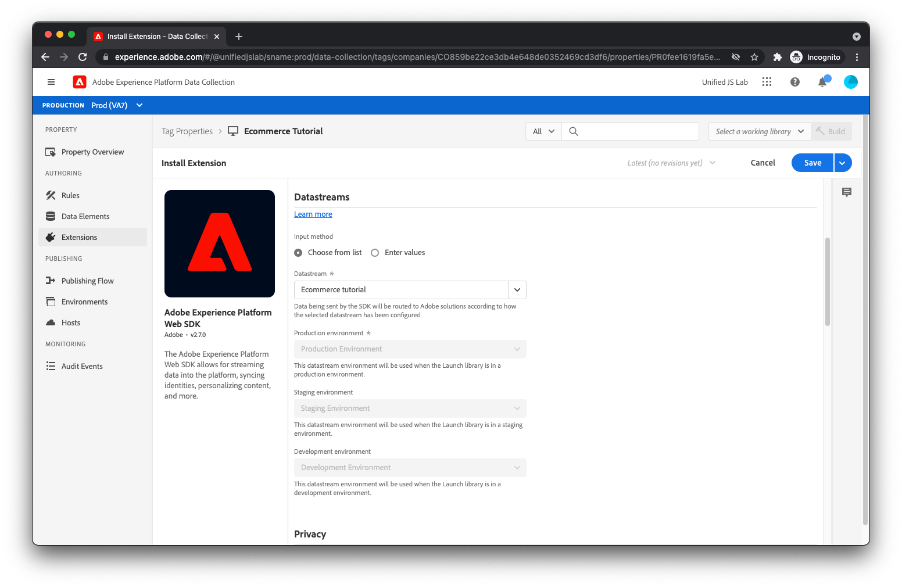

# 建立Adobe Experience Platform標籤屬性並安裝擴充功能

現在頁面程式碼正在將資料和事件推送至資料層，行銷人員可以開始從資料層讀取資料，並將這些資料傳送至Adobe Experience Platform。 這通常需要兩個JavaScript程式庫：

* Adobe客戶端資料層：在先前步驟中，您建立資料層陣列，並將物件推送至陣列。 若要存取資料，您必須載入Adobe用戶端資料層JavaScript程式庫，此程式庫可提供通知資料層變更和事件的方式，並提供存取資料的簡單方式。
* Adobe Experience Platform Web SDK:此JavaScript程式庫會與Adobe Experience Platform Edge Network通訊。 SDK可處理身分、同意、資料收集、個人化、對象等。

雖然您可以將這些個別程式庫載入網站並直接使用，但建議您使用 [Adobe Experience Platform標籤](https://experienceleague.adobe.com/docs/experience-platform/tags/home.html). 透過「標籤」，您可以將單一指令碼內嵌至HTML，並使用「標籤」使用者介面來部署Adobe用戶端資料層和Adobe Experience Platform Web SDK。 標籤也可讓您建立傳送資料的規則，以及執行其他動作。 本教學課程將標籤用於此用途，並假設您基本了解標籤的運作方式。

## 在標籤中建立屬性

如果你還沒， [在標籤中建立屬性](https://experienceleague.adobe.com/docs/experience-platform/tags/admin/companies-and-properties.html#create-or-configure-a-property).

## 安裝Adobe用戶端資料層擴充功能

導覽至擴充功能目錄、尋找擴充功能，然後按一下個別的，以安裝Adobe用戶端資料層擴充功能 [!UICONTROL 安裝] 按鈕。 您應該會看到設定畫面。

在本教學課程中，不需要變更預設值。 按一下「[!UICONTROL 儲存]」。

## 安裝Adobe Experience Platform Web SDK擴充功能

接下來，在擴充功能目錄中找到擴充功能，然後按一下個別的 [!UICONTROL 安裝] 按鈕。 您應該會看到設定畫面。

在 [建立資料流](../configure-the-server/create-a-datastream.md)，您建立了Adobe Experience Platform Edge Network參考的資料流，以判斷要將傳入資料傳送至何處。 從Adobe Experience Platform Web SDK向邊緣網路提出請求時，您必須指出邊緣網路應參考的資料流。

若要這麼做，請尋找 [!UICONTROL 資料流] 欄位，然後選取您先前建立的資料流。 您會看到與 [建立資料流](../configure-the-server/create-a-datastream.md).

如 [建立資料流](../configure-the-server/create-a-dataset.md)，則這些資料集環境與「標籤」環境有關係。 假設您已完成Adobe Experience Platform Web SDK擴充功能的安裝，請建立包含擴充功能的標籤程式庫，然後將程式庫發佈至標籤開發環境。 當標籤程式庫載入至您的網頁，且Adobe Experience Platform Web SDK擴充功能向Edge Network提出請求時，擴充功能會包含 [!UICONTROL 開發環境] 資料流環境ID。 Edge Network則會使用該ID來讀取 [!UICONTROL 開發環境] 資料流環境，並將資料轉送至適當的Adobe產品。

目前，您只有一個開發資料流環境、一個中繼資料流環境和一個生產資料流環境。 這就是為什麼擴充功能組態使用者介面會顯示所有預先選取且不可變更的項目。 不過，您可以使用datastream使用者介面來建立多個資料流開發環境（一個供您使用，另一個則供您的同事使用）。 如果您有多個開發資料流環境，則可以選取要用於此標籤屬性的環境。

最後，向下捲動並取消勾選 [!UICONTROL 啟用點按資料收集]. 依預設，SDK會自動追蹤您的連結。 不過，在本教學課程中，我們將示範如何使用自訂連結資訊來追蹤您自己的連結點按次數。

按一下 [!UICONTROL 儲存] 按鈕完成Adobe Experience Platform Web SDK擴充功能的安裝。

已安裝適當的擴充功能。 是時候建立規則和資料元素了。
