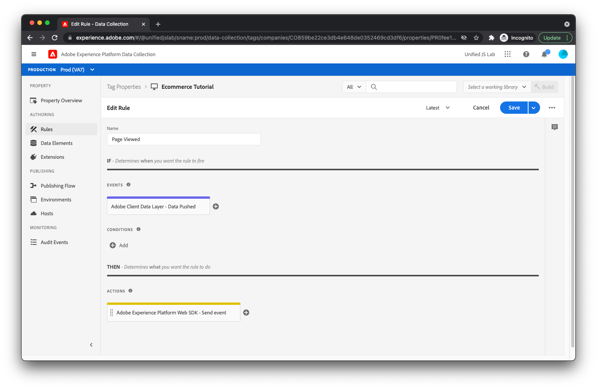

# 建立規則以追蹤頁面檢視和商務事件

若要追蹤使用者是否已檢視產品頁面，請在Adobe Experience Platform標籤中建立規則。 若要這麼做，請按一下 [!UICONTROL 規則] ，然後按一下「 」 [!UICONTROL 新增規則].

規則名稱請輸入 _已檢視的頁面_.

## 新增事件

按一下 [!UICONTROL 新增] 按鈕於 [!UICONTROL 事件]. 您現在顯示在事件檢視上。 對於 [!UICONTROL 副檔名] 欄位，選取 [!UICONTROL Adobe使用者端資料層]. 對於 [!UICONTROL 事件型別] 欄位，選取 [!UICONTROL 資料已推送].

因為您只希望此規則在 `pageViewed` 事件會推送至資料層，請選取「 」 [!UICONTROL 特定事件] 在 [!UICONTROL 聆聽] 和型別 _頁面已檢視_ 到 [!UICONTROL 要註冊的事件/金鑰] 文字欄位。

按一下[!UICONTROL 保留變更].

## 新增動作

現在您已返回規則檢視，請按一下 [!UICONTROL 新增] 按鈕於 [!UICONTROL 動作]. 您現在應該位於動作檢視上。 對於 [!UICONTROL 副檔名] 欄位，選取 [!UICONTROL Adobe Experience Platform Web SDK]. 對於 [!UICONTROL 動作型別] 欄位，選取 [!UICONTROL 傳送事件]. 此動作可讓您將體驗事件傳送至Adobe Experience Platform Edge Network。

在熒幕右側，找到 [!UICONTROL 型別] 欄位並選取 `web.webpagedetails.pageViews`. 這是Adobe Experience Platform提供的現成標準體驗事件型別之一。 它代表頁面檢視。

對於 [!UICONTROL XDM資料] 欄位，輸入 `%event.fullState%`. 這表示觸發規則時擷取的資料層計算狀態（也稱為完整狀態）應作為體驗事件的一部分傳送。

如果您從網站推送至資料層的資料與XDM結構描述不符，或您只想傳送資料層的部分運算狀態，請使用 [!UICONTROL xdm物件] 資料元素型別(由Adobe Experience Platform Web SDK擴充功能提供)，以建立符合您結構的適當物件。

按一下[!UICONTROL 保留變更]按鈕.

## 儲存規則

您的規則現在應該已完成。

按一下以儲存規則 [!UICONTROL 儲存].

## 重複此程式

重複上述程式以建立檢視產品、開啟購物車以及將產品新增到購物車的規則。 規則之間的唯一差異是規則名稱，也就是在 [!UICONTROL 要註冊的事件/金鑰] 中的欄位 [!UICONTROL 資料已推送] 事件，以及 [!UICONTROL 型別] 中的欄位 [!UICONTROL 傳送事件] 動作。 以下是每個規則的值：

產品已檢視規則：

* **規則名稱**： _已檢視的產品_
* **要註冊的事件/金鑰** 範圍 [!UICONTROL 資料已推送] 事件： `productViewed`
* **型別** 範圍 [!UICONTROL 傳送事件] 動作： `commerce.productViews`

購物車開啟規則：

* **規則名稱**： _購物車已開啟_
* **要註冊的事件/金鑰** 範圍 [!UICONTROL 資料已推送] 事件： `cartOpened`
* **型別** 範圍 [!UICONTROL 傳送事件] 動作： `commerce.productListOpens`

產品已新增至購物車規則：

* **規則名稱**： _產品已新增至購物車_
* **要註冊的事件/金鑰** 範圍 [!UICONTROL 資料已推送] 事件： `productAddedToCart`
* **型別** 範圍 [!UICONTROL 傳送事件] 動作： `commerce.productListAdds`

接下來，我們將處理 [!UICONTROL 下載應用程式] 連結。
