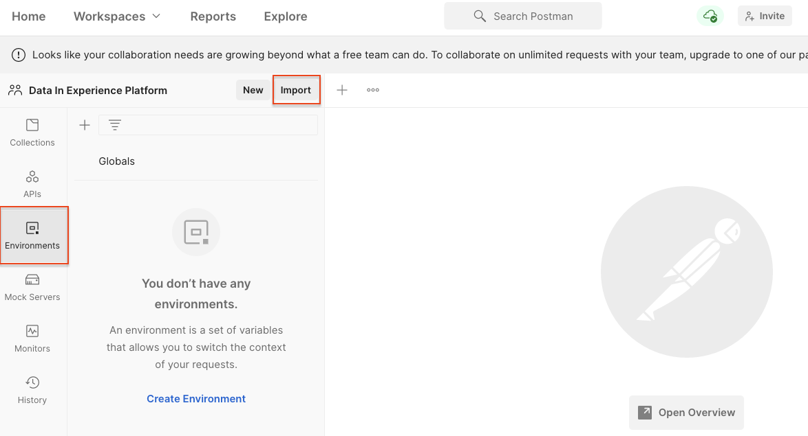
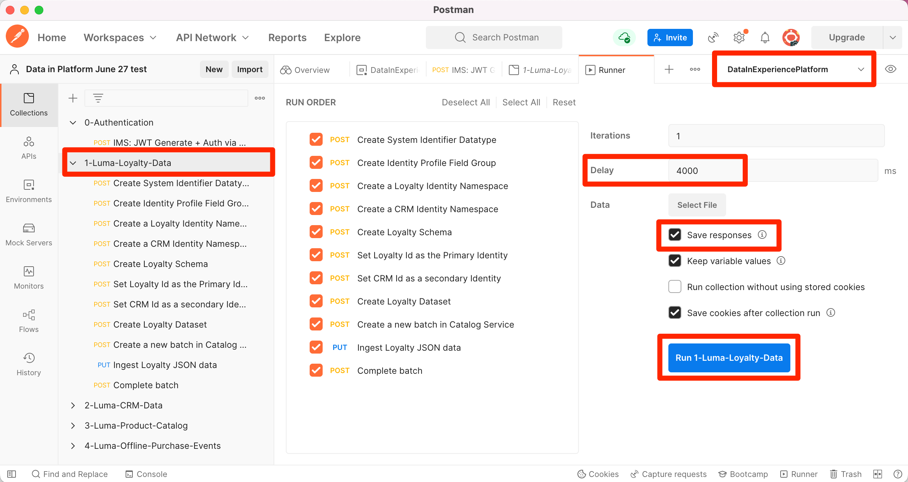

# 將範例資料匯入 Adobe Experience Platform

瞭解如何設定包含範例資料的 Experience Platform 沙箱環境。您可以使用 Postman 集合來建立欄位群組、綱要、資料集，然後將範例資料匯入 Experience Platform。

## 資料使用案例範例

Experience Platform業務使用者通常必須執行一系列步驟，包括識別欄位群組、建立結構、準備資料、建立資料集，然後擷取資料，才能探索Experience Platform提供的行銷功能。 本教學課程會自動執行部分步驟，讓您能盡快將資料匯入Platform沙箱。

本教學課程主要探討虛構的零售品牌Luma。 他們投資於Adobe Experience Platform，將忠誠度、CRM、產品目錄和離線購買資料結合為即時客戶設定檔，並啟用這些設定檔，將其行銷提升至全新境界。 我們已為Luma產生範例資料，在本教學課程的其餘部分中，您會將此資料匯入您的其中一個Experience Platform沙箱環境。

>[!NOTE]
>
>本教學課程的最終結果是提供沙箱，內含與 [資料架構師與資料工程師專用Adobe Experience Platform快速入門教學課程](https://experienceleague.adobe.com/docs/platform-learn/getting-started-for-data-architects-and-data-engineers/overview.html). 更新於2023年4月，以支援 [Journey Optimizer挑戰](https://experienceleague.adobe.com/docs/journey-optimizer-learn/challenges/introduction-and-prerequisites.html?lang=zh-Hant).

## 先決條件

* 您可以存取Experience PlatformAPI，並了解如何驗證。 如果沒有，請查看此 [教學課程](https://experienceleague.adobe.com/docs/platform-learn/tutorials/platform-api-authentication.html?lang=zh-Hant).
* 您可以存取Experience Platform開發沙箱。
* 您知道您的Experience Platform租用戶ID。 您可以透過驗證 [API要求](https://experienceleague.adobe.com/docs/experience-platform/xdm/api/getting-started.html?lang=en#know-your-tenant_id)
或是在您登入Platform帳戶時從URL中擷取。 例如，在下列URL中，租用戶為「
`techmarketingdemos`&quot; `https://experience.adobe.com/#/@techmarketingdemos/sname:prod/platform/home`.

## 使用Postman {#postman}

### 設定環境變數

請確定您已下載 [Postman](https://www.postman.com/downloads/) 應用程式。  我們開始吧！

1. 下載 [platform-utils-main.zip](../assets/data-generator/platform-utils-main.zip) 檔案，其中包含本教學課程所需的所有檔案。

   >[!NOTE]
   >
   >包含在 [platform-utils-main.zip](../assets/data-generator/platform-utils-main.zip) 檔案是虛構的，僅供展示之用。

1. 從下載資料夾中，將`platform-utils-main.zip`檔案移至您電腦的所需位置，然後加以解壓縮。
1. 在 `luma-data` 資料夾，開啟所有 `json` 檔案，並取代所有例項 `_yourOrganizationID` 使用您自己的租用戶id，前面加底線。
1. 開啟 `luma-offline-purchases.json` 和 `luma-web-events.json` 在文字編輯器中更新所有時間戳記，使事件在上個月發生(例如，搜尋 `"timestamp":"2022-11` 並取代年月)
1. 記下解壓縮資料夾的位置，如您稍後設定 `FILE_PATH` Postman環境變數：

   >[!NOTE]
   > 若要在Mac上取得檔案路徑，請導覽至 `platform-utils-main` 資料夾，按一下右鍵資料夾並選取 **取得資訊** 選項。
   >
   > 

   >[!NOTE]
   > 要在窗口上獲取檔案路徑，請按一下以開啟所需資料夾的位置，然後按一下右鍵地址欄中路徑右側的。 複製地址以獲取檔案路徑。
   > 
   > 

1. 開啟Postman並從 **工作區** 下拉式功能表：\
   
1. 輸入 **名稱** 和選填 **摘要** 按一下 **建立工作區**. Postman會在您建立時切換至新工作區。
   
1. 現在調整一些設定，以在此工作區中執行Postman集合。 在Postman的標題中，按一下齒輪圖示並選取 **設定** 以開啟設定強制回應視窗。 您也可以使用鍵盤快速鍵(CMD/CTRL + 、)開啟強制回應視窗。
1. 在 `General` 頁簽，以ms至更新請求超時 `5000 ms` 啟用 `allow reading file outside this directory`
   

   >[!NOTE]
   > 如果從工作目錄中載入檔案，如果將相同檔案儲存在其他裝置上，則跨裝置順利執行。 但是，如果要從工作目錄外部運行檔案，則必須開啟一個設定，以指定相同的目的。 若您的 `FILE_PATH` 與Postman的工作目錄路徑不同，則應啟用此選項。

1. 關閉 **設定** 中。
1. 選取 **環境** 然後選取 **匯入**:
   
1. 匯入下載的json環境檔案， `DataInExperiencePlatform.postman_environment`
1. 在Postman中，在右上角的下拉式清單中選取您的環境，然後按一下眼睛圖示以檢視環境變數：
   

1. 請確定已填入下列環境變數。 若要了解如何取得環境變數的值，請查看 [驗證Experience PlatformAPI](/help/platform/authentication/platform-api-authentication.md) 逐步指示的教學課程。

   * `CLIENT_SECRET`
   * `API_KEY`—`Client ID` 在Adobe Developer Console中
   * `TECHNICAL_ACCOUNT_ID`
   * `META_SCOPE`
   * `IMS`
   * `IMS_ORG`—`Organization ID` 在Adobe Developer Console中
   * `PRIVATE_KEY`
   * `SANDBOX_NAME`
   * `CONTAINER_ID`
   * `TENANT_ID` — 請務必以底線引導，例如 `_techmarketingdemos`
   * `platform_end_point`
   * `FILE_PATH` — 使用已解壓的本地資料夾路徑 `platform-utils-main.zip` 檔案。 請確定其中包含資料夾名稱，例如 `/Users/dwright/Desktop/platform-utils-main`

1. **儲存** 更新的環境

### 匯入Postman集合

接下來，您需要將集合匯入Postman。

1. 選擇 **集合** ，然後選擇導入選項：

   

1. 匯入下列集合：

   * `0-Authentication.postman_collection.json`
   * `1-Luma-Loyalty-Data.postman_collection.json`
   * `2-Luma-CRM-Data.postman_collection.json`
   * `3-Luma-Product-Catalog.postman_collection.json`
   * `4-Luma-Offline-Purchase-Events.postman_collection.json`
   * `5-Luma-Product-Inventory-Events.postman_collection.json`
   * `6-Luma-Test-Profiles.postman_collection.json`
   * `7-Luma-Web-Events.postman_collection.json`

   

### 驗證

接下來，您需要驗證並產生使用者代號。 請注意，本教學課程中使用的代號產生方法僅適用於非生產用途。 本機簽署會從第三方主機載入JavaScript程式庫，而遠端簽署會將私密金鑰傳送至Adobe擁有且運作的Web服務。 雖然Adobe不會儲存此私密金鑰，但生產金鑰絕不應與任何人共用。

1. 開啟 `Authentication` 集合，選取 `IMS: JWT Generate + Auth via User Token` POST請求，然後按一下 `SEND` 來驗證及取得存取權杖。

   

1. 檢閱環境變數，並注意 `JWT_TOKEN` 和 `ACCESS_TOKEN` 現在會填入。

### 匯入資料

現在，您可以準備資料，並將其匯入您的Platform沙箱。 你匯入的Postman收藏品將承擔所有的重擔！

1. 開啟 `1-Luma-Loyalty-Data` 集合，按一下 **執行** 在「概述」標籤上，以啟動「集合執行者」。

   

1. 在收集執行者視窗中，請務必從下拉式清單中選取環境，更新 **延遲** to `4000ms`，檢查 **儲存回應** ，並確保運行順序正確。 按一下 **執行Luma忠誠度資料** 按鈕

   

   >[!NOTE]
   >
   >**1-Luma-Loaty-Data** 建立客戶忠誠度資料的結構。 結構是以XDM個別設定檔類別、標準欄位群組，以及自訂欄位群組和資料為基礎。 集合會使用結構建立資料集，並上傳客戶忠誠度資料範例至Adobe Experience Platform。

   >[!NOTE]
   >
   >如果在Postman收集執行階段期間有任何收集請求失敗，請停止執行並逐一執行收集請求。

1. 如果一切順利， `Luma-Loyalty-Data` 集合應會通過。

   

1. 現在來登入 [Adobe Experience Platform介面](https://platform.adobe.com/) 和導覽至資料集。
1. 開啟 `Luma Loyalty Dataset` 資料集和「資料集活動」視窗下，您可以檢視成功批次執行以擷取1000筆記錄。 您也可以按一下預覽資料集選項，以確認已擷取的記錄。 您可能需要等待幾分鐘才能確認1000 [!UICONTROL 新設定檔片段] 已建立。
   
1. 重複步驟1-3以執行其他集合：
   * `2-Luma-CRM-Data.postman_collection.json` 為客戶的CRM資料建立結構和填入的資料集。 此結構以XDM個別設定檔類別為基礎，該類別包含人口統計詳細資料、個人連絡資料、偏好設定詳細資料和自訂身分欄位群組。
   * `3-Luma-Product-Catalog.postman_collection.json` 為產品目錄資訊建立結構和填入的資料集。 此結構基於自定義產品目錄類，並使用自定義產品目錄欄位組。
   * `4-Luma-Offline-Purchase-Events.postman_collection.json` 為客戶的離線購買事件資料建立結構和填入的資料集。 此結構以XDM ExperienceEvent類別為基礎，並包含自訂身分和商務詳細資料欄位群組。

   * `5-Luma-Product-Inventory-Events.postman_collection.json` 為與產品進出庫存相關的事件建立結構和填入的資料集。 結構是以自訂業務事件類別和自訂欄位群組為基礎。
   * `6-Luma-Test-Profiles.postman_collection.json` 建立結構描述，並填入含有測試設定檔的資料集以用於Adobe Journey Optimizer
   * `7-Luma-Web-Events.postman_collection.json` 以簡單的歷史Web資料建立結構和填入的資料集。

## 驗證

範例資料經過設計，以便在集合執行後，建立結合多個系統資料的即時客戶設定檔。 忠誠度、CRM和離線購買資料集的第一筆記錄就是一例。 查詢該設定檔以確認已擷取資料。 在 [Adobe Experience Platform介面](https://platform.adobe.com/):

1. 前往 **[!UICONTROL 設定檔]** > **[!UICONTROL 瀏覽]**
1. 選擇 `Luma Loyalty Id` 作為 **[!UICONTROL 身分命名空間]**
1. 搜尋 `5625458` 作為 **[!UICONTROL 身分值]**
1. 開啟 `Danny Wright` 設定檔

瀏覽 **[!UICONTROL 屬性]** 和 **[!UICONTROL 事件]** 索引標籤中，您應該會看到設定檔包含來自各種資料檔案的資料：

## 後續步驟

若您想了解Adobe Journey Optimizer，此沙箱會包含您需要取用的所有項目 [Journey Optimizer挑戰](https://experienceleague.adobe.com/docs/journey-optimizer-learn/challenges/introduction-and-prerequisites.html?lang=zh-Hant)

如果您想要了解合併原則、資料控管、查詢服務和區段產生器，請跳至 [資料架構師與資料工程師快速入門教學課程中的第11課](https://experienceleague.adobe.com/docs/platform-learn/getting-started-for-data-architects-and-data-engineers/create-merge-policies.html?lang=en). 本其他教學課程的先前課程可讓您手動建立剛填入這些Postman集合的所有項目，讓您盡享開端！

如果您想要建立範例Web SDK實作以連結至此沙箱，請前往
[使用Web SDK實作Adobe Experience Cloud教學課程](https://experienceleague.adobe.com/docs/platform-learn/implement-web-sdk/overview.html?lang=zh-Hant). 設定Web SDK教學課程的「初始設定」、「標籤設定」和「設定Experience Platform」課程後，請使用 `luma-crm.json` 使用密碼的檔案 `test` 若要查看設定檔片段與本教學課程中上傳的資料合併。

如果您想要建立範例行動SDK實作以連結至此沙箱，請前往
[在行動應用程式中實作Adobe Experience Cloud教學課程](https://experienceleague.adobe.com/docs/platform-learn/implement-mobile-sdk/overview.html). 設定Web SDK教學課程的「初始設定」、「應用程式實作」和「Experience Platform」課程後，請使用 `luma-crm.json` 檔案，檢視與本教學課程中上傳之資料的設定檔片段合併。

## 重設沙箱環境 {#reset-sandbox}

重設非生產沙箱會刪除與該沙箱（結構、資料集等）相關的所有資源，同時維護沙箱的名稱和相關權限。 對於具有存取權的使用者，這個「乾淨」的沙箱會繼續以相同名稱提供。

請依照 [此處](https://experienceleague.adobe.com/docs/experience-platform/sandbox/ui/user-guide.html?lang=en#reset-a-sandbox) 重設沙箱環境。
