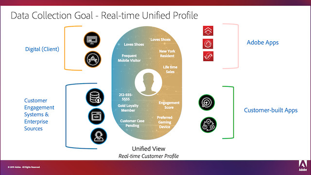
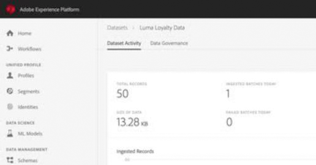
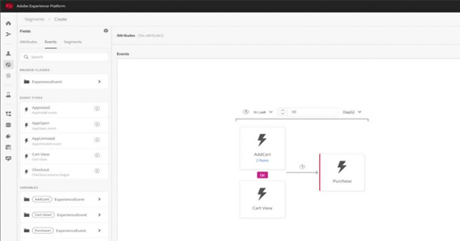

# Adobe Experience Platform 教學課程

Adobe Experience Platform是市面上功能最強大、最靈活、最開放的系統，可建置和管理可提升客戶體驗的完整解決方案。 Experience Platform可讓組織集中和標準化來自任何系統的客戶資料與內容，並運用資料科學和機器學習技術大幅改善豐富個人化體驗的設計和傳遞。 使用這些影片和教學課程來瞭解Experience Platform的許多元件。

## 工作人員選擇

<table style="margin-top: 0 !important">
<tr>
  <td>
    
    

      <a href="intro-to-platform/a-customer-experience-powered-by-experience-platform.md">
    <strong>由Experience Platform支援的客戶體驗</strong>
    </a>
    

    

    <em>瞭解Platform如何提供客戶體驗</em>
    

  </td>
  <td>
    
    

      <a href="https://experienceleague.adobe.com/docs/platform-learn/getting-started-for-data-architects-and-data-engineers/overview.html?lang=zh-Hant">
    <strong>資料架構師與資料工程師快速入門</strong>
    </a>
    

    

    <em>開始動手練習</em>
    

  </td>
  <td>
    
    

      <a href="sources/overview.md">
    <strong>瞭解來源聯結器</strong>
    </a>
    

    

    <em>輕鬆擷取您的資料</em>
    

  </td>
   <!--
   <td>
    
    

      <a href="data-ingestion/create-datasets-and-ingest-data.md">
    <strong>Create Datasets and Ingest Data</strong>
    </a>
    

    

    <em>Ingest your dataset.</em>
    

  </td>
  <td>
    
    

      <a href="segments/create-segments.md">
    <strong>Create Segments</strong>
    </a>
    

    

    <em>Build segments based on your data.</em>
    

  </td>
  -->
</tr>
</table>

