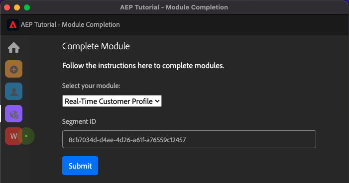
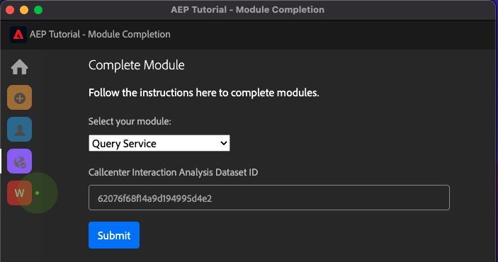
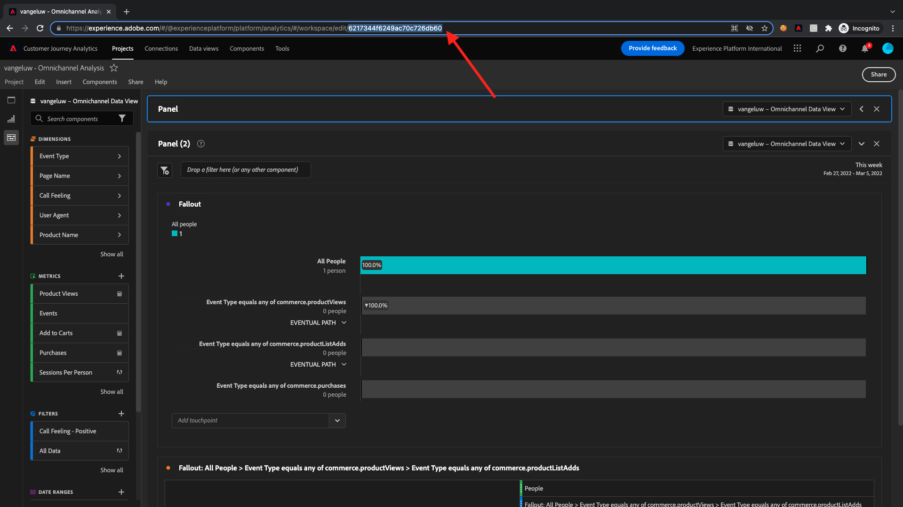
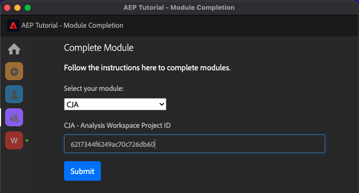
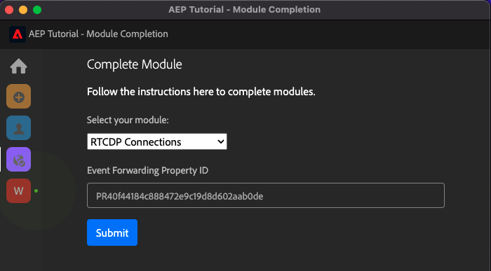

# Adobe Experience Platform的完整技術教學課程 — 如何測量完成？

您可以使用已建立的Chrome擴充功能，更新您完成的Adobe Experience Platform完整技術教學課程。

按照模組0中的說明，您輸入了 **配置ID** 中，而您已註冊。 您的Chrome擴充功能現在看起來應該像這樣。 按一下紫色圖示以提交模組的完成。

然後您會看到：

開啟下拉式功能表後，您可以選取要完成的模組：

若要完成模組，請提供完成證明。

以下是每個模組的預期完成證明。

## 快速入門

模組的預期完成證明 **快速入門** 是您建立之Web的演示系統項目ID。

Web格式的演示系統項目ID如下所示： `--demoProfileLdap-- - OCUC`.

選擇 **快速入門** 在下拉式功能表中，輸入 **演示系統項目的ID** 並按一下 **提交**  — 按鈕。

## 資料收集與Web SDK

模組的預期完成證明 **資料收集與Web SDK** 是web的資料收集屬性的名稱。

Web格式的資料收集屬性名稱如下： `--demoProfileLdap-- - Demo System (05/02/2022) (enablement) 1644046719474`.

選擇 **資料收集與Web SDK** 在下拉式功能表中，輸入 **Web的資料收集屬性名稱** 並按一下 **提交**  — 按鈕。

## 資料擷取

模組的預期完成證明 **資料擷取** 是您建立之2個資料集的資料集ID。

資料集ID格式如下： **5f069724723ef41916a8b5d2**.

`--demoProfileLdap-- - Demo System - Event Dataset for Website`

`--demoProfileLdap-- - Demo System - Profile Dataset for Website`

選擇 **資料擷取** 在下拉式功能表中，輸入 **資料集ID** （針對輸入欄位中的兩個資料集），然後按一下 **提交**  — 按鈕。

## 即時客戶個人檔案

模組的預期完成證明 **即時客戶個人檔案** 是 **區段ID** 透過UI建立的區段， `--demoProfileLdap-- - Male customers with interest in Montana Wind Jacket`.

區段ID格式如下： **8cb7034d-d4ae-4d26-a61f-a76559c12457**.

選擇 **即時客戶個人檔案** 在下拉式功能表中，輸入 **區段ID** 在輸入欄位中，按一下 **提交**  — 按鈕。

## 查詢服務

模組的預期完成證明 **查詢服務** 是 `--demoProfileLdap--_callcenter_interaction_analysis`  — 完成模組後所取得的資料集。

格式如下： **62076f68f14a9d194995d4e2**.

選擇 **查詢服務** 在下拉式功能表中，輸入 **資料集ID** 在輸入欄位中，按一下 **提交**  — 按鈕。

## Intelligent Services

模組的預期完成證明 **Intelligent Services** 是 **產品購買傾向客戶AI服務**.

格式如下： **12729** 當您開啟服務時，就可以從URL中擷取它。

選擇 **Intelligent Services** 在下拉式功能表中，輸入 **Customer AI服務ID** 在輸入欄位中，按一下 **提交**  — 按鈕。

## Real-Time CDP

模組的預期完成證明 **Real-Time CDP** 是 **Adobe Target活動**.

格式如下： **111804**.

選擇 **Real-Time CDP** 在下拉式功能表中，輸入 **Adobe Target活動ID** 在輸入欄位中，按一下 **提交**  — 按鈕。

## AJO:協調

模組的預期完成證明 **AJO:協調** 是 `--demoProfileLdap--AccountCreationEvent`.

格式如下： **227402c540eb8f8855c6b233adf6d54d7153d9d7d56fa475a6866081c574736**.

選擇 **AJO:協調** 在下拉式功能表中，於輸入欄位中輸入** eventID**，然後按一下 **提交**  — 按鈕。

## AJO:自訂動作

模組的預期完成證明 **AJO:自訂動作** 是事件的eventID `--demoProfileLdap--GeofenceEntry`.

格式如下： **fa42ab7982ba55f039eacec24c1e32e5c51b310c67f0fa559ab49b89b63f4934**.

選擇 **AJO:自訂動作** 在下拉式功能表中，輸入 **eventID** 在輸入欄位中，按一下 **提交**  — 按鈕。

## AJO:選件

模組的預期完成證明 **AJO:選件** 是 **優惠方案決策** 由您建立。

您可以找到 **選件決策ID**，看起來像這樣 **xcore:offer-activity:1122fcc4603ea499**，此處：

選擇 **AJO:選件** 在下拉式功能表中，輸入 **選件決策ID** 在輸入欄位中，按一下 **提交**  — 按鈕。

## AJO:事件

模組的預期完成證明 **AJO:事件** 是 `--demoProfileLdap--StoreEntryEvent`.

格式如下： **e3a8f0bdc0b609667cd96a72a6b1e5aafa0ddaf6ccf121c574e6a2030860a633**.

選擇 **AJO:事件** 在下拉式功能表中，輸入 **eventID** 在輸入欄位中，按一下 **提交**  — 按鈕。

## CJA

模組的預期完成證明 **CJA** 是您專案的ID `--demoProfileLdap-- - Omnichannel Analysis`.

格式如下： **6217344f6249ac70c726db60**，可在開啟專案時的URL中找到。

選擇 **CJA** 在下拉式功能表中，輸入 **專案ID** 在輸入欄位中，按一下 **提交**  — 按鈕。

## CJA:BigQuery

模組的預期完成證明 **CJA:BigQuery** 是 **BigQuery**-connection。

您可以找到 **BigQuery連接ID**，看起來像這樣 **85a2394d-8b94-410c-a239-4d8b94b10c38**，此處：

選擇 **CJA:BigQuery** 在下拉式功能表中，輸入 **BigQuery連接ID** 在輸入欄位中，按一下 **提交**  — 按鈕。

## RTCDP:EventHub

模組的預期完成證明 **RTCDP:EventHub** 是 **Microsoft Azure事件中心** 目的地Adobe Experience Platform。

您可以找到 **Microsoft Azure事件中心目標ID**，看起來像這樣 **fa3f7ce5-86fd-4096-bf7c-e586fdc096ba**，此處：

選擇 **RTCDP:EventHub** 在下拉式功能表中，輸入 **Microsoft Azure事件中心目標ID** 在輸入欄位中，按一下 **提交**  — 按鈕。

## RTCDP連接

模組的預期完成證明 **RTCDP連接** 是 **事件轉送屬性ID**.

您可以找到 **事件轉送屬性ID**，看起來像這樣 **PR40f44184c888472e9c19d8d602aab0de**，此處：

選擇 **RTCDP連接** 在下拉式功能表中，輸入 **事件轉送屬性ID** 在輸入欄位中，按一下 **提交**  — 按鈕。

## 阿帕奇卡夫卡

模組的預期完成證明 **阿帕奇卡夫卡** 是來源連接器的ID `--demoProfileLdap-- - Kafka`.

ID看起來像這樣 **f843d50a-ee30-4ca8-a766-0e4f3d29a2f7**，您可在此處找到：

選擇 **阿帕奇卡夫卡** 在下拉式功能表中，輸入 **流量ID** 在輸入欄位中，按一下 **提交**  — 按鈕。

[返回所有模組](./overview.md)
