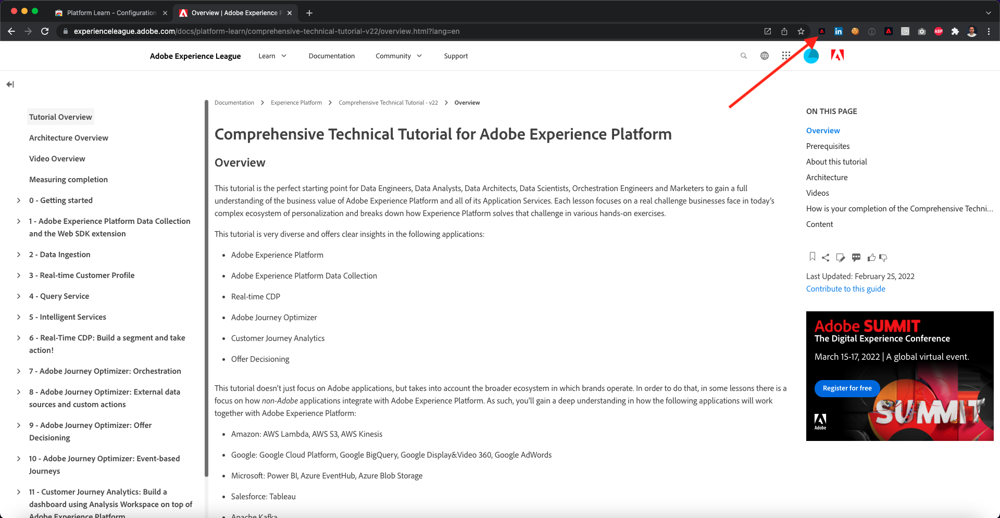

# 0.1安裝Experience League檔案的Chrome擴充功能

## 0.1.1為何要建立Chrome擴充功能？

說明檔案已設為通用檔案，因此任何人都能透過任何Adobe Experience Platform例項輕鬆重複使用。
讓檔案可重複使用， **環境變數** 已在檔案中介紹，這表示您會找到下列內容 **鍵** 中。 每個索引鍵都是特定環境的特定變數，Chrome擴充功能會為您變更該變數，因此您可輕鬆複製教學課程頁面中的程式碼和文字，並貼到您將用於教學課程的各種使用者介面中。

以下提供這些值的範例。 目前，這些值尚無法使用，但當您安裝並啟動Chrome擴充功能時，就會看到這些變數變更為「一般」文字，供您複製及重複使用。

| 名稱 | 代碼 |
|:-------------:| :---------------:|
| AEP IMS組織ID | `--aepImsOrgId--` |
| AEP租用戶ID | `--aepTenantId--` |
| DCS入口ID | `--dcsInletId--` |
| 演示配置檔案LDAP | `--demoProfileLdap--` |

例如，在下面的螢幕截圖中，您可以看到 `--aepTenantId--`.

安裝擴充功能後，會自動變更相同的文字，以反映您的執行個體特定值。

擴充功能也可讓您：

- 註冊參加教學課程
- 提交每個模組的完成情況，以跟蹤進度，如 [如何測量完成？](../../completion.md)

## 0.1.2安裝Chrome擴充功能

若要安裝該Chrome擴充功能，請開啟Chrome瀏覽器，然後前往： [https://chrome.google.com/webstore/detail/platform-learn-configurat/hhnbkfgioecmhimdhooigajdajplinfi/related?hl=en&amp;authuser=0](https://chrome.google.com/webstore/detail/platform-learn-configurat/hhnbkfgioecmhimdhooigajdajplinfi/related?hl=en&amp;authuser=0). 你會看到這個。

按一下 **新增至Chrome**.

你會看到這個。 按一下 **新增擴充功能**.

接著會安裝擴充功能，您就會看到類似的通知。

在 **擴充功能** ，按一下 **拼圖** 圖示並釘上 **平台學習 — 配置** 擴充功能至擴充功能功能表。

## 0.1.2設定Chrome擴充功能

前往 [https://experienceleague.adobe.com/docs/platform-learn/comprehensive-technical-tutorial-v22/overview.html?lang=en](https://experienceleague.adobe.com/docs/platform-learn/comprehensive-technical-tutorial-v22/overview.html?lang=en) 然後按一下擴充功能圖示以開啟。

然後你會看到這個彈出畫面。 按一下 **+** 表徵圖。

輸入您的名稱，以及為您的Adobe Experience Platform環境建立的設定ID。 按一下&#x200B;**新建**。

>[!IMPORTANT]
>
>如果您是Adobe員工：您可以在內部Github存放庫(https://git.corp.adobe.com/vangeluw/platformenablement)找到要使用的設定ID。
>
>如果您是Adobe解決方案合作夥伴，請聯絡您的解決方案合作夥伴聯絡人或電子郵件 **spphelp@adobe.com**.

在擴充功能的左側功能表中，您現在會看到包含您首字母的圖示。 按一下。 然後，您會看到 **環境變數** 和您特定的Adobe Experience Platform例項值。 按一下 **啟動配置**.

啟用您的設定後，您會在首字母旁看到綠色的點。 這表示您的設定ID現在已啟用。 您也會看到其他許多功能表選項出現。

您現在有2個選項：

- 如果您是現有設定的啟用的現有使用者，請前往 **0.1.3現有用戶 — 登錄**
- 如果您是初次開始本教學課程的全新使用者，請前往 **0.1.4註冊** 和跳過 **0.1.3現有用戶 — 登錄**

## 0.1.3現有用戶 — 登錄

>[!IMPORTANT]
>
>練習 **0.1.3現有用戶 — 登錄** 只有在您是先前已註冊參加本教學課程的現有使用者時，才能使用。

如果您是首次設定此Chrome擴充功能的現有使用者，請按一下左側功能表中的紫色圖示。 你會看到這個。

視需要填寫值。

>[!IMPORTANT]
>
>此 **LDAP** 是最重要的欄位：您應使用初次註冊本教程時使用的LDAP。 這將確保成功載入進度。 如果您不確定LDAP是什麼，請查看您的電子郵件地址。 以LDAP形式在電子郵件@-symbol中使用前面的文字。 如果您的電子郵件地址為 **vangeluw@adobe.com**，您在此輸入的LDAP應為 **萬熱盧**)。

按一下&#x200B;**「確定」**。

30秒至1分鐘後，您的螢幕將會變更，而您將會回復為 **首頁**，您會看到以下內容：

您的Chrome擴充功能現已完成設定，您現在可以確認一切都正常運作。

## 0.1.4新用戶 — 註冊

>[!IMPORTANT]
>
>練習 **0.1.4新用戶 — 註冊** 適用於初次啟動本教學課程的新使用者。

如果您是第一次註冊本教學課程的新使用者，請按一下功能表中的黃色圖示。 你會看到這個。

視需要填寫欄位。 按一下「**儲存**」。

>[!IMPORTANT]
>
>此 **LDAP** 是最重要的領域。 如果您不確定LDAP是什麼，請查看您的電子郵件地址。 以LDAP形式在電子郵件@-symbol中使用前面的文字。 如果您的電子郵件地址為 **vangeluw@adobe.com**，您在此輸入的LDAP應為 **萬熱盧**)。

30秒至1分鐘後，您的螢幕將會變更，而您將會回復為 **首頁**，您會看到以下內容：

您的Chrome擴充功能現已完成設定，您現在可以確認一切都正常運作。

## 0.1.5驗證教學課程內容

作為測試，請前往 [本頁](https://experienceleague.adobe.com/docs/platform-learn/comprehensive-technical-tutorial-v22/module4/ex3.html?lang=zh-Hant).

你現在應該看到 **環境變數** 已根據chrome擴充功能中的設定ID，由其true值取代。

您現在應該有與下列類似的檢視，其中的環境變數 `--aepTenantId--` 已由您的實際租用戶ID取代，在此案例中為 **_experienceplatform**.

下一步： [0.2使用設定Adobe Experience Platform資料收集用戶端屬性旁的示範系統](./ex2.md)

[返回模組0](./getting-started.md)

[返回所有模組](./../../overview.md)
