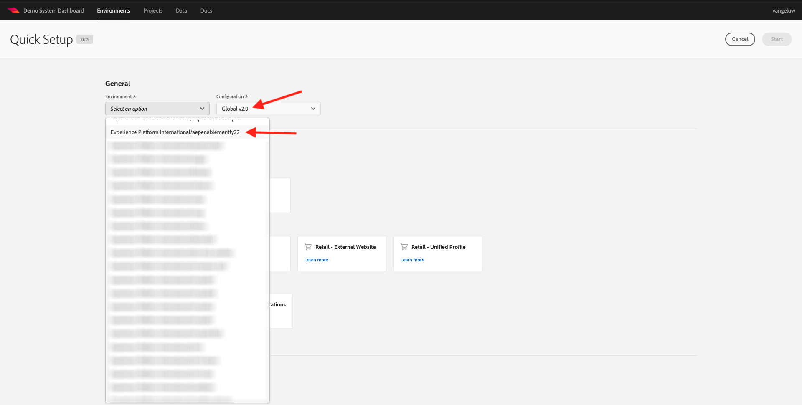
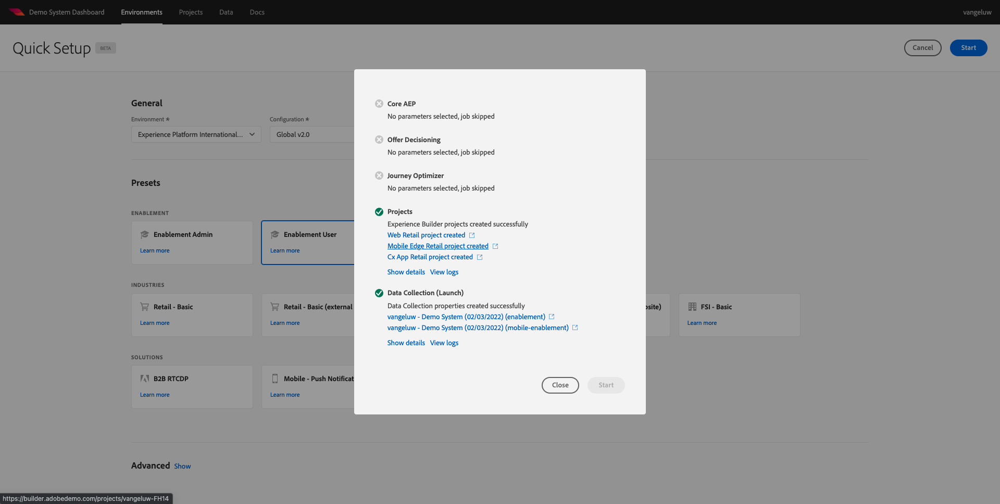

# 0.2使用設定Adobe Experience Platform資料收集用戶端屬性旁的示範系統

註冊Adobe Experience Platform的完整技術教學課程後，會自動完成程式，提供您對示範系統的存取權，以便您存取並執行下列設定。

取得示範系統的存取權後，請繼續下列步驟。

前往 [https://dashboard.adobedemo.com/](https://dashboard.adobedemo.com/). 選取您的沙箱，然後按一下 **快速設定**.

您會看到：

在 **一般** - **環境**，請選取您的Adobe Experience Platform例項和沙箱，在此案例中：

- **Experience Platform國際**
- **aepenablementfy22**
- 配置：請選擇 **全局v2.0**

下一步，選取預設集 **啟用使用者** 按一下 **開始**.

在快顯視窗中，輸入資料收集屬性的名稱。 請使用此命名慣例： **演示系統(DD/MM/YYYY)**. 答：您的LDAP將自動附加，您無需自行添加。

按一下&#x200B;**「開始」**。

然後您會看到此快顯視窗，其顯示建立網站和行動應用程式專案及資料收集屬性時的進度。

快速設定程式完成後，您將擁有：

- 1個Web零售專案，可搭配Luma示範品牌使用示範網站
- 1個行動零售專案，可搭配Luma示範品牌使用示範行動應用程式
- 1個CX App Retail項目，這使客戶可以使用呼叫中心和Luma演示品牌的客戶應用
- 1 Web的資料收集屬性，您將使用此屬性收集網站的資料
- 1行動裝置的資料收集屬性，您將用來從行動應用程式收集資料

在後續步驟中，請隨時開啟此畫面。

下一步： [0.3建立資料流](./ex3.md)

[返回模組0](./getting-started.md)

[返回所有模組](./../../overview.md)
