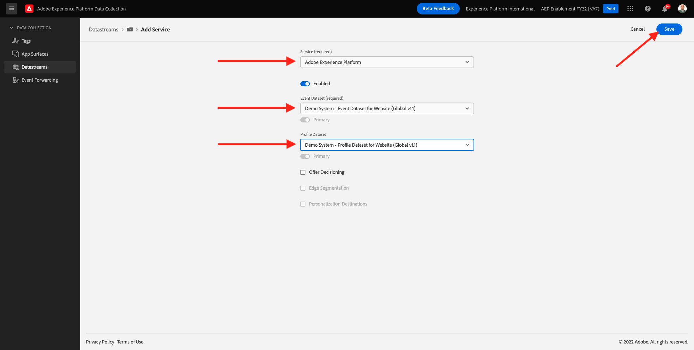
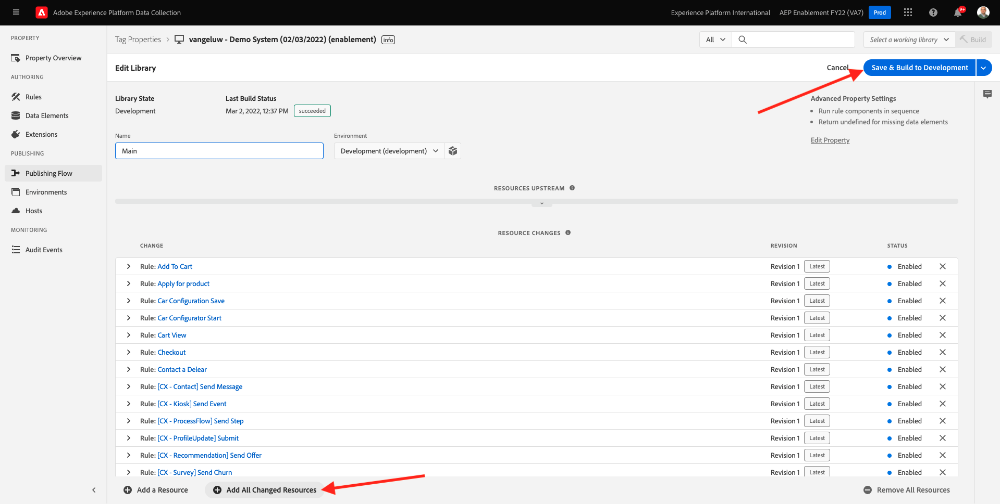
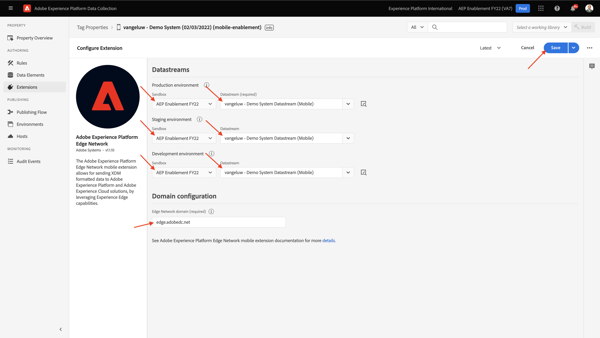
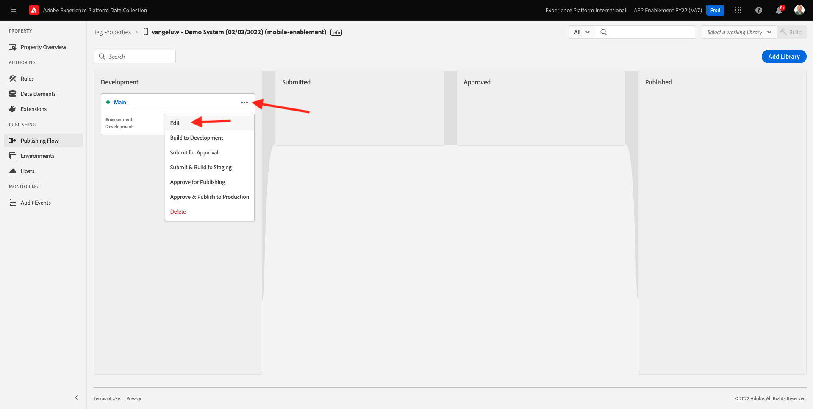

# 0.3建立資料流

前往 [https://experience.adobe.com/#/data-collection/](https://experience.adobe.com/#/data-collection/). 在上一個練習之後，您現在擁有兩個資料收集屬性：一個用於網路，一個用於移動。

這些屬性幾乎已可供使用，但在您開始使用這些屬性收集資料之前，您需要設定資料流。 您將在練習1.2中獲得有關資料流的概念及其含義的更多資訊。

目前，請依照下列步驟操作。

## 0.3.1建立網頁資料流

按一下 **[!UICONTROL 資料流]** 或 **[!UICONTROL 資料流（測試版）]**.

在畫面的右上角，選取沙箱名稱，名稱應為 `--aepSandboxId--`.

按一下 **[!UICONTROL 新資料流]**.

若 **[!UICONTROL 易記名稱]**，並在可選說明中輸入 `--demoProfileLdap-- - Demo System Datastream`. 對於事件結構，請選擇 **示範系統 — 網站事件結構（全域v1.1）**. 按一下「**儲存**」。

你會看到這個。 按一下 **添加服務**.

選擇服務 **[!UICONTROL Adobe Experience Platform]**，將公開其他欄位。 你會看到這個。

若為事件資料集，請選取 **示範系統 — 網站事件資料集（全域v1.1）** 和設定檔資料集，請選取 **示範系統 — 網站設定檔資料集（全域v1.1）**. 按一下「**儲存**」。

你現在會看到這個。

就現在。 在 [模組1](./../module1/data-ingestion-launch-web-sdk.md) 您將進一步了解Web SDK及如何設定其所有功能。

在左側功能表中，按一下 **[!UICONTROL 標籤]**.

篩選搜尋結果，以查看您的兩個資料收集屬性。 開啟 **Web** 按一下它。

你會看到這個。 按一下 **擴充功能**.

在Adobe Experience Platform Web SDK擴充功能上，按一下 **設定**.

你會看到這個。 針對 **資料流**，您目前會看到設為1的虛擬值。 您現在需要按一下 **從清單中選擇** 按鈕。 在下拉式清單中，選取您先前建立的資料流。

請確定已選取 **資料流**. 提示：您可以輸入 `--demoProfileLdap--`.

向下捲動，直到您看到 **資料收集**. 請確定 **啟用點按資料收集** 未啟用。 按一下 **儲存** 來儲存變更。

前往 **發佈流程**.

按一下 **...** for **主要**，然後按一下 **編輯**.

按一下 **新增所有已變更的資源** 然後按一下 **儲存並建置以供開發**.

您的變更現在正在發佈中，幾分鐘內即可完成。

## 0.3.2建立行動裝置適用的資料流

前往 [https://experience.adobe.com/#/data-collection/](https://experience.adobe.com/#/data-collection/).

按一下 **[!UICONTROL 資料流]** 或 **[!UICONTROL 資料流（測試版）]**.

在畫面的右上角，選取沙箱名稱，名稱應為 `--aepSandboxId--`.

按一下 **[!UICONTROL 新資料流]**.

若 **[!UICONTROL 易記名稱]**，並在可選說明中輸入 `--demoProfileLdap-- - Demo System Datastream (Mobile)`. 對於事件結構，請選擇 **示範系統 — 行動應用程式的事件結構（全域v1.1）**. 按一下「**儲存**」。

按一下「**[!UICONTROL 儲存]**」。

你會看到這個。 按一下 **添加服務**.

選擇服務 **[!UICONTROL Adobe Experience Platform]**，將公開其他欄位。 你會看到這個。

若為事件資料集，請選取 **示範系統 — 行動應用程式的事件資料集（全域v1.1）** 和設定檔資料集，請選取 **示範系統 — 行動應用程式的設定檔資料集（全域v1.1）**. 按一下「**儲存**」。

你會看到這個。

您的資料流現在已準備好用於行動版的Adobe Experience Platform資料收集用戶端屬性。

前往 **標籤** 和篩選搜尋結果，以查看您的兩個資料收集屬性。 開啟 **行動** 按一下它。

你會看到這個。 按一下 **擴充功能**.

在 **Adobe Experience Platform Edge Network** 擴充功能，按一下 **設定**.

你會看到這個。 您現在需要選取您剛設定的正確沙箱和資料流。 要使用的沙箱為 `--aepSandboxId--` 而資料流被稱為 `--demoProfileLdap-- - Demo System Datastream (Mobile)`.

若 **邊緣網路域**，請使用預設網域， **edge.adobedc.net**.

按一下 **儲存** 來儲存變更。

前往 **發佈流程**.

按一下 **...** 下一頁 **主要**，然後按一下 **編輯**.

按一下 **新增所有已變更的資源**，然後按一下 **儲存並建置以供開發**.

您的變更現在正在發佈中，幾分鐘內即可完成。

下一步： [0.4使用網站](./ex4.md)

[返回模組0](./getting-started.md)

[返回所有模組](./../../overview.md)