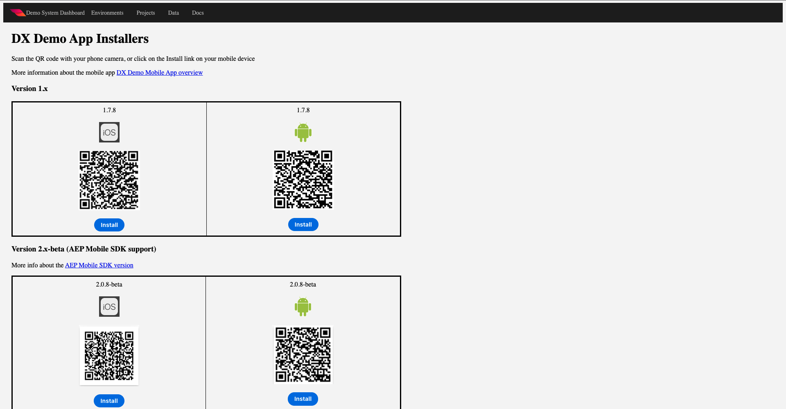

# 0.5使用行動應用程式

## 0.5.1下載應用程式

前往 [https://bit.ly/dx-demo-app](https://bit.ly/dx-demo-app) 電腦上。 你會看到這個。

使用 **相機** 在智慧手機上安裝應用程式，以安裝適用於您裝置作業系統的行動應用程式。 若要進行此啟用，您必須安裝 **2.x版** 使用Adobe Experience Platform Mobile SDK的。

>[!NOTE]
>
>在iOS裝置上首次安裝應用程式後，嘗試開啟應用程式時可能會收到錯誤訊息，指出： **不受信任的企業開發人員**. 若要修正此問題，您必須前往 **設定>一般>裝置管理>Adobe Systems Inc.** 按一下 **信任Adobe Systems公司**.

安裝應用程式後，您就會在裝置的主畫面中找到它。 按一下圖示以開啟應用程式。

第一次使用應用程式時，系統會要求您使用Adobe ID登入。 完成登入程式。

登入後，您會看到要求傳送通知的權限的通知。 我們將在教學課程中傳送通知，因此請按一下 **允許**.

然後您會看到應用程式的首頁。 前往 **設定**.

在設定中，您會看到目前a **公用專案** 已載入應用程式中。 按一下 **自訂專案**.

您現在可以載入自訂專案。 按一下QR碼即可輕鬆載入專案。

0.1練習後，你得到了這個結果。 按一下以開啟 **行動零售專案** 是為你建立的。

若您不小心關閉了瀏覽器視窗，或未來的示範或啟用課程，您也可以前往 [https://builder.adobedemo.com/projects](https://builder.adobedemo.com/projects). 使用您的Adobe ID登入後，您會看到這個。 按一下您的行動應用程式專案以開啟。

你會看到這個。 按一下 **整合**.

您需要為0.1練習中建立的行動裝置選取資料收集屬性。下一步，按一下 **執行**.

然後您會看到此快顯視窗，其中包含QR碼。 從行動應用程式內掃描此QR碼。

接著，您就會在應用程式中看到您的專案ID，然後按一下 **儲存**.

現在，返回 **首頁** 在應用程式中。 您的應用程式現在已可供使用。

您現在已完成模組0。

[返回模組0](./getting-started.md)

[返回所有模組](./../../overview.md)
