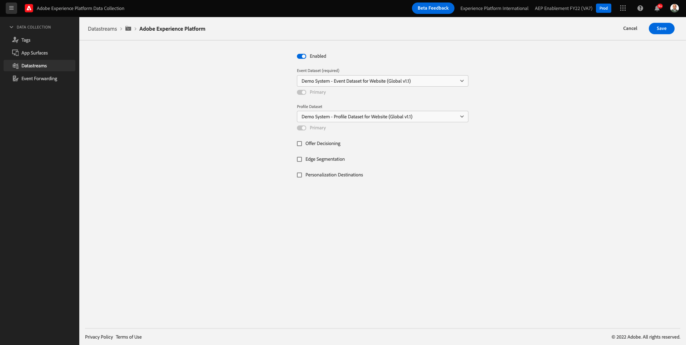

# 1.2邊緣網路、資料流和伺服器端資料收集

## 內容

在本練習中，您將建立 **資料流**. A **資料流** 會告訴Adobe Edge伺服器，Web SDK收集到資料後，應將資料傳送至何處。 例如，您要將資料傳送至Adobe Experience Platform嗎？ Adobe Analytics? Adobe Audience Manager? Adobe Target?

資料流一律在Adobe Experience Platform資料收集使用者介面中進行管理，對於使用Web SDK進行Adobe Experience Platform資料收集至關重要。 即使您使用非Adobe標籤管理解決方案實作Web SDK，您仍需在Adobe Experience Platform資料收集使用者介面中建立資料流。

在下一個練習中，您將在瀏覽器上實作Web SDK。 接著，您會更清楚知道正在收集的資料是什麼樣子。 目前，我們只是告訴資料流將資料轉發到何處。

## 建立資料流

在 [練習0.2](./../module0/ex2.md) 您已經建立了資料流，但我們沒有討論資料流的背景和原因。

資料流會告訴Adobe Edge伺服器，Web SDK收集資料後，要將資料傳送至何處。 例如，您要將資料傳送至Adobe Experience Platform嗎？ Adobe Analytics? Adobe Audience Manager? Adobe Target? 無論您是否透過Adobe Experience Platform資料收集實作Web SDK，資料流都是在Adobe Experience Platform資料收集使用者介面中管理，且對於使用Web SDK進行平台資料收集而言至關重要。

讓我們回顧一下 **[!UICONTROL 資料流]**:

前往 [https://experience.adobe.com/launch/](https://experience.adobe.com/launch/).

按一下 **[!UICONTROL 資料流]** 或 **[!UICONTROL 資料流（測試版）]** 的上界。

搜尋資料流，其名稱為 `--demoProfileLdap-- - Demo System Datastream`.

然後，您將看到資料流的詳細資訊。

按一下 **...** 下一頁 **Adobe Experience Platform** 按一下 **編輯**.

你會看到這個。 目前，您只啟用了Adobe Experience Platform。 您的設定看起來將類似於下列設定。 (視您的環境和Adobe Experience Platform例項而定，沙箱名稱可能不同)

您應將下列欄位解譯為：

對於此資料流……

- 所有收集的資料都會儲存在 `--aepSandboxId--` Adobe Experience Platform沙箱
- 依預設，所有「體驗事件」資料都會收集到資料集中 **示範系統 — 網站事件資料集（全域v1.1）**
- 依預設，所有設定檔資料都會收集到資料集中 **示範系統 — 網站設定檔資料集（全域v1.1）** （Web SDK目前不支援以原生方式擷取Web SDK的設定檔資料，並將於稍後階段提供使用）
- 如果您想使用 **offer decisioning** 應用程式服務，您需要勾選Offer decisioning方塊。 (這將是 [模組9](./../module9/offer-decisioning.md))
- 如果您想使用 **邊緣分割**，您必須勾選「邊緣分段」方塊。
- 如果您想使用 **個人化目的地**，您必須勾選「個人化目的地」方塊。

目前，您的資料流不需要其他設定。

下一步： [1.3Adobe Experience Platform資料收集簡介](./ex3.md)

[返回模組1](./data-ingestion-launch-web-sdk.md)

[返回所有模組](./../../overview.md)
