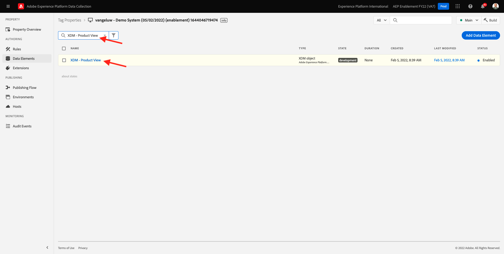

# 1.3 -Adobe Experience Platform資料收集簡介

## 內容

現在，讓我們更深入了解Adobe Experience Platform資料收集的基礎要素，以了解示範網站上安裝了哪些項目。 您將可進一步了解Adobe Experience Platform Web SDK擴充功能、設定資料元素和規則，以及了解如何發佈程式庫。

## 1.3.1 - Adobe Experience Platform Web SDK擴充功能

擴充功能是一組封裝程式碼，可擴充Adobe Experience Platform資料收集介面和程式庫功能。 Adobe Experience Platform Data Collection是平台，而擴充功能就像在平台上執行的應用程式。 本教學課程中使用的所有擴充功能均由Adobe建立和管理，但第三方可建立自己的擴充功能，以限制Adobe Experience Platform資料收集使用者必須管理的自訂程式碼量。

前往 [Adobe Experience Platform資料收集](https://experience.adobe.com/launch/) 選取 **標籤**.

這是您之前看到的Adobe Experience Platform資料收集屬性頁面。

在模組0中，演示系統為您建立了兩個客戶端屬性：一個用於網站，一個用於行動應用。 通過搜索來查找 `--demoProfileLdap--` 在 **[!UICONTROL 搜尋]** 框。

開啟 **Web** 屬性。

然後您會看到「屬性概述」頁面。 按一下 **[!UICONTROL 擴充功能]** 在左側邊欄。 按一下 **[!UICONTROL 設定]** 按鈕(位於Adobe Experience Platform Web SDK擴充功能下)。

歡迎使用Adobe Experience Platform Web SDK! 您可以在此處使用您在 [練習0.2](./../module0/ex2.md) 以及一些更進階的設定。 您只打算為此練習配置兩個設定。

預設邊域始終為 **edge.adobedc.net**. 若您已在Adobe Experience Cloud或Adobe Experience Platform環境中實作CNAME設定，則需要更新 **[!UICONTROL 邊緣網域]**. 您的Adobe Experience Platform執行個體正使用此Edge網域： `--webSdkEdgeDomain--`.

如果實例的邊緣域與預設域不同，請更新邊緣域。 邊緣網域可讓您設定第一方追蹤伺服器，然後在後端使用CNAME設定，以確保將資料收集到Adobe中。

現在，確保 **[!UICONTROL 從清單中選擇]** 選項按鈕 **[!UICONTROL 資料流]** 標題，然後選取名為的資料流： `--demoProfileLdap-- - Demo System Datastream`，從 **[!UICONTROL 資料流]** 框。

按一下 **[!UICONTROL 儲存]** 返回「擴充功能」檢視。

## 1.3.2資料元素

資料元素是資料字典 (或資料地圖) 的建置組塊。使用資料元素，在行銷和廣告技術之間收集、組織和傳遞資料。

單一資料元素是變數，其值可對應至查詢字串、URL、Cookie 值、JavaScript 變數等資料。您可以在整個Adobe Experience Platform資料收集中以變數名稱參考此值。 此資料元素集合會成為定義資料的字典，您可用來建立規則 (事件、條件和動作)。此資料字典會在所有Adobe Experience Platform資料收集之間共用，以搭配您新增至屬性的任何擴充功能使用。

您現在將以Web SDK友好格式編輯現有的資料元素。

按一下左側邊欄中的「資料元素」以前往「資料元素」頁面。

>[!NOTE]
>
>您只在本練習中編輯資料元素，但您可以看到 **[!UICONTROL 新增資料元素]** 按鈕，此按鈕可用來將新變數新增至資料字典。 接著，您就可以在Adobe Experience Platform資料收集中使用此功能。 您可以隨意查看其他已存在的資料元素，大多使用本機儲存作為資料來源。

在搜尋列中，輸入 **XDM — 產品檢視** 並按一下其傳回的「資料元素」 。

此畫面會顯示您要編輯的XDM物件。 Experience Data Model(XDM)的概念將在本技術教學課程中進一步探討，但目前只要了解Adobe Experience Platform Web SDK所需的格式即可。 您會將更多資訊新增至示範網站之文章頁面上收集的資料。

按一下旁邊的加號按鈕 **web** 在樹的底部。

按一下旁邊的加號按鈕 **webPageDetails**.

按一下 **siteSection**. 你現在看到了 **siteSection** 尚未連結至任何資料元素。 讓我們改變它。

向上捲動，然後輸入文字 `%Product Category%`. 按一下「**[!UICONTROL 儲存]**」。

此時已安裝Adobe Experience Platform Web SDK擴充功能，且您已更新資料元素以根據XDM結構收集資料。 接下來，檢查將在正確時間傳送資料的規則。

## 1.3.3規則

Adobe Experience Platform資料收集是規則型系統。 它會尋找使用者互動與相關資料。當符合列於您規則中的準則時，規則會觸發您識別的擴充功能、指令黨指令檔或用戶端代碼。

建置規則來整合行銷和廣告技術的資料和功能，將不同的產品整合為單一解決方案。

讓我們劃分在文章頁面上傳送資料的規則。

按一下 **[!UICONTROL 規則]** 在左側邊欄。

**[!UICONTROL 搜尋]** for `Product View`.

按一下傳回的規則。

讓我們查看組成此規則的個別元素。 若指定 **[!UICONTROL 事件]** 發生， **[!UICONTROL 條件]** 會得到評估，然後指定 **[!UICONTROL 動作]** 視需要進行。

按一下事件 **自訂事件 — 產品檢視**. 這是載入的檢視。

按一下 **事件類型** 下拉。

如果條件為真，這會列出一些標準互動，您可用來傳訊Adobe Experience Platform資料收集以執行動作。

按一下 **[!UICONTROL 取消]** 回到規則。

按一下動作 **傳送「產品檢視」事件至AEP**.

您可在此查看Adobe Experience Platform Web SDK傳送至Adobe Edge的資料。 更具體來說，這是使用 **合金** **[!UICONTROL 例項]** 網頁SDK。 設定其他 **[!UICONTROL 例項]** 會允許使用不同的資料流，除其他外。 您已指定事件 **[!UICONTROL 類型]** as a **commerce.productViews** 而您傳送的XDM資料為 **XDM — 產品檢視** 您先前變更的資料元素。

查看完規則後，即可在Adobe Experience Platform資料收集中發佈所有變更。

## 1.3.4在程式庫中發佈

最後，若要驗證您剛更新的規則和資料元素，您必須發佈包含屬性中已編輯項目的程式庫。 您需要在 **[!UICONTROL 發佈]** Adobe Experience Platform資料收集區段。

按一下 **[!UICONTROL 發佈流程]** 在左側導覽列中

按一下現有程式庫，稱為 **主要**.

按一下 **新增所有已變更的資源** 按鈕。

向下捲動，以查看大部分資源將維持為 **修訂版1（最新）**&#x200B;但我們改變了。 **資料元素：ruleArticlePages** 和 **擴充功能：Adobe Experience Platform Web SDK** 將標籤為 **最新**.

按一下 **儲存並建置以供開發** 按鈕。

程式庫可能需要幾分鐘的時間才能建置，當它完成時，程式庫名稱左側會顯示一個綠色圓點。

如您在「發佈流程」畫面上所見，Adobe Experience Platform資料收集的發佈程式有更多內容，不在本教學課程的討論範圍內。 我們將在開發環境中使用單一程式庫。

下一步： [1.4用戶端Web資料收集](./ex4.md)

[返回模組1](./data-ingestion-launch-web-sdk.md)

[返回所有模組](./../../overview.md)
