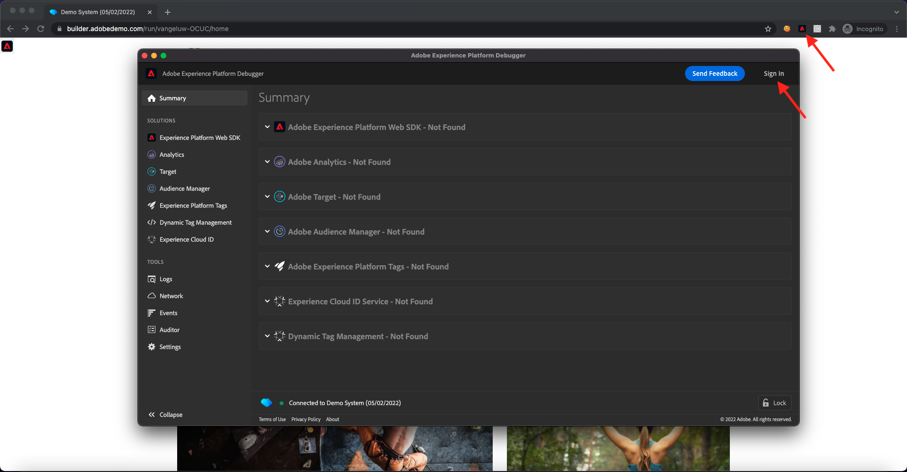

# 1.4用戶端Web資料收集

## 1.4.1驗證請求中的資料

### 安裝Adobe Experience Platform Debugger

Experience Platform偵錯工具是適用於Chrome和Firefox瀏覽器的擴充功能，可協助您查看網頁中實作的Adobe技術。 下載您偏好瀏覽器的版本：

- [Firefox擴充功能](https://addons.mozilla.org/zh-TW/firefox/addon/adobe-experience-platform-dbg/)

- [Chrome擴充功能](https://chrome.google.com/webstore/detail/adobe-experience-platform/bfnnokhpnncpkdmbokanobigaccjkpob)

如果您以前從未使用過Debugger — 而且此版本與先前的Adobe Experience Cloud Debugger不同 — 您可能想要觀看此5分鐘的概述影片：

>[!VIDEO](https://video.tv.adobe.com/v/32156?quality=12&learn=on)

鑑於您將以無痕模式載入演示網站，您需要確保Experience Platform調試器也以無痕模式可用。 若要這麼做，請前往 **chrome://extensions** 在瀏覽器中，開啟「Experience Platform偵錯器」擴充功能。

確認已啟用以下2個設定：

- 開發人員模式
- 無痕允許

### 開啟示範網站

前往 [https://builder.adobedemo.com/projects](https://builder.adobedemo.com/projects). 使用您的Adobe ID登入後，您會看到這個。 按一下您的網站專案以開啟。

在 **Screens** 頁面，按一下 **執行**.

然後，您會看到示範網站已開啟。 選取URL並複製到剪貼簿。

開啟新的無痕瀏覽器窗口。

貼上您在上一步複製的示範網站URL。 然後系統會要求您使用Adobe ID登入。

選取您的帳戶類型並完成登入程式。

然後，您會在無痕瀏覽器視窗中看到您的網站載入。 對於每個演示，您都需要使用全新的無痕瀏覽器窗口來載入演示網站URL。

### 使用Experience Platform偵錯工具來查看前往Edge的呼叫

請確定您已開啟示範網站，然後按一下Experience PlatformDebugger擴充功能圖示。

Debugger將會開啟並顯示在Adobe Experience Platform資料收集屬性中建立之實作的詳細資訊。 請記住，您正在對您剛編輯的擴充功能和規則進行除錯。

按一下 **[!UICONTROL 登入]** 按鈕進行驗證。 如果您已在Adobe Experience Platform資料收集介面中開啟瀏覽器索引標籤，驗證步驟將會自動執行，您不必再次輸入使用者名稱和密碼。

按一下示範網站上的重新載入按鈕，將除錯工具連線至該特定標籤。

確認Debugger為 **[!UICONTROL 連接到首頁]** 如上圖所示，然後按一下 **[!UICONTROL 鎖]** 圖示將Debugger鎖定至示範網站。 若您未這麼做，Debugger會持續切換，以公開焦點所在瀏覽器標籤的實作詳細資訊，這可能會造成混淆。

接下來，前往示範網站上的任何頁面，例如 **男性** 類別頁面。

現在按一下 **[!UICONTROL Experience PlatformWeb SDK]** 在左側導覽中，查看 **[!UICONTROL 網路請求]**.

每個請求都包含 **[!UICONTROL 事件]** 行。

按一下以開啟 **[!UICONTROL 事件]** 行。 請注意，您可以如何 **web.webpagedetails.pageViews** 事件，以及其他附加在 **Web SDK ExperienceEvent XDM** 格式。

網路標籤中也會顯示這些類型的請求詳細資料。 篩選請求，並搭配 **互動** 找到Web SDK傳送的請求。 您可以在「請求裝載標題」中找到XDM裝載的所有詳細資料：

下一步： [1.5實作Adobe Analytics和Adobe Audience Manager](./ex5.md)

[返回模組1](./data-ingestion-launch-web-sdk.md)

[返回所有模組](./../../overview.md)
