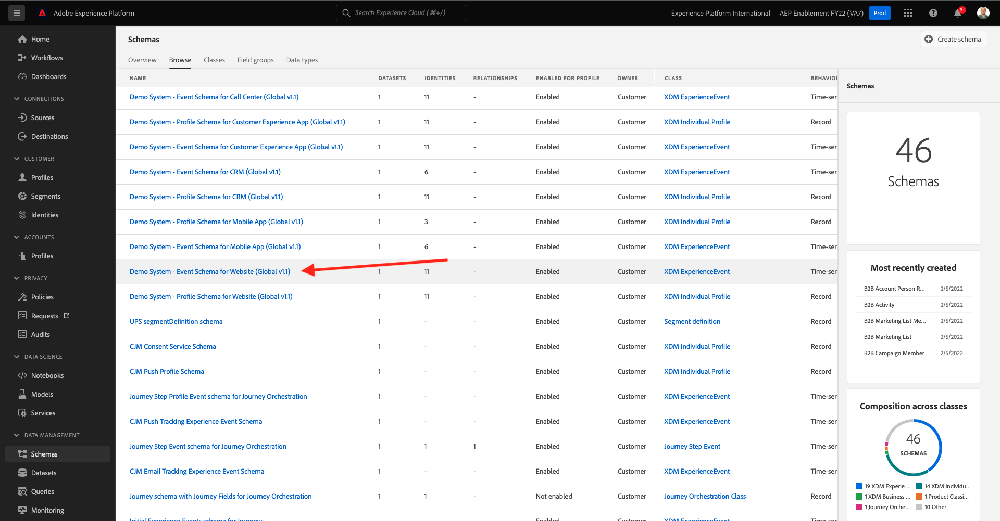

# 1.7Adobe Experience Platform的XDM結構需求

為確保Web SDK和alloy.js能將資料內嵌至Adobe Experience Platform中，特定XDM Mixin必須成為Adobe Experience Platform中XDM結構的一部分。

前往 [https://experience.adobe.com/platform](https://experience.adobe.com/platform) 並登入。

登入後，按一下文字以選取適當的沙箱 **生產產品** 在螢幕上方的藍線。 選取沙箱 `--aepSandboxId--`.

選取沙箱後，畫面會變更，現在就位於沙箱中。

在左側功能表中，前往 **結構** 然後開啟 **示範系統 — 網站事件結構（全域v1.1）** 結構。

在該結構上，您會看到欄位群組 **AEP Web SDK ExperienceEvent Mixin** 已新增。 此欄位組將所有最低要求欄位添加到架構中。 Web SDK將使用的Adobe Experience Platform中每個體驗事件結構都一律需要該欄位群組成為結構的一部分。

在 [模組2](./../module2/data-ingestion.md) 您將學習如何將欄位群組新增至結構。

下一步： [摘要和優點](./summary.md)

[返回模組1](./data-ingestion-launch-web-sdk.md)

[返回所有模組](./../../overview.md)
