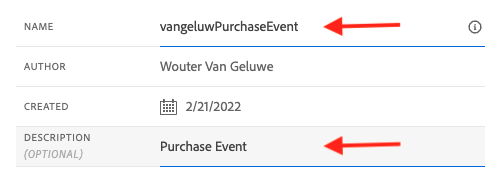
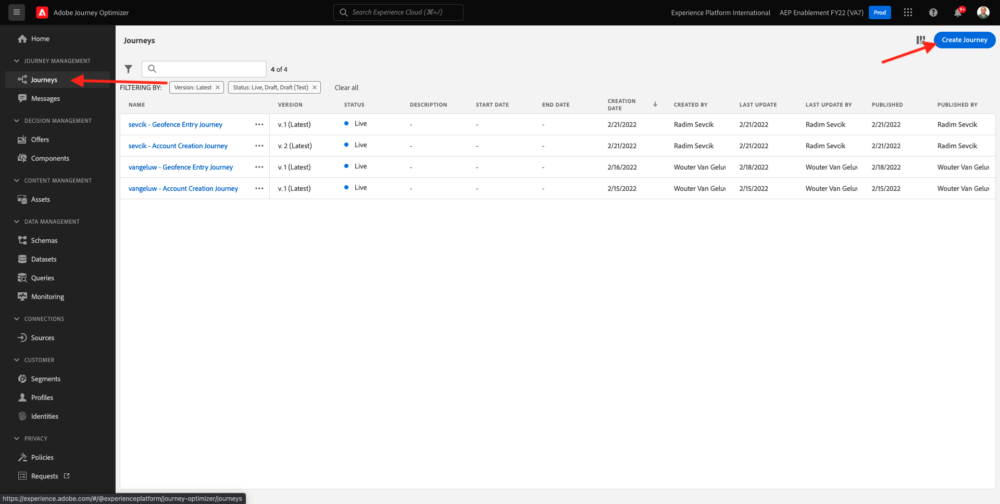
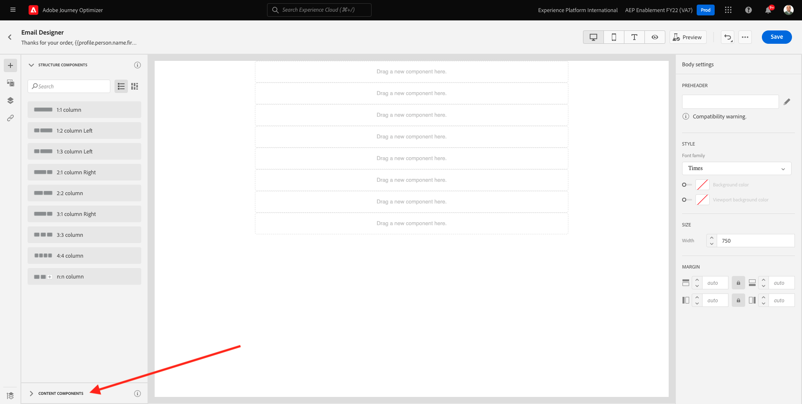
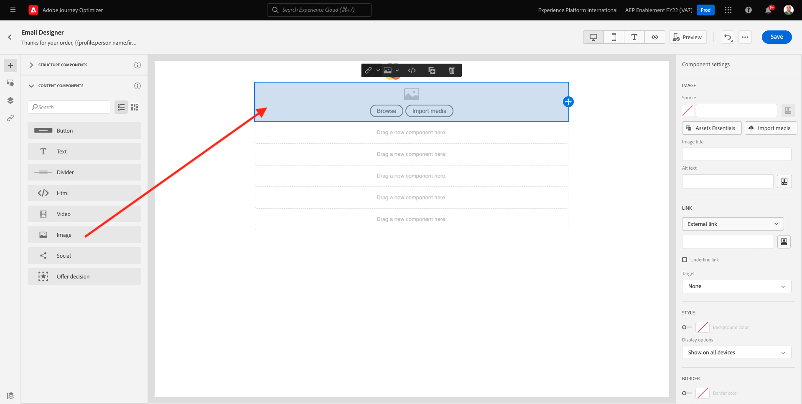
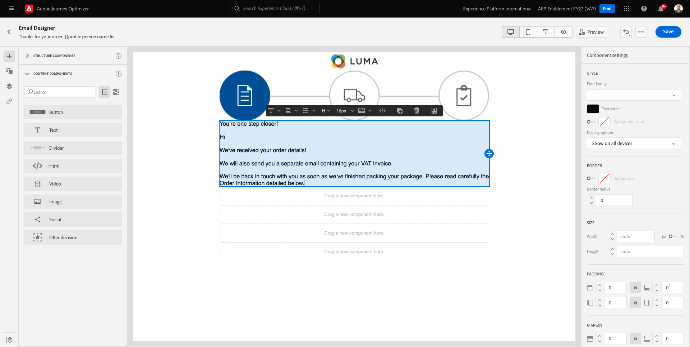
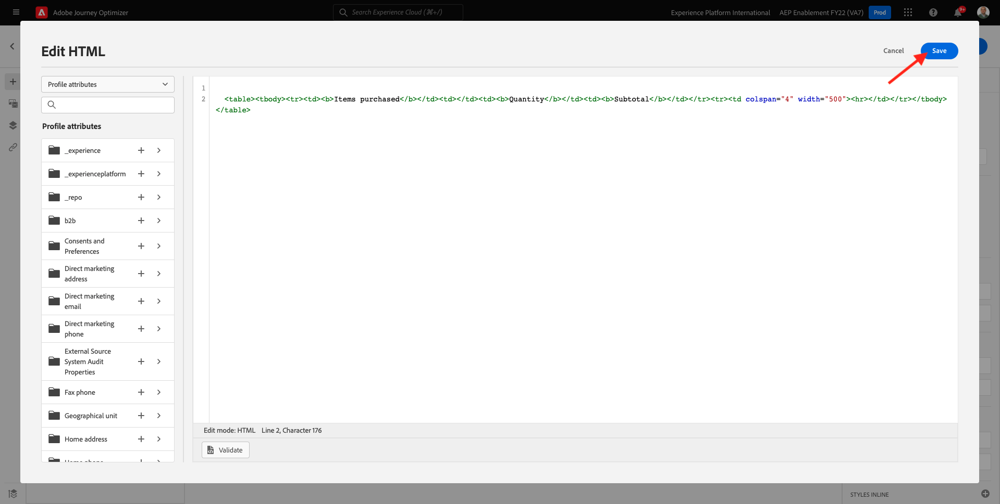
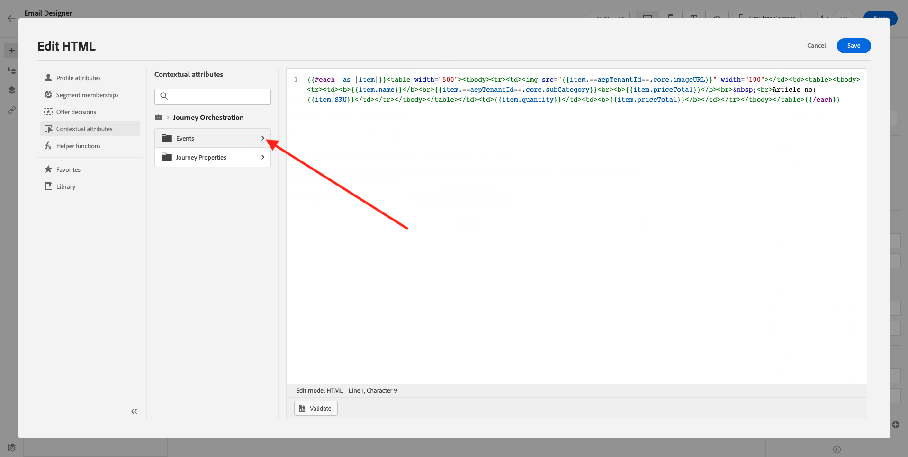
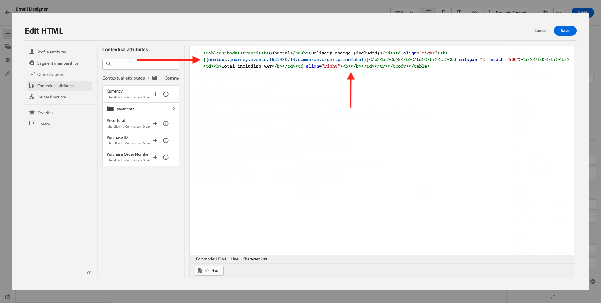
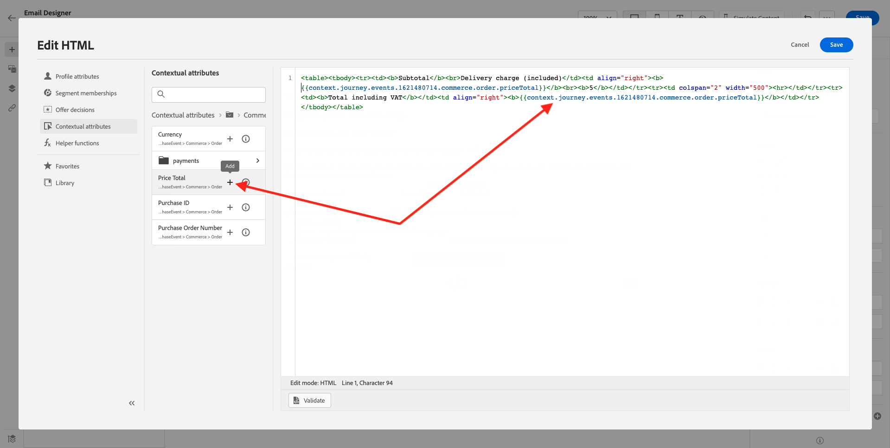
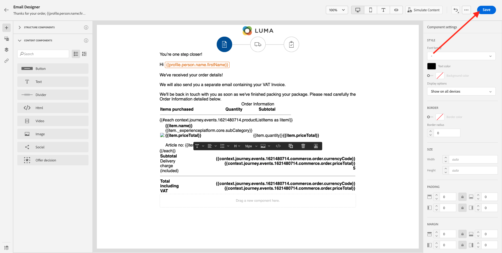

# 10.1設定觸發式歷程 — 訂購確認

前往登入Adobe Journey Optimizer [Adobe Experience Cloud](https://experience.adobe.com). 按一下 **Journey Optimizer**.


系統會將您重新導向至 **首頁**  檢視。 首先，請確定您使用的沙箱正確無誤。 系統會呼叫要使用的沙箱 `--aepSandboxId--`. 若要從一個沙箱變更為另一個沙箱，請按一下 **生產產品(VA7)** 並從清單中選取沙箱。 在此範例中，沙箱的名稱為 **2022財年AEP啟用**. 那你就在 **首頁** 沙箱檢視 `--aepSandboxId--`.


## 10.1.1建立事件

在功能表中，前往 **配置** 按一下 **管理** 在 **事件**.


在 **事件** 螢幕上，您會看到類似此的檢視。 按一下 **建立事件**.


然後您會看到空的事件設定。


首先，為您的事件命名如下： `--demoProfileLdap--PurchaseEvent`，並新增如下的說明： `Purchase Event`.



接下來是 **事件類型** 中。 選擇 **單一**.


接下來是 **事件ID類型** 中。 選擇 **系統生成**


接下來是「結構」選項。 為本練習準備了方案。 請使用架構 `Demo System - Event Schema for Website (Global v1.1) v.1`.


選取結構後，您會在 **裝載** 區段。 按一下 **編輯/鉛筆** 圖示來新增其他欄位至此事件。


然後你會看到這個彈出畫面。 您現在需要勾選其他核取方塊，才能在此事件觸發時存取其他資料。


首先，勾選線上的核取方塊 `--aepTenantId--`.


下一步，向下捲動並勾選線上的核取方塊 `productListItems`.


下一步，向下捲動並勾選線上的核取方塊 `commerce`.


下一步，按一下 **確定**.

之後，您會看到事件已新增其他欄位。 按一下「**儲存**」。


然後會共用您的新事件，您就會在可用事件清單中看到您的事件。

再次按一下您的事件以開啟 **編輯事件** 畫面。
暫留在 **裝載** 欄位，再次查看3個圖示。 按一下 **檢視裝載** 表徵圖。


您現在會看到預期有效負載的範例。 您的事件有唯一的協調eventID，您可以在該裝載中向下捲動以找到它，直到您看到 `_experience.campaign.orchestration.eventID`.


事件ID是需要傳送至Adobe Journey Optimizer的項目，以觸發您將在下一個步驟建立的歷程。 記下此eventID，因為您將在後續步驟中需要它。
`"eventID": "ef6dd943c94fe1b4763c098ccd1772344662f2a9f614513106cb5ada8be36857"`

按一下 **確定**，後跟 **取消**.

您的事件現在已設定完畢，且可供使用。

## 10.1.2建立您的歷程

在功能表中，前往 **歷程** 按一下 **建立歷程**.



你會看到這個。 為您的歷程命名。 使用 `--demoProfileLdap-- - Order Confirmation journey`. 按一下&#x200B;**「確定」**。


首先，您需要將事件新增為歷程的起點。 搜尋您的事件 `--demoProfileLdap--PurchaseEvent` 然後拖放到畫布上。 按一下&#x200B;**「確定」**。


下一個，下 **動作**，搜尋 **電子郵件** 動作並將其新增至畫布。


設定 **類別** to **行銷** 並選取電子郵件介面，讓您傳送電子郵件。 在此情況下，要選取的電子郵件表面是 **電子郵件**. 確保的複選框 **電子郵件的點按次數** 和 **電子郵件開啟** 都會啟用。


下一步是建立訊息。 若要這麼做，請按一下 **編輯內容**.


你現在看到這個。 按一下 **主旨行** 文字欄位。


在文本區域開始寫 **謝謝你的命令，**


尚未完成主題行。 接下來，您需要為欄位帶入個人化代號 **名字** 儲存於 `profile.person.name.firstName`. 在左側功能表中，向下捲動以尋找 **人員** > **全名** >  **名字** 欄位，然後按一下 **+** 圖示將個人化代號新增至主旨行。 按一下「**儲存**」。


你會回來的。 按一下 **電子郵件設計工具** 來建立電子郵件內容。


在下一個畫面中，按一下 **從頭設計**.


在左側功能表中，您會找到可用來定義電子郵件結構（列和欄）的結構元件。

拖放8次a **1:1欄** 畫布上，畫布會提供以下內容：


前往 **內容元件**.



拖放 **影像** 元件。 按一下&#x200B;**「瀏覽」**。


前往資料夾 **啟用資產**，選取檔案 **luma-logo.png** 按一下 **選擇**.


你回來了。 按一下您的影像以加以選取，然後使用 **大小** 滑桿，讓標誌影像小一點。


前往 **內容元件** 拖放 **影像** 元件。 選取 **影像元件** 但不要按一下「瀏覽」。



將此影像URl貼到欄位中 **來源**: `https://parsefiles.back4app.com/hgJBdVOS2eff03JCn6qXXOxT5jJFzialLAHJixD9/29043bedcde632a9cbe8a02a164189c9_preparing.png`. 此影像托管於Adobe之外。


將範圍更改為其他欄位時，將呈現影像，您將看到以下內容：


接下來，轉到 **內容元件** 拖放 **文字** 元件。


選取該元件中的預設文字 **請在這裡鍵入您的文本。** 並以下文字取代：

```javascript
You’re one step closer!

Hi 

We've received your order details!

We will also send you a separate email containing your VAT Invoice.

We'll be back in touch with you as soon as we've finished packing your package. Please read carefully the Order Information detailed below.
```



將游標放在文本旁邊 **你好** 按一下 **新增個人化**.


導覽至 **人員** > **全名** > **名字** 欄位，然後按一下 **+** 圖示將個人化代號新增至主旨行。 按一下「**儲存**」。


然後您會看到：


接下來，轉到 **內容元件** 拖放 **文字** 元件。


選取該元件中的預設文字 **請在這裡鍵入您的文本。** 並以下文字取代：

`Order Information`

將字型大小變更為 **26px** 把你的文字放在這個單元里。 然後，您會擁有此功能：


接下來，轉到 **內容元件** 拖放 **HTML** 元件。 按一下HTML元件，然後按一下 **顯示原始碼**.


在 **編輯HTML** 快顯視窗，貼上此HTML:

```<table><tbody><tr><td><b>Items purchased</b></td><td></td><td><b>Quantity</b></td><td><b>Subtotal</b></td></tr><tr><td colspan="4" width="500"><hr></td></tr></tbody></table>```

按一下「**儲存**」。



那你就拿這個。 按一下 **儲存** 以保存進度。


前往 **內容元件** 拖放 **HTML** 第六列的元件。 按一下HTML元件，然後按一下 **顯示原始碼**.


在 **編輯HTML** 快顯視窗，貼上此HTML:

```{{#each xxx as |item|}}<table width="500"><tbody><tr><td></td><td><table><tbody><tr><td><b>{{item.name}}</b><br>{{item.--aepTenantId--.core.subCategory}}<br><b>{{item.priceTotal}}</b><br>&nbsp;<br>Article no: {{item.SKU}}</td></tr></tbody></table></td><td>{{item.quantity}}</td><td><b>{{item.priceTotal}}</b></td></tr></tbody></table>{{/each}}```

然後，您會擁有此功能：


你現在得替換 **xx** 作為觸發歷程之事件一部分的productListItems物件參考。


首先，刪除 **xx** 在HTML程式碼中。


在左側功能表中，按一下 **內容屬性**. 此內容會傳遞至歷程中的訊息。


你會看到這個。 按一下旁邊的箭頭 **Journey Orchestration** 來鑽得更深。


按一下旁邊的箭頭 **事件** 來鑽得更深。



按一下旁邊的箭頭 `--demoProfileLdap--PurchaseEvent` 來鑽得更深。


按一下旁邊的箭頭 **productListItems** 來鑽得更深。


按一下 **+** 表徵圖 **名稱** 將其新增至畫布。 那你就拿這個。 您現在需要選取  **.name** 如下方螢幕擷取所示，您應將 **.name**.


那你就拿這個。 按一下「**儲存**」。


您現在會回到電子郵件設計工具。 按一下 **儲存** 以保存進度。


接下來，轉到 **內容元件** 拖放 **HTML** 第七排的元件。 按一下HTML元件，然後按一下 **顯示原始碼**.


在 **編輯HTML** 快顯視窗，貼上此HTML:

```<table><tbody><tr><td><b>Subtotal</b><br>Delivery charge (included)</td><td align="right"><b>xxx</b><br><b>5</b></td></tr><tr><td colspan="2" width="500"><hr></td></tr><tr><td><b>Total including VAT</b></td><td align="right"><b>xxx</b></td></tr></tbody></table>```

有2個參考 **xx** 在此HTML代碼中。 現在，您必須取代 **xx** 作為觸發歷程之事件一部分的productListItems物件參考。


首先，刪除第一個 **xx** 在HTML代碼中。


在左側功能表中，按一下 **內容屬性**.


按一下旁邊的箭頭 **Journey Orchestration** 來鑽得更深。


按一下旁邊的箭頭 **事件** 來鑽得更深。


按一下旁邊的箭頭 `--demoProfileLdap--PurchaseEvent` 來鑽得更深。


按一下旁邊的箭頭 **商務** 來鑽得更深。


按一下旁邊的箭頭 **順序** 來鑽得更深。


按一下 **+** 表徵圖 **價格總計** 將其新增至畫布。


那你就拿這個。 現在刪除第二個 **xx** 在HTML代碼中。



按一下 **+** 表徵圖 **價格總計** 再次將其新增至畫布。



您也可以新增欄位 **貨幣** 從 **順序** 物件，如您此處所示。
完成後，按一下 **儲存** 來儲存變更。


然後，您會回到電子郵件設計工具。 按一下 **儲存** 。



按一下 **箭頭** 在左上角的主旨行文字旁邊。


按一下左上角的箭頭，返回您的歷程。


按一下 **確定** 以關閉電子郵件動作。


按一下 **發佈** 發佈您的歷程。


按一下 **發佈** 。


您的歷程現在已發佈。


## 10.1.5更新您的Adobe Experience Platform資料收集用戶端屬性

前往 [Adobe Experience Platform資料收集](https://experience.adobe.com/Launch/) 選取 **標籤**.

這是您之前看到的Adobe Experience Platform資料收集屬性頁面。


在模組0中，演示系統為您建立了兩個客戶端屬性：一個用於網站，一個用於行動應用。 通過搜索來查找 `--demoProfileLdap--` 在 **[!UICONTROL 搜尋]** 框。 按一下以開啟 **Web** 屬性。


前往 **資料元素**. 搜尋並開啟資料元素 **XDM — 購買**.


你會看到這個。 導覽至欄位 **_experience.campaign.orchestration.eventID** 並在此填寫您的eventID。 在此填入的eventID是您在10.1.2練習中建立的eventID。按一下 **儲存** 或 **儲存至程式庫**.


將變更儲存在用戶端屬性中，然後透過更新開發程式庫來發佈變更。


您的變更現已部署，且可進行測試。

## 10.1.6使用演示網站測試您的訂單確認電子郵件

讓我們在示範網站上購買產品，以測試更新的歷程。

前往 [https://builder.adobedemo.com/projects](https://builder.adobedemo.com/projects). 使用您的Adobe ID登入後，您會看到這個。 按一下您的網站專案以開啟。


在 **Screens** 頁面，按一下 **執行**.


然後，您會看到示範網站已開啟。 選取URL並複製到剪貼簿。


開啟新的無痕瀏覽器窗口。


貼上您在上一步複製的示範網站URL。 然後系統會要求您使用Adobe ID登入。


選取您的帳戶類型並完成登入程式。


然後，您會在無痕瀏覽器視窗中看到您的網站載入。 對於每個演示，您都需要使用全新的無痕瀏覽器窗口來載入演示網站URL。


按一下螢幕左上角的Adobe標誌圖示，開啟「設定檔檢視器」。


查看「設定檔檢視器」面板和「即時客戶設定檔」，其中 **Experience CloudID** 作為此目前未知客戶的主要識別碼。


前往註冊/登入頁面。 按一下 **建立帳戶**.


填寫詳細資訊，然後按一下 **註冊** 之後，系統會將您重新導向至上一頁。


將任何產品新增至購物車，然後前往 **購物車** 頁面。 按一下 **繼續結帳**.


接下來，驗證結帳頁面上的欄位，然後按一下 **結帳**.


然後，您會在數秒內收到訂單確認電子郵件。


您已完成本練習。

下一步： [10.2設定批次式電子報歷程](./ex2.md)

[返回模組10](./journeyoptimizer.md)

[返回所有模組](../../overview.md)
