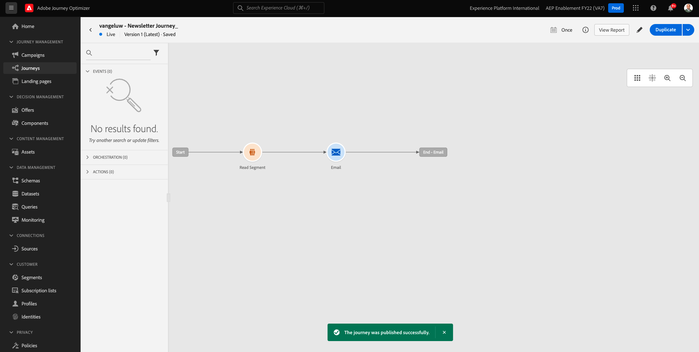

# 10.2設定批次式電子報歷程

前往登入Adobe Journey Optimizer [Adobe Experience Cloud](https://experience.adobe.com). 按一下 **Journey Optimizer**.

系統會將您重新導向至 **首頁**  檢視。 首先，請確定您使用的沙箱正確無誤。 系統會呼叫要使用的沙箱 `--aepSandboxId--`. 若要從一個沙箱變更為另一個沙箱，請按一下 **生產產品(VA7)** 並從清單中選取沙箱。 在此範例中，沙箱的名稱為 **2022財年AEP啟用**. 那你就在 **首頁** 沙箱檢視 `--aepSandboxId--`.

## 10.2.1建立電子報歷程

您現在將建立批次型歷程。 前一個練習的事件型歷程依賴傳入的體驗事件、區段登入或退出來觸發1個特定客戶的歷程，而批次型歷程則透過電子報、一次性促銷活動或一般資訊等不重複內容，或定期傳送類似內容（例如生日促銷活動和提醒）鎖定整個區段一次。

在功能表中，前往 **歷程** 按一下 **建立歷程**.

在右側，您會看到需要指定歷程名稱和說明的表單。 輸入下列值：

- **名稱**: `--demoProfileLdap-- - Newsletter Journey`. 例如： **vangeluw — 電子報歷程**.
- **說明**:每月電子報

按一下 **確定**.

在 **協調**，拖放 **讀取區段** 到畫布上。 這表示發佈後，歷程會從擷取整個區段對象開始，然後會成為歷程和訊息的目標對象。 按一下 **選取區段**.

在 **選擇區段** 彈出式視窗，搜尋您的ldap並選取您在 [模組6 — 即時CDP — 建立區段並採取行動](../module6/real-time-cdp-build-a-segment-take-action.md) 已命名 `--demoProfileLdap-- - Interest in PROTEUS FITNESS JACKSHIRT`. 例如：vangeluw — 對PROTEUS健身夾克衫的興趣。 按一下「**儲存**」。

按一下 **確定**.

在左側功能表中，尋找 **動作** 區段並拖放 **電子郵件** 動作到畫布上。

設定 **類別** to **行銷** 並選取電子郵件介面，讓您傳送電子郵件。 在此情況下，要選取的電子郵件表面是 **電子郵件**. 確保的複選框 **電子郵件的點按次數** 和 **電子郵件開啟** 都會啟用。

下一步是建立訊息。 若要這麼做，請按一下 **編輯內容**.

你現在看到這個。 按一下 **主旨行** 文字欄位。

為主題行輸入以下文本： `Luma Newsletter - your monthly update has arrived.`. 按一下「**儲存**」。

你會回來的。 按一下 **電子郵件設計工具** 以開始建立電子郵件內容。

你會看到這個。 按一下 **匯入HTML**.

在快顯畫面中，您需要拖放電子郵件的HTML檔案。 您可以找到HTML範本 [此處](../../assets/html/ajo-newsletter.html.zip). 將包含HTML範本的zip檔案下載至本機電腦，然後解壓縮至您的案頭。

拖放檔案 **ajo-newsletter.html** 上傳至Journey Optimizer。 按一下&#x200B;**「匯入」**。

此電子郵件內容已準備好使用，因為它具有所有預期的個人化、影像和文字。 只有選件預留位置留空。

您可能會收到錯誤訊息： **嘗試擷取資產時發生錯誤**. 這會連結至電子郵件中的影像。

如果出現此錯誤，請選取影像，然後按一下 **編輯影像** 按鈕。

按一下 **Assets Essentials** 返回您的AEM Assets Essentials資料庫。

然後你會看到這個彈出畫面。 導覽至資料夾 **啟用資產** 並選取影像 **luma-newsletterContent.png**. 按一下&#x200B;**「選取」**。

您的基本電子報電子郵件現已準備就緒。 按一下「**儲存**」。

按一下 **箭頭** 在左上角的主旨行文字旁邊。

按一下左上角的箭頭，返回您的歷程。

按一下 **確定** 以關閉電子郵件動作。

您的電子報歷程現在已準備好發佈。 在執行此操作之前，請注意 **排程** 區段中，您可將此歷程從一次性切換為週期性促銷活動。 按一下 **排程** 按鈕。

你會看到這個。 選擇 **一次**.

選取下一小時內的日期和時間，以便測試您的歷程。 按一下 **確定**.

>[!NOTE]
>
>訊息傳送日期和時間必須在一小時內。

按一下 **發佈**.

按一下 **發佈** 。

您的基本電子報歷程現已發佈。 您的電子報電子郵件訊息會依您在排程中定義的方式傳送，而您的歷程會在上次傳送電子郵件後立即停止。

您已完成本練習。

下一步： [10.3在電子郵件訊息中套用個人化](./ex3.md)

[返回模組10](./journeyoptimizer.md)

[返回所有模組](../../overview.md)
