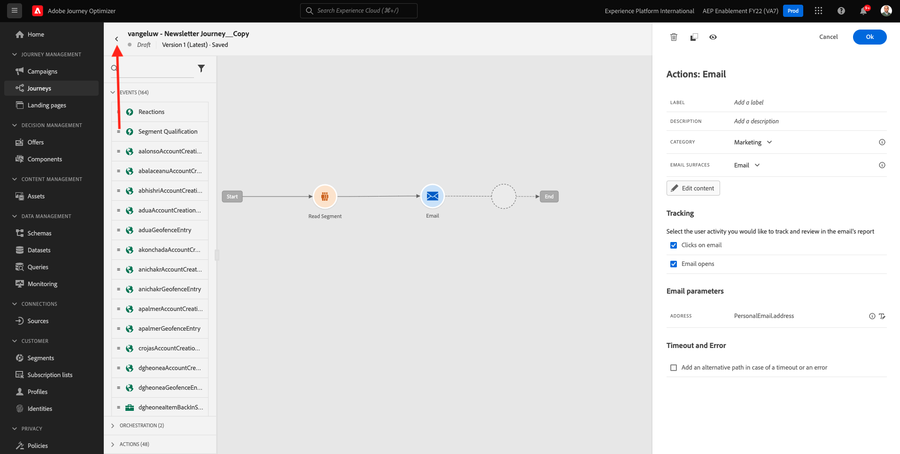
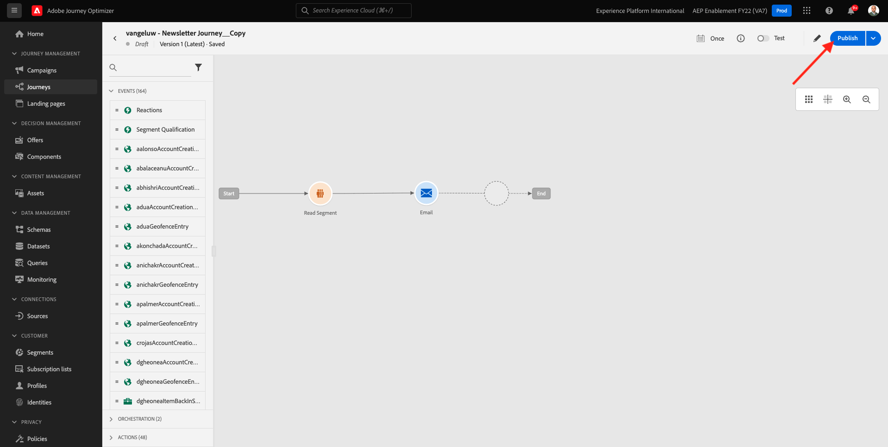

# 10.3在電子郵件訊息中套用個人化

前往登入Adobe Experience Cloud [Adobe Experience Cloud](https://experience.adobe.com). 按一下 **Adobe Journey Optimizer**.

系統會將您重新導向至 **首頁** 檢視。 繼續之前，您需要選取 **沙箱**. 要選取的沙箱已命名 ``--aepTenantId--``. 您可以按一下文字 **[!UICONTROL 生產產品]** 在螢幕上方的藍線。

## 10.3.1區段型個人化

在本練習中，您將根據區段成員資格，以個人化文字來改善電子報電子郵件訊息。

前往 **歷程**. 尋找您在先前練習中建立的電子報歷程。 搜尋 `--demoProfileLdap-- - Newsletter`. 按一下您的歷程以開啟。

你會看到這個。 按一下 **複製**.

按一下**複製**。

選取 **電子郵件** 動作，按一下 **編輯內容**.

按一下 **電子郵件設計工具**.

你會看到這個。

開啟 **內容元件** 並拖曳 **文字** 目前電子報內容下方的元件。

選取整個預設文字並加以刪除。 然後按一下 **新增個人化** 按鈕。

然後您會看到：

在左側功能表中，按一下 **區段成員資格**.

>[!NOTE]
>
>如果您在此清單中找不到您的區段，請向下捲動一位以尋找如何手動擷取區段ID的指示。

選取區段 `Luma - Women's Category Interest` 並按一下 **+** 表徵圖，其應如下所示：

接著，您應將第一行保留原樣，並以此程式碼取代第2行和第3行：

``
Psssst... a private sale in the women category will launch soon, we will keep you posted

Thanks for taking the time to read our newsletter. Here is a 10% promo code to use on the website: READER10

``

然後，您會擁有此功能：

按一下 **驗證** 以確保程式碼正確無誤。 按一下「**儲存**」。

您現在可以按一下 **儲存** 按鈕。 然後，按一下 **模擬內容**.

選取您在本教學課程中建立的其中一個設定檔，然後按一下 **預覽**. 然後，您會看到配置的結果。

你會看到這個。 然後，按一下 **關閉**.

按一下 **箭頭** 在左上角的主旨行文字旁邊。

按一下左上角的箭頭，返回您的歷程。

按一下 **確定** 以關閉電子郵件動作。

變更您的 **排程** to **一次** 並定義 **日期/時間**. 按一下 **確定**.

>[!NOTE]
>
>訊息傳送日期和時間必須在一小時內。

按一下 **發佈** 按鈕。

在快顯視窗中，按一下 **發佈** 。

您的基本電子報歷程現已發佈。 您的電子報電子郵件訊息會根據您的排程傳送，而您的歷程會在最後一封電子郵件傳送完畢後立即停止。

您已完成本練習。

下一步： [10.4設定及使用iOS的推播通知](./ex4.md)

[返回模組10](./journeyoptimizer.md)

[返回所有模組](../../overview.md)
