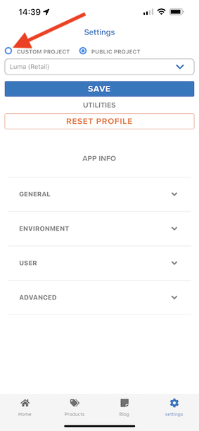
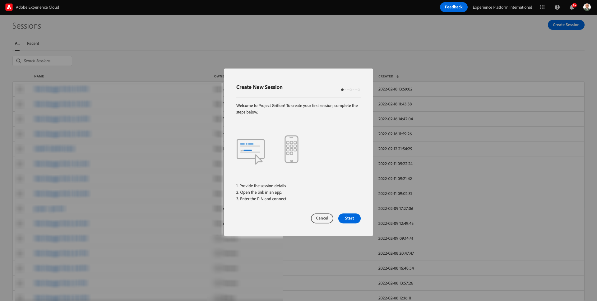
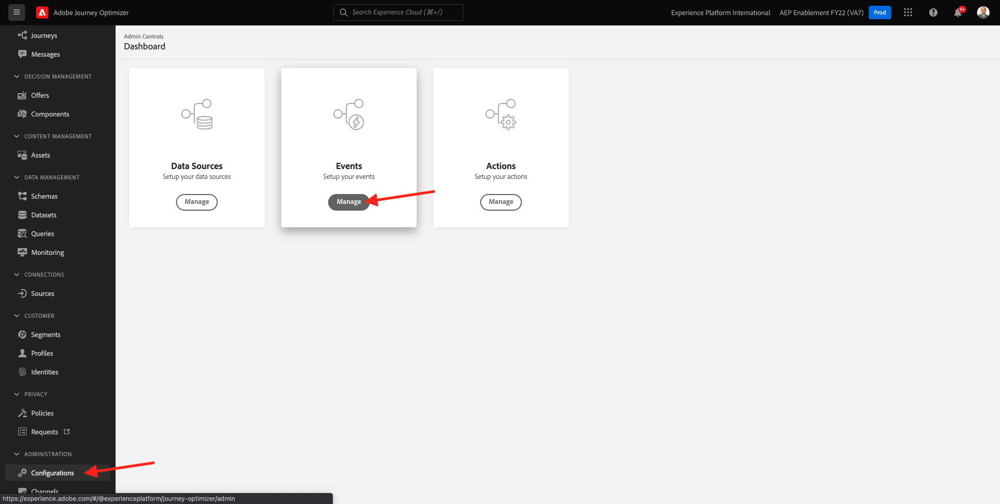
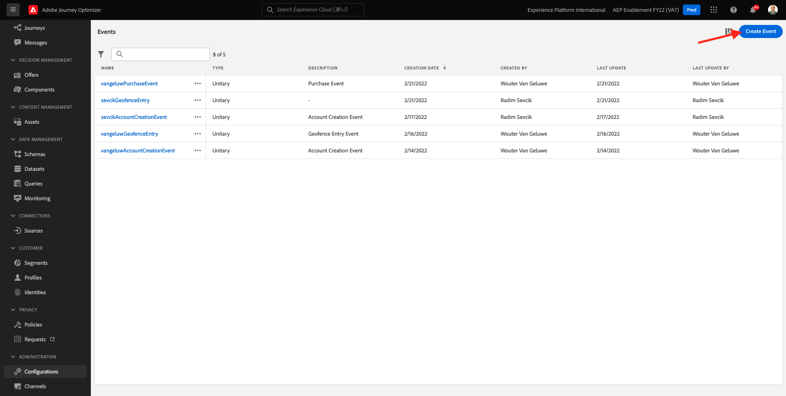
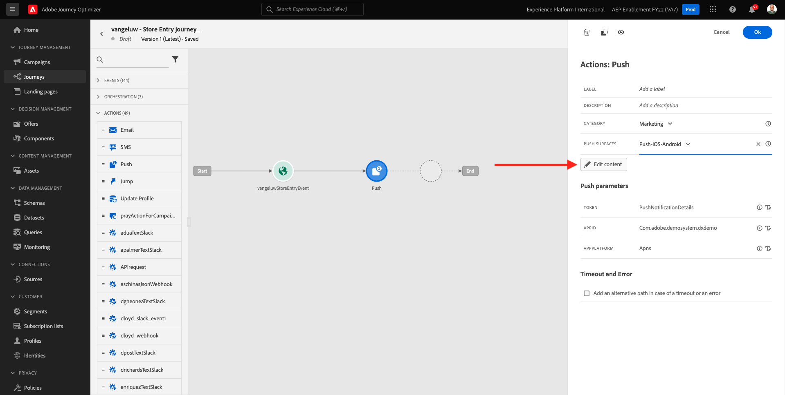
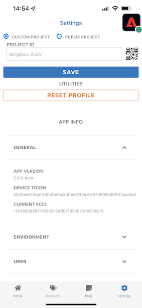

# 10.4設定及使用iOS的推播通知

若要搭配Adobe Journey Optimizer使用推播通知，需檢查並了解許多設定。

以下是要驗證的所有設定：

- Adobe Experience Platform中的資料集和結構
- 行動裝置的資料流
- 行動裝置的資料收集屬性
- 推送憑證的應用程式表面
- 使用AEP保證測試推播設定

讓我們逐一回顧一下。

前往登入Adobe Journey Optimizer [Adobe Experience Cloud](https://experience.adobe.com). 按一下 **Journey Optimizer**.

系統會將您重新導向至 **首頁**  檢視。 首先，請確定您使用的沙箱正確無誤。 系統會呼叫要使用的沙箱 `--aepSandboxId--`. 若要從一個沙箱變更為另一個沙箱，請按一下 **生產產品(VA7)** 並從清單中選取沙箱。 在此範例中，沙箱的名稱為 **2022財年AEP啟用**. 那你就在 **首頁** 沙箱檢視 `--aepSandboxId--`.

## 10.4.1推送資料集

Adobe Journey Optimizer使用資料集來儲存行動裝置上的推送代號或與推送訊息的互動(例如：已傳送訊息、已開啟訊息等)，放在Adobe Journey Optimizer的資料集中。

前往 **[!UICONTROL 資料集]** 在畫面左側的功能表中。 若要顯示系統資料集，請按一下篩選圖示。

啟用選項 **顯示系統資料集** 和搜索 **AJO**. 之後，您就會看到用於推播通知的資料集。

## 10.4.2行動裝置資料流

前往 [https://experience.adobe.com/#/data-collection/](https://experience.adobe.com/#/data-collection/).

在左側功能表中，前往 **[!UICONTROL 資料流]** 並搜尋您在 [練習0.2](./../module0/ex2.md)，此名稱為 `--demoProfileLdap-- - Demo System Datastream (Mobile)`. 按一下以開啟。

按一下 **編輯** 在 **Adobe Experience Platform** 服務。

接著，您會看到已定義的資料流設定，以及將儲存資料集事件和設定檔屬性的位置。

無需變更，您的資料流現在已準備好用於行動裝置的資料收集用戶端屬性。

## 10.4.3檢閱行動裝置的資料收集屬性

前往 [https://experience.adobe.com/#/data-collection/](https://experience.adobe.com/#/data-collection/). 作為的一部分 [練習0.1](./../module0/ex1.md), 2已建立資料收集屬性。
您已使用這些資料收集客戶端屬性作為以前模組的一部分。

按一下以開啟行動裝置的資料收集屬性。

在資料收集屬性中，前往 **擴充功能**. 接著，您會看到行動應用程式所需的各種擴充功能。 按一下以開啟擴充功能 **Adobe Experience Platform Edge Network**.

然後您會看到行動裝置的資料流已連結於此處。 下一步，按一下 **取消** 返回擴充功能概觀。

你會回來的。 您會看到的擴充功能 **AEP保證**. AEP Assurance可協助您檢查、校樣、模擬及驗證您收集資料或提供行動應用程式體驗的方式。 您可以在這裡閱讀更多有關AEP保障和Project Griffon的資訊 [https://aep-sdks.gitbook.io/docs/beta/project-griffon](https://aep-sdks.gitbook.io/docs/beta/project-griffon).

下一步，按一下 **設定** 開啟擴充功能 **Adobe Journey Optimizer**.

接著，您就會看到這是連結追蹤推送事件資料集的位置。

您不需要對資料收集屬性進行任何變更。

## 10.4.4檢閱應用程式表面設定

前往 [https://experience.adobe.com/#/data-collection/](https://experience.adobe.com/#/data-collection/). 在左側功能表中，前往 **應用程式曲面** 和開啟，App Surface **DX示範應用程式APNS**.

之後，您就會看到已設定的iOS和Android適用的App Surface。

## 10.4.5使用AEP保證測試推播通知設定。

安裝應用程式後，您就會在裝置的主畫面中找到它。 按一下圖示以開啟應用程式。

第一次使用應用程式時，系統會要求您使用Adobe ID登入。 完成登入程式。

登入後，您會看到要求傳送通知的權限的通知。 我們將在教學課程中傳送通知，因此請按一下 **允許**.

然後您會看到應用程式的首頁。 前往 **設定**.

在設定中，您會看到目前a **公用專案** 已載入應用程式中。 按一下 **自訂專案**.

您現在可以載入自訂專案。 按一下QR碼即可輕鬆載入專案。

0.1練習後，你得到了這個結果。 按一下以開啟 **行動零售專案** 是為你建立的。

若您不小心關閉了瀏覽器視窗，或未來的示範或啟用課程，您也可以前往 [https://builder.adobedemo.com/projects](https://builder.adobedemo.com/projects). 使用您的Adobe ID登入後，您會看到這個。 按一下您的行動應用程式專案以開啟。

你會看到這個。 按一下 **整合**.

您需要為0.1練習中建立的行動裝置選取資料收集屬性。下一步，按一下 **執行**.

然後您會看到此快顯視窗，其中包含QR碼。 從行動應用程式內掃描此QR碼。

接著，您就會在應用程式中看到您的專案ID，然後按一下 **儲存**.

現在，返回 **首頁** 在應用程式中。 您的應用程式現在已可供使用。

您現在需要掃描QR碼，將行動裝置連線至AEP保證工作階段。

若要開始AEP保證工作階段，請前往 [https://experience.adobe.com/#/@experienceplatform/griffon](https://experience.adobe.com/#/@experienceplatform/griffon). 按一下 **建立工作階段**.

按一下&#x200B;**「開始」**。

填寫值：

- 會話名稱：use `--demoProfileLdap-- - push debugging` 使用ldap替換ldap
- 基本URL:use **dxdemo://default**

按&#x200B;**「下一步」**。

接著，畫面會顯示QR碼，您應使用iOS裝置掃描該碼。

在您的行動裝置上，開啟相機應用程式並掃描AEP Assurance顯示的QR碼。

然後您會看到快顯畫面，要求您輸入PIN碼。 從AEP Assurance畫面複製PIN碼，然後按一下 **Connect**.

你會看到這個。

在「AEP保證」中，您現在會看到裝置進入「AEP保證」工作階段。

前往 **推送偵錯**. 你會看到這樣的。

有些解釋：

- 第一欄， **用戶端**，則會顯示您iOS裝置上可用的識別碼。 您會看到ECID和推送代號。
- 第二欄顯示 **設定檔** 資訊，以及推送代號所在平台的其他資訊（APNS或APNSSandbox）。 如果您按一下 **Inspect設定檔** 按鈕，您就會被帶到Adobe Experience Platform，並看到完整的即時客戶個人檔案。
- 第3欄顯示 **應用程式設定**，此活動是作為練習的一部分而設定 **10.5.4在Launch中建立應用程式設定**

若要測試您的推送設定，請按一下 **傳送推播通知** 按鈕。

您必須確定 **DX示範** 按一下 **傳送推播通知** 按鈕。 如果應用程式開啟，系統可能會在背景接收推播通知，且不會顯示。

之後，您的行動裝置上就會出現類似此的推播通知。

如果您收到推播通知，表示您的設定正確且正常運作。

## 10.4.6建立新事件

在功能表中，前往 **歷程管理** 按一下 **管理** 在 **事件**.

在 **事件** 螢幕上，您會看到類似此的檢視。 按一下 **建立事件**.

然後您會看到空的事件設定。

首先，為您的事件命名如下： `--demoProfileLdap--StoreEntryEvent` 將說明設定為 `Store Entry Event`.

接下來是 **事件類型** 中。 選擇 **單一**.

接下來是 **事件ID類型** 中。 選擇 **系統生成**

接下來是「結構」選項。 為本練習準備了方案。 請使用架構 `Demo System - Event Schema for Mobile App (Global v1.1) v.1`.

選取結構後，您會在 **裝載** 區段。 您的事件現在已完全設定。

你應該看看這個。 按一下「**儲存**」。

您的事件現在已設定並儲存。 再次按一下您的事件以開啟 **編輯事件** 畫面。

暫留在 **裝載** 欄位，然後按一下 **檢視裝載** 表徵圖。

您現在會看到預期有效負載的範例。

您的事件有唯一的協調eventID，您可以在該裝載中向下捲動以找到，直到您看到 `_experience.campaign.orchestration.eventID`.

事件ID是需要傳送至Adobe Experience Platform的項目，以觸發您將在下一個步驟建立的歷程。 記下此eventID，因為您會在下一個步驟中需要它。
`"eventID": "e3a8f0bdc0b609667cd96a72a6b1e5aafa0ddaf6ccf121c574e6a2030860a633"`

按一下 **確定**，後跟 **取消**.

## 10.4.7建立歷程

在功能表中，前往 **歷程** 按一下 **建立歷程**.

你會看到這個。 為您的歷程命名。 使用 `--demoProfileLdap-- - Store Entry journey`. 按一下&#x200B;**「確定」**。

首先，您需要將事件新增為歷程的起點。 搜尋您的事件 `--demoProfileLdap--StoreEntryEvent` 然後拖放到畫布上。 按一下&#x200B;**「確定」**。

下一個，下 **動作**，搜尋 **推播** 動作。
拖放 **推播** 動作到畫布上。

設定 **類別** to **行銷** 和選取可讓您傳送推播通知的推播表面。 在此情況下，要選取的電子郵件表面是 **Push-iOS-Android**.

下一步是建立訊息。 若要這麼做，請按一下 **編輯內容**.

你會看到這個。 按一下 **個人化** 圖示 **標題** 欄位。

你會看到這個。 您現在可以直接從即時客戶設定檔中選取任何設定檔屬性。

搜尋欄位 **名字**，然後按一下 **+** 圖示 **名字**. 接著，您會看到新增名字的個人化代號： **{{profile.person.name.firstName}}**.

接下來，新增文字 **歡迎光臨我們的商店！** 背後 **{{profile.person.name.firstName}}**.

按一下「**儲存**」。

你現在有了這個。 按一下 **個人化** 圖示 **主體** 欄位。

輸入此文本 **按一下這裡，今天就買了，可享受10%的折扣！** 按一下 **儲存**.

那你就拿這個。 按一下左上角的箭頭，返回您的歷程。

按一下 **確定** 來關閉推播動作。

按一下 **發佈**.

按一下 **發佈** 。

您的歷程現在已發佈。

## 10.4.8測試您的歷程和推送訊息

在DX演示2.0移動應用程式中，轉到 **設定** 螢幕。 按一下 **儲存項目** 按鈕。

>[!NOTE]
>
>此 **儲存項目** 按鈕目前正在實作。 您還無法在應用程式中找到它。

請務必在按一下 **儲存項目** 圖示，否則不會顯示推送訊息。

幾秒後，您會看到訊息。

您已完成本練習。

下一步： [10.5建立業務事件歷程](./ex5.md)

[返回模組10](./journeyoptimizer.md)

[返回所有模組](../../overview.md)
