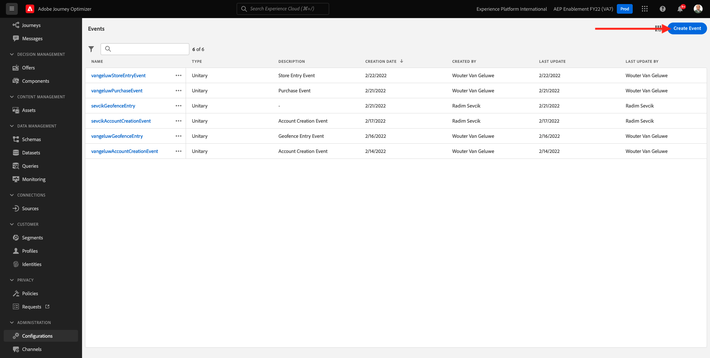
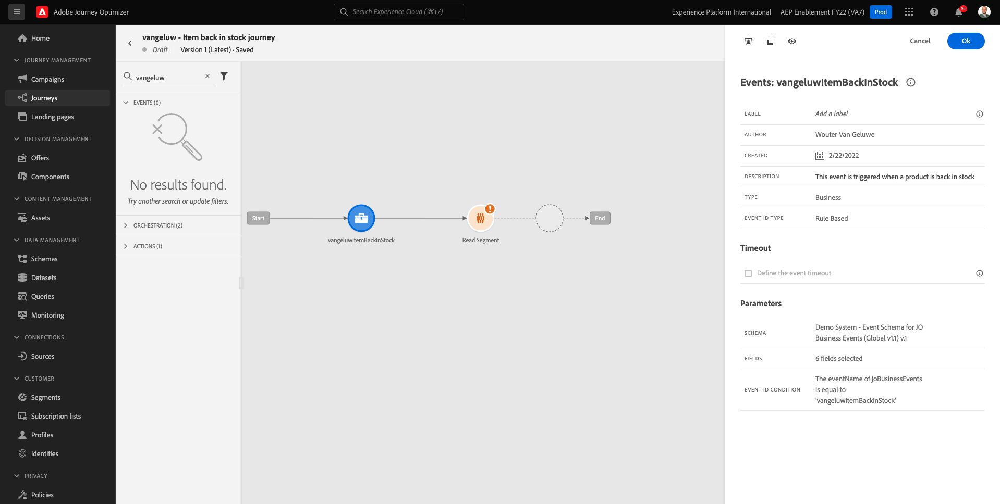
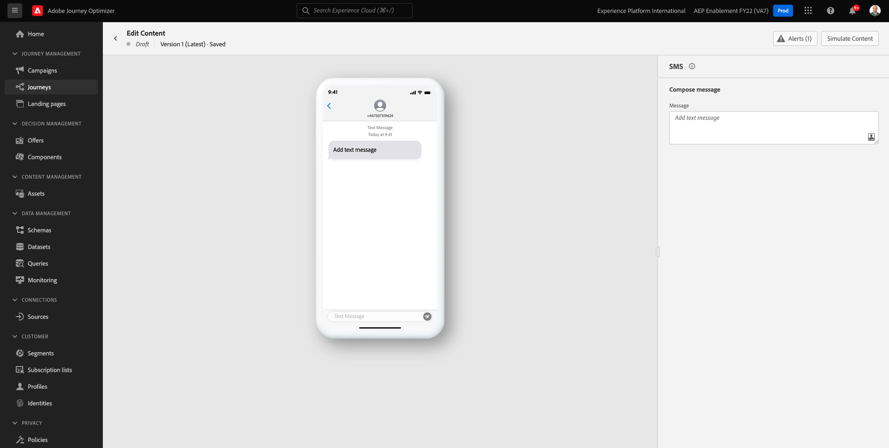
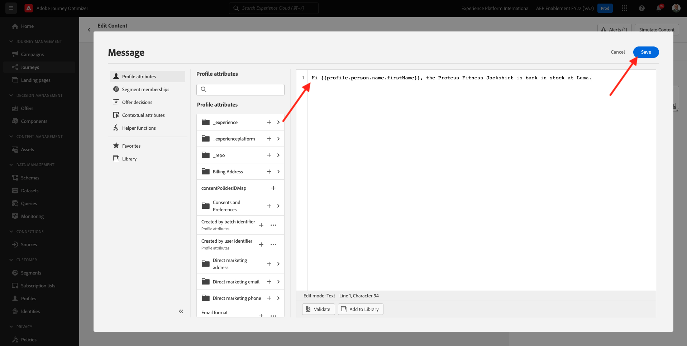

# 10.5建立業務事件歷程

前往登入Adobe Journey Optimizer [Adobe Experience Cloud](https://experience.adobe.com). 按一下 **Journey Optimizer**.


系統會將您重新導向至 **首頁**  檢視。 首先，請確定您使用的沙箱正確無誤。 系統會呼叫要使用的沙箱 `--aepSandboxId--`. 若要從一個沙箱變更為另一個沙箱，請按一下 **生產產品(VA7)** 並從清單中選取沙箱。 在此範例中，沙箱的名稱為 **2022財年AEP啟用**. 那你就在 **首頁** 沙箱檢視 `--aepSandboxId--`.


## 10.5.1建立業務事件

在左側功能表中，按一下 **配置**. 按一下 **管理** 按鈕 **事件** 卡片。


業務事件是您可在Journey Optimizer內建立的新事件類型。 不同於 **單一** 您在先前模組中建立的事件，業務事件不是由客戶觸發，而是由組織觸發。 您現在將建立您的商務活動。

按一下 **建立事件**.



在「事件建立」表單中輸入以下值：

- **名稱**: `--demoProfileLdap--ItemBackInStock`. 例如： **vangeluwItemBackInStock**
- **說明**:當產品重新存貨時，就會觸發此事件
- **類型**:選取 **企業** 在下拉式清單中


對於架構，請選擇 **示範系統 — JO業務事件（全域v1.1）v.1的事件結構**. 您現在需要選取使用案例所需結構中的欄位。


請依照下列步驟操作：

按一下 **鉛筆** 表徵圖 **已選取1個欄位**.


選擇架構中的所有可用欄位，然後按一下 **確定**.


條件：您需要指定此架構中將觸發業務事件的記錄。

請依照下列步驟操作：

按一下 **鉛筆** 表徵圖 **新增條件**.


在左側，展開 `--aepTenantId--` 對象，展開對象 **joBusinessEvents** 拖放欄位 **eventName** 到畫布上。


針對欄位 **eventName**，請輸入下列值： `--demoProfileLdap--ItemBackInStock`. 例如：vangeluwItemBackInStock。
按一下**「確定」**。


按一下&#x200B;**「確定」**。


最後，事件建立表單應如下所示。 按一下 **儲存** 來保存您的業務活動。


## 10.5.2建立業務事件歷程

您現在可以在歷程中運用此業務事件和訊息。 前往 **歷程**. 按一下 **建立歷程**.


在右側，您會看到需要指定歷程名稱和說明的表單。 輸入下列值：

- **名稱**: `--demoProfileLdap-- - Item back in stock journey`. 例如：vangeluw — 庫存歷程中的項目回訪
- **說明**:此歷程會在項目有存貨時傳送簡訊給有興趣的訪客。

按一下&#x200B;**「確定」**。


在左側功能表的下方 **事件**，請搜尋ldap。 您會找到先前建立的業務事件 `--demoProfileLdap--ItemBackInStock`. 將此事件拖放至畫布上，因為這將是歷程的起點。



如您所見，a **讀取區段** 活動已自動新增至畫布。 這是因為業務事件只會傳送歷程的觸發器，以讀取特定區段，接著會擷取該歷程的設定檔清單。

按一下 **讀取區段** 活動。
此 **讀取區段** 設定會要求您選取要通知剛發生之業務事件的區段。 按一下 **選取區段** 欄位。


在 **選擇區段** 彈出式視窗，搜尋您的ldap並選取您在 [模組6 — 即時CDP — 建立區段並採取行動](../module6/real-time-cdp-build-a-segment-take-action.md) 已命名 `--demoProfileLdap-- - Interest in PROTEUS FITNESS JACKSHIRT`. 例如：vangeluw — 對PROTEUS健身夾克衫的興趣。 按一下「**儲存**」。


下一步，按一下 **確定**.


下一步是拖放我們要在此歷程中執行的動作。 選取動作 **簡訊**，然後在您剛新增的條件之後拖放。


設定 **類別** to **行銷** 並選取可讓您傳送sms的sms表面。 在此情況下，要選取的電子郵件表面是 **簡訊**.


下一步是建立訊息。 若要這麼做，請按一下 **編輯內容**.


您現在會看到訊息控制面板，您可在其中設定SMS的文字。 按一下 **撰寫訊息** 區域來建立訊息。



輸入以下文字： `Hi {{profile.person.name.firstName}}, the Proteus Fitness Jackshirt is back in stock at Luma.`. 按一下「**儲存**」。



按一下 **箭頭** 在左上角的主旨行文字旁邊。


您現在會看到已完成的SMS動作。 按一下 **確定**.


您的歷程現在已準備好發佈。 按一下 **發佈**.


按一下 **發佈** 。


您的歷程現已發佈，您現在可以測試！


## 10.5.3測試您的業務事件歷程

您現在會針對 **示範系統 — JO業務事件（全域v1.1）v.1的事件結構** 使用Postman。

在左側功能表中，按一下 **來源** 然後按一下 **帳戶** 標籤。


在 **帳戶** 頁簽上，您會找到 **Journey Optimizer業務活動**. 按一下它以開啟它。


此帳戶只有一個資料流，按一下資料流名稱以選擇它。


按一下 **複製架構裝載** 的下一頁。 此選項會複製整個 **捲曲** 命令，根據 **示範系統 — JO業務事件（全域v1.1）v.1的事件結構** 到剪貼簿。


將Curl命令貼入文字編輯器中


讓我們更仔細地看看這個請求，

- POST要求會傳送至DCS入口ID
- 請求會參考結構、資料集和組織ID。
- 最後，其中包含xdmEntity節點，代表我們要在資料集內建立的資料。

您現在需要取代下列項目 `xdmEntity` 線……

```json
"xdmEntity": {
  "_experienceplatform": {
    "joBusinessEvents": {
      "eventDescription": "string",
      "eventName": "string",
      "stockEventId": "string"
    }
  },
  "_id": "/uri-reference",
  "eventType": "advertising.completes",
  "timestamp": "2018-11-12T20:20:39+00:00"
}
```

...依照此行，請務必如應該確認欄位eventName `--demoProfileLdap--ItemBackInStock`，代表您在業務事件中指定以觸發歷程的條件。

```json
"xdmEntity": {
  "_experienceplatform": {
    "joBusinessEvents": {
      "eventDescription": "Product Proteus Fitness Jackshirt is back in stock",
      "eventName": "--demoProfileLdap--ItemBackInStock",
      "stockEventId": "1"
    }
  },
  "_id": "/uri-reference",
  "eventType": "productBackInStock",
  "timestamp": "2021-04-19T15:25:39+00:00"
}
```

已更新 **捲曲** 命令應如下所示：


選取所有項目，然後複製到剪貼簿。

開啟Postman。 在Postman的左側，按一下 **匯入**.


選取 **原始文字** 標籤中，然後貼上先前複製的命令。 按一下&#x200B;**繼續**。


按一下&#x200B;**「匯入」**。


Postman已自動轉換 **捲曲** 命令進入準備觸發的REST命令，只需按 **傳送** 按鈕，要求在資料集內建立該記錄。


確認已成功接收您的請求。 尋找 **200 OK** 郵遞員狀態。


簡訊可能需要幾分鐘的時間才會送達您的行動電話。 如果沒有，您的 **對Proteus健身Jackshirt的興趣** 區段不得包含使用正確行動電話的設定檔。 若有，請前往Luma網站，造訪 **Proteus Fitness Jackshirt** 產品和註冊，同時確保提供正確的行動電話號碼。


您現在已完成本練習。

下一步： [摘要和優點](./summary.md)

[返回模組10](./journeyoptimizer.md)

[返回所有模組](../../overview.md)
