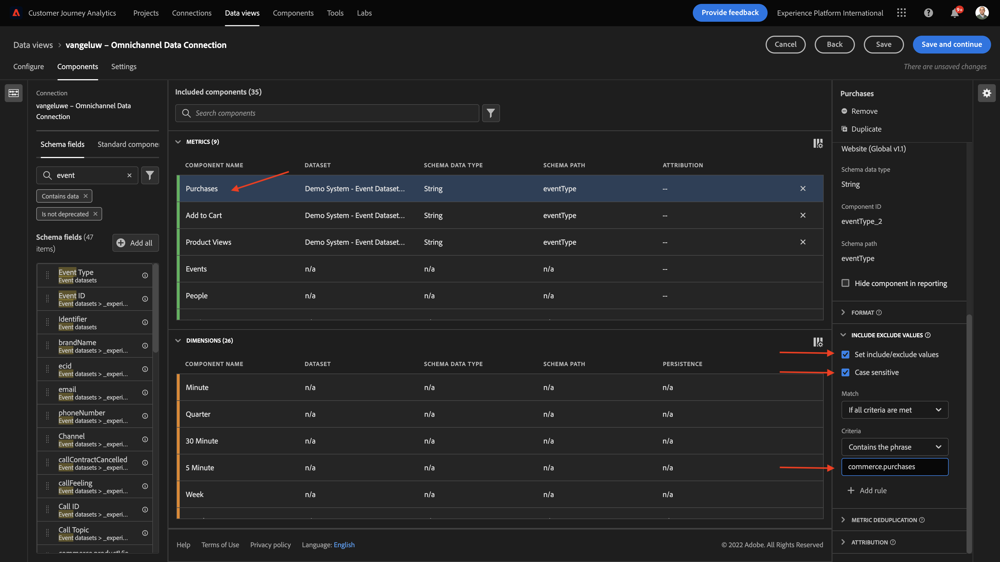

# 11.3建立資料檢視

## 目標

- 了解資料檢視UI
- 了解造訪定義的基本設定
- 了解資料檢視的歸因和持續性

## 11.3.1資料檢視

完成連線後，您現在可以進步影響視覺效果。 Adobe Analytics和CJA的差異在於CJA需要「資料檢視」，才能在視覺化前清除和準備資料。

資料檢視與Adobe Analytics中虛擬報表套裝的概念類似，可讓您定義內容感知造訪定義、篩選，以及元件的呼叫方式。

每個連線至少需要一個資料檢視。 不過，對於某些使用案例而言，擁有多個資料檢視來建立相同連線是件好事，其目標是為不同團隊提供不同的深入分析。
如果您希望公司以資料為導向，您應調整每個團隊中資料的檢視方式。 一些範例：

- 僅限UX設計團隊的UX量度
- 對KPI和Google Analytics使用與Customer Journey Analytics相同的名稱，讓數位分析團隊只能說1種語言。
- 篩選資料檢視，以顯示僅針對一個市場、一個品牌或僅限行動裝置的例項資料。

在 **連線** 螢幕上，勾選您剛建立之連線前面的核取方塊。 按一下 **建立資料檢視**.

系統會將您重新導向至 **建立資料檢視** 工作流程。

## 11.3.2資料視圖定義

您現在可以為資料檢視設定基本定義。

此 **連線** 您在上一練習中建立的內容已被選中。 您的連線已命名 `--demoProfileLdap-- – Omnichannel Data Connection`.

接下來，請依照此命名慣例為您的資料檢視命名： `--demoProfileLdap-- – Omnichannel Data View`.

輸入說明的相同值： `--demoProfileLdap-- – Omnichannel Data View`.

| 名稱 | 說明 |
| ----------------- |-------------| 
| `--demoProfileLdap-- – Omnichannel Data View` | `--demoProfileLdap-- – Omnichannel Data View` |

若 **時區**，請選取時區 **格林威治標準時間；蒙羅維亞、卡薩布蘭卡 [GMT]**. 這是一個非常有趣的環境，因為一些公司在不同的國家和地區經營。 為每個國家分配正確的時區將避免典型的資料錯誤，例如，認為在秘魯，大多數人在凌晨4:00購買T恤。

您也可以修改主要量度命名（人員、工作階段和事件）。 這並非必要項目，但有些客戶喜歡使用「人員」、「造訪」和「點擊」，而非「人員」、「工作階段」和「事件」(來自Customer Journey Analytics的預設命名慣例)。

您現在應已設定下列設定：

按一下 **保存並繼續**.

## 11.3.3資料檢視元件

在本練習中，您將設定分析資料並使用Analysis Workspace加以視覺化所需的元件。 此UI中有三個主要區域：

- 左側：所選資料集中的可用元件
- 中間：新增元件至資料檢視
- 右側：元件設定

>[!IMPORTANT]
>
>如果您找不到特定的量度或維度，請檢查欄位 `Contains data` 會從資料檢視中移除。 否則，請刪除該欄位。
>
>

現在，您必須將分析所需的元件拖放至 **新增元件**. 若要這麼做，您需要在左側功能表中選取元件，並將它們拖放至中間的畫布上。

讓我們從第一個元件開始： **名稱(web.webPageDetails.name)**. 搜尋此元件，然後將其拖放至畫布上。

此元件是頁面名稱，因為您可從讀取架構欄位衍生 `(web.webPageDetails.name)`.

不過，使用 **名稱** 因為名稱不是商務使用者快速了解此維度的最佳命名慣例。

我們把名字改成 **頁面名稱**. 按一下元件，然後在 **元件設定** 的上界。

真正重要的是 **持久性設定**. CJA中不存在eVar和prop的概念，但「持續性」設定可能會有類似的行為。

如果您未變更這些設定，CJA會將維度解讀為 **Prop** （點擊層級）。 此外，我們也可以變更持續性，將維度設為 **eVar** （在歷程中保存值）。

如果您不熟悉eVar和Prop，您可以 [在檔案中深入閱讀相關資訊](https://experienceleague.adobe.com/docs/analytics/landing/an-key-concepts.html).

將「頁面名稱」保留為Prop。 因此，您不需要變更任何 **持久性設定**.

| 要搜索的元件名稱 | 新名稱 | 持久性設定 |
| ----------------- |-------------| --------------------| 
| 名稱(web.webPageDetails.name) | 頁面名稱 |  |

接下來，選取維度 **phoneNumber** 然後放在畫布上。 新名稱應為 **電話號碼**.

最後，我們將變更「持續性」設定，因為「行動號碼」應會保留在使用者層級。

若要變更永續性，請向下捲動右側功能表，並開啟 **持久性** 標籤：

勾選核取方塊以修改持續性設定。 選擇 **最近** 和 **人員（報告窗口）** 範圍，因為我們只關心那個人的最後一個手機號碼。 如果客戶未在未來的造訪中填入行動裝置，您仍會看到此值已填入。

| 要搜索的元件名稱 | 新名稱 | 持久性設定 |
| ----------------- |-------------| --------------------| 
| phoneNumber | 電話號碼 | 最近，人員（報告窗口） |

下一個元件是 `web.webPageDetails.pageViews.value`.

在左側功能表中，搜尋 `web.webPageDetails.pageViews.value`. 將此量度拖放至畫布。

將名稱變更為 **頁面檢視** 在 **元件設定**.

| 要搜索的元件名稱 | 新名稱 | 歸因設定 |
| ----------------- |-------------| --------------------| 
| web.webPageDetails.pageViews.value | 頁面檢視 |  |

在歸因設定中，會將此項目保留空白。

注意：在Analysis Workspace中，量度上的持續性設定也可以變更。 在某些情況下，您可以選擇在此設定，以避免業務使用者思考哪個是最佳持續性模型。

接下來，您必須設定許多Dimension和量度，如下表所示。

### Dimension

| 要搜索的元件名稱 | 新名稱 | 持久性設定 |
| ----------------- |-------------| --------------------| 
| brandName | 品牌名稱 | 最近，工作階段 |
| 冷靜 | 呼叫感覺 |  |
| 呼叫ID | 呼叫互動類型 |  |
| callTopic | 呼叫主題 | 最近，工作階段 |
| ecid | ECID | 最近，人員（報告窗口） |
| 電子郵件 | 電子郵件ID | 最近，人員（報告窗口） |
| 付款類型 | 付款類型 |  |
| 產品添加方法 | 產品添加方法 | 最近，工作階段 |
| 活動類型 | 活動類型 |  |
| 名稱(productListItems.name) | 產品名稱 |  |
| SKU | SKU（工作階段） | 最近，工作階段 |
| 交易 ID | 交易 ID |  |
| URL(web.webPageDetails.URL) | URL |  |
| 使用者代理 | 使用者代理 | 最近，工作階段 |

### 量度

| 要搜索的元件名稱 | 新名稱 | 歸因設定 |
| ----------------- |-------------| --------------------| 
| 數量 | 數量 |  |
| commerce.order.priceTotal | 收入 |  |

您的設定應該如下所示：

別忘了 **儲存** 您的資料檢視。 所以按一下 **儲存** 現在。

## 11.3.4計算量度

雖然我們已在資料檢視中組織了所有元件，您仍需調整其中某些元件，讓業務使用者可以開始進行分析。

若您記得，我們並未明確將「新增至購物車」、「產品檢視」或「購買」等量度加入「資料檢視」。
不過，我們有一個維度，稱為： **事件類型**. 因此，我們建立3個計算量度，衍生這些互動類型。

讓我們從第一個量度開始： **產品檢視**.

左邊請搜索 **事件類型** 並選取維度。 然後將其拖放至 **包含的元件** 畫布。

按一下以選取新量度 **事件類型**.

現在，將元件名稱和說明變更為下列值：

| 元件名稱 | 元件說明 |
| ----------------- |-------------| 
| 產品檢視 | 產品檢視 |

現在只讓計算 **產品檢視** 事件。 若要這麼做，請向下捲動 **元件設定** 直到你看到 **包含排除值**. 請務必啟用選項 **設定包含/排除值**.

因為我們只想數 **產品檢視**，請指定 **commerce.productViews** 在條件下。

您的計算量度現已準備就緒！

接下來，對 **新增至購物車** 和 **購買** 事件。

### 新增至購物車

首先拖放相同的維度 **事件類型**.

您會看到重複欄位的快顯警報，因為我們使用相同的變數。 請按一下 **仍新增**:

現在，請依照與「產品檢視」量度相同的程式操作：
- 請先變更名稱和說明。
- 最後添加 **commerce.productListAdds** 作為僅計數「新增至購物車」的條件

| 名稱 | 描述 | 標準 |
| ----------------- |-------------| -------------|
| 新增至購物車 | 新增至購物車 | commerce.productListAdds |

### 購買

首先拖放相同的維度 **事件類型** 如同先前的兩個量度。

您會看到重複欄位的快顯警報，因為我們使用相同的變數。 請按一下 **仍新增**:

現在，請依照與「產品檢視」和「新增至購物車」量度相同的程式操作：
- 請先變更名稱和說明。
- 最後添加 **commerce.purchases** 作為僅計算「新增至購物車」的條件

| 名稱 | 描述 | 標準 |
| ----------------- |-------------| -------------|
| 購買 | 購買 | commerce.purchases |

您的最終設定應會如下所示。 按一下 **保存並繼續**.

## 11.3.5資料檢視設定

系統應將您重新導向至此畫面：

在此索引標籤中，您可以修改一些重要設定以變更資料的處理方式。 我們先設定 **工作階段逾時** 30分鐘。 由於每個體驗事件的時間戳記，您可以在所有管道中延伸工作階段的概念。 例如，如果客戶造訪網站後呼叫客服中心，會發生什麼事？ 使用自訂工作階段逾時時，您在決定工作階段的內容以及該工作階段如何合併資料時，會缺乏彈性。

在此索引標籤中，您可以使用區段/篩選來修改其他項目，例如篩選資料。 在這個練習中，你不需要這樣做。

完成後，請按一下 **保存並完成**.

>[!NOTE]
>
>之後，您可以返回此資料檢視，並隨時變更設定和元件。 變更會影響歷史資料的顯示方式。

您現在可以繼續使用視覺效果和分析部分！

下一步： [11.4資料準備Customer Journey Analytics](./ex4.md)

[返回模組11](./customer-journey-analytics-build-a-dashboard.md)

[返回所有模組](./../../overview.md)
