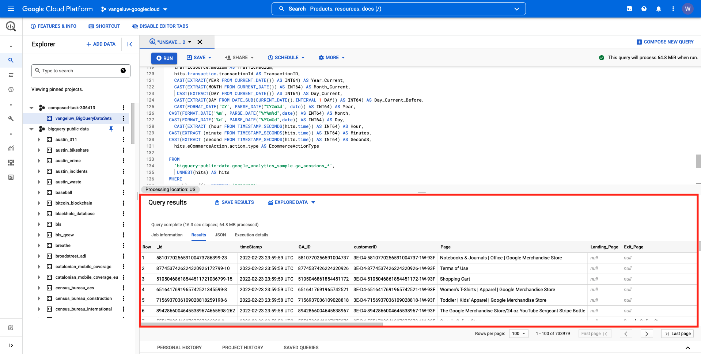

# 12.2在BigQuery中建立第一個查詢

## 目標

- 探索BigQuery UI
- 在BigQuery中建立SQL查詢
- 將SQL查詢的結果保存在BigQuery內的資料集中

## 內容

當Google Analytics資料位於BigQuery時，維度、量度和其他變數都會巢狀內嵌。 此外，Google Analytics資料會每天載入至不同的表格。 這意味著嘗試將BigQuery中的Google Analytics表直接連接到Adobe Experience Platform非常困難，這不是一個好主意。

此問題的解決方案是將Google Analytics資料轉換為可讀的格式，讓擷取至Adobe Experience Platform的程式更簡單。

## 12.2.1建立資料集以儲存新的BigQuery表格

前往 [BigQuery主控台](https://console.cloud.google.com/bigquery).


在 **瀏覽器**，您會看到您的專案ID。 按一下您的專案ID(請勿按一下 **bigquery-public-data** 資料集)。


您可以看到目前還沒有資料集，因此請立即建立資料集。
按一下 **建立資料集**.


在螢幕的右側，您會看到 **建立資料集** 功能表。


若 **資料集ID**，請使用下列命名慣例。 對於其他欄位，請保留預設設定。

| 命名 | 範例 |
| ----------------- | ------------- | 
| `--demoProfileLdap--_BigQueryDataSets` | vangeluw_BigQueryDataSets |


下一步，按一下 **建立資料集**.


之後，您會在建立資料集後，回到BigQuery Console。


## 12.2.2建立第一個SQL BigQuery

接下來，您將在BigQuery中建立第一個查詢。 此查詢的目的是取用Google Analytics範例資料，並加以轉換，以便在Adobe Experience Platform中擷取。 前往 **編輯器** 標籤。


請複製以下SQL查詢，並將其貼到該查詢編輯器中。 歡迎閱讀查詢並了解Google AnalyticsBigQuery語法。


```sql
SELECT
  CONCAT(fullVisitorId, CAST(hitTime AS String), '-', hitNumber) AS _id,
  TIMESTAMP(DATETIME(Year_Current, Month_Current, Day_Current, Hour, Minutes, Seconds)) AS timeStamp,
  fullVisitorId as GA_ID,
  -- Fake CUSTOMER ID
  CONCAT('3E-D4-',fullVisitorId, '-1W-93F' ) as customerID,
  Page,
  Landing_Page,
  Exit_Page,
  Device,
  Browser,
  MarketingChannel,
  TrafficSource,
  TrafficMedium,
  -- Enhanced Ecommerce
  TransactionID,
  CASE
      WHEN EcommerceActionType = '2' THEN 'Product_Detail_Views'
      WHEN EcommerceActionType = '3' THEN 'Adds_To_Cart'
      WHEN EcommerceActionType = '4' THEN 'Product_Removes_From_Cart'
      WHEN EcommerceActionType = '5' THEN 'Product_Checkouts'
      WHEN EcommerceActionType = '6' THEN 'Product_Refunds'
    ELSE
    NULL
  END
     AS Ecommerce_Action_Type,
  -- Entrances (metric)
  SUM(CASE
      WHEN isEntrance = TRUE THEN 1
    ELSE
    0
  END
    ) AS Entries,
    
--Pageviews (metric)
    COUNT(*) AS Pageviews,
    
 -- Exits 
    SUM(
    IF
      (isExit IS NOT NULL,
        1,
        0)) AS Exits,
        
 --Bounces
   SUM(CASE
      WHEN isExit = TRUE AND isEntrance = TRUE THEN 1
    ELSE
    0
  END
    ) AS Bounces,
        
  -- Unique Purchases (metric)
  COUNT(DISTINCT TransactionID) AS Unique_Purchases,
  -- Product Detail Views (metric)
  COUNT(CASE
      WHEN EcommerceActionType = '2' THEN fullVisitorId
    ELSE
    NULL
  END
    ) AS Product_Detail_Views,
  -- Product Adds To Cart (metric)
  COUNT(CASE
      WHEN EcommerceActionType = '3' THEN fullVisitorId
    ELSE
    NULL
  END
    ) AS Adds_To_Cart,
  -- Product Removes From Cart (metric)
  COUNT(CASE
      WHEN EcommerceActionType = '4' THEN fullVisitorId
    ELSE
    NULL
  END
    ) AS Product_Removes_From_Cart,
  -- Product Checkouts (metric)
  COUNT(CASE
      WHEN EcommerceActionType = '5' THEN fullVisitorId
    ELSE
    NULL
  END
    ) AS Product_Checkouts,
  -- Product Refunds (metric)
  COUNT(CASE
      WHEN EcommerceActionType = '7' THEN fullVisitorId
    ELSE
    NULL
  END
    ) AS Product_Refunds
  FROM (
  SELECT
    -- Landing Page (dimension)
    CASE
      WHEN hits.isEntrance = TRUE THEN hits.page.pageTitle
    ELSE NULL
  END
    AS Landing_page,
    
        -- Exit Page (dimension)
    CASE
      WHEN hits.isExit = TRUE THEN hits.page.pageTitle
    ELSE
    NULL
  END
    AS Exit_page,
    
    hits.page.pageTitle AS Page,
    hits.isEntrance,
    hits.isExit,
    hits.hitNumber as hitNumber,
    hits.time as hitTime,
    date as Fecha,
    fullVisitorId,
    visitStartTime,
    device.deviceCategory AS Device,
    device.browser AS Browser,
    channelGrouping AS MarketingChannel,
    trafficSource.source AS TrafficSource,
    trafficSource.medium AS TrafficMedium,
    hits.transaction.transactionId AS TransactionID,
    CAST(EXTRACT(YEAR FROM CURRENT_DATE()) AS INT64) AS Year_Current,
    CAST(EXTRACT(MONTH FROM CURRENT_DATE()) AS INT64) AS Month_Current,
     CAST(EXTRACT(DAY FROM CURRENT_DATE()) AS INT64) AS Day_Current,
    CAST(EXTRACT(DAY FROM DATE_SUB(CURRENT_DATE(),INTERVAL 1 DAY)) AS INT64) AS Day_Current_Before,
    CAST(FORMAT_DATE('%Y', PARSE_DATE("%Y%m%d", date)) AS INT64) AS Year,
  CAST(FORMAT_DATE('%m', PARSE_DATE("%Y%m%d",date)) AS INT64) AS Month,
  CAST(FORMAT_DATE('%d', PARSE_DATE("%Y%m%d",date)) AS INT64) AS Day,
    CAST(EXTRACT (hour FROM TIMESTAMP_SECONDS(hits.time)) AS INT64) AS Hour,
  CAST(EXTRACT (minute FROM TIMESTAMP_SECONDS(hits.time)) AS INT64) AS Minutes,
  CAST(EXTRACT (second FROM TIMESTAMP_SECONDS(hits.time)) AS INT64) AS SecondS,
    hits.eCommerceAction.action_type AS EcommerceActionType
  
  FROM
    `bigquery-public-data.google_analytics_sample.ga_sessions_*`,
     UNNEST(hits) AS hits
  WHERE
    _table_suffix BETWEEN '20170101'
    AND '20170331'
    AND totals.visits = 1
    AND hits.type = 'PAGE'
    )
    
GROUP BY
  1,
  2,
  3,
  4,
  5,
  6,
  7,
  8,
  9,
  10,
  11,
  12,
  13,
  14
    
  ORDER BY 2 DESC
```

準備就緒後，按一下 **執行** 要運行查詢，請執行以下操作：


執行查詢可能需要幾分鐘的時間。

查詢完成後，您會在 **查詢結果**.



## 12.2.3保存BigQuery SQL查詢的結果

下一步是按一下 **保存結果** 按鈕。


由於是輸出的位置，請選取 **BigQuery表**.


然後您會看到新的快顯視窗，其中 **專案名稱** 和 **資料集名稱** 會預先填入。 資料集名稱應為您在本練習開始時建立的資料集，且採用以下命名慣例：

| 命名 | 範例 |
| ----------------- | ------------- | 
| `--demoProfileLdap--_BigQueryDataSets` | `vangeluw_BigQueryDataSets` |

現在需要輸入表名。 請使用此命名慣例：

| 命名 | 範例 |
| ----------------- |------------- | 
| `--demoProfileLdap--_GAdataTableBigQuery` | `vangeluw_GAdataTableBigQuery` |


按一下&#x200B;**儲存**。

資料可能需要一些時間，直到您建立的表格中準備就緒為止。 幾分鐘後，重新整理瀏覽器。 之後，您應該會在資料集中看到 `--demoProfileLdap--_GAdataTableBigquery` 表格 **瀏覽器** 在BigQuery專案中。


您現在繼續下一個練習，將此表格連接到Adobe Experience Platform。

下一步： [12.3將GCP和BigQuery連接到Adobe Experience Platform](./ex3.md)

[返回模組12](./customer-journey-analytics-bigquery-gcp.md)

[返回所有模組](./../../overview.md)
