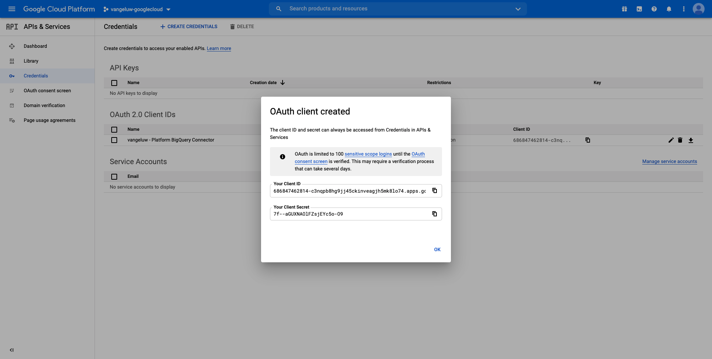

# 12.3將GCP和BigQuery連接到Adobe Experience Platform

## 目標

- 探索Google Cloud Platform中的API與服務
- 熟悉測試Google API的OAuth Playronm
- 在Adobe Experience Platform中建立您的第一個BigQuery連線

## 內容

Adobe Experience Platform在 **來源** 這可協助您將BigQuery資料集匯入Adobe Experience Platform。 此資料連接器以Google BigQuery API為基礎。 因此，請務必妥善準備Google雲端平台和BigQuery環境，以接收來自Adobe Experience Platform的API呼叫。

若要在Adobe Experience Platform中設定BigQuery來源連接器，您將需要這4個值：

- 專案
- clientId
- clientSecret
- refreshToken

到目前為止，你只有第一個 **專案ID**. 此 **專案ID** 值是Google在12.1練習中建立BigQuery專案時產生的隨機ID。

請將項目id複製到單獨的文本檔案中。

| 憑據 | 命名 | 範例 |
| ----------------- |-------------| -------------|
| 專案 ID | random | comperted-task-306413 |

您可以隨時按一下 **專案名稱** 在頂端功能表列中：

右側會顯示專案ID:

在本練習中，您將學習如何取得其他3個必填欄位：

- clientId
- clientSecret
- refreshToken

## 12.3.1 Google雲端API與服務

若要開始，請返回Google雲端平台首頁。 要執行此操作，只需按一下螢幕左上角的標誌。

上首頁後，轉到左菜單，然後按一下 **API與服務**，然後按一下 **控制面板**.

您現在會看到 **API與服務** 首頁。

在本頁面中，您可以看到各種Google API連線的使用情況。 若要設定API連線，以便Adobe Experience Platform能從BigQuery讀取，您需要遵循下列步驟：

- 首先，您需要建立OAuth同意畫面，以啟用未來的驗證。 Google的安全性考量也要求人先進行第一次驗證，才能允許程式化存取。
- 其次，您需要API憑證（clientId和clientSecret），這些憑證將用於API驗證和存取您的BigQuery Connector。

## 12.3.2 OAuth同意畫面

讓我們從建立OAuth同意畫面開始。 在 **API與服務** 首頁，按一下 **OAuth同意畫面**.

然後您會看到：

選擇用戶類型： **外部**. 下一步，按一下 **建立**.

那你就在 **OAuth同意畫面設定** 窗口。

在此唯一要做的，就是在 **應用程式名稱** 欄位並選取 **使用者支援電子郵件**. 對於應用程式名稱，請使用此命名慣例：

| 命名 | 範例 |
| ----------------- |-------------| 
| `--demoProfileLdap-- - AEP BigQuery Connector` | vangeluw - AEP BigQuery Connector |

下一步，向下捲動直到您看到 **開發人員聯絡資訊** 並填寫電子郵件地址。

按一下 **保存並繼續**.

你會看到這個。 按一下 **保存並繼續**.

你會看到這個。 按一下 **保存並繼續**.

你會看到這個。 按一下 **返回控制面板**.

你會看到這個。 按一下 **發佈應用程式**.

按一下 **確認**.

你會看到這個。

在下一個步驟中，您將完成API設定並取得您的API憑證。

## 12.3.3Google API認證：用戶端密碼和用戶端ID

在左側功能表中，按一下 **憑證**. 然後您會看到：

按一下 **+建立憑證** 按鈕。

你會看到3個選項。 按一下 **OAuth用戶端ID**:

在下一個畫面中，選取 **Web應用程式**.

會出現數個新欄位。 您現在需要輸入 **名稱** OAuth用戶端ID的名稱，並輸入 **授權的重定向URI**.

請遵循此命名慣例：

| 欄位 | 值 | 範例 |
| ----------------- |-------------| -------------| 
| 名稱 | ldap - AEP BigQuery Connector | vangeluw - Platform BigQuery Connector |
| 授權的重定向URI | https://developers.google.com/oauthplayground | https://developers.google.com/oauthplayground |

此 **授權的重定向URI** 欄位是非常重要的欄位，因為您稍後將需要它來取得完成Adobe Experience Platform中BigQuery Source Connector的設定所需的RefreshToken。

在繼續之前，您需要實際推送 **輸入** 按鈕 **授權的重定向URI** 欄位。 如果您未按一下 **輸入** 按鈕，您稍後會在 **OAuth 2.0遊樂場**.

下一步，按一下 **建立**:

您現在會看到您的用戶端ID和用戶端密碼。

請複製這兩個欄位，並貼到案頭上的文字檔中。 您隨時都可以在稍後階段訪問這些憑據，但如果將這些憑據保存在BigQuery項目ID旁的文本檔案中，則操作會更輕鬆。

隨著Adobe Experience Platform中BigQuery Source Connector設定的重述，您現在已有這些值可用：

| BigQuery Connector憑證 | 值 |
| ----------------- |-------------| 
| 專案 ID | 您自己的專案ID(例如:compresent-task-306413) |
| clientid | yourclientid |
| cilentsecret | yourclientsecret |

你還在錯過 **refreshToken**. 由於安全性原因，需要重新整理Token。 在API領域，代號通常每24小時過期。 所以 **refreshToken** 需要每24小時重新整理一次安全性權杖，這樣您的來源連接器設定就能持續連線至Google雲端平台和BigQuery。

## 12.3.4 BigQuery API和refreshToken

有許多方法可取得refreshToken來存取Google Cloud Platform API。 其中一個選項是使用Postman。
不過，Google已建立一些功能，讓您更輕鬆地測試及使用其API，此工具稱為 **OAuth 2.0遊樂場**.

若要存取 **OAuth 2.0遊樂場**，前往 [https://developers.google.com/oauthplayground](https://developers.google.com/oauthplayground).

然後您會看到 **OAuth 2.0遊樂場** 首頁。

按一下 **齒輪** 圖示（位於畫面右上方）:

請確定您的設定與上圖中的內容相同。

仔細檢查設定，以100%確定。

完成後，請核取 **使用您自己的OAuth憑證**

應會出現兩個欄位，而且您會為其指定值。

請填寫下表下的欄位：

| 操場API設定 | 您的Google API認證 |
| ----------------- |-------------| 
| OAuth用戶端ID | 您自己的用戶端ID（在案頭的文字檔中） |
| OAuth用戶端密碼 | 您自己的用戶端密碼（在案頭的文字檔中） |

複製 **用戶端ID** 和 **用戶端密碼** 從案頭上建立的文字檔案。

填寫憑據後，請按一下 **關閉**

在左側功能表中，您可以看到所有可用的Google API。 搜尋 **BigQuery API v2**.

接下來，選取以下影像中所示的範圍：

選取之後，您應會看到藍色按鈕，表示 **授權API**. 按一下。

選擇用於設定GCP和BigQuery的Google帳戶。

你可能會看到一個大警告： **未驗證此應用**. 發生此情況是因為您的Platform BigQuery Connector尚未正式審核，因此Google不知道其是否為正版應用程式。 您應忽略此通知。

按一下 **進階**.

下一步，按一下 **前往ldap - AEP BigQuery Connector（不安全）**.

系統會將您重新導向至您建立的OAuth同意畫面。

如果您使用雙因素驗證(2FA)，請輸入發送給您的驗證代碼。

Google現在會給你8個 **權限** 提示。 按一下 **允許** 八個許可請求。 （此程式必須先由真正的人員執行並確認一次，API才允許程式設計要求）

同樣， **八個不同的彈出窗口** 不會顯示，您必須按一下 **允許** 為了所有人。

在8個權限請求之後，您會看到此概觀。 按一下 **允許** 來完成這個過程。

在 **允許**-click，系統會將您傳回OAuth 2.0遊樂場，您會看到以下內容：

按一下 **代號的Exchange授權碼**.

幾秒後， **步驟2 - Exchange權限碼** 檢視會自動關閉，您就會看到 **步驟3 — 設定API要求**.

你必須回去 **步驟2: Exchange令牌的授權代碼**，則按一下 **步驟2: Exchange令牌的授權代碼** 再次視覺化 **重新整理Token**.

您現在會看到 **重新整理Token**.

複製 **重新整理Token** 並將其連同其他BigQuery Source Connector憑證一併貼到案頭上的文字檔案中：

| BigQuery源連接器憑據 | 值 |
| ----------------- |-------------| 
| 專案 ID | 您自己的隨機專案ID(例如:apt-summer-273608) |
| clientid | yourclientid |
| cilentsecret | yourclientsecret |
| refresstoken | yourrefreshtoken |

接下來，在Adobe Experience Platform中設定您的Source Connector。

## 練習12.3.5 — 使用您自己的BigQuery表連接Platform

前往此URL登入Adobe Experience Platform: [https://experience.adobe.com/platform](https://experience.adobe.com/platform).

登入後，您會登陸Adobe Experience Platform首頁。

繼續之前，您需要選取 **沙箱**. 要選取的沙箱已命名 ``--aepSandboxId--``. 您可以按一下文字 **[!UICONTROL 生產產品]** 在螢幕上方的藍線。 選取適當的沙箱後，畫面會變更，現在您就位於專用的沙箱中。

在左側功能表中，前往來源。 然後您會看到 **來源** 首頁。 在 **來源** 按一下 **資料庫**. 按一下 **Google BigQuery** 卡片。 下一步，按一下 **設定** 或 **+配置**.

您現在應建立新連線。

按一下 **新帳戶**. 您現在需要根據在GCP和BigQuery中完成的設定，填寫以下所有欄位。

首先，請為連線命名：

請使用此命名慣例：

| BigQuery Connector憑證 | 值 | 範例 |
| ----------------- |-------------| -------------| 
| 帳戶名稱 | `--demoProfileLdap-- - BigQuery Connection` | vangeluw - BigQuery連接 |
| 說明 | `--demoProfileLdap-- - BigQuery Connection` | vangeluw - BigQuery連接 |

這應該能提供這樣的資訊：

接下來，填寫GCP和BigQuery API **帳戶驗證** — 詳細資訊，您儲存在案頭上的文本檔案中：

| BigQuery Connector憑證 | 值 |
| ----------------- |-------------| 
| 專案 ID | 您自己的隨機專案ID(例如:apt-summer-273608) |
| clientId | ... |
| clientSecret | ... |
| refreshToken | ... |

您的 **帳戶驗證** — 詳細資料現在看起來應該如下：

填寫完所有欄位後，按一下 **連接到源**.

若您的 **帳戶驗證** 詳細資料已正確填寫，您現在應該會看到視覺化確認，確認連線正常運作，方法是檢視 **已連接** 確認。

現在已建立連線，請按一下 **下一個**:

現在，您會在12.2練習中看到您建立的BigQuery資料集。

幹得好！ 在下一個練習中，您將從該表格載入資料，並對應至Adobe Experience Platform中的結構和資料集。

下一步： [12.4將資料從BigQuery載入Adobe Experience Platform](./ex4.md)

[返回模組12](./customer-journey-analytics-bigquery-gcp.md)

[返回所有模組](./../../overview.md)
