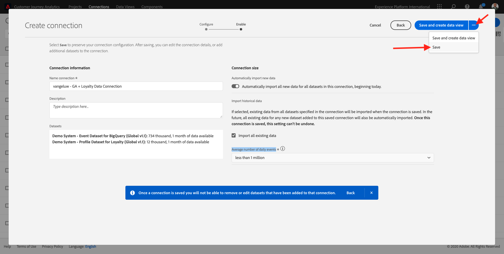
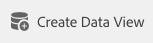
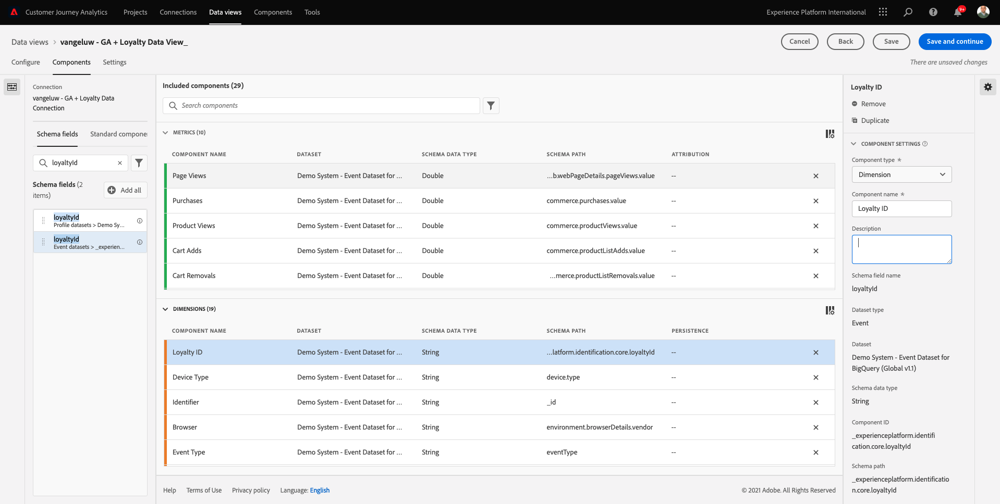
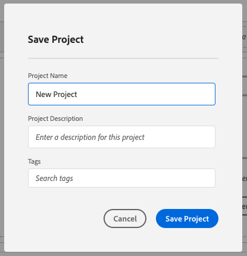
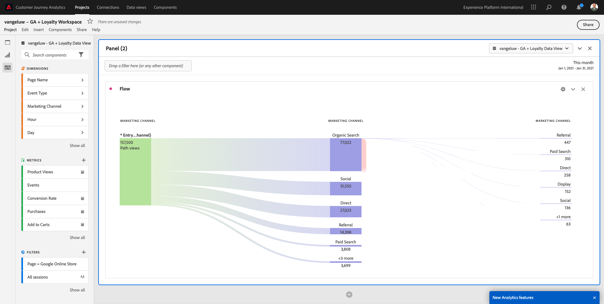
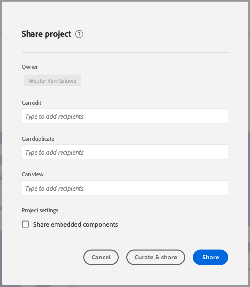

# 12.5使用Google Analytics分析Customer Journey Analytics資料

## 目標

- 將BigQuery資料集連線至Customer Journey Analytics(CJA)
- 使用忠誠度資料連線並加入Google Analytics。
- 熟悉CJA UI

## 12.5.1建立連線

前往 [analytics.adobe.com](https://analytics.adobe.com) 來存取Customer Journey Analytics。

在Customer Journey Analytics首頁上，前往 **連線**.

您可以在這裡看到CJA和Platform之間所有不同的連線。 這些連線的目標與Adobe Analytics中的報表套裝相同。 然而，資料的收集卻完全不同。 所有資料都來自Adobe Experience Platform資料集。

按一下&#x200B;**建立新連線**。

然後您會看到 **建立連線** UI。

首先，您必須選取要使用的正確沙箱。 在沙箱功能表中，選取您的沙箱，沙箱應為 `--aepSandboxId--`. 在此範例中，要使用的沙箱為 **2021財年AEP啟用**.

選取沙箱後，可用的資料集會更新。

在左側功能表中，您可以看到所有可用的Adobe Experience Platform資料集。 搜尋資料集 `Demo System - Event Dataset for BigQuery (Global v1.1)`. 按一下 **+** 將資料集新增至此連線。

新增資料集後，您就會在連線中看到資料集。

您現在必須選取 **人員ID**. 請確保 **loyatyId** 被選作人員ID。

您現在會讓Google Analytics網站互動資料與其他Adobe Experience Platform資料集更為豐富。

搜尋資料集 `Demo System - Profile Dataset for Loyalty (Global v1.1)` 資料集，並將其添加到此連接。

然後您會看到：

若要合併兩個資料集，您必須選取 **人員ID** 包含相同類型ID的區段。 資料集 `Demo System - Profile Dataset for Loyalty (Global v1.1)` 使用 **loyatyId** 作為人員ID，其包含的ID類型與 `Demo System - Event Dataset for BigQuery (Global v1.1)`，也會使用 **loyatyId** 作為人員ID。

按&#x200B;**「下一步」**。

然後您會看到：

在此，您需要為連線命名。

請使用此命名慣例： `ldap - GA + Loyalty Data Connection`.

範例：`vangeluw - GA + Loyalty Data Connection`

完成之前，請啟用 **從今天開始，自動匯入此連線中所有資料集的所有新資料。** 如下圖所示。

這會每60分鐘啟動一次從Adobe Experience Platform到CJA的資料流程，但若有大量資料，則最多需要24小時。

您也需要回填歷史資料，因此請勾選 **匯入所有現有資料** 選取 **不到100萬** 在 **每日事件平均數**.

建立 **連線** CJA可能需要數小時才能提供資料。

按一下 **儲存** 然後去下一個練習。

然後，您會在可用連線清單中看到您的連線。

## 12.5.2建立資料檢視

完成連線後，您現在可以進步影響視覺效果。 Adobe Analytics和CJA的差異在於CJA需要資料檢視，才能在視覺化前清除和準備資料。

資料檢視與Adobe Analytics中虛擬報表套裝的概念類似，可讓您定義內容感知造訪定義、篩選，以及元件的呼叫方式。

每個連線至少需要一個資料檢視。 不過，對於某些使用案例而言，擁有相同連線的多個資料檢視是件好事，其目標是為不同團隊提供不同的深入分析。

如果您希望公司以資料為導向，您應調整每個團隊中資料的檢視方式。 一些範例：

- 僅限UX設計團隊的UX量度
- 對KPI和Google Analytics使用與Customer Journey Analytics相同的名稱，讓數位分析團隊只能說1種語言。
- 篩選的資料檢視，以顯示例如僅1個市場、1個品牌或僅行動裝置的資料。

在 **連線** 螢幕上，勾選您剛建立之連線前面的核取方塊。

現在按一下 **建立資料檢視**.

系統會將您重新導向至 **建立資料檢視** 工作流程。

您現在可以為資料檢視設定基本定義。 時區、工作階段逾時或資料檢視篩選(區段部分類似於Adobe Analytics中的虛擬報表套裝)。

此 **連線** 您在上一練習中建立的內容已被選中。 您的連線已命名 `ldap - GA + Loyalty Data Connection`.

接下來，依照此命名慣例為資料檢視命名： `ldap - GA + Loyalty Data View`.

輸入說明的相同值： `ldap - GA + Loyalty Data View`.

執行任何分析或視覺效果前，我們需先建立資料檢視，包含所有欄位、維度和量度及其歸因設定。

| 欄位 | 命名慣例 | 範例 |
| ----------------- |-------------|-------------|  
| 連線名稱 | ldap - GA +忠誠度資料檢視 | vangeluw - GA +忠誠度資料檢視 |
| 說明 | ldap - GA +忠誠度資料檢視 | vangeluw - GA +忠誠度資料檢視 |

按一下 **保存並繼續**.

您現在可以新增元件至資料檢視。 如您所見，某些量度和維度會自動新增。

將下列元件新增至資料檢視：

| 元件名稱 | 元件類型 | 元件路徑 |
| -----------------|-----------------|-----------------|
| 層級 | 維度 | _experienceplatform.loyatyDetails.level |
| 點 | 量度 | _experienceplatform.loyatyDetails.points |
| commerce.checkouts.value | 量度 | commerce.checkouts.value |
| commerce.productListRemovals.value | 量度 | commerce.productListRemovals.value |
| commerce.productListAdds | 量度 | commerce.productListAdds |
| commerce.productViews.value | 量度 | commerce.productViews.value |
| commerce.purchases.value | 量度 | commerce.purchases.value |
| web.webPageDetails.pageViews | 量度 | web.webPageDetails.pageViews |
| 交易 ID | 維度 | commerce.order.payments.transactionID |
| channel.mediaType | 維度 | channel.mediaType |
| channel.typeAtSource | 維度 | channel.typeAtSource |
| 追蹤代碼 | 維度 | marketing.trackingCode |
| gaid | 維度 | _experienceplatform.identification.core.gaid |
| web.webPageDetails.name | 維度 | web.webPageDetails.name |
| 活動類型 | 維度 | eventType |
| 廠商 | 維度 | environment.browserDetails.vendor |
| 識別碼 | 維度 | _id |
| 時間戳記 | 維度 | timestamp |
| 類型 | 維度 | device.type |
| loyatyId | 維度 | _experienceplatform.identification.core.loyatyId |

然後，您會擁有此功能：

接下來，您需要變更上述部分量度和維度的易記名稱，以便在建立分析時輕鬆使用這些量度和維度。 若要這麼做，請選取量度或維度並更新 **名稱** 欄位，如下圖所示。

| 元件原始名稱 | 顯示名稱 |
| -----------------|-----------------|
| 層級 | 忠誠度等級 |
| 點 | 忠誠度點數 |
| commerce.checkouts.value | 結帳 |
| commerce.productListRemovals.value | 購物車移除 |
| commerce.productListAdds | 購物車新增次數 |
| commerce.productViews.value | 產品檢視 |
| commerce.purchases.value | 購買 |
| web.webPageDetails.pageViews | 頁面檢視 |
| channel.mediaType | 流量媒體 |
| channel.typeAtSource | 流量來源 |
| 追蹤代碼 | 行銷管道 |
| gaid | Google AnalyticsID |
| 名稱 | 頁面標題 |
| 廠商 | 瀏覽器 |
| 類型 | 裝置類型 |
| loyatyId | 忠誠度ID |

然後，您會得到這樣的東西：

接下來，您需要透過變更 **歸因設定**.

請變更 **歸因設定** 針對下列元件：

| 元件 |
| -----------------|
| 流量來源 |
| 行銷管道 |
| 瀏覽器 |
| 流量媒體 |
| 裝置類型 |
| Google AnalyticsID |
| 忠誠度ID |
| 忠誠度等級 |
| 忠誠度點數 |

若要這麼做，請選取元件，按一下 **使用自訂歸因模型** 並設定 **模型** to **上次接觸**，和 **過期** to **人員（報告窗口）**. 對上述所有元件重複此步驟。

變更上述所有元件的歸因設定後，您應該會看到此檢視：

您的資料檢視現在已設定完畢。 按一下「**儲存**」。

您現在可以在Adobe Analytics Analysis Workspace中分析Google Analytics資料。 讓我們來做下一個練習。

## 12.5.3建立專案

在Customer Journey Analytics中，前往 **專案**.

然後您會看到：

按一下 **建立新專案**.

您現在有空白專案：

首先，儲存您的專案並命名。 您可以使用下列命令來儲存：

| 作業系統 | 短切 |
| ----------------- |-------------| 
| Windows | Control + S |
| Mac | Command + S |

您會看到此快顯視窗：

請使用此命名慣例：

| 名稱 | 說明 |
| ----------------- |-------------| 
| ldap - GA +忠誠度工作區 | ldap - GA +忠誠度工作區 |

下一步，按一下 **儲存專案**.

接下來，請務必在畫面的右上角選取正確的資料檢視。 這是您在上一個練習中建立的資料檢視，其命名慣例為 `ldap - GA + Loyalty Data View`. 在此範例中，要選取的資料檢視是 `ldap - GA + Loyalty Data View`.

### 12.5.3.1自由表格

自由表格可作為Excel內的樞紐表格運作，或多或少都有效。 您從左側列選取項目，然後將其拖放至自由格式中，便會收到表格報表。

自由表格幾乎是無限的。 您幾乎可以執行任何操作，而且與Google Analytics相比，這可帶來如此大的價值（因為此工具有某些分析限制）。 這是將Google Analytics資料載入至其他分析工具的其中一個原因。

請看兩個範例，其中您需要使用SQL、BigQuery和一些時間來回答在Google AnalyticsUI或Google Data Studio中無法回答的簡單問題：

- 有多少人從依行銷管道分割的Safari瀏覽器到達結帳？ 請查看Safari瀏覽器正在篩選結帳量度。 我們剛拖放變數「Browser = Safari」到結帳欄的頂端。

- 身為分析師，我可以看到社交行銷管道的轉換率低。 我使用「上次接觸」歸因為預設值，但「首次接觸」呢？ 暫留在任何量度上，則會顯示量度設定。 我可以在此處選取想要的歸因模型。 您可以在GA中（不能在data studio中）將歸因作為獨立活動，但無法在相同表格中有其他與歸因分析無關的量度或維度。

讓我們在CJA中回答這些問題，並透過Analysis Workspace提供更多資訊。

首先，選取正確的日期範圍(**最近53週**)。

然後按一下 **套用** 來套用日期範圍。 請記住此步驟，以供後續練習使用。

>[!NOTE]
>
>如果您剛建立 **資料連線** 和 **資料檢視** 你可能需要等上幾個小時。 有大量資料記錄時，CJA需要一些時間回填歷史資料。

讓我們拖放一些維度和量度來分析行銷管道。 首先使用維度 **行銷管道** 並將其拖放至 **自由表格**. (按一下 **全部顯示** 以防您在「量度」功能表中沒有立即看到量度)

然後您會看到：

接下來，您需要將量度新增至自由表格。 您應新增下列量度： **人員**, **工作階段**, **產品檢視**, **結帳**, **購買**, **轉換率** （計算量度）。

您必須先建立計算量度，才能執行此動作 **轉換率**. 若要這麼做，請按一下 **+** 圖示（位於量度旁）:

作為計算量度的名稱，請使用 **轉換率**. 然後拖曳量度 **購買** 和 **工作階段** 到畫布上。 設定 **格式** to **百分比** 和 **小數位數** to **2**. 最後，按一下 **儲存**.

接下來，若要在 **自由表格**，將它們逐一拖放至 **自由表格**. 請參閱下列範例。

最後你會得到這樣一張桌子：

如上所述， **自由表格** 讓您能夠自由執行深入分析。 例如，您可以挑選任何其他Dimension來劃分表格內的特定量度。

例如，前往維度並搜尋並選取 **瀏覽器** 變數。

接著您會看到此Dimension可用值的概觀。

選擇Dimension **Safari** 將其拖放至量度上，例如 **結帳**. 然後您會看到：

做到這一點，你剛剛回答了一個潛在問題：有多少人使用Safari到達結帳頁面，依「行銷管道」分割？

現在來回答歸因問題。

尋找 **購買** 量度。

將滑鼠指標暫留在量度上，而 **設定** 圖示。 按一下。

內容功能表隨即顯示。 勾選 **非預設歸因模型**.

在您會看到的快顯視窗中，您可以輕鬆變更歸因模型和回顧期間（使用SQL時相當複雜）。

選擇 **首次接觸** 作為歸因模型。

選擇 **人員** 回顧期間。

現在按一下 **套用**.

您現在可以看到該特定量度的歸因模型為「首次接觸」。

您可以視需要執行任意數量的劃分，不受變數、區段、維度或日期範圍類型的限制。

更特別的是，從Adobe Experience Platform加入任何資料集，讓Google Analytics的數位行為資料更為豐富。 例如，離線、客服中心、忠誠度或CRM資料。

若要展示此功能，請先設定您的第一個劃分，將離線資料與線上資料結合。 挑選維度 **忠誠度等級** 並將其拖放到任何 **行銷管道**，例如， **自然搜尋**:

接下來，分析 **裝置類型** 供使用 **自然搜尋** 帶 **忠誠度等級** 是 **青銅**. 取用Dimension **裝置類型** 然後拖放到 **青銅**. 然後您會看到：

您可以看到，第一次劃分時會使用忠誠度等級。 此維度來自不同的資料集和結構，與您用於BigQuery連接器的結構不同。 人員ID **loyatyID** (示範系統 — BigQuery（全域v1.1）的事件結構)和 **loyatyID** (示範系統 — 忠誠度的設定檔結構（全域v1.1）)彼此相符。 因此，您可以結合來自Google Analytics的體驗事件和來自忠誠度結構的設定檔資料。

我們可以持續將列分割為區段或特定日期範圍（可能反映特定的電視行銷活動），以向Customer Journey Analytics提問，並在行動中取得答案。

使用SQL取得相同的結果，然後使用第三方視覺化工具是相當困難的。 尤其是當你在問問題，並試圖即時得到答案的時候。 Customer Journey Analytics沒有此難題，可讓資料分析人員以彈性和即時的方式查詢資料。

## 12.5.3.2漏斗或流失分析

漏斗是了解客戶歷程中主要步驟的絕佳機制。 這些步驟也可以來自離線互動（例如，來自客服中心），然後您可以將它們與相同漏斗中的數位接觸點結合。

Customer Journey Analytics可讓您執行此動作，並執行更多操作。 如果您記得模組13，我們會提供以滑鼠右鍵按一下的功能，並執行下列動作：

- 分析使用者在流失步驟後的進行位置
- 從漏斗的任何點建立區段
- 在折線圖視覺效果的任何階段查看趨勢

讓我們看看另一件事：本月的客戶歷程漏斗與上個月相比如何？ 行動版與案頭版有何不同？

您將在下方建立兩個面板：

- 漏斗分析（1月）
- 漏斗分析（2月）

您會看到，我們正在比較依裝置類型分割的不同時段（1月和2月）的漏斗。

在Google AnalyticsUI內無法進行此類型的分析，或者分析非常有限。 因此CJA再次為Google Analytics擷取的資料增加許多價值。

建立第一個流失視覺效果。 請關閉目前的面板，以新面板開始。

查看面板的右側，然後按一下箭頭以關閉它。

下一步，按一下 **+** 來建立新面板。

現在，選取 **流失** 視覺效果。

身為分析師，假設您想要了解主要電子商務漏斗的狀況：首頁>內部搜尋>產品詳細資料>結帳>購買。

首先，將一些新步驟新增至漏斗。 若要這麼做，請開啟 **頁面名稱** 維度。

之後，您將會看到已造訪的所有可用頁面。

拖放 **首頁** 到第一步。

第二步，請使用 **儲存搜尋結果**

現在，您需要新增一些電子商務動作。 在Dimension中搜尋Dimension **事件類型** 維度。 按一下以開啟維度。

選擇 **Product_Detail_Views** 並將其拖放至下一個步驟。

選擇 **Product_Checkouts** 並將其拖放至下一個步驟。

調整流失視覺效果的大小。

您的流失視覺效果現已準備就緒。

要開始分析和記錄這些見解，對於 **文字** 視覺效果。 新增 **文字** 視覺效果中，按一下 **圖表** 圖示，以查看所有可用的視覺效果。 然後拖放 **文字** 視覺效果顯示至畫布。 調整大小並移動它，使其看起來與下面的影像相似。

再次，調整其大小以符合控制面板：

「區隔」視覺效果也可允許劃分。 使用 **裝置類型** 維度，並將部分值依序拖放至視覺效果上：

最後會提供更進階的視覺效果：

Customer Journey Analytics可讓您執行此動作，並執行更多操作。 以滑鼠右鍵按一下流失中的任何位置，您就可以……

- 分析使用者從流失步驟前往的位置
- 從漏斗的任何點建立區段
- 線條圖視覺效果中的任何步驟趨勢
- 以視覺化方式比較任何漏斗與不同時段。

例如，在流失的任何步驟中按一下滑鼠右鍵，即可查看其中一些分析選項。

## 12.5.3.3流量分析和視覺效果

如果您想使用Google Analytics執行進階流量分析，需要使用SQL來擷取資料，然後使用第三方解決方案來處理視覺效果部分。 Customer Journey Analytics會幫上忙的。

在此步驟中，您將設定流量分析以回答以下問題：特定登陸頁面之前的主要貢獻管道為何。  透過兩個拖放和一個點按，身為分析師，您可以透過行銷管道的最後兩個接觸點，探索使用者流向著陸頁面的流程。

Customer Journey Analytics可協助您回答的其他問題：

- 特定登陸頁面之前的管道主要組合為何？
- 當使用者到達Product_Checkout時，是什麼原因導致使用者退出工作階段？ 先前的步驟是什麼？

讓我們再從空白麵板開始解答這些問題。 關閉目前面板，然後按一下 **+**.

現在，選取 **流量** 視覺效果。

現在來設定多路徑行銷管道流量分析。 拖放 **行銷管道** 維度至 **登入Dimension** 的上界。

您現在可以看到第一個登入路徑：

按一下第一個路徑以深入研究。

您現在可以看到下一個路徑（行銷管道）。

我們再做第三次深入研究。 按一下新路徑中的第一個選項， **轉介**.

現在，您應該會看到如下的視覺效果：

讓事情複雜些。 假設您想要分析兩個行銷路徑之後的著陸頁面為何？ 若要這麼做，您可以使用次要維度來變更最後一個路徑。 尋找 **頁面名稱** 維度，並拖放如下：

您現在會看到：

再做一次流量分析。 這次您將分析特定退出點後發生的事件。 其他Analytics解決方案則需要使用SQL/ETL，再次需要使用協力廠商視覺化工具來達成相同目標。

帶來新 **流量視覺效果** 至面板。

然後，您會擁有此功能：

查找Dimension **事件類型** 然後拖放到 **退出維度** 的上界。

現在你可以看到 **事件類型**-paths將客戶帶往出口。

讓我們調查結帳動作退出前發生的事件。 按一下 **Product_Checkouts** 路徑：

新的動作路徑將會出現，其中包含一些沒有見地的資料。

讓我們進一步分析！ 搜尋Dimension **頁面名稱** 並將其拖放至新產生的路徑。

您現在只需幾分鐘即可完成進階流量分析。 您可以按一下不同的路徑，以查看其從退出連結至先前步驟的方式。

您現在擁有功能強大的套件，可分析漏斗，並探索數位化接觸點（亦即離線接觸點）中客戶行為的路徑。

別忘了儲存變更！

## 12.5.4共用項目

>[!IMPORTANT]
>
>以下內容的用途為FYI — 您可以 **NOT** 必須與他人共用您的專案。

FYI — 您可以與同事共用此專案，以共同合作或分析業務問題。

下一步： [摘要和優點](./summary.md)

[返回模組12](./customer-journey-analytics-bigquery-gcp.md)

[返回所有模組](./../../overview.md)
