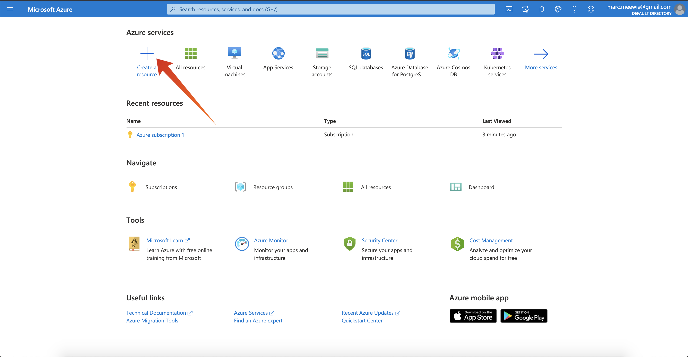
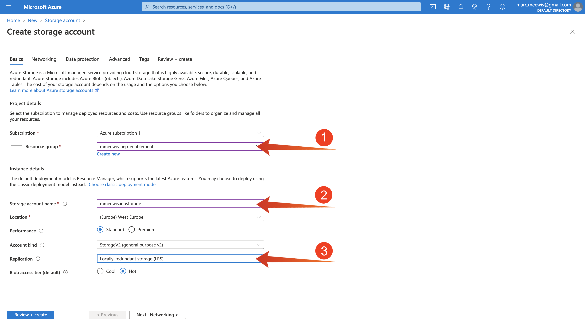

# 13.1配置您的Microsoft Azure EventHub環境

Azure事件中心是一種高度可擴展的發佈訂閱服務，每秒可接收數百萬個事件，並將其流入多個應用程式。 這可讓您處理和分析由您連接的設備和應用程式產生的大量資料。

## 13.1.1什麼是Azure事件中心？

Azure事件中心是大資料流平台和事件獲取服務。 它每秒可接收並處理數百萬個事件。 透過任何即時分析提供者或批次處理程式/儲存轉接器，即可轉換及儲存傳送至事件中樞的資料。

事件中心表示 **前門** 對於事件管道，通常稱為解決方案架構中的事件擷取器。 事件擷取器是位於事件發佈者(例如Adobe Experience Platform RTCDP)與事件消費者之間的元件或服務，可將事件資料流的產生與這些事件的耗用脫鈎。 「事件中心」提供具有時間保留緩衝的統一流平台，將事件產生者與事件消費者脫鈎。

## 13.1.2建立事件中心命名空間

前往 [https://portal.azure.com/#home](https://portal.azure.com/#home) 選取 **建立資源**.

在資源畫面中，輸入 **事件** 在搜尋列中選取 **事件中心** 從下拉式清單：

按一下 **建立**:

如果這是您第一次在Azure中建立資源，則需要建立新 **資源組**. 如果您已有資源組，則可以選擇該資源組（或建立新的資源組）。

選擇 **新建**，為群組命名 `--demoProfileLdap---aep-enablement`.

完成欄位測試，如下所示：

- 命名空間：定義您的命名空間，其必須是唯一的，請使用下列模式 `--demoProfileLdap---aep-enablement`
- 位置： **西歐** 指阿姆斯特丹的Azure資料中心
- 定價層： **基本**
- 吞吐量單位： **1**

按一下 **檢閱+建立**.

按一下&#x200B;**建立**。

部署資源組可能需要1-2分鐘，如果成功，您將看到以下螢幕：

## 13.1.3在Azure中設定您的事件中樞

前往 [https://portal.azure.com/#home](https://portal.azure.com/#home) 選取 **所有資源**.

從資源清單中，選取 `--demoProfileLdap---aep-enablement` 命名空間：

在 `--demoProfileLdap---aep-enablement` 詳細畫面，選取 **事件中心**:

按一下 **+事件中心**.

使用 `--demoProfileLdap---aep-enablement-event-hub` 作為名稱，然後按一下 **建立**.

按一下 **事件中心** 在事件中心命名空間中。 您現在應該會看到 **事件中心** 已列出。 如果是這種情況，您可以繼續下一個練習。

## 13.1.4設定您的Azure儲存帳戶

若要在稍後的練習中對您的Azure事件中心功能進行調試，您需要在Visual Studio代碼項目設定中提供Azure儲存帳戶。 您現在將建立該Azure儲存帳戶。

前往 [https://portal.azure.com/#home](https://portal.azure.com/#home) 選取 **建立資源**.

輸入 **儲存** 在搜索中，並選擇 **儲存帳戶** 從清單中。

選取「**建立**」。

指定您的 **資源組** （在本練習開始時建立），請使用 `--demoProfileLdap--aepstorage` 作為儲存帳戶名稱，然後選擇 **本地冗餘儲存(LRS)**，然後按一下 **檢閱+建立**.

按一下&#x200B;**建立**。

建立儲存帳戶需要幾秒鐘時間：

完成後，畫面會顯示 **前往資源** 按鈕。

按一下 **Microsoft Azure**.

您的儲存帳戶現在會顯示在 **最近的資源**.

下一步： [13.2在Adobe Experience Platform中設定您的Azure事件中樞目的地](./ex2.md)

[返回模組13](./segment-activation-microsoft-azure-eventhub.md)

[返回所有模組](./../../overview.md)
