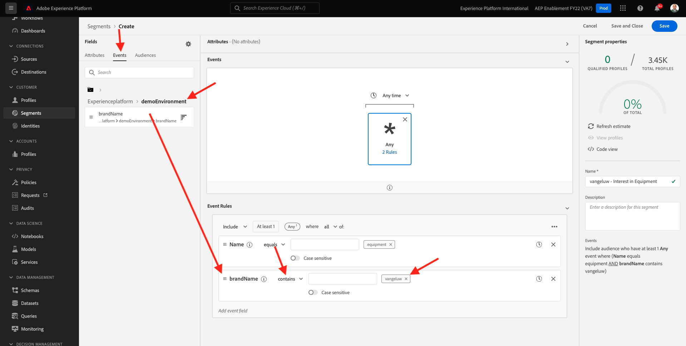

# 13.3建立區段

## 13.3.1導言

您將建立簡單區段：

- **設備權益** 當客戶設定檔造訪時符合哪些資格 **設備** Luma示範網站的頁面。

### 很高興知道

只要您符合目的地啟用清單中區段的資格，即時CDP就會觸發對目的地的啟用。 在此情況下，將傳送至該目的地的區段資格裝載將包含 **您的設定檔符合其資格的所有區段**.

此模組的目標是顯示您的客戶設定檔區段資格已傳送至 **您的** 即時事件中心目的地。

### 區段狀態

Adobe Experience Platform的區段資格一律有 **狀態**-property，可以是下列其中一項：

- **實現**:這表示有新的區段資格
- **現有**:這表示現有區段資格
- **退出**:這表示設定檔不再符合區段資格

## 13.3.2建立區段

建立區段的詳細說明請參閱 [模組6](../module6/real-time-cdp-build-a-segment-take-action.md).

### 建立區段

前往此URL登入Adobe Experience Platform: [https://experience.adobe.com/platform](https://experience.adobe.com/platform).

登入後，您會登陸Adobe Experience Platform首頁。


繼續之前，您需要選取 **沙箱**. 要選取的沙箱已命名 ``--aepSandboxId--``. 您可以按一下文字 **[!UICONTROL 生產產品]** 在螢幕上方的藍線。 選取適當的沙箱後，畫面會變更，現在您就位於專用的沙箱中。


前往 **區段**. 按一下 **+建立區段** 按鈕。


為區段命名 `--demoProfileLdap-- - Interest in Equipment` 和新增頁面名稱體驗事件：

按一下 **事件**，並拖放 **XDM ExperienceEvent > Web >網頁詳細資訊>名稱**. 輸入 **設備** 作為值：


拖放 **XDM ExperienceEvent > `--aepTenantIdSchema--` > demoEnvironment > brandName**. 輸入 `--demoProfileLdap--` 作為值，將比較參數設為 **包含** 按一下 **儲存**:



### PQL定義

區段的PQL如下所示：

```code
CHAIN(xEvent, timestamp, [C0: WHAT(web.webPageDetails.name.equals("equipment", false) and _experienceplatform.demoEnvironment.brandName.contains("--demoProfileLdap--", false))])
```

下一步： [13.4啟用區段](./ex4.md)

[返回模組13](./segment-activation-microsoft-azure-eventhub.md)

[返回所有模組](./../../overview.md)
