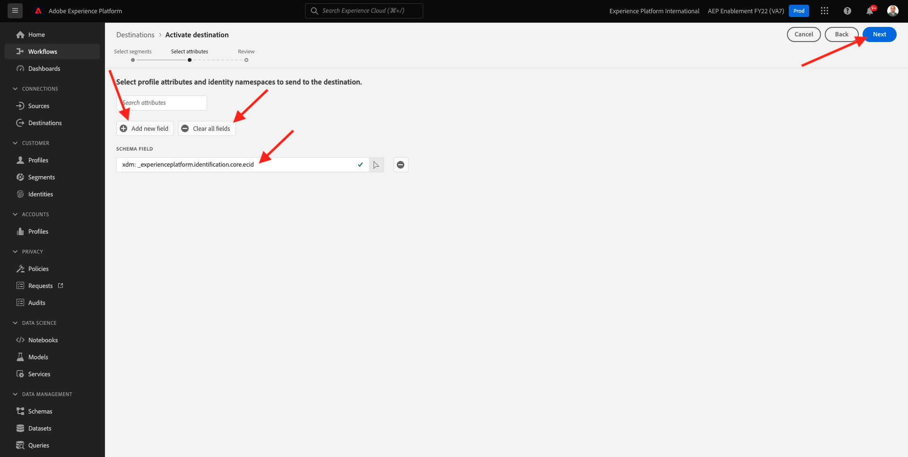

# 13.4啟用區段

## 13.4.1將段添加到Azure事件中心目標

在本練習中，您將新增區段 `--demoProfileLdap-- - Interest in Equipment` 至 `--demoProfileLdap---aep-enablement` Azure事件中心目標。

前往此URL登入Adobe Experience Platform: [https://experience.adobe.com/platform](https://experience.adobe.com/platform).

登入後，您會登陸Adobe Experience Platform首頁。

繼續之前，您需要選取 **沙箱**. 要選取的沙箱已命名 ``--aepSandboxId--``. 您可以按一下文字 **[!UICONTROL 生產產品]** 在螢幕上方的藍線。 選取適當的沙箱後，畫面會變更，現在您就位於專用的沙箱中。

前往 **目的地**，然後按一下 **瀏覽**. 然後您會看到所有可用的目的地。 找到您的目的地，然後按一下 **+** 圖示，如下所示。

你會看到這個。 使用LDAP搜尋區段並選取 `--demoProfileLdap-- - Interest in Equipment` 從區段清單。

按&#x200B;**「下一步」**。

Adobe Experience Platform Real-time CDP可將裝載提供給兩種類型的目的地、區段目的地和設定檔目的地。

區段目的地會收到預先定義的區段資格裝載，稍後將討論。 這樣的裝載包含 **all** 特定設定檔的區段資格。 即使不在目的地啟用清單中的區段也是如此。 此類區段目的地的範例為 **Azure事件中心** 和 **AWSKinesis**.

以設定檔為基礎的目的地可讓您從XDM設定檔聯合結構中挑選任何屬性(firstName、lastName、...)，並將其納入啟用裝載中。 此類目的地的範例為 **電子郵件行銷**.

因為您的Azure事件中心目標是 **區段** 目標，例如選取欄位 `--aepTenantId--.identification.core.ecid`.

按一下 **新增欄位**，按一下「瀏覽架構」並選取「 」欄位 `--aepTenantId--identification.core.ecid` （刪除要自動顯示的任何其他欄位）。

按&#x200B;**「下一步」**。

按一下&#x200B;**完成**。

您的區段現在已啟動至Microsoft事件中心目的地。

下一步： [13.5建立您的Microsoft Azure專案](./ex5.md)

[返回模組13](./segment-activation-microsoft-azure-eventhub.md)

[返回所有模組](./../../overview.md)
