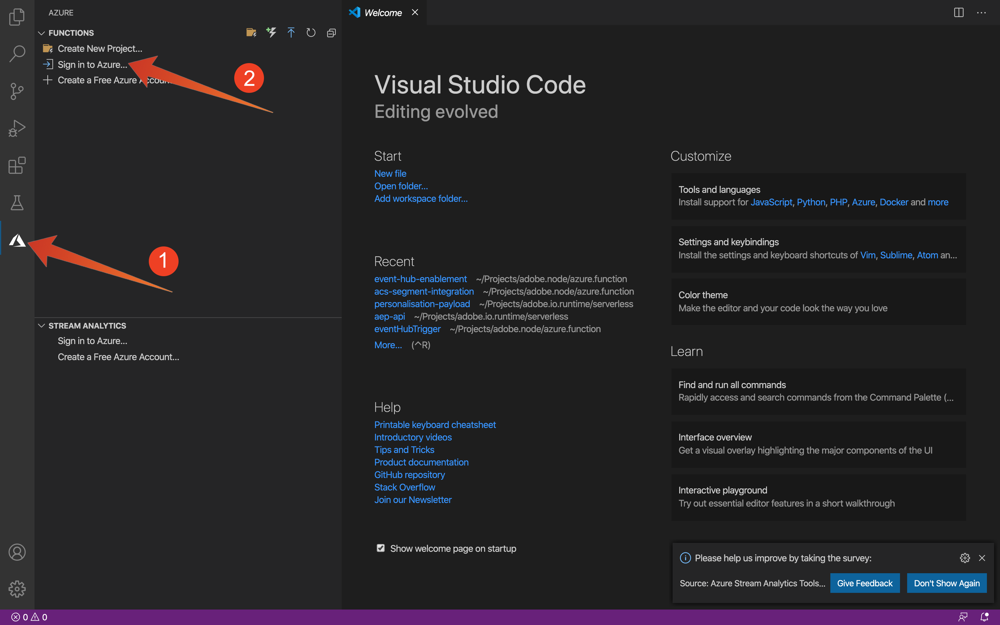
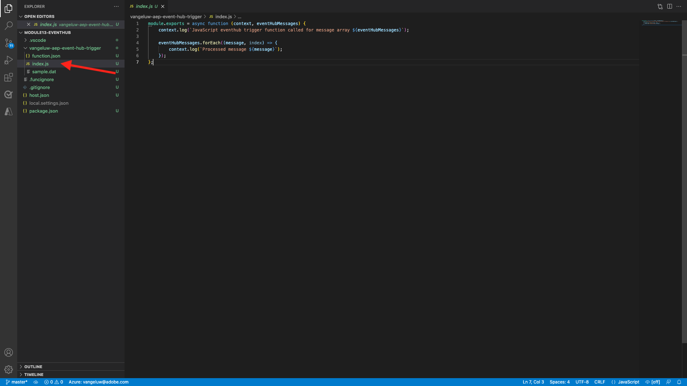

# 13.5建立您的Microsoft Azure專案

## 13.5.1熟悉Azure事件中心功能

Azure函式可讓您執行小部分程式碼(稱為 **函式**)，而不必擔心應用程式基礎架構。 借助Azure功能，雲基礎架構提供您需要的所有最新伺服器，以保持應用程式的大規模運行。

函式是 **觸發** 的值。 支援的觸發器包括回應資料中的變更、回應訊息（例如事件中心）、依排程執行，或因HTTP要求而執行。

Azure函式是一種無伺服器計算服務，可讓您執行事件觸發的程式碼，而無須明確布建或管理基礎架構。

Azure事件集線器與無伺服器架構的Azure函式整合。

## 13.5.2開啟Visual Studio代碼並登錄到Azure

Visual Studio Code使得……

- 定義Azure函式並將其綁定到事件集線器
- 本地測試
- 部署至Azure
- 遠程日誌功能執行

### 開啟Visual Studio代碼

要開啟Visual Studio代碼，請輸入 **visual** 在作業系統的搜索中（OSX上的焦點搜索，在窗口的任務欄中搜索）。 若找不到，則需重複 [練習0 — 先決條件](./ex0.md).


### 登錄Azure

當您使用您用來註冊的Azure帳戶登入時 [練習0 — 先決條件](./ex0.md), Visual Studio Code可讓您尋找和系結所有Event Hub資源。

按一下 **Azure** 表徵圖。 如果您沒有該選項，安裝必要的擴充功能時可能會發生問題。

下一選擇 **登入Azure**:



系統會將您重新導向至瀏覽器以登入。 請記得選取您用來註冊的Azure帳戶。


當您在瀏覽器中看到以下螢幕時，您將使用Visual Code Studio登錄：


返回Visual Code Studio(例如，您會看到Azure訂閱的名稱 **Azure訂閱1**):


## 13.5.3建立Azure專案

當您暫留在 **Azure訂閱1**，則區段上方會顯示功能表，請選取 **建立新項目……**:


選取您選擇的本機資料夾以儲存專案，然後按一下 **選擇**:


您現在將進入專案建立精靈。 選擇 **Javascript** 作為專案的語言：


選擇 **Azure事件中心觸發器** 作為項目的第一個功能模板：


輸入函式的名稱，使用以下格式 `--demoProfileLdap---aep-event-hub-trigger` 然後按下Enter鍵：


選擇 **建立新的本機應用程式設定**:


選取事件中心命名空間後，您應該會看到您在 **練習2**. 在此範例中，事件中心命名空間為 **vangeluw-aep啟用**:


選取您的事件中心，您應該會看到您在 **練習2**. 我的例子是 **vangeluw-aep-enablement-event-hub**:


選擇 **RootManageSharedAccessKey** 作為事件中心策略：


輸入以使用 **$預設**:


選擇 **新增至工作區** 關於如何開啟專案：


建立專案後，按一下 **index.js** 若要在編輯器中開啟檔案：



Adobe Experience Platform傳送至您的Event Hub的裝載將包含區段ID:

```json
[{
"segmentMembership": {
"ups": {
"ca114007-4122-4ef6-a730-4d98e56dce45": {
"lastQualificationTime": "2020-08-31T10:59:43Z",
"status": "realized"
},
"be2df7e3-a6e3-4eb4-ab12-943a4be90837": {
"lastQualificationTime": "2020-08-31T10:59:56Z",
"status": "realized"
},
"39f0feef-a8f2-48c6-8ebe-3293bc49aaef": {
"lastQualificationTime": "2020-08-31T10:59:56Z",
"status": "realized"
}
}
},
"identityMap": {
"ecid": [{
"id": "08130494355355215032117568021714632048"
}]
}
}]
```

將Visual Studio Code的index.js中的程式碼取代為下列程式碼。 每次Real-time CDP將區段資格傳送至您的Event Hub目的地時，就會執行此程式碼。 在我們的範例中，程式碼只是關於顯示及增強已接收的裝載。 但您可以想像任何即時處理區段資格的功能。

```javascript
// Marc Meewis - Solution Consultant Adobe - 2020
// Adobe Experience Platform Enablement - Module 13

// Main function
// -------------
// This azure function is fired for each segment activated to the Adobe Exeperience Platform Real-time CDP Azure 
// Eventhub destination
// This function enriched the received segment payload with the name fo the segment. 
// You can replace this function with any logic that is require to process and deliver
// Adobe Experience Platform segments in real-time to any application or platform that 
// would need to act upon an AEP segment qualiification.
// 

module.exports = async function (context, eventHubMessages) {

    return new Promise (function (resolve, reject) {

        context.log('Message : ' + JSON.stringify(eventHubMessages, null, 2));

        resolve();

    });    

};
```

結果應該如下所示：


## 13.5.4運行Azure項目

現在該執行您的專案了。 目前，我們不會將專案部署至Azure。 我們會以除錯模式在本機執行。 選取「執行」圖示，按一下綠色箭頭。


在調試模式下首次運行項目時，需要附加Azure儲存帳戶，請按一下 **選擇儲存帳戶**.


從儲存帳戶清單中，選擇已作為 [13.1.4設定您的Azure儲存帳戶](./ex1.md). 您的儲存帳戶已命名 `--demoProfileLdap--aepstorage`，例如： **meewisaepstorage**.


您的專案現在正在運作中，且正在列出事件中心中的事件。 在下一個練習中，您將在Luma示範網站上示範符合這些區段資格的行為。 因此，您會在事件中心觸發功能的終端機中收到區段資格有效負載：


## 13.5.5停止Azure項目

若要停止專案，請選取 **終端** 按一下「終端機」窗口，然後按 **CMD-C** 在OSX或 **CTRL-C** 在Windows上：


下一步： [13.6端到端方案](./ex6.md)

[返回模組13](./segment-activation-microsoft-azure-eventhub.md)

[返回所有模組](./../../overview.md)
