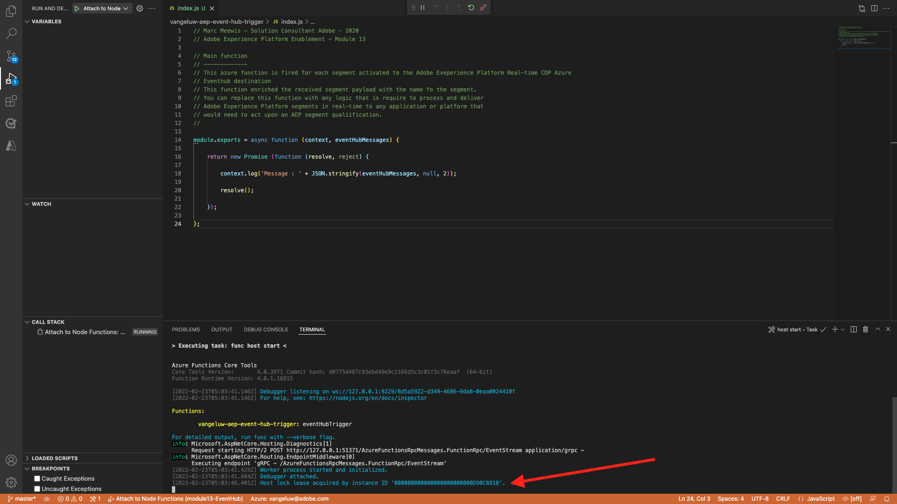
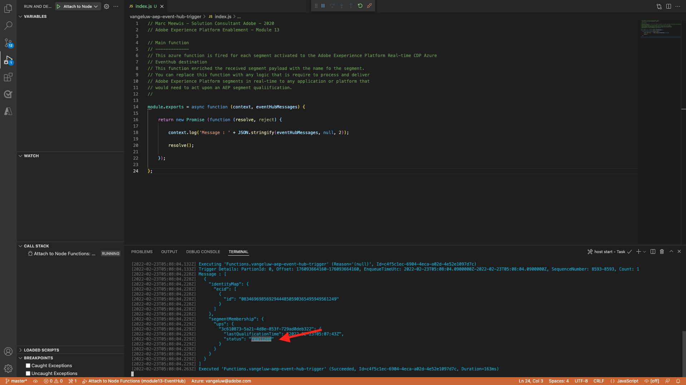

# 13.6端到端方案

## 13.6.1啟動Azure事件中心觸發器

若要在區段資格時顯示Adobe Experience Platform Real-time CDP傳送至Azure事件中樞的裝載，我們需要啟動簡單的Azure事件中樞觸發功能。 此函式將簡單地將裝載「轉儲」到Visual Studio Code中的控制台。 但請記住，此函式可以透過任何方式延伸，以使用專用API和通訊協定來與各種環境進行介面。

### 啟動Visual Studio代碼並啟動項目

請務必開啟並執行您的Visual Studio Code專案

要在Visual Studio Code中啟動/停止/重新啟動您的Azure功能，請參閱以下練習：

- [練習13.5.4 — 啟動Azure項目](./ex5.md)
- [練習13.5.5 — 停止Azure項目](./ex5.md)

您的Visual Studio Code **終端** 應該提到類似以下的內容：

```code
[2022-02-23T05:03:41.429Z] Worker process started and initialized.
[2022-02-23T05:03:41.484Z] Debugger attached.
[2022-02-23T05:03:46.401Z] Host lock lease acquired by instance ID '000000000000000000000000D90C881B'.
```



## 13.6.2載入您的Luma網站

前往 [https://builder.adobedemo.com/projects](https://builder.adobedemo.com/projects). 使用您的Adobe ID登入後，您會看到這個。 按一下您的網站專案以開啟。


您現在可以依照下列流程存取網站。 按一下 **整合**.


在 **整合** 頁，您需要選擇在練習0.1中建立的資料收集屬性。


然後，您會看到示範網站已開啟。 選取URL並複製到剪貼簿。


開啟新的無痕瀏覽器窗口。


貼上您在上一步複製的示範網站URL。 然後系統會要求您使用Adobe ID登入。


選取您的帳戶類型並完成登入程式。


然後，您會在無痕瀏覽器視窗中看到您的網站載入。 對於每個演示，您都需要使用全新的無痕瀏覽器窗口來載入演示網站URL。


## 13.6.3符合您對設備分部的權益

導覽至 **設備** 頁面一次， **不重新載入或刷新**. 此動作應可讓您符合 `--demoProfileLdap-- - Interest in Equipment` 區段。


要驗證，請開啟「配置檔案查看器」面板。 您現在應是 `--demoProfileLdap-- - Interest in Equipment`. 如果您的區段成員資格在設定檔檢視器面板中尚未更新，請按一下重新載入按鈕。


切換回Visual Studio Code ，查看您的 **終端** 索引標籤中，您應該會看到特定 **ECID**. 只要您符合以下條件，此啟動裝載就會傳送至您的事件中心： `--demoProfileLdap-- - Interest in Equipment` 區段。

當您進一步了解區段裝載時，您可以看到 `--demoProfileLdap-- - Interest in Equipment` 狀態為 **實現**.

區段狀態 **實現** 表示我們的設定檔剛進入區段。 若 **現有** 狀態表示我們的設定檔會繼續位在區段中。



## 13.6.4第二次瀏覽「設備」頁

重新整理 **設備** 頁面。


現在，切換回Visual Studio Code ，然後驗證 **終端** 標籤。 您會看到我們仍有您的區段，但現在處於狀態 **現有** 這表示我們的設定檔會繼續在區段中。


## 13.6.5第三次瀏覽「運動」頁面

如果您回訪 **運動** 第三次啟動頁面時，不會進行任何啟動，因為從區段檢視點來看，狀態沒有變更。

只有在區段的狀態變更時，才會啟動區段：


下一步： [摘要和優點](./summary.md)

[返回模組13](./segment-activation-microsoft-azure-eventhub.md)

[返回所有模組](./../../overview.md)
