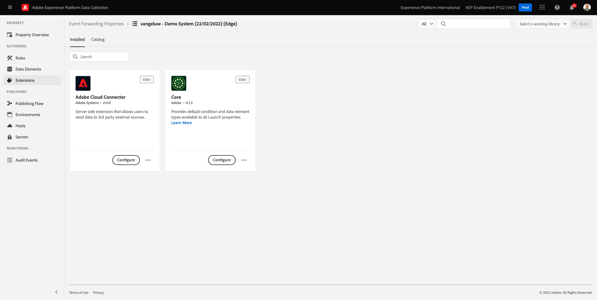
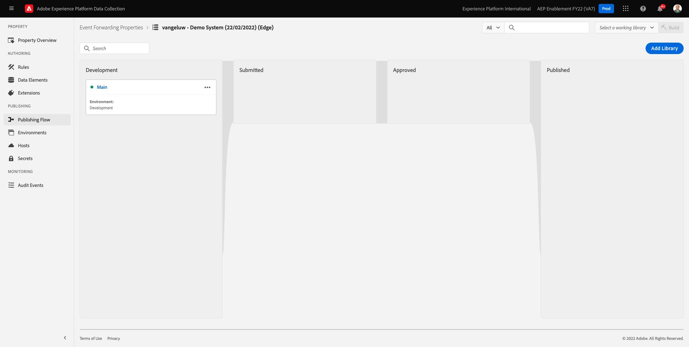

# 14.1建立Adobe Experience Platform資料收集事件轉送屬性

>[!NOTE]
>
>Adobe Experience Platform Edge行動擴充功能目前仍在測試中。 此擴充功能僅由邀請使用。 請連絡您的Adobe客戶成功經理，以深入了解並存取本教學課程的資料。

## 14.1.1什麼是Adobe Experience Platform資料收集事件轉送屬性？

通常，使用Adobe Experience Platform資料收集來收集資料時，會在 **用戶端**. 此 **用戶端** 是網站或行動應用程式等環境。 在模組0和模組1中，深入討論了Adobe Experience Platform資料收集客戶端屬性的配置，並且您已將Adobe Experience Platform資料收集客戶端屬性實施到您的網站和移動應用程式上，以便當客戶與網站和移動應用程式交互時，可以在那裡收集資料。

當Adobe Experience Platform資料收集用戶端屬性收集互動資料時，網站或行動應用程式會傳送要求至Adobe的Edge。 Edge是Adobe的資料收集環境，也是點按資料流資料進入Adobe生態系統的入口點。 從Edge，收集到的資料會傳送至Adobe Experience Platform、Adobe Analytics、Adobe Audience Manager或Adobe Target等應用程式。

加上Adobe Experience Platform資料收集事件轉送屬性後，現在可以設定Adobe Experience Platform資料收集屬性，監聽Edge上傳入的資料。 在Edge上執行的Adobe Experience Platform資料收集事件轉送屬性偵測到傳入資料時，便能使用該資料並轉送至其他位置。 現在，其他地方也可以是非Adobe的外部WebHook，這可以將資料傳送至，例如您所選擇的資料湖、決策應用程式，或任何其他能夠開啟Web Hook的應用程式。

Adobe Experience Platform資料收集事件轉送屬性的設定在用戶端屬性看來很熟悉，能夠像過去一樣以Adobe Experience Platform資料收集用戶端屬性來設定資料元素和規則。 不過，根據您的使用案例，資料的存取及使用方式會稍有不同。

先建立Adobe Experience Platform資料收集事件轉送屬性。

## 14.1.2建立Adobe Experience Platform資料收集事件轉送屬性

前往 [https://experience.adobe.com/#/data-collection/](https://experience.adobe.com/#/data-collection/). 在左側功能表中，按一下 **事件轉送**. 接著，您會看到所有可用Adobe Experience Platform資料收集事件轉送屬性的概觀。 按一下 **新屬性** 按鈕。

您現在需要輸入Adobe Experience Platform資料收集事件轉送屬性的名稱。 作為命名慣例，請使用 `--demoProfileLdap-- - Demo System (DD/MM/YYYY) (Edge)`. 例如，在此範例中，名稱為 **vangeluw — 演示系統(22/02/2022)（邊緣）**. 按一下「**儲存**」。

然後，您會回到Adobe Experience Platform資料收集事件轉送屬性清單中。 按一下以開啟您剛建立的屬性。

## 14.1.2設定Adobe雲端連接器擴充功能

在左側功能表中，前往 **擴充功能**. 你會看到 **核心** 擴充功能已設定。

前往 **目錄**. 您會看到 **Adobe雲端連接器** 擴充功能。 按一下&#x200B;**安裝**&#x200B;以進行安裝。

接著會新增擴充功能。 此步驟中沒有要進行的配置。 系統會將您傳回已安裝擴充功能的概觀。

## 14.1.3部署Adobe Experience Platform資料收集事件轉送屬性

在左側功能表中，前往 **發佈流程**. 按一下 **新增程式庫**.

輸入名稱 **主要**，選取環境 **開發（開發）** 按一下 **+新增所有變更的資源**.

你會看到這個。 按一下&#x200B;**儲存並為開發環境建置**.

程式庫隨後會建置，可能需要1-2分鐘。

最後，程式庫會建置完畢並準備就緒。

下一步： [14.2更新您的資料流，讓資料可供您的資料收集事件轉送屬性使用](./ex2.md)

[返回模組14](./aep-data-collection-ssf.md)

[返回所有模組](./../../overview.md)
