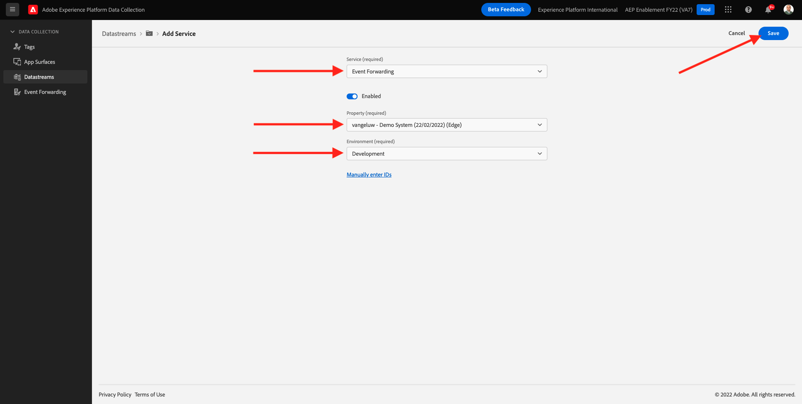

# 14.2更新您的Datastream，讓資料可供Adobe Experience Platform資料收集伺服器屬性使用

## 14.2.1更新資料流

在 [練習0.2](./../../modules/module0/ex2.md)，您已建立自己的 **[!UICONTROL 資料流]**. 然後您使用名稱 `--demoProfileLdap-- - Demo System Datastream`.

在本練習中，您需要設定 **[!UICONTROL 資料流]** 與 **[!DNL Data Collection Server property]**.

若要這麼做，請前往 [https://experience.adobe.com/#/data-collection/](https://experience.adobe.com/#/data-collection/). 你會看到這個。 在左側功能表中，按一下 **[!UICONTROL 資料流]**.

在畫面的右上角，選取沙箱名稱，名稱應為 `--aepSandboxId--`.

搜尋 **[!UICONTROL 資料流]**，此名稱為 `--demoProfileLdap-- - Demo System Datastream`. 按一下 **[!UICONTROL 資料流]** 來開啟它。

你會看到這個。 按一下 **[!UICONTROL +新增服務]**.

選擇服務 **事件轉送**. 這會顯示2個額外設定。 選取您在上一個練習中建立的「事件轉送」屬性，並命名為 `--demoProfileLdap-- - Demo System (DD/MM/YYYY) (Edge)`. 然後選取 **開發** 在 **環境**. 按一下「**儲存**」。

您的資料流現已更新，並可供使用。

您的資料流現在已可以與 **[!DNL Event Forwarding property]**.

下一步： [14.3建立和設定自訂網頁鈎點](./ex3.md)

[返回模組14](./aep-data-collection-ssf.md)

[返回所有模組](./../../overview.md)
