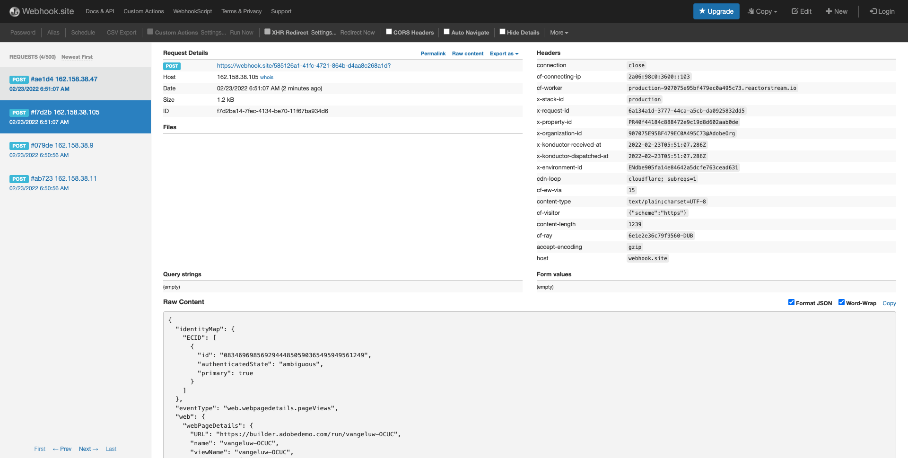

# 14.3建立和設定自訂網頁鈎點

## 14.3.1建立自訂網頁鈎點

前往 [https://webhook.site/](https://webhook.site/). 您會看到這樣的內容：

您會看到您的唯一URL，如下所示： `https://webhook.site/585126a1-41fc-4721-864b-d4aa8c268a1d`.

此網站現在已為您建立此網頁連結，您將可以在 **[!DNL Event Forwarding property]** 以開始測試事件的轉送。

## 14.3.2更新「事件轉送」屬性：建立資料元素

前往 [https://experience.adobe.com/#/data-collection/](https://experience.adobe.com/#/data-collection/) 然後 **事件轉送**. 搜尋您的事件轉送屬性，然後按一下以開啟。

在左側功能表中，前往 **資料元素**. 按一下&#x200B;**「建立新資料元素」**。

然後您會看到要設定的新資料元素。

選取下列項目：

- 作為 **名稱**，輸入 **XDM事件**.
- 作為 **擴充功能**，選取 **核心**.
- 作為 **資料元素類型**，選取 **路徑**.
- 作為 **路徑**，輸入 **arc.event.xdm**. 輸入此路徑，即會篩選掉 **XDM** 區段(從網站或行動應用程式傳送至Adobe Edge的事件裝載)。

你現在有這個。 按一下「**儲存**」。

>[!NOTE]
>
>在上述路徑中，會參照 **弧**. **弧** 代表Adobe資源內容，並 **弧** 一律代表伺服器端內容中可用的最高可用物件。 可向其添加擴充和轉換 **弧** 物件(使用Adobe Experience Platform資料收集伺服器函式)。
>
>在上述路徑中，會參照 **事件**. **事件** 代表一個唯一事件，Adobe Experience Platform資料收集伺服器一律會個別評估每個事件。 有時候，您可能會看到 **事件** 在由Web SDK用戶端傳送的裝載中，但在Adobe Experience Platform資料收集伺服器中，每個事件都會進行個別評估。

## 14.3.3更新您的Adobe Experience Platform資料收集伺服器屬性：建立規則

在左側功能表中，前往 **規則**. 按一下&#x200B;**「建立新規則」**。

然後您會看到要設定的新規則。 輸入 **名稱**: **所有頁面**. 在此練習中，您不需要設定條件。 相反地，您會設定動作。 按一下 **+新增** 按鈕 **動作**.

你會看到這個。 選取下列項目：

- 選取 **擴充功能**: **Adobe雲端連接器**.
- 選取 **動作類型**: **進行擷取呼叫**.

那應該給你這個 **名稱**: **Adobe雲端連接器 — 進行擷取呼叫**. 您現在應該會看到：

接下來，配置以下內容：

- 將要求方法從GET變更為 **POST**
- 輸入您在 [https://webhook.site/](https://webhook.site/) 網站，如下所示： `https://webhook.site/585126a1-41fc-4721-864b-d4aa8c268a1d`

你現在應該有這個。 接下來，轉到 **主體**.

你會看到這個。 按一下資料元素圖示，如下所示。

在快顯視窗中，選取資料元素 **XDM事件** 您在上一步驟中建立的項目。 按一下&#x200B;**「選取」**。

你會看到這個。 按一下&#x200B;**保留變更**.

你會看到這個。 按一下「**儲存**」。

您現在已在「事件轉送」屬性中設定了第一個規則。 前往 **發佈流程** 來發佈變更。
開啟開發程式庫 **主要** 按一下 **編輯** 如所示。

按一下 **新增所有已變更的資源** 按鈕，之後您會看到規則和資料元素出現在此程式庫中。 下一步，按一下 **儲存並建置以供開發**. 您的變更現在已部署。

幾分鐘後，您會看到部署已完成，且已準備好進行測試。

## 14.3.4測試您的配置

前往 [https://builder.adobedemo.com/projects](https://builder.adobedemo.com/projects). 使用您的Adobe ID登入後，您會看到這個。 按一下您的網站專案以開啟。

您現在可以依照下列流程存取網站。 按一下 **整合**.

在 **整合** 頁，您需要選擇在練習0.1中建立的資料收集屬性。

然後，您會看到示範網站已開啟。 選取URL並複製到剪貼簿。

開啟新的無痕瀏覽器窗口。

貼上您在上一步複製的示範網站URL。 然後系統會要求您使用Adobe ID登入。

選取您的帳戶類型並完成登入程式。

然後，您會在無痕瀏覽器視窗中看到您的網站載入。 對於每個演示，您都需要使用全新的無痕瀏覽器窗口來載入演示網站URL。

當您開啟瀏覽器「開發人員檢視」時，可以檢查網路請求，如下所示。 使用篩選器時 **互動**，您會看到Adobe Experience Platform資料收集用戶端傳送至Adobe Edge的網路請求。

如果您選取原始裝載，請前往 [https://jsonformatter.org/json-pretty-print](https://jsonformatter.org/json-pretty-print) 並貼上裝載。 按一下 **美**. 接著您會看到JSON裝載， **事件** 物件和 **xdm** 物件。 在前面的步驟之一中，定義「資料元素」時，會使用參照 **arc.event.xdm**，這會導致您解析 **xdm** 此裝載的物件。

將您的檢視切換至網站 [https://webhook.site/](https://webhook.site/) 您在先前的步驟之一中使用過。 您現在應該有類似此檢視的檢視，網路要求會顯示在左側功能表中。 您看到 **xdm** 篩選掉上述網路請求的裝載。

向下捲動裝載中的一位，以尋找頁面名稱，在此例中是 **萬熱盧** （即示範網站的專案名稱）。

如果您現在瀏覽整個網站，您會看到此自訂網頁連結即時提供其他網路請求。

您現在已將Web SDK/XDM裝載的伺服器端轉送設定為外部自訂Web Hook。 在下個練習中，您將設定類似的方法，並將相同的資料傳送至Google和AWS環境。

下一步： [14.4建立和設定Google雲端函式](./ex4.md)

[返回模組14](./aep-data-collection-ssf.md)

[返回所有模組](./../../overview.md)
