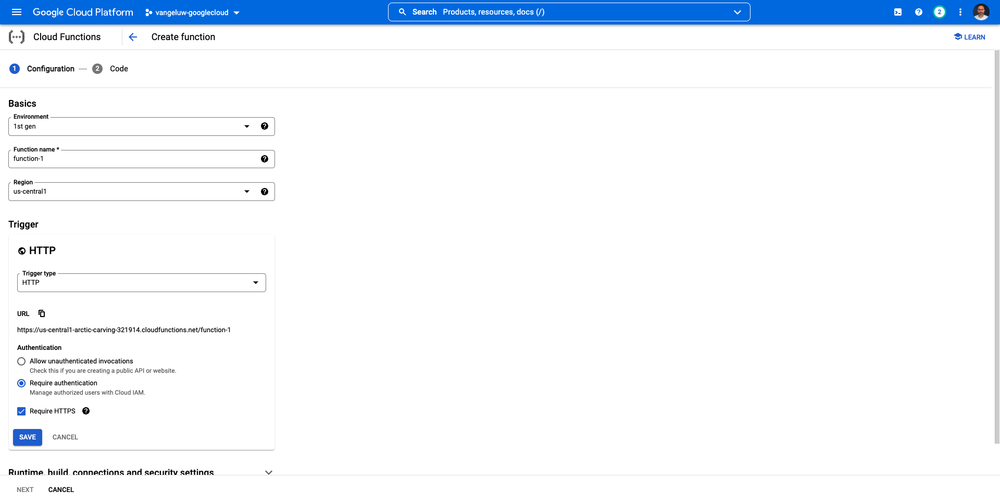
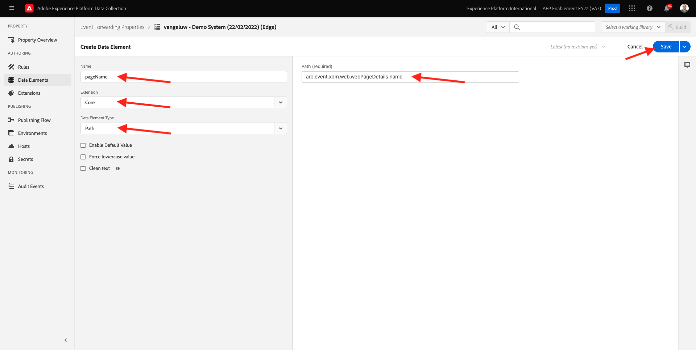
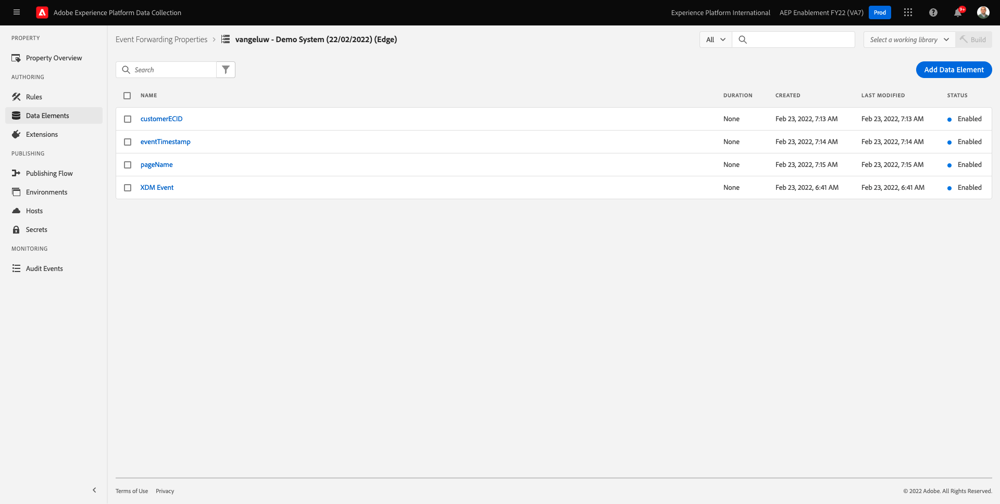
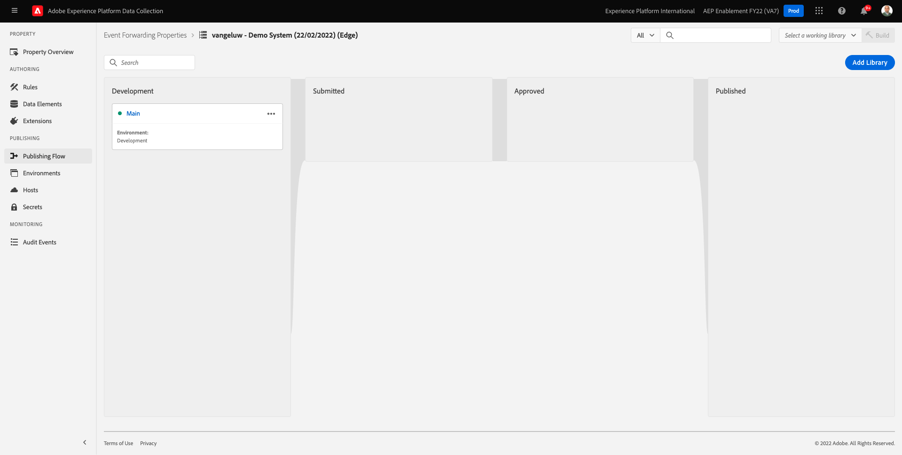

# 14.4建立和設定Google雲端函式

## 14.4.1建立Google雲端函式

前往 [https://console.cloud.google.com/](https://console.cloud.google.com/). 前往 **雲端函式**.


你會看到這個。 按一下 **建立函式**.


你會看到這個。



做出下列選擇：

- **函式名稱**: `--demoProfileLdap---event-forwarding`
- **地區**:選擇任何區域
- **觸發器類型**:選取 **HTTP**
- **驗證**:選取 **允許未驗證的調用**

你現在應該有這個。 按一下&#x200B;**儲存**。


按一下 **下一個**.


然後您會看到：


做出下列選擇：

- **執行階段**:選取 **Node.js 16** （或最近）
- **進入點**:輸入 **helloAEP**

按一下 **啟用API** 啟用 **雲端建置API**. 然後你會看到新的窗口。 在新視窗中，按一下 **啟用** 。


你會看到這個。 按一下 **啟用**.


一次 **雲端建置API** 已啟用，您將看到此內容。


返回您的 **雲端函式**.
在雲端函式內嵌編輯器中，請確定您有下列程式碼：

```javascript
/**
 * Responds to any HTTP request.
 *
 * @param {!express:Request} req HTTP request context.
 * @param {!express:Response} res HTTP response context.
 */
exports.helloAEP = (req, res) => {
  let message = req.query.message || req.body.message || 'Hello World!';
  res.status(200).send(message);
};
```

下一步，按一下 **部署**.


你會看到這個。 您的雲端函式現在已建立。 這可能需要幾分鐘。


建立並執行函式後，您就會看到這個。 按一下函式的名稱以開啟它。


你會看到這個。 前往 **觸發**. 然後您會看到 **觸發URL** 這是您在Launch伺服器端中定義端點時所使用的項目。


複製觸發器URL，如下所示： **https://europe-west1-dazzling-pillar-273812.cloudfunctions.net/vangeluw-event-forwarding**.

在後續步驟中，您將設定Adobe Experience Platform資料收集伺服器，以串流關於 **頁面檢視** 至Google雲端函式。 您不會依原樣轉送完整裝載，而只會傳送 **ECID**, **timestamp** 和 **頁面名稱** 至Google雲端函式。

以下是您需要剖析的裝載範例，以篩選掉上述變數：

```json
{
  "events": [
    {
      "xdm": {
        "eventType": "web.webpagedetails.pageViews",
        "web": {
          "webPageDetails": {
            "URL": "https://builder.adobedemo.com/run/vangeluw-OCUC",
            "name": "vangeluw-OCUC",
            "viewName": "vangeluw-OCUC",
            "pageViews": {
              "value": 1
            }
          },
          "webReferrer": {
            "URL": "https://builder.adobedemo.com/run/vangeluw-OCUC/equipment"
          }
        },
        "device": {
          "screenHeight": 1080,
          "screenWidth": 1920,
          "screenOrientation": "landscape"
        },
        "environment": {
          "type": "browser",
          "browserDetails": {
            "viewportWidth": 1920,
            "viewportHeight": 451
          }
        },
        "placeContext": {
          "localTime": "2022-02-23T06:51:07.140+01:00",
          "localTimezoneOffset": -60
        },
        "timestamp": "2022-02-23T05:51:07.140Z",
        "implementationDetails": {
          "name": "https://ns.adobe.com/experience/alloy/reactor",
          "version": "2.8.0+2.9.0",
          "environment": "browser"
        },
        "_experienceplatform": {
          "identification": {
            "core": {
              "ecid": "08346969856929444850590365495949561249"
            }
          },
          "demoEnvironment": {
            "brandName": "vangeluw-OCUC"
          },
          "interactionDetails": {
            "core": {
              "channel": "web"
            }
          }
        }
      },
      "query": {
        "personalization": {
          "schemas": [
            "https://ns.adobe.com/personalization/html-content-item",
            "https://ns.adobe.com/personalization/json-content-item",
            "https://ns.adobe.com/personalization/redirect-item",
            "https://ns.adobe.com/personalization/dom-action"
          ],
          "decisionScopes": [
            "eyJ4ZG06YWN0aXZpdHlJZCI6Inhjb3JlOm9mZmVyLWFjdGl2aXR5OjE0YzA1MjM4MmUxYjY1MDUiLCJ4ZG06cGxhY2VtZW50SWQiOiJ4Y29yZTpvZmZlci1wbGFjZW1lbnQ6MTRiZjA5ZGM0MTkwZWJiYSJ9",
            "__view__"
          ]
        }
      }
    }
  ],
  "query": {
    "identity": {
      "fetch": [
        "ECID"
      ]
    }
  },
  "meta": {
    "state": {
      "domain": "adobedemo.com",
      "cookiesEnabled": true,
      "entries": [
        {
          "key": "kndctr_907075E95BF479EC0A495C73_AdobeOrg_identity",
          "value": "CiYwODM0Njk2OTg1NjkyOTQ0NDg1MDU5MDM2NTQ5NTk0OTU2MTI0OVIPCPn66KfyLxgBKgRJUkwx8AH5-uin8i8="
        },
        {
          "key": "kndctr_907075E95BF479EC0A495C73_AdobeOrg_consent_check",
          "value": "1"
        },
        {
          "key": "kndctr_907075E95BF479EC0A495C73_AdobeOrg_consent",
          "value": "general=in"
        }
      ]
    }
  }
}
```

這些欄位包含需要剖析的資訊：

- ECID: **events.xdm。_experienceplatform.identification.core.ecid**
- 時間戳記： **timestamp**
- 頁面名稱： **events.xdm.web.webPageDetails.name**

現在來到Adobe Experience Platform資料收集伺服器，設定資料元素以實現此目標。

## 14.4.2更新「事件轉送」屬性：資料元素

前往 [https://experience.adobe.com/#/data-collection/](https://experience.adobe.com/#/data-collection/) 然後 **事件轉送**. 搜尋您的事件轉送屬性，然後按一下以開啟。


在左側功能表中，前往 **資料元素**. 按一下&#x200B;**新增資料元素**.


然後您會看到要設定的新資料元素。


選取下列項目：

- 作為 **名稱**，輸入 **customerECID**.
- 作為 **擴充功能**，選取 **核心**.
- 作為 **資料元素類型**，選取 **路徑**.
- 作為 **路徑**，輸入 `arc.event.xdm.--aepTenantId--.identification.core.ecid`. 輸入此路徑，即可篩選欄位 **ecid** 從網站或行動應用程式傳送至Adobe Edge的事件裝載。

>[!NOTE]
>
>在上方和下方路徑中，會參照 **弧**. **弧** 代表Adobe資源內容，並 **弧** 一律代表伺服器端內容中可用的最高可用物件。 可向其添加擴充和轉換 **弧** 物件(使用Adobe Experience Platform資料收集伺服器函式)。
>
>在上方和下方路徑中，會參照 **事件**. **事件** 代表一個唯一事件，Adobe Experience Platform資料收集伺服器一律會個別評估每個事件。 有時候，您可能會看到 **事件** 在由Web SDK用戶端傳送的裝載中，但在Adobe Experience Platform資料收集伺服器中，每個事件都會進行個別評估。

你現在有這個。 按一下「**儲存**」。


按一下&#x200B;**新增資料元素**.


然後您會看到要設定的新資料元素。


選取下列項目：

- 作為 **名稱**，輸入 **eventTimestamp**.
- 作為 **擴充功能**，選取 **核心**.
- 作為 **資料元素類型**，選取 **路徑**.
- 作為 **路徑**，輸入 **arc.event.xdm.timestamp**. 輸入此路徑，即可篩選欄位 **timestamp** 從網站或行動應用程式傳送至Adobe Edge的事件裝載。

你現在有這個。 按一下「**儲存**」。


按一下&#x200B;**新增資料元素**.


然後您會看到要設定的新資料元素。


選取下列項目：

- 作為 **名稱**，輸入 **pageName**.
- 作為 **擴充功能**，選取 **核心**.
- 作為 **資料元素類型**，選取 **路徑**.
- 作為 **路徑**，輸入 **arc.event.xdm.web.webPageDetails.name**. 輸入此路徑，即可篩選欄位 **名稱** 從網站或行動應用程式傳送至Adobe Edge的事件裝載。

你現在有這個。 按一下「**儲存**」。



您現在已建立下列資料元素：



## 14.4.3更新「事件轉送」屬性：更新規則

在左側功能表中，前往 **規則**. 在上一個練習中，您已建立規則 **所有頁面**. 按一下該規則以開啟它。


你會的。 按一下 **+** 圖示 **動作** 以新增動作。


你會看到這個。


選取下列項目：

- 選取 **擴充功能**: **Adobe雲端連接器**.
- 選取 **動作類型**: **進行擷取呼叫**.

那應該給你這個 **名稱**: **Adobe雲端連接器 — 進行擷取呼叫**. 您現在應該會看到：


接下來，配置以下內容：

- 將請求協定從GET更改為 **POST**
- 輸入您在先前步驟之一中建立的Google雲端函式的URL，如下所示： **https://europe-west1-dazzling-pillar-273812.cloudfunctions.net/vangeluw-event-forwarding**

你現在應該有這個。 接下來，轉到 **主體**.


你會看到這個。 按一下 **JSON**.


設定 **主體** 如下所示：

| 代碼 | 值 |
|--- |--- |
| customerECID | {{customerECID}} |
| pageName | {{pageName}} |
| eventTimestamp | {{eventTimestamp}} |

你會看到這個。 按一下&#x200B;**保留變更**.


你會看到這個。 按一下「**儲存**」。


您現在已更新Adobe Experience Platform資料收集伺服器屬性中的現有規則。 前往 **發佈流程** 來發佈變更。 開啟開發程式庫 **主要** 按一下 **編輯** 如所示。


按一下 **新增所有已變更的資源** 按鈕，之後您會看到規則和資料元素出現在此程式庫中。 下一步，按一下 **儲存並建置以供開發**. 您的變更現在已部署。


幾分鐘後，您會看到部署已完成，且已準備好進行測試。



## 14.3.4測試您的配置

前往 [https://builder.adobedemo.com/projects](https://builder.adobedemo.com/projects). 使用您的Adobe ID登入後，您會看到這個。 按一下您的網站專案以開啟。


您現在可以依照下列流程存取網站。 按一下 **整合**.


在 **整合** 頁，您需要選擇在練習0.1中建立的資料收集屬性。


然後，您會看到示範網站已開啟。 選取URL並複製到剪貼簿。


開啟新的無痕瀏覽器窗口。


貼上您在上一步複製的示範網站URL。 然後系統會要求您使用Adobe ID登入。


選取您的帳戶類型並完成登入程式。


然後，您會在無痕瀏覽器視窗中看到您的網站載入。 對於每個演示，您都需要使用全新的無痕瀏覽器窗口來載入演示網站URL。


當您開啟瀏覽器「開發人員檢視」時，可以檢查網路請求，如下所示。 使用篩選器時 **互動**，您會看到Adobe Experience Platform資料收集用戶端傳送至Adobe Edge的網路請求。


將檢視切換至Google雲端函式，然後前往 **記錄檔**. 您現在應該有類似此檢視的檢視，並顯示許多記錄項目。 每次你看到 **函式已啟動**，表示已在您的Google雲端函式中接收傳入流量。


讓我們更新一下您的函式，以處理傳入的資料，並顯示從Adobe Experience Platform資料收集伺服器收到的資訊。 前往 **來源** 按一下 **編輯**.


在下一個畫面中，按一下 **下一個**.


以下列方式更新您的程式碼：

```javascript
/**
 * Responds to any HTTP request.
 *
 * @param {!express:Request} req HTTP request context.
 * @param {!express:Response} res HTTP response context.
 */
exports.helloAEP = (req, res) => {
  console.log('>>>>> Function has started. The following information was received from Event Forwarding:');
  console.log(req.body);

  let message = req.query.message || req.body.message || 'Hello World!';
  res.status(200).send(message);
};
```

那你就拿這個。 按一下 **部署**.


幾分鐘後，您的函式將再次部署。 按一下您的函式名稱以開啟它。


在您的示範網站上，導覽至產品，例如 **放鬆適合卡普里酒店**.


將檢視切換至Google雲端函式，然後前往 **記錄檔**. 您現在應該有類似此檢視的檢視，並顯示許多記錄項目。

對於示範網站上的每個頁面檢視，您現在應該會在Google雲端函式的記錄中看到新記錄項目快顯視窗，顯示收到的資訊。


您現在已成功將Adobe Experience Platform資料收集所收集的資料即時傳送至Google雲端函式端點。 從那裡，任何Google雲端平台應用程式（例如BigQuery）都可以使用該資料進行儲存和報告，或用於機器學習的使用案例。

下一步： [14.5向AWS生態系統發展的前進活動](./ex5.md)

[返回模組14](./aep-data-collection-ssf.md)

[返回所有模組](./../../overview.md)
