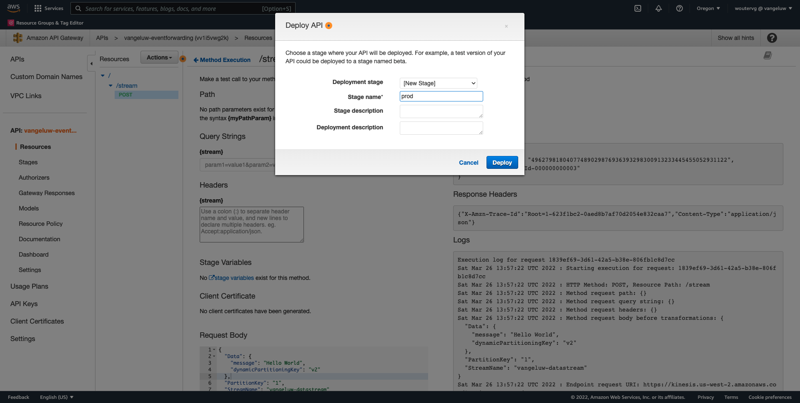
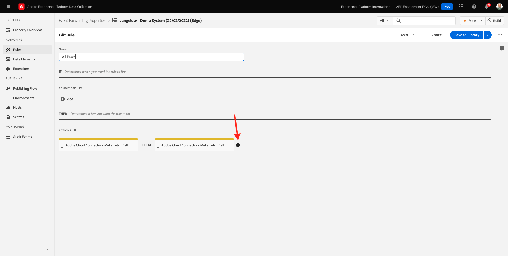

# 14.5向AWS生態系統發展的前進活動

>[!IMPORTANT]
>
>此練習為選用項目，使用AWS Kinesis需支付成本。 雖然AWS提供免費套餐帳戶，讓您無需付費即可測試和設定許多服務，但AWS Kinesis不是免費套餐帳戶的一部分。 因此，為了實施和測試此練習，使用AWS Kinesis將需要花費成本。

## 很高興知道

Adobe Experience Platform支援各種Amazon服務作為目的地。
Kinesis和S3都 [設定檔匯出目的地](https://experienceleague.adobe.com/docs/experience-platform/destinations/destination-types.html?lang=en) 且可作為Adobe Experience Platform Real-Time CDP的一部分。
您可以輕鬆將高價值區段事件和相關設定檔屬性饋送至您所選擇的系統。

在本說明中，您將學習如何設定自己的Amazon Kinesis資料流，以便將來自Adobe Experience Platform Edge生態系統的事件資料串流至雲端儲存目的地，例如Amazon S3。 如果您想要從Web和行動屬性收集體驗事件，並將其推送至您的資料表，以便進行分析和執行報告，此功能會很實用。 資料鎖通常會以批次方式內嵌資料，且每日匯入的檔案量很大，因此不會公開公用http端點，此端點可與事件轉送搭配使用。

支援上述使用案例意味著在將流式資料寫入檔案之前需要緩衝或將其置於隊列中。 請務必注意，不要開啟檔案以便跨多個進程進行寫入存取。 將這項任務下放給專用系統，是在確保服務水準高的同時實現良好規模的理想選擇，這正是Kinesis的救星之所。

Amazon Kinesis資料流著重於擷取和儲存資料流。 Kinesis Data Firehose著重於將資料流傳送至選取的目的地，例如S3貯體。

作為練習的一部分，你會……

- 執行Kinesis資料流的基本設定
- 建立Firehose傳送資料流，並使用S3儲存貯體作為目的地
- 將Amazon API閘道設為rest api端點，以接收您的事件資料
- 將原始事件資料從Adobe的Edge轉送至您的Kinesis資料流

## 14.5.1設定您的AWS S3貯體

前往 [https://console.aws.amazon.com](https://console.aws.amazon.com) 並使用您先前建立的Amazon帳戶登入。


登入後，系統會將您重新導向至 **AWS Management Console**.


在 **查找服務** 菜單，搜索 **s3**. 按一下第一個搜尋結果： **S3 — 雲中可擴充的儲存**.


然後您會看到 **Amazon S3** 首頁。 按一下 **建立貯體**.


在 **建立貯體** 畫面中，您需要設定兩個項目：

- 名稱：使用名稱 `eventforwarding---demoProfileLdap--`. 例如，在本練習中，貯體名稱為 **aepmodulertcdpvangeluw**
- 地區：使用地區 **EU（法蘭克福）eu-central-1**


保留所有其他預設設定。 向下捲動並按一下 **建立貯體**.


接著，您會看到儲存貯體已建立，並會重新導向至Amazon S3首頁。


## 14.5.2設定AWS Kinesis資料流

在 **查找服務** 菜單，搜索 **kiness**. 按一下第一個搜尋結果： **Kinesis — 使用即時串流資料**.


選擇 **Kinesis資料流**. 按一下 **建立資料流**.


若 **資料流名稱**，使用 `--demoProfileLdap---datastream`.


不需要變更任何其他設定。 向下捲動並按一下 **建立資料流**.


你會看到這個。 成功建立資料流後，您可以繼續進行下一個練習。


## 14.5.3設定您的AWS Firehose傳送資料流

在 **查找服務** 菜單，搜索 **kiness**. 按一下 **Kinesis Data Firehose**.


按一下 **建立傳送資料流**.


針對 **來源**，選取 **Amazon Kinesis資料流**. 針對 **目的地**，選取 **Amazon S3**. 按一下 **瀏覽** 來選取資料流。


選取您的資料流。 按一下 **選擇**.


你會看到這個。 記住 **傳送資料流名稱** 你以後會需要的。


向下捲動，直到您看到 **目的地設定**. 按一下 **瀏覽** 來選取S3貯體。


選取您的S3貯體，然後按一下 **選擇**.


你會看到這樣的。 更新下列設定：

- 動態分區：設為 **已啟用**
- 多記錄分集：設為 **已停用**
- 新行分隔符：設為 **已啟用**
- JSON的內嵌剖析：設為 **已啟用**


向下滾動一點，然後您會看到這個。 更新下列設定：

- 動態分段鍵
   - 密鑰名稱： **dynamicPartitioningKey**
   - JQ表達式： **.dynamicPartitioningKey**
- S3貯體首碼：新增下列程式碼：

```bash
!{partitionKeyFromQuery:dynamicPartitioningKey}/!{timestamp:yyyy}/!{timestamp:MM}/!{timestamp:dd}/!{timestamp:HH}/}
```

- S3儲存貯體錯誤輸出首碼：設為 **錯誤**


最後，再向下捲動一點，然後按一下 **建立傳送資料流**


幾分鐘後，將會建立您的傳送資料流，並 **作用中**.


## 14.5.4配置AWS IAM角色

在 **查找服務** 菜單，搜索 **iam**. 按一下 **API閘道**.


按一下 **角色**.


搜尋 **KinesisFirehose** 角色。 按一下它以開啟它。


按一下您的權限原則名稱以開啟它。


在開啟的新畫面中，按一下 **編輯策略**.


在 **Kinesis** - **動作**，請確定 **寫入** 權限 **PutRecord** 啟用。 按一下 **審核策略**.


按一下&#x200B;**儲存變更**。


你會回來的。 按一下 **角色**.


搜尋 **KinesisFirehose** 角色。 按一下它以開啟它。


前往 **信任關係** 按一下 **編輯信任策略**.


通過貼上此代碼來替換現有代碼來覆蓋當前信任策略：

```json
{
	"Version": "2012-10-17",
	"Statement": [
		{
			"Effect": "Allow",
			"Principal": {
				"Service": [
                    "firehose.amazonaws.com",
                    "kinesis.amazonaws.com",
                    "apigateway.amazonaws.com"
                ]
			},
			"Action": "sts:AssumeRole"
		}
	]
}
```

按一下 **更新策略**


你會看到這個。 您需要指定 **ARN** ，以便在下一步執行此角色。


## 14.5.5設定AWS API閘道

Amazon API閘道是AWS服務，可供建立、發佈、維護、監控及保護REST、HTTP和WebSocket API，且可用於任何規模。 API開發人員可建立存取AWS或其他網站服務的API，以及儲存在AWS雲端中的資料。

您現在會透過HTTPS端點將Kinesis資料流公開至網際網路，然後Adobe服務（例如事件轉送）就可直接使用該端點。

在 **查找服務** 菜單，搜索 **api閘道**. 按一下 **API閘道**.


你會看到這樣的。 按一下 **建立API**.


按一下 **建置** 在 **REST API** 卡片。


你會看到這個。 填寫如下設定：

- 選擇協定：選取 **REST**
- 建立新API:選取 **新API**
- 設定:
   - API名稱：use `--demoProfileLdap---eventforwarding`
   - 端點類型：選取 **地區**

按一下 **建立API**.


你會看到這個。 按一下 **動作** 然後按一下 **建立資源**.


你會看到這個。 設定 **資源名稱** to **流**. 按一下 **建立資源**.


你會看到這個。 按一下 **動作** 然後按一下 **建立方法**.


在下拉式清單中，選取 **POST** 並按一下 **v** 按鈕。


你會看到這個。 填寫如下設定：

- 整合類型： **AWS服務**
- AWS地區：選取您的Kinesis資料流所使用的地區，在此案例中為： **us-west-2**
- AWS服務：選取 **Kinesis**
- AWS子網域：留空
- HTTP方法：選取 **POST**
- 動作類型：選取 **使用動作名稱**
- 動作：輸入 **PutRecord**
- 執行角色：貼上 **ARN** Kinesis Data Firehose所使用之執行角色的設定，如先前練習所指示
- 內容處理：選取 **直通**
- 使用預設超時：啟用核取方塊

按一下「**儲存**」。


你會看到這個。 按一下 **整合要求**.


按一下 **HTTP標題**.


向下捲動一位，然後按一下 **新增標題**.


設定 **名稱** to **內容類型**，設定 **映射自** to `'application/x-amz-json-1.1'`. 按一下 **v** 圖示以儲存您的變更。


你會看到這個。 針對 **要求內文通過**，選取 **未定義範本時（建議）**. 下一步，按一下 **添加映射模板**.


在 **內容類型**，輸入 **application/json**. 按一下 **v** 圖示以儲存您的變更。


向下捲動以尋找程式碼編輯器視窗。 將下列程式碼貼到此處：

```json
{
  "StreamName": "$input.path('StreamName')",
  "Data": "$util.base64Encode($input.json('$.Data'))",
  "PartitionKey": "$input.path('$.PartitionKey')"
}
```

按一下「**儲存**」。


下一步，向上捲動並按一下 **&lt; — 方法執行** 回去。


按一下 **測試**.


向下捲動，然後將此程式碼貼到 **要求內文**. 按一下 **測試**.

```json
{
  "Data": {
    "message": "Hello World",
    "dynamicPartitioningKey": "v2"
  },
  "PartitionKey": "1",
  "StreamName": "--demoProfileLdap---datastream"
}
```


然後您會看到類似的結果：


你會看到這個。 按一下 **動作** 然後按一下 **部署API**.


針對 **部署階段**，選取 **新階段**. As **階段名稱**，輸入 **prod**. 按一下 **部署**.



你會看到這個。 按一下&#x200B;**儲存變更**。答：影像中的URL是用來傳送資料的URL(在此範例中：https://vv1i5vwg2k.execute-api.us-west-2.amazonaws.com/prod)。


您可以使用下列cURL要求來測試設定，您只需依您的URL取代下列URL即可。 `https://vv1i5vwg2k.execute-api.us-west-2.amazonaws.com/prod` 在此範例中，新增 `/stream` 填入。

```json
curl --location --request POST 'https://vv1i5vwg2k.execute-api.us-west-2.amazonaws.com/prod/stream' \
--header 'Content-Type: application/json' \
--data-raw '{
    "Data": {
        "userid": "--demoProfileLdap--@adobe.com",
        "firstName":"--demoProfileLdap--",
        "offerName":"10% off on outdoor gears",
        "offerCode": "10OFF-SPRING",
        "dynamicPartitioningKey": "campaign"
    },
    "PartitionKey": "1",
    "StreamName": "--demoProfileLdap---datastream"
}'
```

將上述更新的程式碼貼到「終端機」視窗中，然後按Enter。 然後您會看到此回應，類似於上述測試時您可看到的回應。


## 14.5.6更新事件轉送屬性

您現在可以透過AWS API Gateway啟用AWS Kinesis資料流，因此現在可以將原始體驗事件傳送至AWS生態系統。 您現在可以使用Real-Time CDP連線和事件轉送，輕鬆將事件轉送至新建立的AWS API閘道端點。

### 14.5.6.1更新事件轉送屬性：建立資料元素

前往 [https://experience.adobe.com/#/data-collection/](https://experience.adobe.com/#/data-collection/) 然後 **事件轉送**. 搜尋您的事件轉送屬性，然後按一下以開啟。


在左側功能表中，前往 **資料元素**. 按一下&#x200B;**新增資料元素**.


然後您會看到要設定的新資料元素。


選取下列項目：

- 作為 **名稱**，輸入 **awsDataObject**.
- 作為 **擴充功能**，選取 **核心**.
- 作為 **資料元素類型**，選取 **自訂程式碼**.

你現在有這個。 按一下 **&lt;/>開啟編輯器**.


在編輯器中，將下列程式碼貼到第3行。 按一下「**儲存**」。

```javascript
const newObj = {...arc.event.xdm, dynamicPartitioningKey: "event_forwarding"}
return JSON.stringify(newObj);
```


>[!NOTE]
>
>在上述路徑中，會參照 **弧**. **弧** 代表Adobe資源內容，並 **弧** 一律代表伺服器端內容中可用的最高可用物件。 可向其添加擴充和轉換 **弧** 物件(使用Adobe Experience Platform資料收集伺服器函式)。
>
>在上述路徑中，會參照 **事件**. **事件** 代表一個唯一事件，Adobe Experience Platform資料收集伺服器一律會個別評估每個事件。 有時候，您可能會看到 **事件** 在由Web SDK用戶端傳送的裝載中，但在Adobe Experience Platform資料收集事件轉送中，系統會個別評估每個事件。

你會回來的。 按一下 **儲存** 或 **儲存至程式庫**.


### 14.5.6.2更新您的Adobe Experience Platform資料收集伺服器屬性：更新規則

在左側功能表中，前往 **規則**. 按一下以開啟規則 **所有頁面** 在先前的練習中建立的。


你會看到這個。 按一下 **+** 圖示以新增動作。



你會看到這個。 選取下列項目：

- 選取 **擴充功能**: **Adobe雲端連接器**.
- 選取 **動作類型**: **進行擷取呼叫**.

那應該給你這個 **名稱**: **Adobe雲端連接器 — 進行擷取呼叫**. 您現在應該會看到：


接下來，配置以下內容：

- 將要求方法從GET變更為 **POST**
- 輸入您在先前步驟之一中建立的AWS API閘道端點的URL，如下所示： `https://vv1i5vwg2k.execute-api.us-west-2.amazonaws.com/prod/stream`

你現在應該有這個。 接下來，轉到 **標題**.


在標題下，使用鍵新增標題 **內容類型** 和值 **application/json**. 接下來，轉到 **主體**.


你會看到這個。 將下列程式碼貼入欄位中 **內文（原始）**. 按一下&#x200B;**保留變更**.

```json
{
    "Data":{{awsDataObject}},
    "PartitionKey": "1",
    "StreamName": "--demoProfileLdap---datastream"
}
```


你會看到的。 按一下 **儲存** 或 **儲存至程式庫**.


您現在已在「事件轉送」屬性中設定了第一個規則。 前往 **發佈流程** 來發佈變更。
按一下「 」以開啟開發程式庫 **主要**.


按一下 **新增所有已變更的資源** 按鈕，之後您會看到規則和資料元素變更出現在此程式庫中。 下一步，按一下 **儲存並建置以供開發**. 您的變更現在已部署。


幾分鐘後，您會看到部署已完成，且已準備好進行測試。


## 14.5.7測試您的配置

前往 [https://builder.adobedemo.com/projects](https://builder.adobedemo.com/projects). 使用您的Adobe ID登入後，您會看到這個。 按一下您的網站專案以開啟。


您現在可以依照下列流程存取網站。 按一下 **整合**.


在 **整合** 頁，您需要選擇在練習0.1中建立的資料收集屬性。


然後，您會看到示範網站已開啟。 選取URL並複製到剪貼簿。


開啟新的無痕瀏覽器窗口。


貼上您在上一步複製的示範網站URL。 然後系統會要求您使用Adobe ID登入。


選取您的帳戶類型並完成登入程式。


然後，您會在無痕瀏覽器視窗中看到您的網站載入。 對於每個演示，您都需要使用全新的無痕瀏覽器窗口來載入演示網站URL。


當您開啟瀏覽器「開發人員檢視」時，可以檢查網路請求，如下所示。 使用篩選器時 **互動**，您會看到Adobe Experience Platform資料收集用戶端傳送至Adobe Edge的網路請求。


如果您選取原始裝載，請前往 [https://jsonformatter.org/json-pretty-print](https://jsonformatter.org/json-pretty-print) 並貼上裝載。 按一下 **美**. 接著您會看到JSON裝載， **事件** 物件和 **xdm** 物件。 在前面的步驟之一中，定義「資料元素」時，會使用參照 **arc.event.xdm**，這會導致您解析 **xdm** 此裝載的物件。


將視圖切換為 **AWS**. 開啟資料流並進入 **監控** 標籤，您現在會看到傳入的流量。


當您接著開啟傳送資料流，並進入 **監控** 頁簽，您也會看到傳入的流量。


最後，當您查看S3儲存貯體時，現在會注意到由於資料擷取而在該處建立的檔案。


下載這類檔案並使用文字編輯器開啟時，您會看到其中包含轉送之事件的XDM裝載。


下一步： [摘要和優點](./summary.md)

[返回模組14](./aep-data-collection-ssf.md)

[返回所有模組](./../../overview.md)
