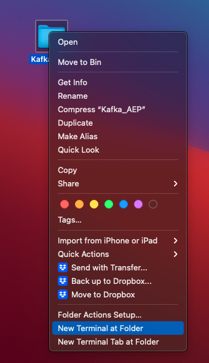
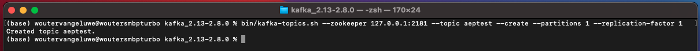
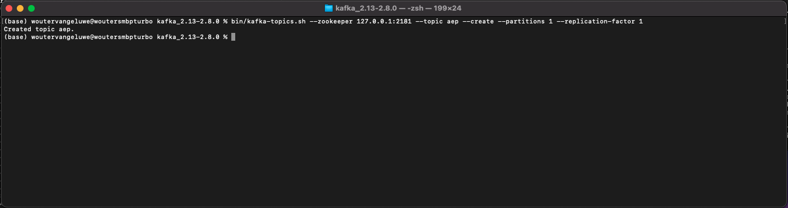
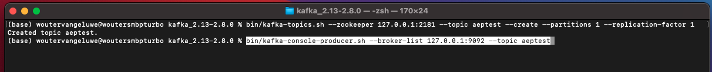

# 15.2安裝和配置您的Kafka群集

## 15.2.1下載Apache Kafka

前往 [https://kafka.apache.org/downloads](https://kafka.apache.org/downloads) 並下載最新發行版本。 選取最新的二進位版本，在此情況下為 **斯卡拉2.13**.

然後你被帶到鏡子站。 按一下建議的連結以下載Kafka。

在案頭上建立資料夾，名為 **Kafka_AEP** 並將下載的檔案置於該目錄中。

開啟 **終端** 按一下右鍵資料夾並按一下 **資料夾處的新終端**.

在「終端機」視窗中執行此命令，以解壓縮下載的檔案：

`tar -xvf kafka_2.13-3.1.0.tgz`

>[!NOTE]
>
>請驗證上述命令是否與您下載的檔案版本匹配。 如果您的版本較新，則需要更新上述命令以符合該版本。

然後您會看到：

解壓縮該檔案後，您現在有類似以下目錄的目錄：

在該目錄中，您會看到這些子目錄：

返回您的終端機視窗。 輸入以下命令：

`cd kafka_2.13-3.1.0`

>[!NOTE]
>
>請驗證上述命令是否與您下載的檔案版本匹配。 如果您的版本較新，則需要更新上述命令以符合該版本。

接下來，輸入命令 `bin/kafka-topics.sh`.

您應該會看到此回應。 這表示已正確安裝Kafka，且Java正常運作。 (提醒：您需要安裝Java 8 JDK或Java 11 JDK，才能使此功能發揮作用！ 您可以使用命令查看已安裝的Java版本 `java -version`.)

## 15.2.2開始卡夫卡

為了啟動Kafka，你需要啟動Kafka Zookeeper和Kafka，按此順序。

開啟 **終端** 按一下右鍵資料夾 **kafka_2.13-3.1.0** 按一下 **資料夾處的新終端**.

輸入以下命令：

`bin/zookeeper-server-start.sh config/zookeeper.properties`

然後您會看到：

在進行這些練習時，請保持窗口開啟！

開啟另一個新 **終端** 按一下右鍵資料夾 **kafka_2.13-3.1.0** 按一下 **資料夾處的新終端**.

輸入以下命令：

`bin/kafka-server-start.sh config/server.properties`

然後您會看到：

在進行這些練習時，請保持窗口開啟！

## 15.2.3建立Kafka主題

開啟 **終端** 按一下右鍵資料夾 **kafka_2.13-3.1.0** 按一下 **資料夾處的新終端**.

輸入此命令以建立名稱為的新Kafka主題 **aeptest**. 本主題將用於本練習中的測試。

`bin/kafka-topics.sh --create --topic aeptest --bootstrap-server localhost:9092`

然後您會看到類似的確認：

輸入此命令以建立名稱為的新Kafka主題 **aep**. 本主題將用於您將在下一練習中配置的Adobe Experience Platform Sink Connector。

`bin/kafka-topics.sh --create --topic aep --bootstrap-server localhost:9092`

然後您會看到類似的確認：

## 15.2.4製作事件

返回「終端機」視窗，在該視窗中建立第一個Kafka主題，然後輸入下列命令：

`bin/kafka-console-producer.sh --broker-list 127.0.0.1:9092 --topic aeptest`

你會看到這個。 按Enter按鈕後面的每一行新郵件都會導致主題中傳送新訊息 **aeptest**.

輸入 `Hello AEP` 按Enter鍵。 您的第一個事件現在已傳送至您本機的Kafka例項，進入主題 **aeptest**.

輸入 `Hello AEP again.` 按Enter鍵。

輸入 `AEP Data Collection is the best.` 按Enter鍵。

您現在已針對本主題製作3個活動 **aeptest**. 現在，可能需要該資料的應用程式可以使用這些事件。

在鍵盤上，按一下 `Control` 和 `C` 同時關閉你的製片人。

## 15.2.4使用事件

在您用來產生事件的相同「終端機」視窗中，輸入下列命令：

`bin/kafka-console-consumer.sh --bootstrap-server 127.0.0.1:9092 --topic aeptest --from-beginning`

然後，您會看到在上一個主題練習中產生的所有訊息 **aeptest**，即會出現在消費者中。 以下是Apache Kafka的運作方式：製作者會將事件建立到管道中，而消費者會取用這些事件。

在鍵盤上，按一下 `Control` 和 `C` 同時關閉你的製片人。

在本練習中，您已完成設定本機Kafka叢集、建立Kafka主題、產生事件和使用事件的所有基本操作。

此模組的目標是模擬如果真實的組織已實作Apache Kafka叢集，且想要將資料從其Kafka叢集串流至Adobe Experience Platform，會發生什麼情況。

為了便於實施，建立了一個Adobe Experience Platform Sink連接器，可以使用Kafka Connect實現。 您可以在以下位置找到Adobe Experience Platform Sink Connector的文檔： [https://github.com/adobe/experience-platform-streaming-connect](https://github.com/adobe/experience-platform-streaming-connect).

在下一個練習中，您將從自己的本地Kafka叢集中實作使用該Adobe Experience Platform Sink Connector所需的所有內容。

關閉終端機視窗。

您已完成本練習。

下一步： [15.3在Adobe Experience Platform中設定HTTP API端點](./ex3.md)

[返回模組15](./aep-apache-kafka.md)

[返回所有模組](../../overview.md)
