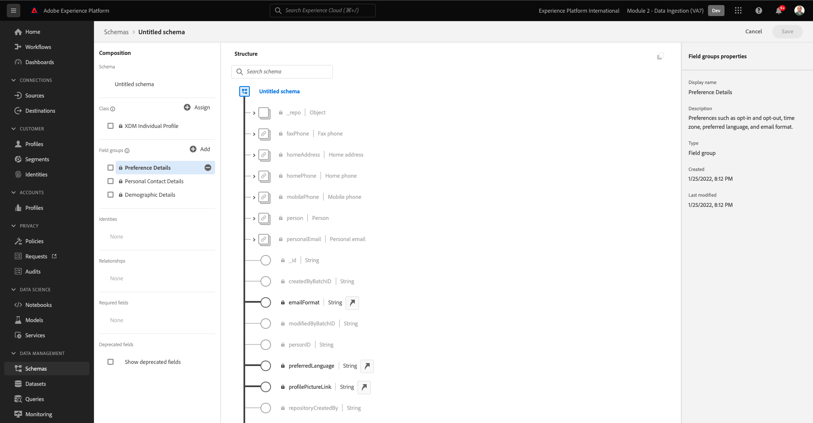
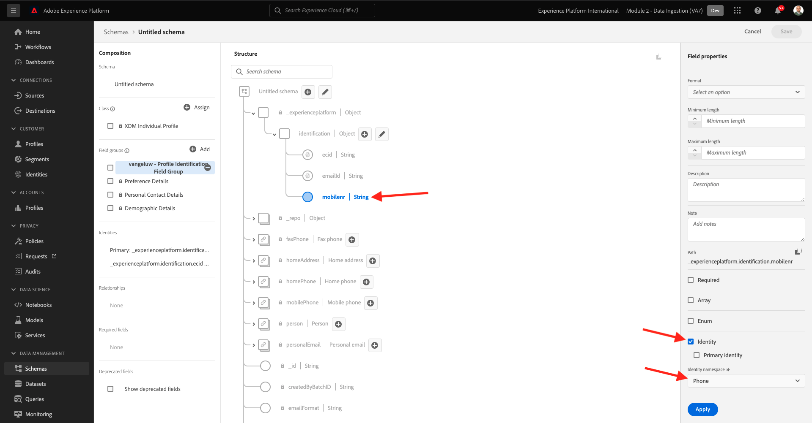
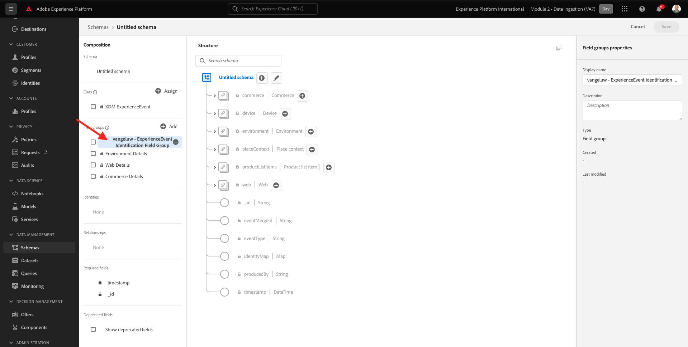
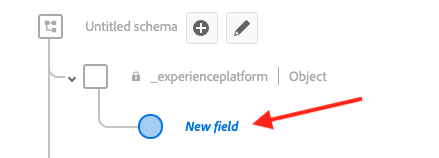
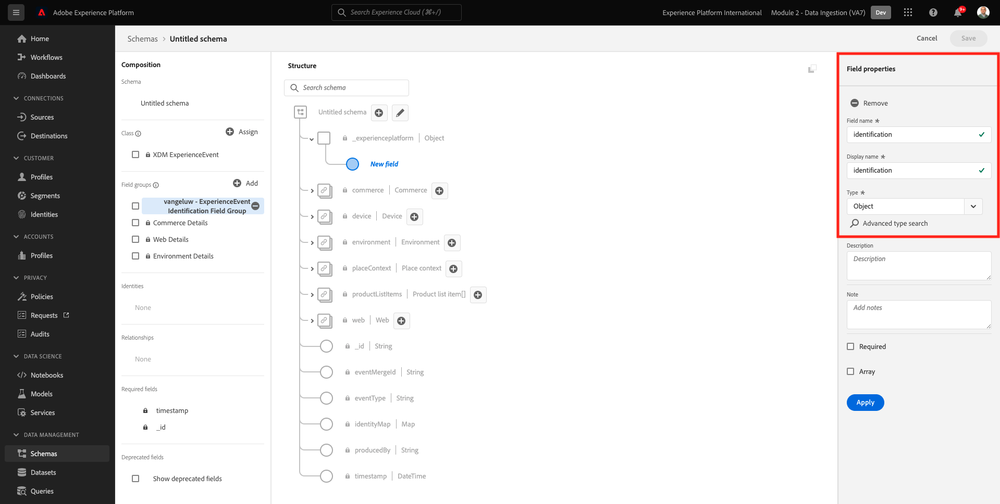
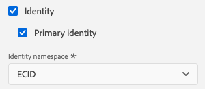

# 2.2設定結構和設定識別碼

在本練習中，您將設定必要的XDM結構，以分類設定檔資訊和客戶行為。 在每個XDM結構中，您也必須設定主要識別碼，將所有資訊連結至。

## Story

開始設定XDM結構並設定主要識別碼之前，我們需要先思考我們要嘗試執行的業務環境：

- 想要資料
- 您想要將資料連結至客戶
- 您想要建立漸進式的即時客戶個人檔案

我們要擷取的資料類型有2種：

- 該客戶是誰？
- 此客戶有何功能？

然而，問題 **該客戶是誰？** 是一個有很多答案的非常開放的問題。 當您的公司想要看到此問題已解答時，您會尋找人口統計資訊，例如名字、姓氏和地址。 也可以查看電子郵件地址或手機號碼等聯繫資訊。 還有連結至語言、選擇加入/選擇退出，甚至個人資料圖片的資訊。 最後，您真正需要知道的是，我們將如何在您公司使用的各種系統中識別此客戶。

同樣的問題 **此客戶有何功能？**。這是一個非常開放的問題，有很多答案。 當您的公司想要看到此問題已解答時，您會尋找客戶與您的任何線上和離線屬性之間的任何互動。 已瀏覽哪些頁面或產品？ 此客戶是否已將產品新增至購物車或甚至購買項目？ 已使用什麼裝置和瀏覽器來瀏覽網站？ 此客戶想要什麼樣的資訊，我們如何使用這些資訊來配置並向此客戶提供令人愉快的體驗？ 最後，我們真正需要知道的是，我們將如何在貴公司將使用的各種系統中識別此客戶。

## 2.1.1 — 誰是此客戶

擷取答案 **該客戶是誰？** 需透過登入/註冊頁面完成。

從綱要的觀點來看， **類別**. 問題是： **該客戶是誰？** 是我們在類里定義的 **[!UICONTROL XDM個別設定檔]**.

因此，當您建立XDM結構以擷取 **該客戶是誰？**&#x200B;首先，您需要建立並定義參考類別的1個結構 **[!UICONTROL XDM個別設定檔]**.

若要指定可針對該問題提供何種答案，您必須定義 [!UICONTROL 欄位群組]. [!UICONTROL 欄位群組] 是設定檔類別的擴充功能，且有非常特定的設定。 例如，名字、姓氏、性別和生日等人口資訊是 [!UICONTROL 欄位組]: **[!UICONTROL 人口統計詳細資料]**.

其次，您的公司需要決定如何識別此客戶。 就您的公司而言，已知客戶的主要識別碼可能是特定客戶ID，例如電子郵件地址。 但從技術上講，您公司還有其他方法來識別客戶，例如使用行動電話號碼。
在本實驗中，我們將將電子郵件地址定義為主要識別碼，將電話號碼定義為次要識別碼。

最後，請務必區分擷取資料的管道。 在此案例中，我們將討論網站註冊，以及需要定義以反映的結構 **where** 已捕獲註冊資料。 管道在影響擷取的資料方面也將扮演重要角色。 因此，最佳作法是針對每個管道組合、主要識別碼和收集的資料類型定義結構。

根據上述，您需要在Adobe Experience Platform中設定結構描述。

前往此URL登入Adobe Experience Platform: [https://experience.adobe.com/platform](https://experience.adobe.com/platform).

登入後，您會登陸Adobe Experience Platform首頁。

繼續之前，您需要選取 **沙箱**. 要選取的沙箱已命名 ``--module2sandbox--``. 您可以按一下文字 **[!UICONTROL 生產產品]** 在螢幕上方的藍線。 選取適當的沙箱後，畫面會變更，現在您就位於專用的沙箱中。

在Adobe Experience Platform中，按一下 **[!UICONTROL 結構]** 在畫面左側的功能表中。 您會看到可用清單 [!UICONTROL 結構].

您應建立新結構。 要建立新架構，請按一下按鈕 **[!UICONTROL +建立結構]** 選取 **[!UICONTROL XDM個別設定檔]**.

按一下 **[!UICONTROL +建立結構]** 按鈕，則會建立新架構，系統將提示您選擇或建立 **欄位群組**.

現在，您需要定義問題的答案 **該客戶是誰？** 應該是這樣的。
在本實驗的介紹中，我們注意到需要以下屬性來定義客戶：

- 人口統計資訊，例如名字、姓氏和地址
- 聯絡資訊，例如首頁地址、電子郵件地址或行動電話號碼
- 連結至語言、OptIn/OptOut，甚至個人資料圖片的其他資訊。
- 客戶的主要識別碼

若要讓該資訊成為架構的一部分，您需要新增下列項目 [!UICONTROL 欄位群組] 至您的架構：

- 人口統計詳細資訊（人口統計資訊）
- 個人聯繫詳情（聯繫資訊）
- 首選項詳細資訊（其他資訊）
- 貴公司的自訂設定檔識別欄位群組（主要和次要識別碼）

在 **[!UICONTROL 添加欄位組]** 螢幕上，選取 [!UICONTROL 欄位組] **[!UICONTROL 人口統計詳細資料]**, **[!UICONTROL 個人聯繫人詳細資訊]** 和 **[!UICONTROL 首選項詳細資訊]**.

按一下 **[!UICONTROL 新增欄位群組]** 按鈕以新增 [!UICONTROL 欄位組] 到您的架構。

您現在會擁有此功能：

接下來，你需要一個 [!UICONTROL 欄位組] 捕捉 **[!UICONTROL 識別碼]** 用於資料收集。 如前一練習所示，主要和次要識別碼的概念已經存在。 主要識別碼是最重要的，因為所有收集的資料都會連結至此識別碼。

您現在將建立自己的自訂 [!UICONTROL 欄位組] 因此，你將把 [!UICONTROL XDM結構] 來滿足您公司的要求。

按一下 **[!UICONTROL +新增]** 開始添加按鈕 [!UICONTROL 欄位組].

取代重複使用現有 [!UICONTROL 欄位組]，您現在將建立自己的 [!UICONTROL 欄位組]. 您可以選取 **[!UICONTROL 建立新欄位組]**.

您現在需要提供 **[!UICONTROL 顯示名稱]** 和 **[!UICONTROL 說明]** 新 [!UICONTROL 欄位組].

作為架構的名稱，我們將使用：
`--demoProfileLdap-- - Profile Identification Field Group`

例如，對於ldap **[!UICONTROL 萬熱盧]**，此名稱應為結構名稱：

**[!UICONTROL vangeluw — 配置檔案標識欄位組]**

這應該會給你這樣的東西：

按一下 **[!UICONTROL 新增欄位群組]** 按鈕以添加新建立的 [!UICONTROL 欄位組] 到您的架構。

您現在應已建立此結構。

新 [!UICONTROL 欄位組] 仍為空白，因此現在您必須新增欄位至 [!UICONTROL 欄位組].
在 [!UICONTROL 欄位組]-list，按一下您的自定義 [!UICONTROL 欄位組].

您現在會看到許多新按鈕出現。

在結構的頂層，按一下 **[!UICONTROL +新增欄位]** 按鈕。

按一下 **[!UICONTROL +新增欄位]** 按鈕，您現在會看到新 **[!UICONTROL 物件]** 在您的架構中。 此物件代表自訂 **[!UICONTROL 物件]** 在您的結構中，以您的Adobe Experience Platform租用戶ID命名。 您的Adobe Experience Platform租用戶id為 `--aepTenantId--`.

您現在將在該租用戶下新增一個物件。 若要這麼做，請按一下欄位 **[!UICONTROL 新欄位]** 在tenant-object下。

使用以下object-definitions:

- 欄位名稱： **[!UICONTROL 識別]**
- 顯示名稱：  **[!UICONTROL 識別]**
- 類型： **[!UICONTROL 物件]**

按一下 **[!UICONTROL 套用]** 來儲存變更。

按一下 **[!UICONTROL 套用]**，您現在會看到 **[!UICONTROL 識別]** 對象。

您現在會在  **[!UICONTROL 識別]** 物件：

- ecid:
   - 欄位名稱： **[!UICONTROL ecid]**
   - 顯示名稱：  **[!UICONTROL ecid]**
   - 類型：**[!UICONTROL 字串]**

- emailId
   - 欄位名稱： **[!UICONTROL emailId]**
   - 顯示名稱：  **[!UICONTROL emailId]**
   - 類型：**[!UICONTROL 字串]**

- mobilenr
   - 欄位名稱： **[!UICONTROL mobilenr]**
   - 顯示名稱：  **[!UICONTROL mobilenr]**
   - 類型：**[!UICONTROL 字串]**

每個欄位將定義為類型 **[!UICONTROL 字串]** 我們將這些欄位配置為 **[!UICONTROL 身分]**. 結構 **[!UICONTROL 網站註冊結構]**，我們假設客戶一律會以其電子郵件地址識別，這表示您必須設定欄位 **[!UICONTROL emailId]** as a **[!UICONTROL 主要]** 標識符，其他欄位作為 **[!UICONTROL 次要]** 識別碼。

若要新增欄位，請按一下 **[!UICONTROL +]** 按鈕 **[!UICONTROL 識別]** 物件。

您現在有空欄位。 您需要依指示設定上述3個欄位。

這是每個欄位在初始欄位設定後的外觀。

按一下 **[!UICONTROL +]** 按鈕 **[!UICONTROL 識別]** 物件，以建立新欄位並填寫欄位，如所示。

- ecid

若要儲存欄位，請向下捲動 **[!UICONTROL 欄位屬性]** 直到你看到按鈕 **[!UICONTROL 套用]**. 按一下 **[!UICONTROL 套用]** 按鈕。

按一下 **[!UICONTROL +]** 按鈕 **[!UICONTROL 識別]** 物件，以建立新欄位並填寫欄位，如所示。

- emailId

若要儲存欄位，請向下捲動 **[!UICONTROL 欄位屬性]** 直到你看到按鈕 **[!UICONTROL 套用]**. 按一下 **[!UICONTROL 套用]** 按鈕。

按一下 **[!UICONTROL +]** 按鈕 **[!UICONTROL 識別]** 物件，以建立新欄位並填寫欄位，如所示。

- mobilenr

若要儲存欄位，請向下捲動 **[!UICONTROL 欄位屬性]** 直到你看到按鈕 **[!UICONTROL 套用]**. 按一下 **[!UICONTROL 套用]** 按鈕。

您現在有3個欄位，但這些欄位尚未定義為 **[!UICONTROL 身分]** — 欄位。

若要開始將這些欄位定義為 **[!UICONTROL 身分]**-fields，請執行以下步驟：

- 選取欄位 **[!UICONTROL emailId]**.
- 在右側的欄位屬性中，向下捲動直到您看到 **[!UICONTROL 身分]**. 勾選 **[!UICONTROL 身分]**.

   

- 現在勾選 **[!UICONTROL 主要身分]**.

   

- 最後，選取命名空間 **[!UICONTROL 電子郵件]** 從 **[!UICONTROL 命名空間]**. Adobe Experience Platform中的「身分圖表」會使用命名空間來分類命名空間中的識別碼，並定義這些命名空間之間的關係。

   

- 最後，按一下 **[!UICONTROL 套用]** 來儲存變更。

   

接下來，您必須為 **[!UICONTROL ecid]** 和 **[!UICONTROL mobilenr]** 做為次要識別碼。

- 選取欄位 **[!UICONTROL ecid]**.
- 在右側的欄位屬性中，向下捲動直到您看到 **[!UICONTROL 身分]**. 勾選 **[!UICONTROL 身分]**.

   

- 接下來，選取命名空間 **[!UICONTROL ECID]** 從 **[!UICONTROL 命名空間]**. A [!UICONTROL 命名空間] 供Adobe Experience Platform中的「身分圖表」用來分類命名空間中的識別碼，並定義這些命名空間之間的關係。

   

- 按一下 **[!UICONTROL 套用]** 來儲存變更。

   

- 選取欄位 **[!UICONTROL mobilenr]**.
- 在右側的欄位屬性中，向下捲動直到您看到 **[!UICONTROL 身分]**. 勾選 **[!UICONTROL 身分]**.

   

- 請務必選取命名空間 **[!UICONTROL 電話]** 從 **[!UICONTROL 命名空間]**. Adobe Experience Platform中的「身分圖表」會使用命名空間來分類命名空間中的識別碼，並定義這些命名空間之間的關係。

   

- 按一下 **[!UICONTROL 套用]** 來儲存變更。

   

此 **[!UICONTROL 識別]** 物件現在看起來應該像這樣，而3個id欄位現在也會顯示 **[!UICONTROL 指紋]** 圖示來顯示它們已定義為識別碼。

現在為您的架構命名。 選取欄位 **無標題結構**.

作為架構的名稱，您會使用：

`--demoProfileLdap-- - Demo System - Profile Schema for Website`

取代 **[!UICONTROL ldap]** 按特定ldap。 例如，對於ldap **[!UICONTROL 萬熱盧]**，此名稱應為結構名稱：

**[!UICONTROL vangeluw — 示範系統 — 網站設定檔結構]**

這應該會給你這樣的東西：

您現在已定義結構，並連結現有和新建立的 [!UICONTROL 欄位群組] 和已定義識別碼。

按一下 **[!UICONTROL 儲存]** 來儲存變更。

在此，最後一件事是啟動要連結至的結構 **[!UICONTROL 設定檔]**.
啟用設定檔的結構，即可確保針對此結構傳送至Adobe Experience Platform的所有資料都將成為即時客戶設定檔環境的一部分，以便確保所有資料都可即時用於查詢、細分和啟用。

要執行此操作，請選取架構的名稱。

在結構的右側標籤中，您會看到 **[!UICONTROL 設定檔切換]**，目前已停用。

啟動 [!UICONTROL 設定檔]  — 按一下以切換。

您會看到以下訊息：

按一下 **[!UICONTROL 啟用]** 為配置檔案啟用此架構。

您的結構現在已設定為 [!UICONTROL 即時客戶個人檔案].

最後，按一下 **[!UICONTROL 儲存]** 來儲存您的架構。

### 2.1.2 — 此客戶的工作

擷取問題的答案 **此客戶有何功能？** 對於您的公司，請透過（例如）產品頁面上的產品檢視完成。

從綱要的角度，我們將此視為 **[!UICONTROL 類別]**. 問題是： **此客戶有何功能？** 是我們在班裡定義的 **[!UICONTROL ExperienceEvent]**.

所以當您建立 [!UICONTROL XDM結構] 來擷取 **此客戶有何功能？**&#x200B;首先，您需要建立並定義參考類別的1個結構 **[!UICONTROL ExperienceEvent]**.

若要指定可針對該問題提供何種答案，您必須定義 [!UICONTROL 欄位組]. [!UICONTROL 欄位群組] 是 [!UICONTROL ExperienceEvent]-class，並且有非常特定的配置。 例如，客戶檢視或新增至購物車的產品類型資訊屬於 [!UICONTROL 欄位組] **商務詳細資訊**.

其次，您的公司需要決定如何識別此客戶的行為。 由於我們討論的是網站上的互動，因此您的公司可能了解客戶，但同樣可能是網站上有未知、匿名的訪客在作用中。 因此，我們無法使用電子郵件地址之類的標識符。 在此情況下，您的公司可能會決定使用 [!UICONTROL Experience CloudID(ECID)] 作為主要識別碼。

最後，請務必區分擷取資料的管道。 在此案例中，我們將討論網站互動，以及需要定義以反映的結構 **where** 已擷取互動資料。 管道在影響擷取的資料方面也將扮演重要角色。 因此，最佳作法是針對每個管道組合、主要識別碼和收集的資料類型定義結構。

根據上述，您需要在Adobe Experience Platform中設定結構。

登入後，您會登陸Adobe Experience Platform首頁。

繼續之前，您需要選取 **[!UICONTROL 沙箱]**. 此 [!UICONTROL 沙箱] 選取的名稱 ``--module2sandbox--``. 您可以按一下文字 **[!UICONTROL 生產產品]** 在螢幕上方的藍線。 選取適當的沙箱後，畫面會變更，現在您就位於專用的沙箱中。

在Adobe Experience Platform中，按一下 **[!UICONTROL 結構]** 在畫面左側的功能表中。

在 [!UICONTROL 結構]，您會看到所有現有結構。

您應建立新結構。 要建立新架構，請按一下按鈕 **[!UICONTROL +建立結構]** 選取 **[!UICONTROL XDM ExperienceEvent]**.

按一下 **[!UICONTROL +建立結構]** 按鈕，則會建立新架構，系統將提示您選擇或建立 **欄位群組**.

現在，您需要定義問題的答案 **此客戶有何功能？** 應該是這樣的。
在本實驗的介紹中，我們注意到需要以下屬性來定義客戶的行為：

- 已瀏覽哪些頁面或產品？
- 此客戶是否已將產品新增至購物車或甚至購買項目？
- 已使用什麼裝置和瀏覽器來瀏覽網站？
- 此客戶想要什麼樣的資訊，我們如何使用這些資訊來配置並向此客戶提供令人愉快的體驗？
- 客戶的主要識別碼

若要讓該資訊成為架構的一部分，您需要新增下列項目 [!UICONTROL 欄位組] 至您的架構：

- Web詳細資訊
- 商務詳細資訊
- 環境詳細資訊
- 貴公司的自訂設定檔識別 [!UICONTROL 欄位組] （主要和次要識別碼）

在 **[!UICONTROL 添加欄位組]** 螢幕上，選取 [!UICONTROL 欄位群組] **[!UICONTROL Web詳細資訊]**, **[!UICONTROL 商務詳細資訊]** 和 **[!UICONTROL 環境詳細資訊]**.

按一下 **[!UICONTROL 新增欄位群組]** 按鈕，將欄位組添加到架構中。

然後，您會擁有此功能：

接下來，您需要建立新 [!UICONTROL 欄位組] 捕捉 **[!UICONTROL 識別碼]** 用於資料收集。 如前一練習所示，主要和次要識別碼的概念已經存在。 主要識別碼是最重要的，因為所有收集的資料都會連結至此識別碼。

您現在將建立自己的自訂 [!UICONTROL 欄位組] 因此，你將把 [!UICONTROL XDM結構] 來滿足您公司的要求。

A [!UICONTROL 欄位組] 連結至 [!UICONTROL 類別]，這表示您無法直接重複使用先前建立的 [!UICONTROL 欄位組].

按一下 **[!UICONTROL +新增]** 開始添加按鈕 [!UICONTROL 欄位組].

取代重複使用現有 [!UICONTROL 欄位組]，您現在將建立自己的 [!UICONTROL 欄位組]. 您可以選取 **[!UICONTROL 建立新欄位組]**.

您現在需要提供 **[!UICONTROL 顯示名稱]** 和 **[!UICONTROL 說明]** 新欄位組。

作為欄位群組的名稱，請使用：

`--demoProfileLdap-- - ExperienceEvent Identification Field Group`

例如，對於ldap **[!UICONTROL 萬熱盧]**，此名稱應為結構名稱：

**[!UICONTROL vangeluw — 體驗事件識別欄位群組]**

這應該會給你這樣的東西：

按一下 **[!UICONTROL 添加欄位組]** 按鈕以添加新建立的 [!UICONTROL 欄位組] 到您的架構。

你現在應該有這個 [!UICONTROL 結構] 結構。

新 [!UICONTROL 欄位組] 仍為空白，因此現在您必須將欄位新增至該欄位群組。
在 [!UICONTROL 欄位組]-list，按一下您的自定義 [!UICONTROL 欄位組].

您現在會看到許多新按鈕出現。

在架構的頂層，在「架構 — 名稱」旁，按一下 **[!UICONTROL +]** 按鈕。

按一下 **[!UICONTROL +]** 按鈕，您現在會看到新 **[!UICONTROL 物件]** 在您的架構中。 此物件代表自訂 **[!UICONTROL 物件]** 在 [!UICONTROL 結構] 和是以您的Adobe Experience Platform租用戶ID命名。 您的Adobe Experience Platform租用戶id為 `--aepTenantId--`.

您現在將在該租用戶下新增一個物件。 若要這麼做，請按一下欄位 **[!UICONTROL 新欄位]** 在tenant-object下。

使用以下object-definitions:

- 欄位名稱： **[!UICONTROL 識別]**
- 顯示名稱：  **[!UICONTROL 識別]**
- 類型： **[!UICONTROL 物件]**

向下捲動並按一下 **[!UICONTROL 套用]** 來儲存變更。

按一下 **[!UICONTROL 套用]**，您現在會看到 **[!UICONTROL 識別]** 對象。

您現在會在  **[!UICONTROL 識別]** 物件。

按一下 **[!UICONTROL +]** 按鈕 **[!UICONTROL 識別]** 物件以建立新欄位。

ECID欄位將定義為類型 **[!UICONTROL 字串]** 您會將此欄位設為 **[!UICONTROL 身分]**. 結構 **[!UICONTROL 示範系統 — 網站的事件結構]**，我們假設客戶一律以其 [!UICONTROL ECID]，這表示您必須設定欄位 **[!UICONTROL ECID]** as a **主要** 識別碼

您現在有空欄位。 您需要如上所示設定上述欄位。

- ecid:

   - 欄位名稱： **[!UICONTROL ecid]**
   - 顯示名稱：  **[!UICONTROL ecid]**
   - 類型：**[!UICONTROL 字串]**

這是 [!UICONTROL ecid]-field應該檢查初始欄位配置：

向下捲動並按一下 **[!UICONTROL 套用]**.

您現在有新欄位，但此欄位尚未定義為 **[!UICONTROL 身分]**-field仍然存在。

若要開始將這些欄位定義為 **[!UICONTROL 身分]**-fields，請執行以下步驟：

- 選取欄位 **[!UICONTROL ecid]**.
- 在右側的欄位屬性中，向下捲動直到您看到 **[!UICONTROL 身分]**. 勾選 **[!UICONTROL 身分]**.

- 現在勾選 **[!UICONTROL 主要身分]**.

- 最後，選取命名空間 **[!UICONTROL ECID]** 從 **[!UICONTROL 命名空間]**. A [!UICONTROL 命名空間] 由使用 [!UICONTROL 身分圖] 中，將識別碼分類到命名空間中，並定義這些命名空間之間的關係。

   

- 最後，按一下 **[!UICONTROL 套用]** 來儲存變更。

   

此 **[!UICONTROL 識別]** 物件現在看起來應該像這樣，而ecid欄位現在也會顯示 **指紋** 圖示來顯示它們已定義為識別碼。

現在為您的架構命名。 選取欄位 **無標題結構**.

作為架構的名稱，我們將使用：
`--demoProfileLdap-- - Demo System - Event Schema for Website`

例如，對於ldap **[!UICONTROL 萬熱盧]**，此名稱應為結構名稱：

**[!UICONTROL vangeluw — 示範系統 — 網站事件結構]**

這應該會給你這樣的東西：

按一下 **[!UICONTROL 儲存]** 來儲存變更。

請務必注意，當最終根據此架構擷取資料時，需要一些欄位。
例如，欄位 **[!UICONTROL _id]** 和 **[!UICONTROL timestamp]** 是必填欄位。

- _id需要包含特定資料擷取的唯一id
- 時間戳記必須是此點擊的時間戳記，格式為 **[!UICONTROL &quot;YYYY-MM-DDTHH:MM:SSSZ」]**，例如： **[!UICONTROL &quot;2019-04-08T07&quot;:20:000Z」]**

您現在已定義結構、連結現有和新建立的 [!UICONTROL 欄位群組] 和已定義識別碼。

在此，最後一件事是啟動要連結至的結構 **[!UICONTROL 設定檔]**.
為 [!UICONTROL 設定檔]，您會確定根據此結構傳送至Adobe Experience Platform的所有資料都會成為即時客戶設定檔的一部分，如此即可確保所有資料都可即時用於查詢、細分和啟用。

要執行此操作，請選取架構的名稱。

在結構的右側標籤中，您會看到 **[!UICONTROL 設定檔] 切換**，目前已停用。

啟動 [!UICONTROL 設定檔]  — 按一下以切換。

您會看到以下訊息：

按一下 **[!UICONTROL 啟用]** 為配置檔案啟用此架構。

您的結構現在已設定為即時客戶設定檔的一部分。

最後，按一下 **[!UICONTROL 儲存]** 來儲存您的架構。

您現在已完成建立結構，這些結構已啟動以用於即時客戶設定檔。

讓我們在下個練習中查看資料集。

下一步： [2.3設定資料集](./ex3.md)

[返回模組2](./data-ingestion.md)

[返回所有模組](../../overview.md)
