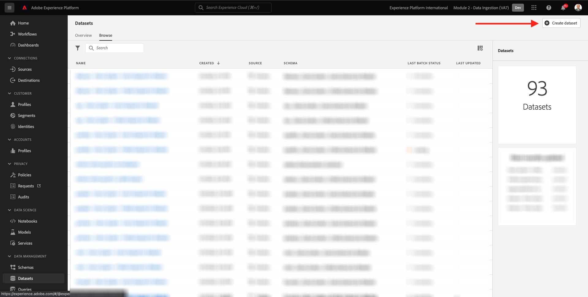
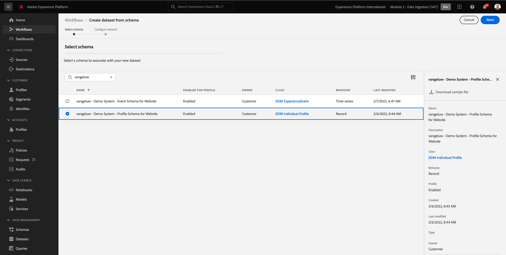
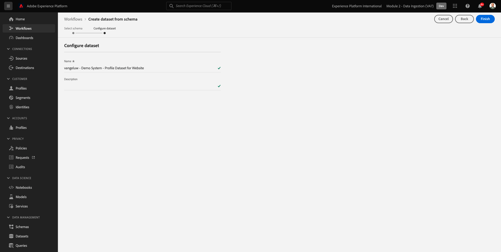
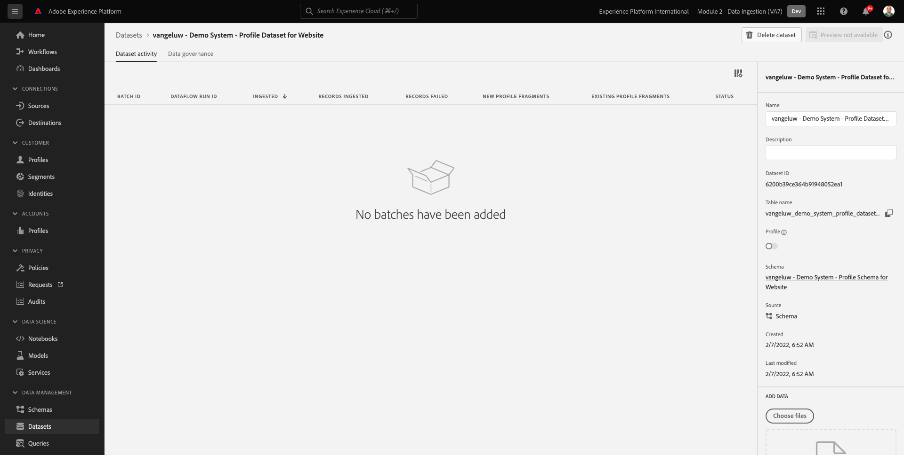

# 2.3設定資料集

在本練習中，您將設定所需的資料集，以擷取和儲存設定檔資訊和客戶行為。 您在此中建立的每個資料集，都會使用您在上一步驟建立的其中一個結構。

## Story

定義問題的答案後 **該客戶是誰？** 和 **此客戶有何功能？** 看起來應該是這樣，您現在需要建立使用該資訊的貯體，以接收及驗證已傳送至Adobe Experience Platform的資料。

## 2.3.1 — 建立資料集

您現在需要建立2個資料集：

- 1個資料集，用於擷取回答 **該客戶是誰？**  — 問題。
- 1個資料集，用於擷取回答 **此客戶有何功能？**  — 問題。

前往此URL登入Adobe Experience Platform: [https://experience.adobe.com/platform](https://experience.adobe.com/platform).

登入後，您會登陸Adobe Experience Platform首頁。

繼續之前，您需要選取 **[!UICONTROL 沙箱]**. 要選取的沙箱已命名 ``--module2sandbox--``. 您可以按一下文字 **[!UICONTROL 生產產品]** 在螢幕上方的藍線。 選取適當的 [!UICONTROL 沙箱]，您會看到畫面變更，現在您已進入專屬 [!UICONTROL 沙箱].

在Adobe Experience Platform中，按一下 **[!UICONTROL 資料集]** 在畫面左側的功能表中。  然後您會看到：

先建立資料集來擷取網站註冊資訊。

您應建立新資料集。 若要建立新資料集，請按一下按鈕 **[!UICONTROL +建立資料集]**.

按一下 **[!UICONTROL +建立資料集]** 按鈕，您會看到下列畫面。

您必須從上一步定義的結構中定義資料集。 按一下 **[!UICONTROL 從結構建立資料集]**  — 選項。

在下一個畫面中，您必須選取您在1中建立的架構， `--demoProfileLdap-- - Demo System - Profile Schema for Website`.

選取架構後，按一下 **[!UICONTROL 下一個]** 繼續。

為資料集命名。

以下是資料集的名稱：

`--demoProfileLdap-- - Demo System - Profile Dataset for Website`

例如，對於ldap **[!UICONTROL 萬熱盧]**，此名稱應為結構名稱：

**[!UICONTROL vangeluw — 示範系統 — 網站設定檔資料集]**

這應該會給你這樣的東西：

按一下 **[!UICONTROL 完成]** 完成資料集設定。

您現在會看到：

返回 [!UICONTROL 資料集] 概述。 您現在可以在概述中看到您建立的資料集快顯視窗。

接下來，您將設定第二個資料集來擷取網站互動。

您應建立新資料集。 若要建立新資料集，請按一下按鈕 **[!UICONTROL +建立資料集]**.

按一下 **[!UICONTROL +建立資料集]** 按鈕，您會看到下列畫面。

您必須從上一步定義的結構中定義資料集。 按一下 **[!UICONTROL 從結構建立資料集]**  — 選項。

在下一個畫面中，您必須選取您在2.2中建立的架構， `--demoProfileLdap-- - Demo System - Event Schema for Website`.

選取架構後，按一下 **[!UICONTROL 下一個]** 繼續。

為資料集命名。

以資料集的名稱形式，我們會使用：

`--demoProfileLdap-- - Demo System - Event Dataset for Website`

例如，對於ldap **[!UICONTROL 萬熱盧]**，此名稱應為結構名稱：

**[!UICONTROL vangeluw — 示範系統 — 網站事件資料集]**

這應該會給你這樣的東西：

按一下 **[!UICONTROL 完成]** 完成資料集設定。

然後您會看到：

返回 [!UICONTROL 資料集] 概述畫面。

您現在必須啟用資料集，才能加入Adobe Experience Platform的即時客戶個人檔案。

開啟資料集 `--demoProfileLdap--`  — 示範系統 — 按一下網站的設定檔資料集。

找出 [!UICONTROL 設定檔] 切換畫面右側的圖示。

按一下 [!UICONTROL 設定檔] 切換為啟用此資料集 [!UICONTROL 設定檔].

按一下 **[!UICONTROL 啟用]**.

您的資料集現在已啟用 [!UICONTROL 設定檔].

返回資料集概觀，開啟資料集 `--demoProfileLdap-- - Demo System - Event Dataset` ，按一下網站。

找出 [!UICONTROL 設定檔] 切換畫面右側的圖示。

按一下 [!UICONTROL 設定檔] 切換為啟用 [!UICONTROL 設定檔].

按一下 **[!UICONTROL 啟用]**.

您的資料集現在已啟用 [!UICONTROL 設定檔].

下一步： [2.4從離線來源擷取資料](./ex4.md)

[返回模組2](./data-ingestion.md)

[返回所有模組](../../overview.md)
