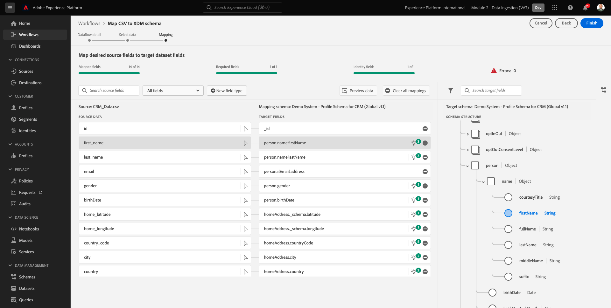

# 2.4從離線來源擷取資料

在本練習中，目標是將外部資料（例如Platform中的CRM資料）上線。

## 學習目標

- 了解如何產生測試資料
- 了解如何內嵌CSV
- 了解如何使用網頁UI透過工作流程擷取資料
- 了解Experience Platform的資料控管功能

## 資源

- 模仿UI: [https://www.mockaroo.com/](https://www.mockaroo.com/)
- Experience PlatformUI: [https://experience.adobe.com/platform/](https://experience.adobe.com/platform/)

## 工作

- 建立含有示範日期的CSV檔案。 利用可用的工作流程，在Adobe Experience Platform中內嵌CSV檔案。
- 了解Adobe Experience Platform中的資料控管選項

## 2.4.1透過資料產生器工具建立CRM資料集

為此，您需要1000行CRM資料範例。

開啟Mockaroo範本，前往 [https://www.mockaroo.com/12674210](https://www.mockaroo.com/12674210).

在範本上，您會注意到下列欄位：

- id
- first_name
- last_name
- 電子郵件
- 性別
- birthDate
- home_latitude
- home_longitude
- country_code
- city
- 國家

所有這些欄位都已定義為產生與Platform相容的資料。

若要產生CSV檔案，請按一下 **[!UICONTROL 下載資料]** 按鈕，即可提供包含1000行示範資料的CSV檔案。

在Microsoft Excel中開啟CSV檔案，以視覺化其內容。

在您的CSV檔案準備就緒後，您可以繼續對應XDM。

### 2.4.2驗證Adobe Experience Platform中的CRM入門資料集

開啟 [Adobe Experience Platform](https://experience.adobe.com/platform) 然後 **[!UICONTROL 資料集]**.

繼續之前，您需要選取 **[!UICONTROL 沙箱]**. 要選取的沙箱已命名 ``--module2sandbox--``. 您可以按一下文字 **[!UICONTROL 生產產品]** 在螢幕上方的藍線。 選取適當的 [!UICONTROL 沙箱]，您會看到畫面變更，現在您已進入專屬 [!UICONTROL 沙箱].

在Adobe Experience Platform中，按一下 **[!UICONTROL 資料集]** 在畫面左側的功能表中。

您將根據這項啟用使用共用資料集。 共用資料集已建立且稱為 **[!UICONTROL 示範系統 — CRM的設定檔資料集（全域v1.1）]**.

開啟資料集 **[!UICONTROL 示範系統 — CRM的設定檔資料集（全域v1.1）]**.

在概述畫面上，您可以看到3個主要資訊片段。

首先， [!UICONTROL 資料集活動] 控制面板會顯示資料集中的CRM記錄總數，以及擷取的批次和狀態

其次，向下捲動頁面，即可檢查擷取批次資料的時間、已上線的記錄數，以及批次是否已成功上線。 此 **[!UICONTROL 批次ID]** 是特定批次作業的識別碼，且 **[!UICONTROL 批次ID]** 很重要，因為它可用於疑難排解特定批次未成功上線的原因。

最後， [!UICONTROL 資料集資訊] 標籤顯示重要資訊，如 [!UICONTROL 資料集ID] （同樣地，從疑難排解的角度來看，也很重要）、資料集的名稱，以及資料集是否已啟用「設定檔」。

此處最重要的設定是資料集與結構之間的連結。 結構會定義可內嵌的資料，以及該資料的外觀。

在此案例中，我們使用 **[!UICONTROL 示範系統 — CRM的設定檔結構（全域v1.1）]**，會對應至 **[!UICONTROL 設定檔]** 和已實作擴充功能，也稱為欄位群組。

按一下結構名稱后，系統會將您導向 [!UICONTROL 結構] 概覽是否可查看已為此架構激活的所有欄位。

每個架構都需要定義一個自定義的主描述符。 就CRM資料集而言，結構已定義欄位 **[!UICONTROL crmId]** 應為主要識別碼。 如果要建立結構，並將其連結至 [!UICONTROL 即時客戶個人檔案]，您需要定義自訂 [!UICONTROL 欄位組] 指主描述符。

在上面的螢幕截圖中，您可以看到描述符位於 `--aepTenantId--.identification.core.crmId`，會設為 [!UICONTROL 主要識別碼]，連結至 [!UICONTROL 命名空間] of **[!UICONTROL 示範系統 — CRMID]**.

應在 [!UICONTROL 即時客戶個人檔案] 應該有 [!UICONTROL 主要識別碼]. 此 [!UICONTROL 主要識別碼] 是該資料集中客戶的品牌識別碼使用者。 若是CRM資料集，則可能是電子郵件地址或CRM ID，若是客服中心資料集，則可能是客戶的行動電話號碼。

最佳作法是為每個資料集建立個別的特定結構，並為每個資料集設定描述元，以符合品牌目前使用的解決方案的運作方式。

### 2.4.3使用工作流程將CSV檔案對應至XDM結構

其目標是將CRM資料上傳至Platform。 Platform中擷取的所有資料都應對應至特定XDM結構。 您目前擁有的是CSV資料集，一側有1000行，另一側連結至結構的資料集。 若要將該CSV檔案載入該資料集，必須進行對應。 為方便進行此對應練習，我們 **[!UICONTROL 工作流程]** 於Adobe Experience Platform提供。

此 [!UICONTROL 工作流程] 我們會用的，是 [!UICONTROL 工作流程] 已命名 **[!UICONTROL 將CSV對應至XDM結構]** 在 [!UICONTROL 資料擷取] 功能表。

按一下 **[!UICONTROL 將CSV對應至XDM結構]** 按鈕。 按一下 **[!UICONTROL Launch]** 來啟動程式。

在下一個畫面中，您需要選取資料集，以擷取檔案。 您可以選擇選取現有的資料集或建立新資料集。 在本練習中，我們將重複使用現有的一個：請選擇 **[!UICONTROL 示範系統 — CRM的設定檔資料集（全域v1.1）]** 如下所示，並將其他設定保留為預設。

按一下 **[!UICONTROL 下一個]** 來執行下一步。

拖放您的CSV檔案或按一下 **[!UICONTROL 瀏覽]** 並在電腦上導覽至案頭，然後選取CSV檔案。

選取您的CSV檔案後，檔案會立即上傳，幾秒內就會看到檔案的預覽。

按一下 **[!UICONTROL 下一個]** 來執行下一步。 完整處理檔案時，可能需要幾秒的時間。

您現在需要將CSV欄標題與 **[!UICONTROL 示範系統 — CRM的設定檔資料集]**.

Adobe Experience Platform已經向你提出了一些建議，試圖把 [!UICONTROL 源屬性] 和 [!UICONTROL 目標結構欄位].

若 [!UICONTROL 架構對應],Adobe Experience Platform已嘗試將欄位連結在一起。 然而，並非所有的製圖建議都是正確的。 你現在需要 **接受目標欄位** 逐一。

#### birthDate

源架構欄位 **birthDate** 應連結至目標欄位 **person.birthDate**.

#### city

源架構欄位 **city** 應連結至目標欄位 **homeAddress.city**.

#### 國家

源架構欄位 **國家** 應連結至目標欄位 **homeAddress.country**.

#### country_code

源架構欄位 **country_code** 應連結至目標欄位 **homeAddress.countryCode**.

#### 電子郵件

源架構欄位 **電子郵件** 應連結至目標欄位 **personalEmail.address**.

#### crmid

應將「源架構」欄位** crmid**連結到目標欄位 **`--aepTenantId--`.identification.core.crmId**.

#### first_name

源架構欄位 **first_name** 應連結至目標欄位 **person.name.firstName**.

#### 性別

源架構欄位 **性別** 應連結至目標欄位 **person.gender**.

#### home_latitude

源架構欄位 **home_latitude** 應連結至目標欄位 **homeAddress。_schema.latitude**.

#### home_longitude

源架構欄位 **home_longitude** 應連結至目標欄位 **homeAddress。_schema.longitude**.

#### id

源架構欄位 **id** 應連結至目標欄位 **_id**.

#### last_name

源架構欄位 **last_name** 應連結至目標欄位 **person.name.lastName**.

您現在應該有以下項目：

按一下 **[!UICONTROL 完成]** 按鈕以完成工作流程。

按一下 **[!UICONTROL 完成]**，您就會看到 **資料流** 概觀，幾分鐘後，您就可以重新整理畫面，查看工作流程是否成功完成。 按一下 **目標資料集名稱**.

接著，您就會看到處理擷取的資料集。

在資料集上，您會看到 [!UICONTROL 批次ID] 剛才已擷取，已擷取1000筆記錄，且狀態為 **[!UICONTROL 成功]**.

按一下 **[!UICONTROL 預覽資料集]** — 按鈕，快速檢視資料集的小範例，以確保載入的資料正確無誤。

載入資料後，您就可以為資料集定義正確的資料控管方法。

### 2.5.4將資料控管新增至資料集

現在您已內嵌客戶資料，您必須確定此資料集已妥善管理，以利使用和匯出控制。 按一下 **[!UICONTROL 資料控管]** 標籤，並請留意您可以設定三種限制類型：合約、身分和敏感資料。

您可以透過此連結上的原則架構，找到有關不同標籤的詳細資訊，以及日後如何強制執行這些標籤： [https://www.adobe.io/apis/experienceplatform/home/dule/duleservices.html](https://www.adobe.io/apis/experienceplatform/home/dule/duleservices.html)

讓我們限制整個資料集的身分資料。 將滑鼠指標暫留在資料集名稱上，然後按一下「鉛筆」圖示即可編輯設定。

前往 **[!UICONTROL 身分資料]** 你會看到 **[!UICONTROL I2]** 核取選項 — 這會假設此資料集中的所有資訊至少可間接識別給使用者。

按一下 **[!UICONTROL 儲存變更]** 並注意 **[!UICONTROL I2]** 現在已為資料集中的所有資料欄位設定。

您也可以為個別資料欄位設定這些標幟，例如 **[!UICONTROL firstName]** 欄位可能分類為 **[!UICONTROL I1]** 級別，以取得可直接識別的資訊。

選取欄位 **[!UICONTROL firstName]** 勾選核取方塊並按一下 **[!UICONTROL 編輯控管標籤]** 在螢幕的右上角。

前往 **[!UICONTROL 身分資料]** 你會看到 **[!UICONTROL I2]** 選項（繼承自資料集）。 欄位firstName也具有欄位專屬的設定，並設為 **[!UICONTROL I1 — 可直接識別的資料]**.

透過此功能，您現在已成功在Adobe Experience Platform中內嵌及分類CRM資料。

下一步： [2.5資料登陸區](./ex5.md)

[返回模組2](./data-ingestion.md)

[返回所有模組](../../overview.md)
