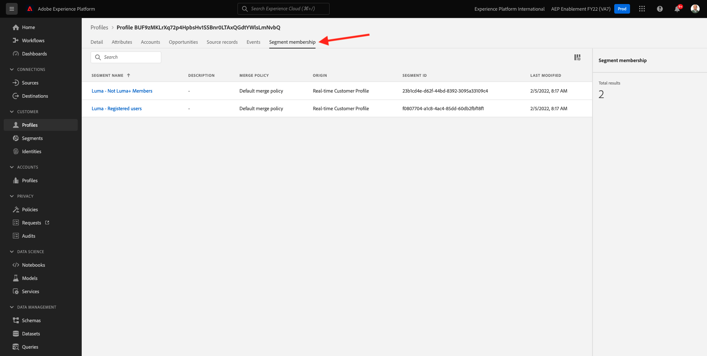

# 3.2將您自己的即時客戶個人檔案視覺化 — UI

在本練習中，您將登入Adobe Experience Platform，並在UI中檢視您自己的即時客戶個人檔案。

## Story

在即時客戶設定檔中，所有設定檔資料會與事件資料以及現有區段成員資格一起顯示。 顯示的資料可以來自任何位置、Adobe應用程式和外部解決方案。 這是Adobe Experience Platform最強大的觀點，也是真正的體驗系統。

## 3.2.1使用Adobe Experience Platform中的「客戶個人檔案檢視」

前往 [Adobe Experience Platform](https://experience.adobe.com/platform). 登入後，您會登陸Adobe Experience Platform首頁。

繼續之前，您需要選取 **沙箱**. 要選取的沙箱已命名 ``--aepSandboxId--``. 您可以按一下文字 **[!UICONTROL 生產產品]** 在螢幕上方的藍線。 選取適當的 [!UICONTROL 沙箱]，您會看到畫面變更，現在您已進入專屬 [!UICONTROL 沙箱].

在左側功能表中，前往 **設定檔** 和 **瀏覽**.

在網站的「設定檔檢視器」面板上，您可以找到多個身分。 每個身分都會連結至命名空間。

在「設定檔檢視器」面板上，您可以看到ID和命名空間的下列組合：

| 身分 | 命名空間 |
|:-------------:| :---------------:|
| Experience Cloud ID (ECID) | 12507560687324495704459439363261812234 |
| 電子郵件ID | woutervangeluwe+06022022-01@gmail.com |
| 行動號碼ID | +32473622044+06022022-01 |

有了Adobe Experience Platform，所有ID都同樣重要。 過去，ECID是Adobe內容中最重要的ID，而所有其他ID則以階層關係連結至ECID。 有了Adobe Experience Platform，情況就不再如此，每個ID都可視為主要識別碼。

主要識別碼通常取決於內容。 如果你問問你的呼叫中心， **最重要的ID為何？** 他們很可能會回答， **電話號碼！** 但如果你問你的CRM團隊，他們會回答， **電子郵件地址！**  Adobe Experience Platform了解這種複雜性，並為您管理。 每個應用程式(無論是Adobe應用程式或非Adobe應用程式)都會參照其視為主要的ID，與Adobe Experience Platform通話。 它就是有效的。

針對欄位 **身分命名空間**，選取 **電子郵件** 和 **身分值** 輸入您在上一個練習中用來註冊的電子郵件地址。 按一下 **檢視**. 然後，您會在清單中看到您的個人資料。 按一下 **設定檔ID** 來開啟您的個人資料。

您現在會看到以下幾個重要項目的概述 **設定檔屬性** 客戶個人檔案。

如果您想要查看設定檔的所有可用設定檔屬性，請前往 **屬性**.

前往 **事件**，您可以在其中看到連結至您設定檔之每個體驗事件的項目。

最後，移至功能表選項 **區段成員資格**. 您現在會看到所有符合此設定檔資格的區段。

現在您已了解如何運用Adobe Experience Platform的使用者介面來檢視任何客戶的即時設定檔，接下來我們再透過API利用Postman和Adobe I/O來查詢Adobe Experience Platform的API，做同樣的事情。

下一步： [3.3將您自己的即時客戶個人檔案視覺化 — API](./ex3.md)

[返回模組3](./real-time-customer-profile.md)

[返回所有模組](../../overview.md)
