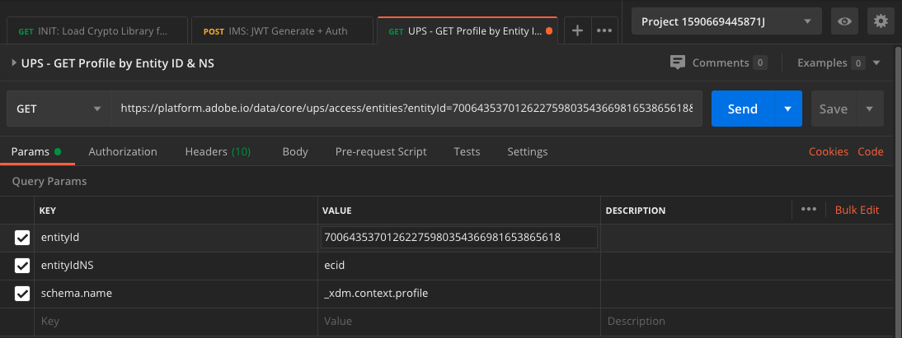

# 3.3將您自己的即時客戶個人檔案視覺化 — API

在本練習中，您將使用Postman和Adobe I/O來查詢Adobe Experience Platform的API，以檢視您自己的即時客戶設定檔。

## Story

在即時客戶設定檔中，所有設定檔資料會與事件資料以及現有區段成員資格一起顯示。 顯示的資料可以來自任何位置、Adobe應用程式和外部解決方案。 這是Adobe Experience Platform最強大的觀點，這是有記錄的體驗系統。

即時Adobe設定檔可供所有客戶應用程式使用，也可供呼叫中心或店內客戶應用程式等外部解決方案使用。 方法是將這些外部解決方案連結至Adobe Experience Platform的API。

## 3.3.1您的識別碼

在網站的「設定檔檢視器」面板上，您可以找到多個身分。 每個身分都會連結至命名空間。


在X光片上，我們可以看到4個不同的ID和命名空間組合：

| 身分 | 命名空間 |
|:-------------:| :---------------:|
| Experience Cloud ID (ECID) | 12507560687324495704459439363261812234 |
| 電子郵件ID | woutervangeluwe+06022022-01@gmail.com |
| 行動號碼ID | +32473622044+06022022-01 |

請記住這些識別碼，以備後續步驟使用。

請考慮這些ID，前往Postman。

## 3.3.2設定您的Adobe I/O專案

在本練習中，您將會大量使用Adobe I/O來查詢Platform的API。 請按照以下步驟設定Adobe I/O。

前往 [https://developer.adobe.com/console/home](https://developer.adobe.com/console/home)


請務必在畫面右上角選取正確的Adobe Experience Platform例項。 您的例項為 `--envName--`.


按一下 **建立新專案**.

 或


選擇 **+新增至專案** 選取 **API**.


然後您會看到：


按一下 **Adobe Experience Platform** 表徵圖。


按一下 **Experience PlatformAPI**.


按&#x200B;**「下一步」**。


您現在可以選擇讓Adobe I/O產生您的安全金鑰組，或上傳現有的金鑰組。

選擇 **選項1 — 產生金鑰組**.


按一下 **產生鍵對**.


30秒後，你就會看見一個旋轉器。


之後您會看到這個訊息，您產生的鑰匙組將會以zip檔案的形式下載： **config.zip**.

將檔案解壓縮 **config.zip** 在案頭上，您會看到其中包含2個檔案：


- **certificate_pub.crt** 是您的公開金鑰憑證。 從安全性角度來看，這是可自由用來設定與線上應用程式整合的憑證。
- **private.key** 是您的私密金鑰。 這永遠不應該和任何人分享。 私密金鑰是您用來驗證API實作的，且應為機密。 如果您與任何人共用您的私密金鑰，對方將可存取您的實作，並濫用API將惡意資料內嵌至Platform中，以及擷取位於Platform中的所有資料。


請務必儲存 **config.zip** 檔案，因為您後續步驟及日後存取Adobe I/O和Adobe Experience Platform API時，都需要此功能。

按&#x200B;**「下一步」**。


您現在必須選取 **產品設定檔** 以進行整合。

選取所需的產品設定檔。

**菲**:在您的Adobe Experience Platform例項中，產品設定檔會有不同的命名。 您至少需要選取一個具有適當存取權限的產品設定檔，這些權限會設定在Adobe Admin Console中。


按一下 **儲存已設定的API**.


你會看見一個旋轉器。


接下來，您將看到您的整合。


按一下 **下載Postman** 按鈕，然後按一下 **服務帳戶(JWT)** 若要下載Postman環境（等到環境下載完成，可能需要幾秒鐘的時間）。


向下捲動，直到您看到 **服務帳戶(JWT)**，您可在此找到所有用來設定與Adobe Experience Platform整合的整合詳細資訊。


您的IO項目當前具有通用名稱。 您必須為整合指定好記的名稱。 按一下 **項目1** （或類似名稱）如所示


按一下 **編輯專案**.


輸入整合的名稱和說明。 作為命名慣例，我們將 `AEP API --demoProfileLdap--`. 將ldap替換為ldap。
例如，如果您的ldap為vangeluw，則整合的名稱和說明會變成AEP API vangeluw。

輸入 `AEP API --demoProfileLdap--` 作為 **專案標題**. 按一下「**儲存**」。


您的Adobe I/O整合現已完成。


## 3.3.3Postman驗證至Adobe I/O

前往 [https://www.getpostman.com/](https://www.getpostman.com/).

按一下 **開始使用**.


接下來，下載並安裝Postman。


安裝Postman後，啟動應用程式。

在Postman中有2個概念：環境和集合。

- 「環境」包含所有或多或少一致的環境變數。 在「環境」中，您會找到平台環境的IMSOrg等項目，以及私密金鑰等安全性認證。 在上一個練習的Adobe I/O設定期間下載的環境檔案名稱如下： **service.postman_environment.json**.

- 集合包含許多您可使用的API請求。 我們將使用2個集合
   - 1個AdobeI/0驗證的集合
   - 1收集本模組中的練習
   - 1個集合，供Real-Time CDP模組中的練習，用於目標編寫

請下載該檔案 [postman.zip](../../assets/postman/postman_profile.zip) 到本地案頭。

在此 **postman.zip** 檔案中，您會找到下列檔案：

- `_Adobe I-O - Token.postman_collection.json`
- `_Adobe Experience Platform Enablement.postman_collection.json`
- `Destination_Authoring_API.json`

將 **postman.zip** 將這3個檔案連同從Adobe I/O下載的Postman環境，儲存在案頭上的資料夾中。該資料夾中需要包含以下4個檔案：


回Postman。 按一下&#x200B;**「匯入」**。


按一下 **上傳檔案**.


導覽至案頭上您擷取4個下載檔案的資料夾。 同時選取這4個檔案，然後按一下 **開啟**.


點按後 **開啟**,Postman會顯示您要匯入的環境和集合概覽。 按一下&#x200B;**「匯入」**。


現在，Postman提供您開始透過API與Adobe Experience Platform互動所需的一切。

首先，要確保你的身份正確。 若要驗證，您需要請求存取權杖。

在執行任何請求之前，請確定已選取正確的環境。 您可以驗證右上角的「環境」下拉式清單，以檢查目前選取的環境。

所選環境的名稱應與以下名稱類似：


按一下 **眼** 圖示，然後按一下 **編輯** 更新環境檔案中的私密金鑰。


你會看到這個。 除欄位外，所有欄位皆已預先填入 **PRIVATE_KEY**.


建立Adobe I/O專案時，會產生私密金鑰。 下載為zip檔案，名為 **config.zip**. 將zip檔案解壓縮至您的案頭。


開啟資料夾 **設定** 並開啟檔案 **private.key** 選擇的文字編輯器。


然後，您會看到類似這樣的內容，將所有文本複製到剪貼簿。


返回Postman，並將私密金鑰貼到變數旁的欄位中 **PRIVATE_KEY**，針對兩欄 **初始值** 和 **目前值**. 按一下「**儲存**」。


您的Postman環境和集合現在已設定且運作中。 您現在可以從Postman驗證至Adobe I/O。

為此，您需要載入一個外部庫，負責通信的加密和解密。 若要載入此程式庫，您必須以名稱執行要求 **INIT:載入RS256的加密庫**. 在 **_Adobe I/O — 代號集合** 你會看到它顯示在螢幕的中央。


按一下藍色 **傳送** 按鈕。 幾秒後，您應該會在 **主體** Postman區段：


現在載入加密程式庫後，我們便可以驗證以Adobe I/O。

在 **\_Adobe I/O — 代號集合**，請選取名稱為的請求 **IMS:JWT產生+驗證**. 同樣地，畫面中間會顯示請求詳細資訊。


按一下藍色 **傳送** 按鈕。 幾秒後，您應該會在 **主體** Postman區段：


如果您的設定成功，您應該會看到包含下列資訊的類似回應：

| 代碼 | 值 |
|:-------------:| :---------------:| 
| token_type | **承載者** |
| access_token | **eyJ4NXUiOiJpbXNfbmEx..QT7mqZkumN1tdsPEioOEl4087Dg** |
| expires_in | **86399973** |

Adobe I/O給你了 **承載者**-token，具有特定值（這個很長的access_token）和過期窗口。

我們收到的代號現在有效24小時。 這表示24小時後，如果您想使用Postman驗證以Adobe I/O，則必須再次執行此請求以產生新代號。

## 3.3.4即時客戶設定檔API，結構：設定檔

現在，您可以開始將您的第一個要求傳送至Platform的即時客戶個人檔案API。

在Postman中，找出集合 **啟用Adobe Experience Platform(_A)**.


在 **1. 統一配置檔案服務**，請選取名稱為的第一個請求 **UPS — 按實體ID和NS列出的GET配置檔案**.


對於此要求，有三個必要變數：

| 代碼 | 值 | 定義 |
|:-------------:| :---------------:| :---------------:| 
| entityId | **id** | 特定客戶ID |
| entityIdNS | **namespace** | 適用於ID的特定命名空間 |
| schema.name | **_xdm.context.profile** | 要接收資訊的特定架構 |

因此，若您想要求Adobe Experience Platform的API將您自己ECID的所有設定檔資訊還給您，您需依下列方式設定請求：

| 代碼 | 值 |
|:-------------:| :---------------:| 
| entityId | **yourECID** |
| entityIdNS | **ecid** |
| schema.name | **_xdm.context.profile** |



您也應驗證 **標題**  — 請求的欄位。 前往 **標題**. 然後您會看到：


| 代碼 | 值 |
| ----------- | ----------- |
| x-sandbox-name | `--aepSandboxId--` |

>[!NOTE]
>
>您必須指定您所使用Adobe Experience Platform沙箱的名稱。 您的x-sandbox-name應為 `--aepSandboxId--`.

按一下 **傳送** 將您的要求傳送至Platform。

您應會立即收到Platform的回應，並顯示如下所示：


以下是Platform的完整回應：

```javascript
{
    "A28iM3aJBJRbEQpOnUh5HOM9": {
        "entityId": "A28iM3aJBJRbEQpOnUh5HOM9",
        "mergePolicy": {
            "id": "e632ccb8-882a-4b5e-8375-96a1ba3df1aa"
        },
        "sources": [
            "61fe23c5be4b5f19485dc379",
            "profile-streaming-segment",
            "61fe23cfa07c1219489b3ba4"
        ],
        "tags": [
            "1644130566774:1542:232:va7",
            "0a1e9dd4-940a-46ec-9114-7e371cf5c4d0",
            "aep_ups_partitioned_profile_cdc_low_lag_sla_0:106:1090888313",
            "a6fed09e-2c56-403e-8692-4e99e4779dfa:IRL1",
            "1644419616318:2989:31:va7",
            "aep_ups_profile_change_event_prod_va7:71:7946633524-8361f22c-c09e-4364-b24b-b57435c4d14f"
        ],
        "identityGraph": [
            "BUF9zMKLrXq72p4HpbsHv1SSBnr0LTAxQGdtYWlsLmNvbQ",
            "GkicrkFjgmCjUg",
            "GtCbrkFjgkSOFg",
            "A2-AP9zOsakzNTe9Rqwf7Wse",
            "BkFuK4QcJpSPByuSBnr0LTAx",
            "A28jSB484ziuECF3fEoXmFlF",
            "A28iM3aJBJRbEQpOnUh5HOM9"
        ],
        "entity": {
            "_experienceplatform": {
                "individualCharacteristics": {},
                "loyaltyDetails": {
                    "level": "Basic",
                    "points": 0
                },
                "identification": {
                    "core": {
                        "phoneNumber": "+32473622044+06022022-01",
                        "email": "woutervangeluwe+06022022-01@gmail.com",
                        "loyaltyId": "5415776",
                        "ecid": "12019606991718502754997192487345616673",
                        "crmId": "1478212"
                    }
                }
            },
            "personalEmail": {
                "address": "woutervangeluwe+06022022-01@gmail.com"
            },
            "_repo": {
                "createDate": "2022-02-06T06:56:06.424Z"
            },
            "testProfile": true,
            "homeAddress": {
                "postalCode": "1831",
                "city": "Diegem",
                "street1": "Culliganlaan 2F"
            },
            "mobilePhone": {
                "number": "+32473622044+06022022-01"
            },
            "segmentMembership": {
                "ups": {
                    "bc999ded-b6d7-40d4-87a7-d3a280b950e3": {
                        "lastQualificationTime": "2022-02-09T20:38:33Z",
                        "status": "exited"
                    },
                    "23b1cd4e-d62f-44bd-8392-3095a33109c4": {
                        "lastQualificationTime": "2022-02-09T20:38:33Z",
                        "status": "exited"
                    },
                    "f0807704-a1c8-4ac4-85dd-60db2fbf18f1": {
                        "lastQualificationTime": "2022-02-09T20:38:33Z",
                        "status": "existing"
                    }
                }
            },
            "person": {
                "name": {
                    "lastName": "Van Geluwe",
                    "firstName": "Wouter"
                },
                "gender": "female",
                "birthDate": "1982-07-08"
            },
            "userActivityRegions": {
                "IRL1": {
                    "captureTimestamp": "2022-02-09T15:21:11Z"
                }
            },
            "identityMap": {
                "email": [
                    {
                        "id": "woutervangeluwe+06022022-01@gmail.com"
                    }
                ],
                "crmid": [
                    {
                        "id": "1478212"
                    }
                ],
                "ecid": [
                    {
                        "id": "12507560687324495704459439363261812234"
                    },
                    {
                        "id": "12019606991718502754997192487345616673"
                    },
                    {
                        "id": "38335942889672702722192106363935964471"
                    }
                ],
                "phone": [
                    {
                        "id": "+32473622044+06022022-01"
                    }
                ],
                "loyaltyid": [
                    {
                        "id": "5415776"
                    }
                ]
            }
        },
        "lastModifiedAt": "2022-02-09T20:38:36Z"
    }
}
```

這是目前此ECID在Platform中可用的所有設定檔資料。

您不需要使用ECID來從Platform的即時客戶個人檔案要求個人資料，可以在任何命名空間中使用任何ID來要求此資料。

讓我們回到Postman，假設我們是客服中心，然後傳送要求給Platform，指定的命名空間 **電話** 和你的手機號碼。

因此，如果您想要要求Platform的API將特定電話的所有設定檔資訊傳回，則需依下列方式設定請求：

| 代碼 | 值 |
|:-------------:| :---------------:| 
| entityId | **您的電話號碼** |
| entityIdNS | **phone** （電話更換ecid） |
| schema.name | **_xdm.context.profile** |

如果你的電話號碼包含特殊符號，如 **+**，您必須選取您的完整電話號碼，按一下滑鼠右鍵，然後按一下 **EncodeURIComponent**.


然後，您會擁有此功能：


您也應驗證 **標題**  — 請求的欄位。 前往 **標題**. 然後您會看到：


| 代碼 | 值 |
| ----------- | ----------- |
| x-sandbox-name | `--aepSandboxId--` |

>[!NOTE]
>
>您必須指定您所使用Adobe Experience Platform沙箱的名稱。 您的x-sandbox-name應為 `--aepSandboxId--`.

按一下藍色 **傳送** 按鈕並驗證回應。


讓我們針對您的電子郵件地址執行相同的動作，方法是指定命名空間 **電子郵件** 和你的電子郵件地址。

因此，如果您想要要求Platform的API將特定電子郵件地址的所有設定檔資訊傳回，則需依下列方式設定請求：

| 代碼 | 值 |
|:-------------:| :---------------:| 
| entityId | **youremail** |
| entityIdNS | **電子郵件** （用電子郵件取代電話） |
| schema.name | **_xdm.context.profile** |

如果您的電子郵件地址包含特殊符號，例如 **+**，您必須選取完整的電子郵件地址，按一下滑鼠右鍵並按一下 **EncodeURIComponent**.


然後，您會擁有此功能：


您也應驗證 **標題**  — 請求的欄位。 前往 **標題**. 然後您會看到：


| 代碼 | 值 |
| ----------- | ----------- |
| x-sandbox-name | `--aepSandboxId--` |

>[!NOTE]
>
>您必須指定您所使用Adobe Experience Platform沙箱的名稱。 您的x-sandbox-name應為 `--aepSandboxId--`.

按一下藍色 **傳送** 按鈕並驗證回應。


這是為品牌提供的一種非常重要的靈活性。 這表示任何環境都可使用自己的ID和命名空間，將要求傳送至Platform，不必了解多個命名空間和ID的複雜性。

例如：

- 客服中心會使用命名空間向Platform要求資料 **phone**
- 忠誠度系統會使用命名空間向Platform要求資料 **電子郵件**
- 線上應用程式可能會使用命名空間 **ecid**

客服中心不一定知道忠誠系統中使用的識別碼類型，而忠誠系統也不一定知道線上應用程式使用的識別碼類型。 每個系統都可以使用他們擁有和理解的資訊，在他們需要時獲得他們需要的資訊。

## 3.3.5即時客戶設定檔API，結構：設定檔與ExperienceEvent

成功查詢Platform的API以取得設定檔資料後，現在來對ExperienceEvent資料執行相同操作。

在Postman中，找出集合 **啟用Adobe Experience Platform(_A)**.


在 **1. 統一配置檔案服務**，請選取名稱為的第二個請求 **UPS -GET配置檔案和EE（按實體ID和NS）**.


對於此要求，有四個必要變數：

| 代碼 | 值 | 定義 |
|:-------------:| :---------------:|  :---------------:| 
| schema.name | **_xdm.context.experienceevent** | 要接收資訊的特定架構。 在此情況下，我們會尋找對應至ExperienceEvent結構的資料。 |
| relatedSchema.name | **_xdm.context.profile** | 當我們尋找已對應至ExperienceEvent結構的資料時，需要指定要接收該資料的身分。 有權訪問標識的架構是配置式架構，因此，此處的relatedSchema是配置式架構。 |
| relatedEntityId | **id** | 特定客戶ID |
| relatedEntityIdNS | **命名空間** | 適用於ID的特定命名空間 |

因此，若您想要要求Platform的API將您自己ecid的所有設定檔資訊傳回，您需依下列方式設定請求：

| 代碼 | 值 |
|:-------------:| :---------------:| 
| schema.name | **_xdm.context.experienceevent** |
| relatedSchema.name | **_xdm.context.profile** |
| relatedEntityId | **yourECID** |
| relatedEntityIdNS | **ecid** |


您也應驗證 **標題**  — 請求的欄位。 前往 **標題**. 然後您會看到：


| 代碼 | 值 |
| ----------- | ----------- |
| x-sandbox-name | `--aepSandboxId--` |

>[!NOTE]
>
>您必須指定您所使用Adobe Experience Platform沙箱的名稱。 您的x-sandbox-name應為 `--aepSandboxId--`.

按一下 **傳送** 將您的要求傳送至Platform。

您應會立即收到Platform的回應，並顯示如下所示：


以下是Platform的完整回應。 在此範例中，有8個ExperienceEvents連結至此客戶的ECID。 請查看下方，了解要求上的不同變數，因為您在下方看到的，是您在先前練習中於Launch中設定的直接後果。

此外，當X光片面板顯示ExperienceEvent資訊時，會使用下列裝載來剖析和擷取產品名稱（在下列裝載中搜尋productName）和產品影像URL（在下列裝載中搜尋productImageUrl）等資訊。

```javascript
{
    "_page": {
        "orderby": "timestamp",
        "start": "d686ab8a-2d0c-4722-9ff5-bfc1020b0b55-0",
        "count": 31,
        "next": ""
    },
    "children": [
        {
            "relatedEntityId": "A28iM3aJBJRbEQpOnUh5HOM9",
            "entityId": "d686ab8a-2d0c-4722-9ff5-bfc1020b0b55-0",
            "timestamp": 1644127126596,
            "entity": {
                "environment": {
                    "ipV4": "213.118.129.117",
                    "type": "browser",
                    "browserDetails": {
                        "viewportHeight": 969,
                        "viewportWidth": 1920,
                        "userAgent": "Mozilla/5.0 (Macintosh; Intel Mac OS X 10_15_7) AppleWebKit/537.36 (KHTML, like Gecko) Chrome/98.0.4758.80 Safari/537.36"
                    }
                },
                "web": {
                    "webPageDetails": {
                        "pageViews": {
                            "value": 1
                        },
                        "name": "vangeluw-OCUC",
                        "URL": "https://builder.adobedemo.com/run/vangeluw-OCUC"
                    },
                    "webReferrer": {
                        "URL": "https://adobe.okta.com/"
                    }
                },
                "_experienceplatform": {
                    "interactionDetails": {
                        "core": {
                            "channel": "web"
                        }
                    },
                    "demoEnvironment": {
                        "brandName": "vangeluw-OCUC"
                    },
                    "identification": {
                        "core": {
                            "ecid": "12507560687324495704459439363261812234"
                        }
                    }
                },
                "implementationDetails": {
                    "name": "https://ns.adobe.com/experience/alloy/reactor",
                    "version": "2.8.0+2.9.0",
                    "environment": "browser"
                },
                "identityMap": {
                    "ECID": [
                        {
                            "id": "12507560687324495704459439363261812234",
                            "authenticatedState": "ambiguous",
                            "primary": true
                        }
                    ]
                },
                "eventType": "web.webpagedetails.pageViews",
                "_id": "d686ab8a-2d0c-4722-9ff5-bfc1020b0b55-0",
                "placeContext": {
                    "localTime": "2022-02-06T06:58:46.596+01:00",
                    "localTimezoneOffset": -60
                },
                "device": {
                    "screenOrientation": "landscape",
                    "screenWidth": 1920,
                    "screenHeight": 1080
                },
                "timestamp": "2022-02-06T05:58:46.596Z"
            },
            "lastModifiedAt": "2022-02-06T05:59:48Z"
        },
        {
            "relatedEntityId": "A28iM3aJBJRbEQpOnUh5HOM9",
            "entityId": "919a46bf-a591-4c32-9201-b72250d5f5d9-0",
            "timestamp": 1644127129876,
            "entity": {
                "environment": {
                    "ipV4": "213.118.129.117",
                    "type": "browser",
                    "browserDetails": {
                        "viewportHeight": 969,
                        "viewportWidth": 1920,
                        "userAgent": "Mozilla/5.0 (Macintosh; Intel Mac OS X 10_15_7) AppleWebKit/537.36 (KHTML, like Gecko) Chrome/98.0.4758.80 Safari/537.36"
                    }
                },
                "web": {
                    "webPageDetails": {
                        "pageViews": {
                            "value": 1
                        },
                        "name": "vangeluw-OCUC#",
                        "URL": "https://builder.adobedemo.com/run/vangeluw-OCUC#"
                    },
                    "webReferrer": {
                        "URL": "https://adobe.okta.com/"
                    }
                },
                "_experienceplatform": {
                    "interactionDetails": {
                        "core": {
                            "channel": "web"
                        }
                    },
                    "demoEnvironment": {
                        "brandName": "vangeluw-OCUC"
                    },
                    "identification": {
                        "core": {
                            "ecid": "12507560687324495704459439363261812234"
                        }
                    }
                },
                "implementationDetails": {
                    "name": "https://ns.adobe.com/experience/alloy/reactor",
                    "version": "2.8.0+2.9.0",
                    "environment": "browser"
                },
                "identityMap": {
                    "ECID": [
                        {
                            "id": "12507560687324495704459439363261812234",
                            "authenticatedState": "ambiguous",
                            "primary": true
                        }
                    ]
                },
                "eventType": "web.webpagedetails.pageViews",
                "_id": "919a46bf-a591-4c32-9201-b72250d5f5d9-0",
                "placeContext": {
                    "localTime": "2022-02-06T06:58:49.876+01:00",
                    "localTimezoneOffset": -60
                },
                "device": {
                    "screenOrientation": "landscape",
                    "screenWidth": 1920,
                    "screenHeight": 1080
                },
                "timestamp": "2022-02-06T05:58:49.876Z"
            },
            "lastModifiedAt": "2022-02-06T05:59:48Z"
        },
        {
            "relatedEntityId": "A28iM3aJBJRbEQpOnUh5HOM9",
            "entityId": "41a80489-00d4-446c-b456-8cb19c3f309a-0",
            "timestamp": 1644130597134,
            "entity": {
                "environment": {
                    "ipV4": "213.118.129.117",
                    "type": "browser",
                    "browserDetails": {
                        "viewportHeight": 1001,
                        "viewportWidth": 1920,
                        "userAgent": "Mozilla/5.0 (Macintosh; Intel Mac OS X 10_15_7) AppleWebKit/537.36 (KHTML, like Gecko) Chrome/98.0.4758.80 Safari/537.36"
                    }
                },
                "web": {
                    "webPageDetails": {
                        "pageViews": {
                            "value": 1
                        },
                        "name": "login",
                        "URL": "https://builder.adobedemo.com/run/vangeluw-OCUC/login"
                    },
                    "webReferrer": {
                        "URL": "https://builder.adobedemo.com/run/vangeluw-OCUC/login"
                    }
                },
                "_experienceplatform": {
                    "interactionDetails": {
                        "core": {
                            "channel": "web"
                        }
                    },
                    "demoEnvironment": {
                        "brandName": "vangeluw-OCUC"
                    },
                    "identification": {
                        "core": {
                            "ecid": "12507560687324495704459439363261812234"
                        }
                    }
                },
                "implementationDetails": {
                    "name": "https://ns.adobe.com/experience/alloy/reactor",
                    "version": "2.8.0+2.9.0",
                    "environment": "browser"
                },
                "identityMap": {
                    "ECID": [
                        {
                            "id": "12507560687324495704459439363261812234",
                            "authenticatedState": "ambiguous",
                            "primary": true
                        }
                    ]
                },
                "eventType": "web.webpagedetails.pageViews",
                "_id": "41a80489-00d4-446c-b456-8cb19c3f309a-0",
                "placeContext": {
                    "localTime": "2022-02-06T07:56:37.134+01:00",
                    "localTimezoneOffset": -60
                },
                "device": {
                    "screenOrientation": "landscape",
                    "screenWidth": 1920,
                    "screenHeight": 1080
                },
                "timestamp": "2022-02-06T06:56:37.134Z"
            },
            "lastModifiedAt": "2022-02-06T06:56:38Z"
        },
        {
            "relatedEntityId": "A28jSB484ziuECF3fEoXmFlF",
            "entityId": "8ACC7B6C-2320-4865-B414-3B0CFA01F628",
            "timestamp": 1644419615000,
            "entity": {
                "environment": {
                    "ipV4": "213.118.129.117",
                    "browserDetails": {
                        "userAgent": "Mozilla/5.0 (iPhone; CPU OS 15_3 like Mac OS X; en_BE)"
                    }
                },
                "eventType": "application.login",
                "_id": "8ACC7B6C-2320-4865-B414-3B0CFA01F628",
                "_experienceplatform": {
                    "interactionDetails": {
                        "core": {
                            "channel": "mobile"
                        }
                    },
                    "demoEnvironment": {
                        "brandName": "vangeluw-2L6V"
                    },
                    "identification": {
                        "core": {
                            "ecid": "12019606991718502754997192487345616673",
                            "email": "woutervangeluwe+06022022-01@gmail.com"
                        }
                    }
                },
                "timestamp": "2022-02-09T15:13:35Z",
                "identityMap": {
                    "ECID": [
                        {
                            "id": "12019606991718502754997192487345616673",
                            "authenticatedState": "ambiguous",
                            "primary": true
                        }
                    ]
                }
            },
            "lastModifiedAt": "2022-02-09T15:13:38Z"
        },
        {
            "relatedEntityId": "A28jSB484ziuECF3fEoXmFlF",
            "entityId": "54F68CE5-E9E1-4AD0-91B1-7B607A9285C4",
            "timestamp": 1644419658000,
            "entity": {
                "environment": {
                    "ipV4": "213.118.129.117",
                    "browserDetails": {
                        "userAgent": "Mozilla/5.0 (iPhone; CPU OS 15_3 like Mac OS X; en_BE)"
                    }
                },
                "_experienceplatform": {
                    "interactionDetails": {
                        "core": {
                            "channel": "mobile"
                        }
                    },
                    "demoEnvironment": {
                        "brandName": "vangeluw-2L6V"
                    },
                    "identification": {
                        "core": {
                            "ecid": "12019606991718502754997192487345616673"
                        }
                    }
                },
                "identityMap": {
                    "ECID": [
                        {
                            "id": "12019606991718502754997192487345616673",
                            "authenticatedState": "ambiguous",
                            "primary": true
                        }
                    ]
                },
                "eventType": "commerce.productViews",
                "_id": "54F68CE5-E9E1-4AD0-91B1-7B607A9285C4",
                "commerce": {
                    "productViews": {
                        "value": 1
                    }
                },
                "productListItems": [
                    {
                        "quantity": 1,
                        "productAddMethod": "Mobile",
                        "_experienceplatform": {
                            "core": {
                                "mainCategory": "Women",
                                "productURL": "product1",
                                "imageURL": "https://contentviewer.s3.amazonaws.com/helium/wh08-white_main.jpg"
                            }
                        },
                        "priceTotal": 42,
                        "name": "Cassia Funnel Sweatshirt",
                        "SKU": "product1",
                        "currencyCode": "USD"
                    }
                ],
                "timestamp": "2022-02-09T15:14:18Z"
            },
            "lastModifiedAt": "2022-02-09T15:14:21Z"
        },
        {
            "relatedEntityId": "A2-AP9zOsakzNTe9Rqwf7Wse",
            "entityId": "bfe26684-bc3b-40c5-9fe5-5aba854c3227-0",
            "timestamp": 1644420036035,
            "entity": {
                "environment": {
                    "ipV4": "193.105.139.131",
                    "type": "browser",
                    "browserDetails": {
                        "viewportHeight": 969,
                        "viewportWidth": 1920,
                        "userAgent": "Mozilla/5.0 (Macintosh; Intel Mac OS X 10_15_7) AppleWebKit/537.36 (KHTML, like Gecko) Chrome/98.0.4758.80 Safari/537.36"
                    }
                },
                "web": {
                    "webPageDetails": {
                        "pageViews": {
                            "value": 1
                        },
                        "name": "vangeluw-OCUC",
                        "URL": "https://builder.adobedemo.com/run/vangeluw-OCUC"
                    },
                    "webReferrer": {
                        "URL": "https://adobe.okta.com/"
                    }
                },
                "_experienceplatform": {
                    "interactionDetails": {
                        "core": {
                            "channel": "web"
                        }
                    },
                    "demoEnvironment": {
                        "brandName": "vangeluw-OCUC"
                    },
                    "identification": {
                        "core": {
                            "ecid": "38335942889672702722192106363935964471"
                        }
                    }
                },
                "implementationDetails": {
                    "name": "https://ns.adobe.com/experience/alloy/reactor",
                    "version": "2.8.0+2.9.0",
                    "environment": "browser"
                },
                "identityMap": {
                    "ECID": [
                        {
                            "id": "38335942889672702722192106363935964471",
                            "authenticatedState": "ambiguous",
                            "primary": true
                        }
                    ]
                },
                "eventType": "web.webpagedetails.pageViews",
                "_id": "bfe26684-bc3b-40c5-9fe5-5aba854c3227-0",
                "placeContext": {
                    "localTime": "2022-02-09T16:20:36.035+01:00",
                    "localTimezoneOffset": -60
                },
                "device": {
                    "screenOrientation": "landscape",
                    "screenWidth": 1920,
                    "screenHeight": 1080
                },
                "timestamp": "2022-02-09T15:20:36.035Z"
            },
            "lastModifiedAt": "2022-02-09T15:20:39Z"
        },
        {
            "relatedEntityId": "A2-AP9zOsakzNTe9Rqwf7Wse",
            "entityId": "0480c434-8fcd-4a80-b298-c561276ac989-0",
            "timestamp": 1644420037078,
            "entity": {
                "environment": {
                    "ipV4": "193.105.139.131",
                    "type": "browser",
                    "browserDetails": {
                        "viewportHeight": 969,
                        "viewportWidth": 1920,
                        "userAgent": "Mozilla/5.0 (Macintosh; Intel Mac OS X 10_15_7) AppleWebKit/537.36 (KHTML, like Gecko) Chrome/98.0.4758.80 Safari/537.36"
                    }
                },
                "web": {
                    "webPageDetails": {
                        "pageViews": {
                            "value": 1
                        },
                        "name": "vangeluw-OCUC#",
                        "URL": "https://builder.adobedemo.com/run/vangeluw-OCUC#"
                    },
                    "webReferrer": {
                        "URL": "https://adobe.okta.com/"
                    }
                },
                "_experienceplatform": {
                    "interactionDetails": {
                        "core": {
                            "channel": "web"
                        }
                    },
                    "demoEnvironment": {
                        "brandName": "vangeluw-OCUC"
                    },
                    "identification": {
                        "core": {
                            "ecid": "38335942889672702722192106363935964471"
                        }
                    }
                },
                "implementationDetails": {
                    "name": "https://ns.adobe.com/experience/alloy/reactor",
                    "version": "2.8.0+2.9.0",
                    "environment": "browser"
                },
                "identityMap": {
                    "ECID": [
                        {
                            "id": "38335942889672702722192106363935964471",
                            "authenticatedState": "ambiguous",
                            "primary": true
                        }
                    ]
                },
                "eventType": "web.webpagedetails.pageViews",
                "_id": "0480c434-8fcd-4a80-b298-c561276ac989-0",
                "placeContext": {
                    "localTime": "2022-02-09T16:20:37.078+01:00",
                    "localTimezoneOffset": -60
                },
                "device": {
                    "screenOrientation": "landscape",
                    "screenWidth": 1920,
                    "screenHeight": 1080
                },
                "timestamp": "2022-02-09T15:20:37.078Z"
            },
            "lastModifiedAt": "2022-02-09T15:20:39Z"
        },
        {
            "relatedEntityId": "A2-AP9zOsakzNTe9Rqwf7Wse",
            "entityId": "6b1b3983-6966-4551-a711-6b6e410fd819-0",
            "timestamp": 1644420045993,
            "entity": {
                "environment": {
                    "ipV4": "193.105.139.131",
                    "type": "browser",
                    "browserDetails": {
                        "viewportHeight": 969,
                        "viewportWidth": 1920,
                        "userAgent": "Mozilla/5.0 (Macintosh; Intel Mac OS X 10_15_7) AppleWebKit/537.36 (KHTML, like Gecko) Chrome/98.0.4758.80 Safari/537.36"
                    }
                },
                "web": {
                    "webPageDetails": {
                        "pageViews": {
                            "value": 1
                        },
                        "name": "login",
                        "URL": "https://builder.adobedemo.com/run/vangeluw-OCUC/login"
                    },
                    "webReferrer": {
                        "URL": "https://adobe.okta.com/"
                    }
                },
                "_experienceplatform": {
                    "interactionDetails": {
                        "core": {
                            "channel": "web"
                        }
                    },
                    "demoEnvironment": {
                        "brandName": "vangeluw-OCUC"
                    },
                    "identification": {
                        "core": {
                            "ecid": "38335942889672702722192106363935964471"
                        }
                    }
                },
                "implementationDetails": {
                    "name": "https://ns.adobe.com/experience/alloy/reactor",
                    "version": "2.8.0+2.9.0",
                    "environment": "browser"
                },
                "identityMap": {
                    "ECID": [
                        {
                            "id": "38335942889672702722192106363935964471",
                            "authenticatedState": "ambiguous",
                            "primary": true
                        }
                    ]
                },
                "eventType": "web.webpagedetails.pageViews",
                "_id": "6b1b3983-6966-4551-a711-6b6e410fd819-0",
                "placeContext": {
                    "localTime": "2022-02-09T16:20:45.993+01:00",
                    "localTimezoneOffset": -60
                },
                "device": {
                    "screenOrientation": "landscape",
                    "screenWidth": 1920,
                    "screenHeight": 1080
                },
                "timestamp": "2022-02-09T15:20:45.993Z"
            },
            "lastModifiedAt": "2022-02-09T15:20:47Z"
        },
        {
            "relatedEntityId": "A2-AP9zOsakzNTe9Rqwf7Wse",
            "entityId": "ae0f3551-7753-4467-8547-8fdbb66c2214-0",
            "timestamp": 1644420058565,
            "entity": {
                "environment": {
                    "ipV4": "193.105.139.131",
                    "type": "browser",
                    "browserDetails": {
                        "viewportHeight": 969,
                        "viewportWidth": 1920,
                        "userAgent": "Mozilla/5.0 (Macintosh; Intel Mac OS X 10_15_7) AppleWebKit/537.36 (KHTML, like Gecko) Chrome/98.0.4758.80 Safari/537.36"
                    }
                },
                "web": {
                    "webPageDetails": {
                        "URL": "https://builder.adobedemo.com/run/vangeluw-OCUC/home"
                    },
                    "webReferrer": {
                        "URL": "https://adobe.okta.com/"
                    }
                },
                "_experienceplatform": {
                    "interactionDetails": {
                        "core": {
                            "channel": "web"
                        }
                    },
                    "demoEnvironment": {
                        "brandName": "vangeluw-OCUC"
                    },
                    "identification": {
                        "core": {
                            "ecid": "38335942889672702722192106363935964471",
                            "email": "woutervangeluwe+06022022-01@gmail.com"
                        }
                    }
                },
                "implementationDetails": {
                    "name": "https://ns.adobe.com/experience/alloy/reactor",
                    "version": "2.8.0+2.9.0",
                    "environment": "browser"
                },
                "identityMap": {
                    "ECID": [
                        {
                            "id": "38335942889672702722192106363935964471",
                            "authenticatedState": "ambiguous",
                            "primary": true
                        }
                    ]
                },
                "eventType": "web.login",
                "_id": "ae0f3551-7753-4467-8547-8fdbb66c2214-0",
                "placeContext": {
                    "localTime": "2022-02-09T16:20:58.565+01:00",
                    "localTimezoneOffset": -60
                },
                "device": {
                    "screenOrientation": "landscape",
                    "screenWidth": 1920,
                    "screenHeight": 1080
                },
                "timestamp": "2022-02-09T15:20:58.565Z"
            },
            "lastModifiedAt": "2022-02-09T15:20:59Z"
        },
        {
            "relatedEntityId": "A2-AP9zOsakzNTe9Rqwf7Wse",
            "entityId": "5e67a9c9-b201-4e21-bd3a-4d10475f6156-0",
            "timestamp": 1644420058653,
            "entity": {
                "environment": {
                    "ipV4": "193.105.139.131",
                    "type": "browser",
                    "browserDetails": {
                        "viewportHeight": 969,
                        "viewportWidth": 1920,
                        "userAgent": "Mozilla/5.0 (Macintosh; Intel Mac OS X 10_15_7) AppleWebKit/537.36 (KHTML, like Gecko) Chrome/98.0.4758.80 Safari/537.36"
                    }
                },
                "web": {
                    "webPageDetails": {
                        "pageViews": {
                            "value": 1
                        },
                        "name": "home",
                        "URL": "https://builder.adobedemo.com/run/vangeluw-OCUC/home"
                    },
                    "webReferrer": {
                        "URL": "https://adobe.okta.com/"
                    }
                },
                "_experienceplatform": {
                    "interactionDetails": {
                        "core": {
                            "channel": "web"
                        }
                    },
                    "demoEnvironment": {
                        "brandName": "vangeluw-OCUC"
                    },
                    "identification": {
                        "core": {
                            "ecid": "38335942889672702722192106363935964471"
                        }
                    }
                },
                "implementationDetails": {
                    "name": "https://ns.adobe.com/experience/alloy/reactor",
                    "version": "2.8.0+2.9.0",
                    "environment": "browser"
                },
                "identityMap": {
                    "ECID": [
                        {
                            "id": "38335942889672702722192106363935964471",
                            "authenticatedState": "ambiguous",
                            "primary": true
                        }
                    ]
                },
                "eventType": "web.webpagedetails.pageViews",
                "_id": "5e67a9c9-b201-4e21-bd3a-4d10475f6156-0",
                "placeContext": {
                    "localTime": "2022-02-09T16:20:58.653+01:00",
                    "localTimezoneOffset": -60
                },
                "device": {
                    "screenOrientation": "landscape",
                    "screenWidth": 1920,
                    "screenHeight": 1080
                },
                "timestamp": "2022-02-09T15:20:58.653Z"
            },
            "lastModifiedAt": "2022-02-09T15:21:00Z"
        },
        {
            "relatedEntityId": "A2-AP9zOsakzNTe9Rqwf7Wse",
            "entityId": "33253c5a-6a7e-4858-a7d2-4e6d4a1c7901-0",
            "timestamp": 1644420061804,
            "entity": {
                "environment": {
                    "ipV4": "193.105.139.131",
                    "type": "browser",
                    "browserDetails": {
                        "viewportHeight": 969,
                        "viewportWidth": 1920,
                        "userAgent": "Mozilla/5.0 (Macintosh; Intel Mac OS X 10_15_7) AppleWebKit/537.36 (KHTML, like Gecko) Chrome/98.0.4758.80 Safari/537.36"
                    }
                },
                "web": {
                    "webPageDetails": {
                        "pageViews": {
                            "value": 1
                        },
                        "name": "vangeluw-OCUC",
                        "URL": "https://builder.adobedemo.com/run/vangeluw-OCUC"
                    },
                    "webReferrer": {
                        "URL": "https://builder.adobedemo.com/run/vangeluw-OCUC/home"
                    }
                },
                "_experienceplatform": {
                    "interactionDetails": {
                        "core": {
                            "channel": "web"
                        }
                    },
                    "demoEnvironment": {
                        "brandName": "vangeluw-OCUC"
                    },
                    "identification": {
                        "core": {
                            "ecid": "38335942889672702722192106363935964471"
                        }
                    }
                },
                "implementationDetails": {
                    "name": "https://ns.adobe.com/experience/alloy/reactor",
                    "version": "2.8.0+2.9.0",
                    "environment": "browser"
                },
                "identityMap": {
                    "ECID": [
                        {
                            "id": "38335942889672702722192106363935964471",
                            "authenticatedState": "ambiguous",
                            "primary": true
                        }
                    ]
                },
                "eventType": "web.webpagedetails.pageViews",
                "_id": "33253c5a-6a7e-4858-a7d2-4e6d4a1c7901-0",
                "placeContext": {
                    "localTime": "2022-02-09T16:21:01.804+01:00",
                    "localTimezoneOffset": -60
                },
                "device": {
                    "screenOrientation": "landscape",
                    "screenWidth": 1920,
                    "screenHeight": 1080
                },
                "timestamp": "2022-02-09T15:21:01.804Z"
            },
            "lastModifiedAt": "2022-02-09T15:21:03Z"
        },
        {
            "relatedEntityId": "A2-AP9zOsakzNTe9Rqwf7Wse",
            "entityId": "d8e81fb7-6de9-44c1-b9c6-60d93b520209-0",
            "timestamp": 1644420071737,
            "entity": {
                "environment": {
                    "ipV4": "193.105.139.131",
                    "type": "browser",
                    "browserDetails": {
                        "viewportHeight": 969,
                        "viewportWidth": 1920,
                        "userAgent": "Mozilla/5.0 (Macintosh; Intel Mac OS X 10_15_7) AppleWebKit/537.36 (KHTML, like Gecko) Chrome/98.0.4758.80 Safari/537.36"
                    }
                },
                "web": {
                    "webPageDetails": {
                        "pageViews": {
                            "value": 1
                        },
                        "name": "vangeluw-OCUC",
                        "URL": "https://builder.adobedemo.com/run/vangeluw-OCUC"
                    },
                    "webReferrer": {
                        "URL": "https://builder.adobedemo.com/run/vangeluw-OCUC/home"
                    }
                },
                "_experienceplatform": {
                    "interactionDetails": {
                        "core": {
                            "channel": "web"
                        }
                    },
                    "demoEnvironment": {
                        "brandName": "vangeluw-OCUC"
                    },
                    "identification": {
                        "core": {
                            "ecid": "38335942889672702722192106363935964471"
                        }
                    }
                },
                "implementationDetails": {
                    "name": "https://ns.adobe.com/experience/alloy/reactor",
                    "version": "2.8.0+2.9.0",
                    "environment": "browser"
                },
                "identityMap": {
                    "ECID": [
                        {
                            "id": "38335942889672702722192106363935964471",
                            "authenticatedState": "ambiguous",
                            "primary": true
                        }
                    ]
                },
                "eventType": "web.webpagedetails.pageViews",
                "_id": "d8e81fb7-6de9-44c1-b9c6-60d93b520209-0",
                "placeContext": {
                    "localTime": "2022-02-09T16:21:11.737+01:00",
                    "localTimezoneOffset": -60
                },
                "device": {
                    "screenOrientation": "landscape",
                    "screenWidth": 1920,
                    "screenHeight": 1080
                },
                "timestamp": "2022-02-09T15:21:11.737Z"
            },
            "lastModifiedAt": "2022-02-09T15:21:14Z"
        }
    ],
    "_links": {
        "next": {
            "href": ""
        }
    }
}
```

這是此ECID目前在Platform中可用的所有ExperienceEvent資料。

您不需要使用ECID來從Adobe Experience Platform的即時設定檔要求ExperienceEvent資料，您可以在任何命名空間中使用任何ID來要求此資料。

下一步： [3.4建立區段 — UI](./ex4.md)

[返回模組3](./real-time-customer-profile.md)

[返回所有模組](../../overview.md)
