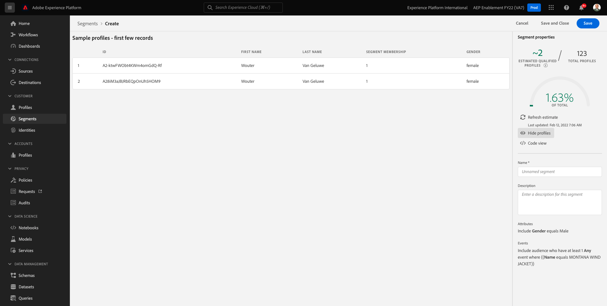

# 3.4建立區段 — UI

在本練習中，您會使用Adobe Experience Platform的區段產生器來建立區段。

## Story

前往 [Adobe Experience Platform](https://experience.adobe.com/platform). 登入後，您會登陸Adobe Experience Platform首頁。


繼續之前，您需要選取 **沙箱**. 要選取的沙箱已命名 ``--aepSandboxId--``. 您可以按一下文字 **[!UICONTROL 生產產品]** 在螢幕上方的藍線。 選取適當的 [!UICONTROL 沙箱]，您會看到畫面變更，現在您已進入專屬 [!UICONTROL 沙箱].


在左側的功能表中，前往 **區段**. 在此頁面上，您可以檢視所有現有區段的概觀。 按一下 **+建立區段** 按鈕以開始建立新區段。


進入新的區段產生器後，您會立即注意到 **屬性** 功能表選項和 **XDM個別設定檔** 參考。


由於XDM是支援體驗業務的語言，因此XDM也是區段產生器的基礎。 Platform中擷取的所有資料都應對應至XDM，因此，無論資料來自何處，所有資料都會成為相同資料模型的一部分。 這可讓您在建立區段時獲得重大優勢，因為透過這個區段產生器UI，您可以將來自任何來源的資料合併至相同的工作流程。 在「區段產生器」中建立的區段可傳送至Adobe Target、Adobe Campaign和Adobe Audience Manager等解決方案進行啟用。

我們來建立包含所有 **男** 客戶。

若要取得性別屬性，您必須了解並了解XDM。

性別是「人員」的屬性，可在「屬性」下找到。 所以，要到達那裡，你首先點擊 **XDM個別設定檔**. 你會看到這個。 從 **XDM個別設定檔** 窗口，選擇 **人員**.


你會看到這個。 在 **人員**，您可以找到 **性別** 屬性。 將「性別」屬性拖曳至區段產生器。


現在，您可以從預先填入的選項中選擇特定性別。 在這個情況下，我們選 **男性**.


選取後 **男性**，您可以推送 **刷新估計值** 按鈕。 這對業務使用者非常實用，因此他們可以看到特定屬性對產生的區段大小的影響。


接著，您會看到下列估計值：


接下來，您應該調整一下區段。 您必須建立已檢視產品之所有男性客戶的區段 **Proteus Fitness Jackshirt（橙色）**.

若要建置此區段，您必須新增體驗事件。 您可以按一下 **事件** 圖示 **欄位** 的上界。


接下來，你會看到最高層， **XDM ExperienceEvents** 節點。 按一下 **XDM ExperienceEvent**.


前往 **產品清單項目**.


選擇 **名稱** 拖放 **名稱** 物件，從左側功能表移至區段產生器畫布中 **事件** 區段。


然後您會看到：


比較參數應為 **等於** 在輸入欄位中，輸入 **蒙大拿風衣**.


每次新增元素至區段產生器時，您都可以按一下 **刷新估計值** 按鈕，以取得區段中人口的新估計。

到目前為止，您只使用UI來建立區段，但也有程式碼選項可用來建立區段。

建立區段時，您實際上會合成設定檔查詢語言(PQL)查詢。 若要視覺化PQL程式碼，您可以按一下 **程式碼檢視** 區段產生器右上角的切換器。


現在，您可以看到完整的PQL陳述式：

```sql
person.gender in ["male"] and CHAIN(xEvent, timestamp, [C0: WHAT(productListItems.exists(name.equals("MONTANA WIND JACKET", false)))])
```

您也可以按一下 **檢視設定檔**.




最後，將區段命名並儲存。

作為命名慣例，請使用：

- `--demoProfileLdap-- - Male customers with interest in Montana Wind Jacket`


然後，按一下 **儲存並關閉** 按鈕來儲存區段，之後會返回「區段概觀」頁面。


您現在可以繼續下一個練習，並透過API建立區段。

下一步： [3.5建立區段 — API](./ex5.md)

[返回模組3](./real-time-customer-profile.md)

[返回所有模組](../../overview.md)
