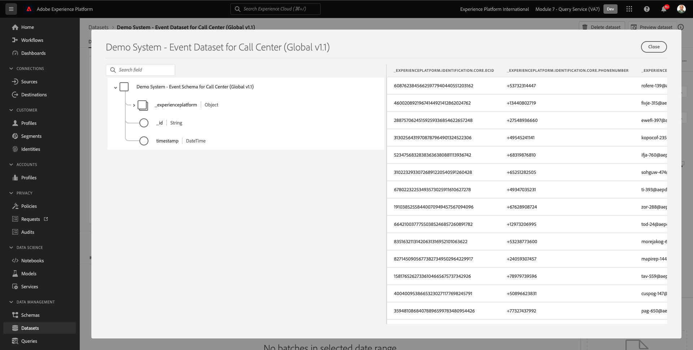

# 4.1快速入門

## 4.1.1熟悉Adobe Experience Platform UI

前往 [Adobe Experience Platform](https://experience.adobe.com/platform). 登入後，您會登陸Adobe Experience Platform首頁。

繼續之前，您需要選取 **沙箱**. 要選取的沙箱已命名 ``--module7sandbox--``. 您可以按一下文字 **[!UICONTROL 生產產品]** 在螢幕上方的藍線。 選取適當的 [!UICONTROL 沙箱]，您會看到畫面變更，現在您已進入專屬 [!UICONTROL 沙箱].

## 4.1.2在平台上探索資料

從不同管道帶入資料對於任何品牌而言都是一項艱巨的任務。 在這個練習中，Citi Signal客戶在其網站上與Citi Signal接洽，在其移動應用上，購買資料由Citi Signal的銷售點系統收集，他們擁有CRM和忠誠度資料。 Citi Signal正利用Adobe Analytics和AdobeLaunch來擷取其網站、行動應用程式以及POS系統的資料，因此這些資料已流入Adobe Experience Platform。 讓我們先探索Adobe Experience Platform中已存在的Citi Signal所有資料。

在左側功能表中，前往 **資料集**.

Citi Signal正在將資料串流至Adobe Experience Platform，此資料可在 `Demo System - Event Dataset for Website (Global v1.1)` 資料集。 搜尋 `Demo System - Event Dataset for Website`.

Citi Signal的「呼叫中心互動」資料擷取於 `Demo System - Event Dataset for Call Center (Global v1.1)` 資料集。 搜尋 `Demo System - Event Dataset for Call Center` 資料。 按一下資料集的名稱以開啟資料集。

按一下資料集後，您會看到資料集活動的概觀，例如擷取和失敗批次。

按一下 **預覽資料集** 查看儲存於 `Demo System - Event Dataset for Call Center (Global v1.1)` 資料集。 左側面板顯示此資料集的結構。

按一下 **關閉** 按鈕以關閉 **預覽資料集** 窗口。

## 4.1.3查詢服務簡介

Adobe Experience Platform查詢服務的存取方式為按一下 **查詢** 的上界。

前往 **記錄檔** 您將看到「查詢清單」頁，該頁提供了在此組織中運行的所有查詢的清單，最上面是最新的查詢。

按一下清單中的任何SQL查詢，並觀察右側邊欄中提供的詳細資訊。

您可以滾動窗口以查看整個查詢，也可以按一下下面突出顯示的表徵圖將整個查詢複製到記事本。 此時不必複製查詢。

您不能只看到已執行的查詢，此使用者介面可讓您從查詢建立新資料集。 這些資料集可連結至Adobe Experience Platform的即時客戶個人檔案，或作為Adobe Experience Platform Data Science Workspace的輸入。

## 4.1.4將PSQL客戶端連接到查詢服務

查詢服務支援具有PostgreSQL驅動程式的客戶端。 在此中，我們將使用PSQL、命令列介面，以及Power BI或Tableau。 讓我們連接到PSQL。

按一下 **憑證**.

您會在下方看到畫面。 「配置」螢幕提供用於驗證Query Service的伺服器資訊和憑據。 目前，我們將集中在螢幕的右側，該螢幕包含PSQL的connect命令。 按一下「複製」按鈕，將命令複製到剪貼簿。

對於Windows:按一下windows鍵並鍵入cmd ，然後按一下命令提示符結果，開啟命令行。

若為macOS:透過精選搜尋開啟terminal.app:

貼上您從Query Service UI複製的connect命令，然後在命令提示字元視窗中按Enter:

Windows:

MacOS:

您現在已使用PSQL連接到查詢服務。

在下一個練習中，將會與此窗口進行一些交互。 我們稱之為 **PSQL命令行介面**.

現在，您可以開始提交查詢了。

下一步： [4.2使用查詢服務](./ex2.md)

[返回模組4](./query-service.md)

[返回所有模組](../../overview.md)
