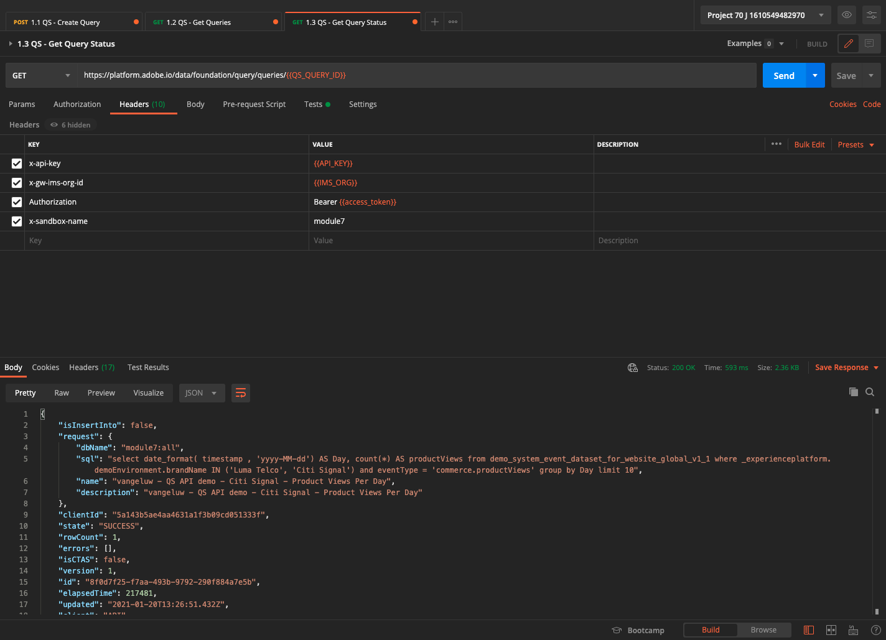

# 4.7查詢服務API

## 目標

- 使用查詢服務API管理查詢模板和查詢計畫

## 內容

在本練習中，您將執行API呼叫，以使用Postman集合管理查詢範本和查詢排程。 您將定義查詢模板、執行常規查詢和CTAS查詢。 A **CTAS** 查詢（將表格建立為選取查詢）將其結果集儲存在明確資料集中。 一般查詢會儲存在隱式（或系統產生的）資料集中，但通常會以鑲木地板檔案格式匯出。

## 文件

- [Adobe Experience Platform 查詢服務說明](https://experienceleague.adobe.com/docs/experience-platform/query/api/getting-started.html)
- [查詢服務API](https://www.adobe.io/apis/experienceplatform/home/api-reference.html#!acpdr/swagger-specs/qs-api.yaml)

## 4.7.1查詢服務API

「查詢服務API」可讓您管理針對Adobe Experience Platform資料湖的非互動式查詢。

非互動式表示執行查詢的要求不會立即產生回應。 將處理查詢，其結果集將以隱式或顯式形式儲存(CTAS:以選取方式建立表格)資料集。

## 4.7.2範例查詢

作為範例查詢，您將使用 [4.3 — 查詢、查詢、查詢……和流失分析](./ex3.md):

我們每天有多少次產品檢視？

**SQL**

```sql
select date_format( timestamp , 'yyyy-MM-dd') AS Day,
       count(*) AS productViews
from   demo_system_event_dataset_for_website_global_v1_1
where  --aepTenantId--.demoEnvironment.brandName IN ('Luma Telco', 'Citi Signal')
and eventType = 'commerce.productViews'
group by Day
limit 10;
```

## 4.7.3查詢

在電腦上開啟Postman。 在模組3中，您已建立Postman環境並匯入Postman集合。 遵循 [練習3.3.3](./../module3/ex3.md) 以防你還沒做。

隨著您匯入的Postman系列，您會看到資料夾 **3. 查詢服務**. 如果您沒有看到此資料夾，請重新下載 [Postman集合](../../assets/postman/postman_profile.zip) 並在Postman中重新匯入集合，如 [練習3.3.3](./../module3/ex3.md).


>[!NOTE]
>
>此時，僅資料夾 **1. 查詢** 包含要求。 其他請求會在層級新增。

開啟該資料夾，並了解要執行、監控和下載查詢結果集的查詢服務API呼叫。

POST呼叫 [/query/query] 有下列裝載時，會觸發查詢的執行；

### 4.7.3.1建立查詢

按一下名為的請求 **1.1 QS — 建立查詢** 然後 **標題**. 然後您會看到：


讓我們關注此標題欄位：

| 代碼 | 值 |
| ----------- | ----------- |
| x-sandbox-name | `--module7sandbox--` |

>[!NOTE]
>
>您必須指定您所使用Adobe Experience Platform沙箱的名稱。 標題欄位 **x-sandbox-name** 應該是 `--module7sandbox--`.

前往 **主體** 部分。 在 **主體** 在此請求中，您會看到下列內容：


```sql
{
    "name" : "ldap - QS API demo - Citi Signal - Product Views Per Day",
	"description": "ldap - QS API demo - Citi Signal - Product Views Per Day",
	"dbName": "module7:all",
	"sql": "select date_format( timestamp , 'yyyy-MM-dd') AS Day, count(*) AS productViews from demo_system_event_dataset_for_website_global_v1_1 where _experienceplatform.demoEnvironment.brandName IN ('Luma Telco', 'Citi Signal') and eventType = 'commerce.productViews' group by Day limit 10"
}
```

注意：請更新變數 **名稱** 取代 **ldap** 與 **ldap**.

新增您的特定 **ldap**，內文看起來應類似以下：

```json
{
    "name" : "vangeluw - QS API demo - Citi Signal - Product Views Per Day",
	"description": "vangeluw - QS API demo - Citi Signal - Product Views Per Day",
	"dbName": "module7:all",
	"sql": "select date_format( timestamp , 'yyyy-MM-dd') AS Day, count(*) AS productViews from demo_system_event_dataset_for_website_global_v1_1 where _experienceplatform.demoEnvironment.brandName IN ('Luma Telco', 'Citi Signal') and eventType = 'commerce.productViews' group by Day limit 10"
}
```

>[!NOTE]
>
>金鑰 **dbName** 在上述JSON內文中，是指您的Adobe Experience Platform例項中使用的沙箱。 如果您使用PROD沙箱，dbName應為 **prod:all**，如果您使用其他沙箱，例如 **module7**, dbName應等於 **module7:all**.

下一步，按一下藍色 **傳送** 按鈕來建立區段並檢視其結果。


成功時，POST要求會傳回下列回應：

```json
{
    "isInsertInto": false,
    "request": {
        "dbName": "module7:all",
        "sql": "select date_format( timestamp , 'yyyy-MM-dd') AS Day, count(*) AS productViews from demo_system_event_dataset_for_website_global_v1_1 where _experienceplatform.demoEnvironment.brandName IN ('Luma Telco', 'Citi Signal') and eventType = 'commerce.productViews' group by Day limit 10",
        "name": "vangeluw - QS API demo - Citi Signal - Product Views Per Day",
        "description": "vangeluw - QS API demo - Citi Signal - Product Views Per Day"
    },
    "clientId": "5a143b5ae4aa4631a1f3b09cd051333f",
    "state": "SUBMITTED",
    "rowCount": 0,
    "errors": [],
    "isCTAS": false,
    "version": 1,
    "id": "8f0d7f25-f7aa-493b-9792-290f884a7e5b",
    "elapsedTime": 0,
    "updated": "2021-01-20T13:23:13.951Z",
    "client": "API",
    "userId": "A3392DB95FFF08EE0A495E87@techacct.adobe.com",
    "created": "2021-01-20T13:23:13.951Z",
    "_links": {
        "self": {
            "href": "https://platform-va7.adobe.io/data/foundation/query/queries/8f0d7f25-f7aa-493b-9792-290f884a7e5b",
            "method": "GET"
        },
        "soft_delete": {
            "href": "https://platform-va7.adobe.io/data/foundation/query/queries/8f0d7f25-f7aa-493b-9792-290f884a7e5b",
            "method": "PATCH",
            "body": "{ \"op\": \"soft_delete\"}"
        },
        "cancel": {
            "href": "https://platform-va7.adobe.io/data/foundation/query/queries/8f0d7f25-f7aa-493b-9792-290f884a7e5b",
            "method": "PATCH",
            "body": "{ \"op\": \"cancel\"}"
        }
    }
}
```

目前 **state** 的 **已提交**，一旦執行其狀態， **成功**.

您也可以透過Adobe Experience Platform UI查詢已提交的查詢，請開啟 [Adobe Experience Platform](https://experience.adobe.com/#/@experienceplatform/platform/home)，導覽至 **查詢**，到 **記錄檔** 並選擇查詢：


### 4.7.3.2獲取查詢

按一下名為的請求 **1.2 QS — 獲取查詢** 然後 **標題**. 然後您會看到：


讓我們關注此標題欄位：

| 代碼 | 值 |
| ----------- | ----------- |
| x-sandbox-name | `--module7sandbox--` |

>[!NOTE]
>
>您必須指定您所使用Adobe Experience Platform沙箱的名稱。 標題欄位 **x-sandbox-name** 應該是 `--module7sandbox--`.

前往 **Params**. 然後您會看到：


此 **orderby** 參數可讓您根據 **已建立** 屬性。 請注意 **&#39;-&#39;** 登入created，這表示傳回查詢清單的順序將使用其建立日期(於 **降序** 順序。 您的查詢應位於清單頂端。

下一步，按一下藍色 **傳送** 按鈕來建立區段並檢視其結果。


成功後，要求會傳回類似下列的回應。 此 **state** 的 **已提交**, **IN_PROGRESS** 或 **成功**. 查詢可能需要幾分鐘才會有 **成功** 狀態。 您可以重複傳送此請求多次，直到看到 **成功** 狀態。

```json
{
    "queries": [
        {
            "isInsertInto": false,
            "request": {
                "dbName": "module7:all",
                "sql": "select date_format( timestamp , 'yyyy-MM-dd') AS Day, count(*) AS productViews from demo_system_event_dataset_for_website_global_v1_1 where _experienceplatform.demoEnvironment.brandName IN ('Luma Telco', 'Citi Signal') and eventType = 'commerce.productViews' group by Day limit 10",
                "name": "vangeluw - QS API demo - Citi Signal - Product Views Per Day",
                "description": "vangeluw - QS API demo - Citi Signal - Product Views Per Day"
            },
            "clientId": "5a143b5ae4aa4631a1f3b09cd051333f",
            "state": "SUCCESS",
            "rowCount": 1,
            "errors": [],
            "isCTAS": false,
            "version": 1,
            "id": "8f0d7f25-f7aa-493b-9792-290f884a7e5b",
            "elapsedTime": 217481,
            "updated": "2021-01-20T13:26:51.432Z",
            "client": "API",
            "userId": "A3392DB95FFF08EE0A495E87@techacct.adobe.com",
            "created": "2021-01-20T13:23:13.951Z",
            "_links": {
                "self": {
                    "href": "https://platform-va7.adobe.io/data/foundation/query/queries/8f0d7f25-f7aa-493b-9792-290f884a7e5b",
                    "method": "GET"
                },
                "soft_delete": {
                    "href": "https://platform-va7.adobe.io/data/foundation/query/queries/8f0d7f25-f7aa-493b-9792-290f884a7e5b",
                    "method": "PATCH",
                    "body": "{ \"op\": \"soft_delete\"}"
                },
                "referenced_datasets": [
                    {
                        "id": "60080ace62c49a19490c5870",
                        "href": "https://platform-va7.adobe.io/data/foundation/catalog/dataSets/60080ace62c49a19490c5870"
                    }
                ]
            }
        }
     ]
    },
    "version": 1
}
```

當狀態為 **成功**，請繼續下一個請求。

### 4.7.3.3獲取查詢狀態

按一下名為的請求 **1.3 QS — 獲取查詢狀態** 然後 **標題**. 然後您會看到：


讓我們關注此標題欄位：

| 代碼 | 值 |
| ----------- | ----------- |
| x-sandbox-name | `--module7sandbox--` |

>[!NOTE]
>
>您必須指定您所使用Adobe Experience Platform沙箱的名稱。 標題欄位 **x-sandbox-name** 應該是 `--module7sandbox--`.

下一步，按一下藍色 **傳送** 按鈕來建立區段並檢視其結果。



成功後，要求會傳回類似下列的回應。

```json
{
    "isInsertInto": false,
    "request": {
        "dbName": "module7:all",
        "sql": "select date_format( timestamp , 'yyyy-MM-dd') AS Day, count(*) AS productViews from demo_system_event_dataset_for_website_global_v1_1 where _experienceplatform.demoEnvironment.brandName IN ('Luma Telco', 'Citi Signal') and eventType = 'commerce.productViews' group by Day limit 10",
        "name": "vangeluw - QS API demo - Citi Signal - Product Views Per Day",
        "description": "vangeluw - QS API demo - Citi Signal - Product Views Per Day"
    },
    "clientId": "5a143b5ae4aa4631a1f3b09cd051333f",
    "state": "SUCCESS",
    "rowCount": 1,
    "errors": [],
    "isCTAS": false,
    "version": 1,
    "id": "8f0d7f25-f7aa-493b-9792-290f884a7e5b",
    "elapsedTime": 217481,
    "updated": "2021-01-20T13:26:51.432Z",
    "client": "API",
    "userId": "A3392DB95FFF08EE0A495E87@techacct.adobe.com",
    "created": "2021-01-20T13:23:13.951Z",
    "_links": {
        "self": {
            "href": "https://platform-va7.adobe.io/data/foundation/query/queries/8f0d7f25-f7aa-493b-9792-290f884a7e5b",
            "method": "GET"
        },
        "soft_delete": {
            "href": "https://platform-va7.adobe.io/data/foundation/query/queries/8f0d7f25-f7aa-493b-9792-290f884a7e5b",
            "method": "PATCH",
            "body": "{ \"op\": \"soft_delete\"}"
        },
        "referenced_datasets": [
            {
                "id": "60080ace62c49a19490c5870",
                "href": "https://platform-va7.adobe.io/data/foundation/catalog/dataSets/60080ace62c49a19490c5870"
            }
        ]
    }
}
```

查詢達到 **成功**，回應也會指出查詢透過 **rowCount** 屬性。 在我們的範例中，查詢會傳回10列。 下節將說明如何擷取10列。

### 4.7.3.4檢索查詢結果

此 **成功** 上述回應包含 **referenced_datests** 屬性，此屬性指向儲存查詢結果的隱式資料集。 為了獲得結果，我們使用 **href** 或 **id** 屬性。

按一下名為的請求 **1.4 QS — 獲取查詢結果** 然後 **標題**. 然後您會看到：


讓我們關注此標題欄位：

| 代碼 | 值 |
| ----------- | ----------- |
| x-sandbox-name | `--module7sandbox--` |

>[!NOTE]
>
>您必須指定您所使用Adobe Experience Platform沙箱的名稱。 標題欄位 **x-sandbox-name** 應該是 `--module7sandbox--`.

下一步，按一下藍色 **傳送** 按鈕來建立區段並檢視其結果。


此要求的回應會指向資料集檔案：

```json
{
    "60080ace62c49a19490c5870": {
        "name": "Demo System - Event Dataset for Website (Global v1.1)",
        "description": "Demo System - Event Dataset for Website (Global v1.1)",
        "enableErrorDiagnostics": false,
        "tags": {
            "adobe/siphon/partition/definition": [
                "day(timestamp, _ACP_DATE)",
                "identity(_ACP_BATCHID)"
            ],
            "aep/siphon/partitions": [
                "_ACP_DATE",
                "_ACP_BATCHID"
            ],
            "acp_granular_plugin_validation_flags": [
                "identity:enabled",
                "profile:enabled"
            ],
            "adobe/siphon/buffered-promotion-recency": [
                "live"
            ],
            "adobe/siphon/use-buffered-promotion": [
                "true"
            ],
            "adobe/pqs/table": [
                "demo_system_event_dataset_for_website_global_v1_1"
            ],
            "aep/siphon/expire-snapshot-timestamp": [
                "1611141272703"
            ],
            "acp_granular_validation_flags": [
                "requiredFieldCheck:enabled"
            ],
            "acp_validationContext": [
                "enabled"
            ],
            "adobe/siphon/table/format": [
                "iceberg"
            ],
            "unifiedProfile": [
                "enabled:true",
                "enabledAt:2021-01-20 10:49:51"
            ],
            "unifiedIdentity": [
                "enabled:true"
            ]
        },
        "namespace": "ACP",
        "state": "DRAFT",
        "imsOrg": "907075E95BF479EC0A495C73@AdobeOrg",
        "sandboxId": "62cd9f38-8529-4b05-8d9f-388529db0540",
        "lastBatchId": "01EWFQZ15XRNNB1FPKPW5ETRVP",
        "lastBatchStatus": "success",
        "lastSuccessfulBatch": "01EWFQZ15XRNNB1FPKPW5ETRVP",
        "version": "1.0.6",
        "created": 1611139790698,
        "updated": 1611149266031,
        "createdClient": "750e24ee855b4ac18ccc4f4817f96ee1",
        "createdUser": "3A260B485E909A170A495E76@techacct.adobe.com",
        "updatedUser": "acp_foundation_dataTracker@AdobeID",
        "viewId": "60080ace62c49a19490c5871",
        "fileDescription": {
            "persisted": true,
            "containerFormat": "parquet",
            "format": "parquet"
        },
        "files": "@/dataSets/60080ace62c49a19490c5870/views/60080ace62c49a19490c5871/files",
        "schemaMetadata": {
            "delta": [],
            "gdpr": []
        },
        "schemaRef": {
            "id": "https://ns.adobe.com/experienceplatform/schemas/d9b88a044ad96154637965a97ed63c7b20bdf2ab3b4f642e",
            "contentType": "application/vnd.adobe.xed-full+json;version=1"
        }
    }
}
```

>[!NOTE]
>
>我們很快將新增更多練習，協助您與Query Service API互動。

下一步： [摘要和優點](./summary.md)

[返回模組4](./query-service.md)

[返回所有模組](../../overview.md)
