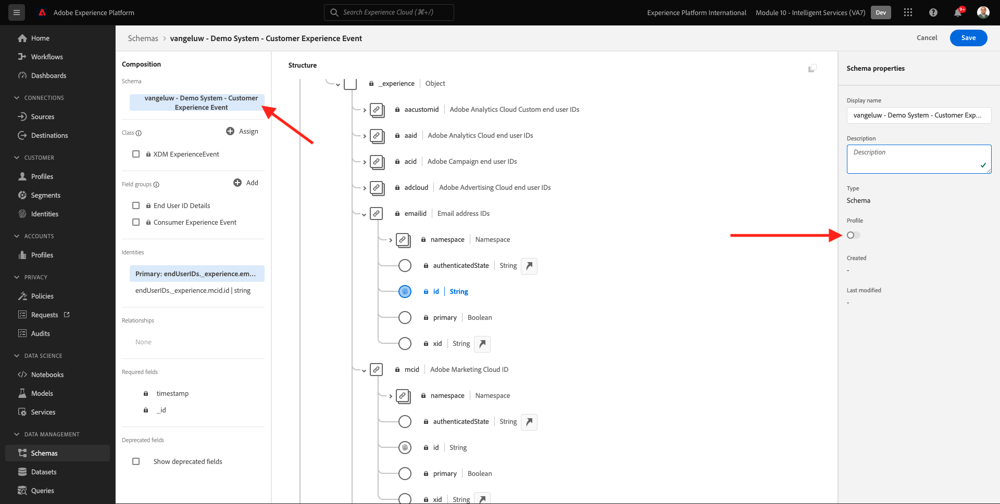
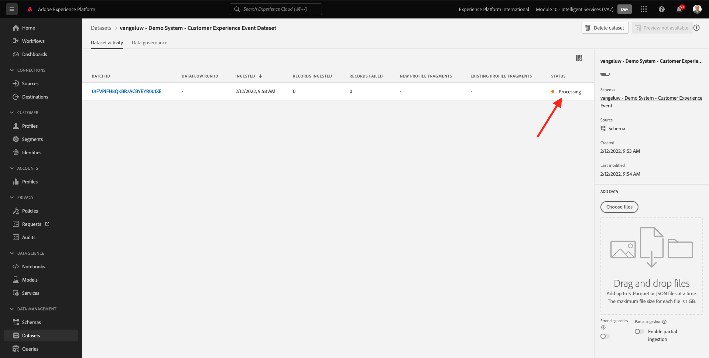

# 5.1 Customer AI — 資料準備（擷取）

為了讓Intelligent Services從您的行銷事件資料中探索深入分析，資料必須在語義上加以擴充並維護為標準結構。 Intelligent Services運用Adobe的Experience Data Model(XDM)結構，以達到此目的。
具體而言，Intelligent Services中使用的所有資料集都必須符合 **消費者體驗事件** XDM結構。

## 5.1.1建立結構

在本練習中，您將建立包含 **消費者體驗事件Mixin**，此為 **Customer AI** 智慧服務。

前往此URL登入Adobe Experience Platform: [https://experience.adobe.com/platform](https://experience.adobe.com/platform).

登入後，您會登陸Adobe Experience Platform首頁。

繼續之前，您需要選取 **沙箱**. 要選取的沙箱已命名 ``--module10sandbox--``. 您可以按一下文字 **[!UICONTROL 生產產品]** 在螢幕上方的藍線。 選取適當的沙箱後，畫面會變更，現在您就位於專用的沙箱中。

從左側功能表，按一下 **結構** 然後 **瀏覽**. 按一下 **建立結構**.

在快顯視窗中，選取 **XDM ExperienceEvent**.

你會看到這個。

搜尋並選取下列項目 **Mixins** 要添加到此架構：

- 消費者體驗事件

   

- 最終用戶ID詳細資訊

   

按一下 **新增欄位群組**.

你會看到這個。 選取Mixin **最終用戶ID詳細資訊**.

導覽至欄位 **endUserIDs。_experience.emailid.id**.

在欄位的右側功能表中 **endUserIDs。_experience.emailid.id**，向下捲動並勾選 **身分**，勾選 **主要身分** ，然後選取 **身分命名空間** of **電子郵件**.

導覽至欄位 **endUserIDs。_experience.mcid.id**. 勾選 **身分** ，然後選取 **身分命名空間** of **ECID**. 按一下&#x200B;**套用**。

立即為您的架構命名。

作為架構的名稱，您會使用：

- `--demoProfileLdap-- - Demo System - Customer Experience Event`

例如，對於ldap **萬熱盧**，此名稱應為結構名稱：

- **vangeluw — 示範系統 — 客戶體驗事件**

那應該給你這樣的東西。 按一下 **+新增** 按鈕以新增 **Mixins**.

選取架構的名稱。 您現在應為 **設定檔**，方法是按一下 **設定檔** 切換。

你會看到這個。 按一下 **啟用**.

你現在應該有這個。 按一下 **儲存** 來儲存您的架構。

## 5.1.2建立資料集

從左側功能表，按一下 **資料集** 然後 **瀏覽**. 按一下 **建立資料集**.

按一下&#x200B;**「從架構建立資料集」**。

在下一個畫面中，選取您在上一個練習中建立的資料集，命名為 **[!UICONTROL ldap — 示範系統 — 客戶體驗事件]**. 按&#x200B;**「下一步」**。

以資料集的名稱形式，請使用 `--demoProfileLdap-- - Demo System - Customer Experience Event Dataset`. 按一下&#x200B;**完成**。

您的資料集現在已建立。 啟用 **設定檔** 切換。

按一下 **啟用**.

您現在應該有以下項目：

您現在已準備好開始擷取消費者體驗事件資料，並開始使用Customer AI服務。

## 5.1.3下載體驗事件測試資料

一旦 **結構** 和 **資料集** 已設定，您現在可以擷取體驗事件資料。 由於Customer AI需要 **至少2個季度**，您需要擷取外部準備的資料。

為體驗事件準備的資料必須符合 [消費者體驗事件XDM Mixin](https://github.com/adobe/xdm/blob/797cf4930d5a80799a095256302675b1362c9a15/docs/reference/context/experienceevent-consumer.schema.md).

請從以下位置下載包含範例資料的檔案： [https://dashboard.adobedemo.com/data](https://dashboard.adobedemo.com/data). 按一下 **下載** 按鈕。

您現在下載了一個檔案，名為 **retail-v1-2020-xl.json.zip**. 將檔案放在電腦的案頭上並解壓縮，之後您會看到名為 **retail-v1.json**. 在下一個練習中，您將需要此檔案。

## 5.1.4內嵌體驗事件測試資料

在Adobe Experience Platform中，前往 **資料集** 並開啟資料集，該資料集名為 **[!UICONTROL ldap — 示範系統 — 客戶體驗事件資料集]**.

在資料集中，按一下 **選擇檔案** 來新增資料。

在快顯視窗中，選取檔案 **retail-v1.json** 按一下 **開啟**.

之後，您會看到要匯入的資料，並在 **載入** 狀態。 上傳檔案前，請勿從此頁面導覽。

上傳檔案後，您會看到 **載入** to **處理**.

擷取和處理資料可能需要10-20分鐘。

資料內嵌一旦成功，批次狀態會變更為 **成功**.

下一步： [5.2 Customer AI — 建立新執行個體（設定）](./ex2.md)

[返回模組5](./intelligent-services.md)

[返回所有模組](./../../overview.md)
