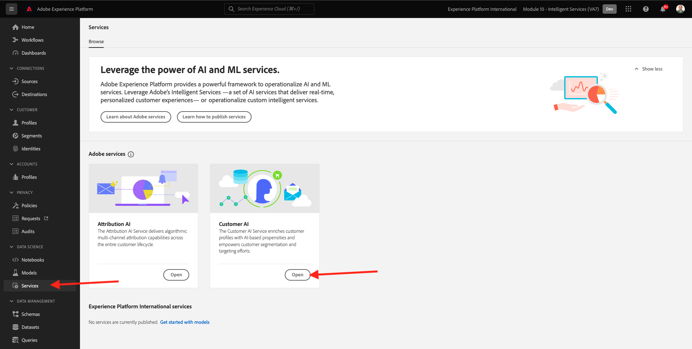

# 5.2 Customer AI — 建立新執行個體（設定）

Customer AI的運作方式是分析現有的消費者體驗事件資料，以預測流失率或轉換傾向分數。 建立新的Customer AI例項可讓行銷人員定義目標和測量。

## 5.2.1設定新的Customer AI例項

在Adobe Experience Platform中，按一下 **服務** 的上界。 此 **服務** 瀏覽器隨即顯示，並顯示您自己擁有的所有可用服務。 在Customer AI的資訊卡中，按一下 **開啟**.

按一下 **建立例項**.

你會看到這個。

輸入Customer AI實例所需的詳細資訊：

- 名稱：use `--demoProfileLdap-- Product Purchase Propensity`
- 說明：使用： **預測客戶購買產品的可能性**
- 傾向類型：選取 **轉換**

按&#x200B;**「下一步」**。

你會看到這個。 選取您在上一個練習中建立的資料集，命名為 `--demoProfileLdap - Demo System - Customer Experience Event Dataset`. 按&#x200B;**「下一步」**。

選擇 **將會發生** 和定義欄位 **commerce.purchases.value** 作為目標變數。

按&#x200B;**「下一步」**。

接下來，設定您的排程以執行 **每週** 並將時間設定得盡可能接近目前時間。 確保切換 **啟用設定檔分數** 啟用。

按一下&#x200B;**完成**。

然後你會看到這個彈出畫面。 按一下&#x200B;**「確定」**。

設定執行個體後，您可以在Customer AI執行個體清單中看到該執行個體，也可以按一下Customer AI執行個體列來預覽設定和執行詳細資訊的摘要。 如果發現錯誤，摘要面板也會顯示錯誤詳細資訊。

>[!NOTE]
>
>只要您的Customer AI例項的狀態為 **等待培訓** 或 **錯誤**

下一步： [5.3客戶AI — 計分控制面板和區段（預測並採取動作）](./ex3.md)

[返回模組5](./intelligent-services.md)

[返回所有模組](./../../overview.md)
