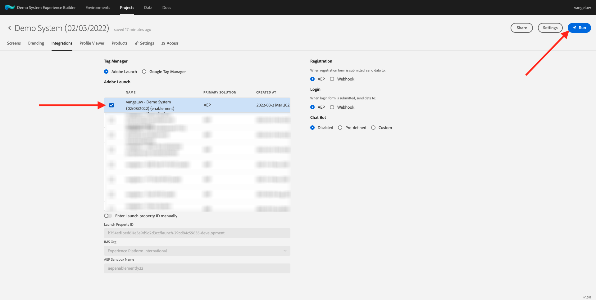
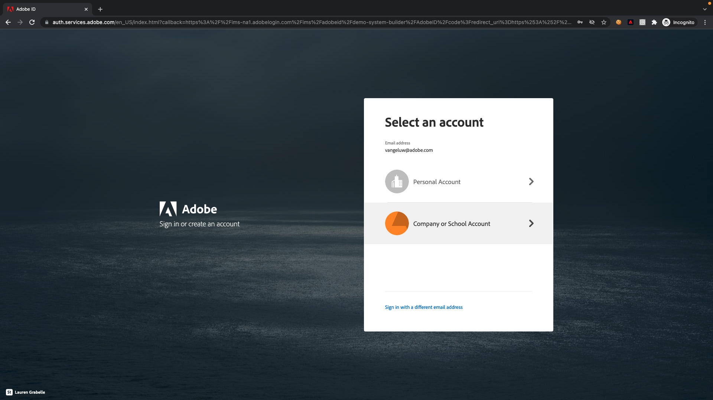
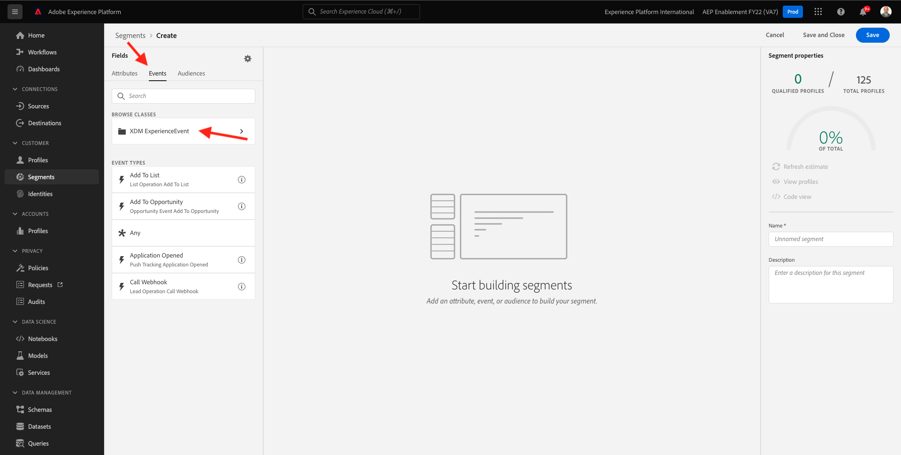

# 6.1建立區段

在本練習中，您會利用Adobe Experience Platform的區段產生器來建立區段。

## 6.1.1內容

在當今世界，對客戶行為的響應需要是即時的。 即時回應客戶行為的其中一種方式，是在區段符合即時資格的條件下使用區段。 在本練習中，您需要建立區段，並考量我們使用過的網站上的實際活動。

## 6.1.2識別您要對

前往 [https://builder.adobedemo.com/projects](https://builder.adobedemo.com/projects). 使用您的Adobe ID登入後，您會看到這個。 按一下您的網站專案以開啟。

您現在可以依照下列流程存取網站。 按一下 **整合**.

在 **整合** 頁，您需要選擇在練習0.1中建立的資料收集屬性。

然後，您會看到示範網站已開啟。 選取URL並複製到剪貼簿。

開啟新的無痕瀏覽器窗口。

貼上您在上一步複製的示範網站URL。 然後系統會要求您使用Adobe ID登入。

選取您的帳戶類型並完成登入程式。

然後，您會在無痕瀏覽器視窗中看到您的網站載入。 對於每個演示，您都需要使用全新的無痕瀏覽器窗口來載入演示網站URL。

在此範例中，您想要回應檢視特定產品的特定客戶。
從 **盧馬** 首頁，轉到 **男性**，然後按一下產品 **PROTEUS健身夾克衫**.

當有人瀏覽產品頁面 **PROTEUS健身夾克衫**，您就想要能夠採取動作。 要採取動作，首先要定義區段。

## 6.1.3建立區段

前往 [Adobe Experience Platform](https://experience.adobe.com/platform). 登入後，您會登陸Adobe Experience Platform首頁。

繼續之前，您需要選取 **沙箱**. 要選取的沙箱已命名 ``--aepSandboxId--``. 您可以按一下文字 **[!UICONTROL 生產產品]** 在螢幕上方的藍線。 選取適當的 [!UICONTROL 沙箱]，您會看到畫面變更，現在您已進入專屬 [!UICONTROL 沙箱].

在左側的功能表中，前往 **區段** 然後， **瀏覽** 可讓您查看所有現有區段的概觀。 按一下 **建立區段** 按鈕以開始建立新區段。

如上所述，您必須從已檢視產品的所有客戶中建立區段 **PROTEUS健身夾克衫**.

若要建置此區段，您必須新增事件。 您可以按一下 **事件** 圖示 **區段** 的上界。

接下來，您將看到頂層 **XDM ExperienceEvent** 節點。

尋找已造訪 **PROTEUS健身夾克衫** 產品，按一下 **XDM ExperienceEvent**.

向下捲動至 **產品清單項目** 然後按一下。

選擇 **名稱** 拖放 **名稱** 從左起 **產品清單項目** 功能表上的區段產生器畫布 **事件** 區段。

比較參數應為 **等於** 在輸入欄位中，輸入 `PROTEUS FITNESS JACKSHIRT`.

您的 **事件規則** 現在應該是這樣。 每次新增元素至區段產生器時，您都可以按一下 **刷新估計值** 按鈕，以取得區段中人口的新估計。

最後，將區段命名並儲存。

作為命名慣例，請使用：

- `--demoProfileLdap-- - Interest in PROTEUS FITNESS JACKSHIRT`

您的區段名稱應如下所示：
`vangeluw - Interest in PROTEUS FITNESS JACKSHIRT`

下一步，按一下 **儲存並關閉** 按鈕來儲存區段。

現在會回到區段概觀頁面。

下一步： [6.2查看如何使用目的地配置DV360目的地](./ex2.md)

[返回模組11](./real-time-cdp-build-a-segment-take-action.md)

[返回所有模組](../../overview.md)
