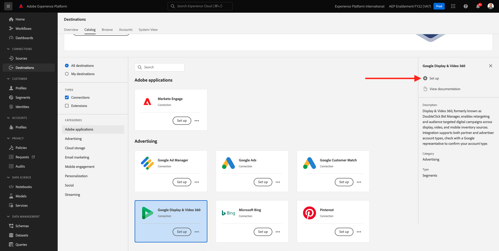
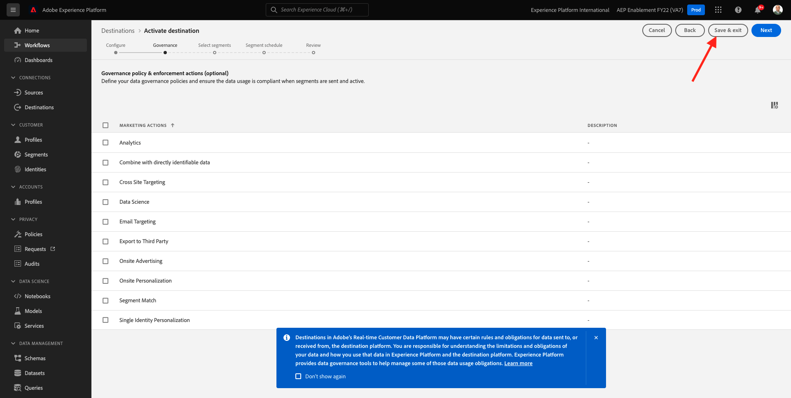

# 6.2設定廣告目的地，例如Google DV360

>[!IMPORTANT]
>
>以下內容的用途為FYI — 您可以 **NOT** 必須為DV360配置新目標。 目標已建立，您可以在下一個練習中使用。

前往 [Adobe Experience Platform](https://experience.adobe.com/platform). 登入後，您會登陸Adobe Experience Platform首頁。

繼續之前，您需要選取 **沙箱**. 要選取的沙箱已命名 ``--aepSandboxId--``. 您可以按一下文字 **[!UICONTROL 生產產品]** 在螢幕上方的藍線。 選取適當的 [!UICONTROL 沙箱]，您會看到畫面變更，現在您已進入專屬 [!UICONTROL 沙箱].

在左側功能表中，前往 **目的地**，然後前往 **目錄**. 然後您會看到 **目的地目錄**.

在 **目的地**，按一下 **Google Display &amp; Video 360** 然後按一下 **+設定**.

你會看到這個。 按一下 **連接到目標**.

在下一個螢幕中，您可以將目標配置為Google DV360。

在欄位中輸入值 **名稱** 和 **說明**.

欄位 **帳戶ID** 是 **廣告商ID** DV360帳戶。 您可以在此找到：

此 **帳戶類型** 應設為 **邀請廣告商**.

現在你有了這個。 按&#x200B;**「下一步」**。

>[!NOTE]
>
>Google需要允許清單Adobe，才能讓Adobe Experience Platform將資料傳送至Google DV360。 請連絡您的Google客戶經理以啟用此資料流。

建立目的地後，您會看到這個。 您可以選擇選取資料控管原則。 下一步，按一下 **儲存並退出**.

然後您會看到可用目的地的清單。
在下一個練習中，您將將上一個練習中建立的區段連接到Google DV360目的地。

下一步： [6.3採取行動：將段發送到DV360](./ex3.md)

[返回模組6](./real-time-cdp-build-a-segment-take-action.md)

[返回所有模組](../../overview.md)
