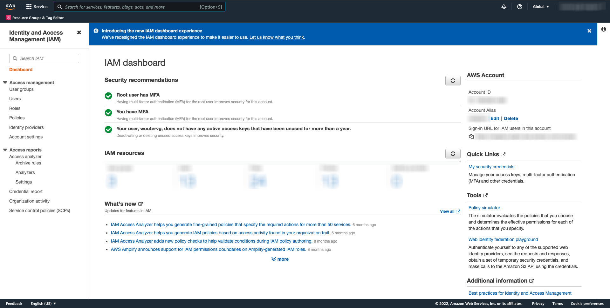
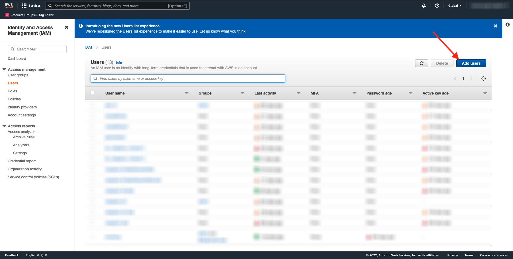
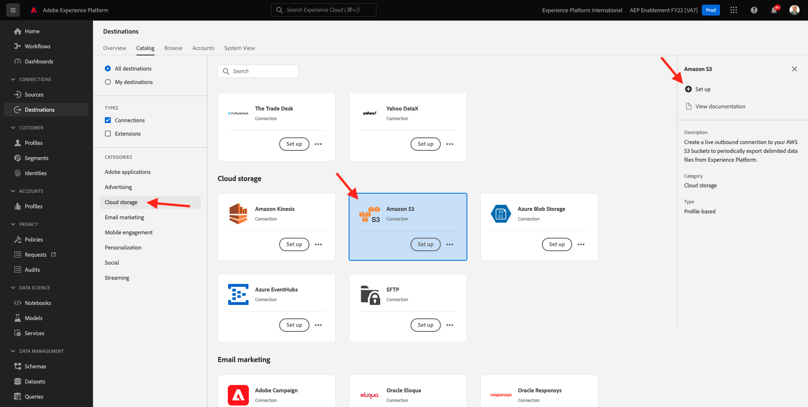
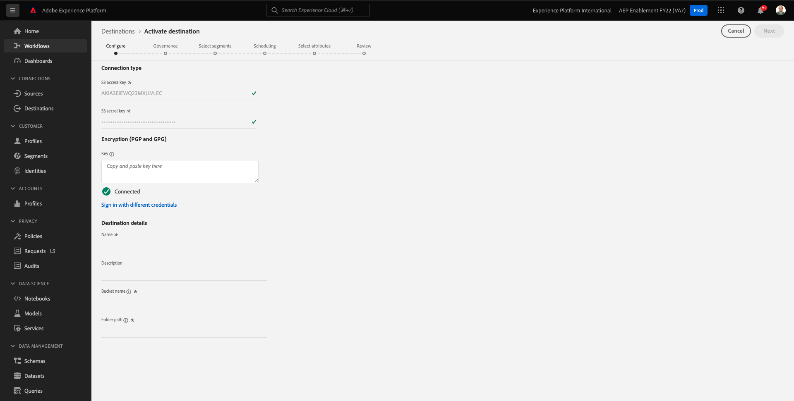
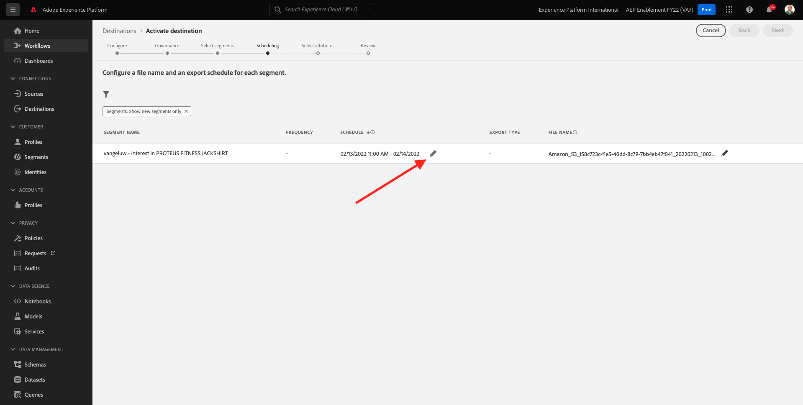

# 6.4採取行動：將區段傳送至S3目的地

Adobe Experience Platform也能與電子郵件行銷目的地共用受眾，例如SalesforceMarketing Cloud、OracleEloqua、OracleResponsys和Adobe Campaign。

您可以使用FTP或SFTP作為這些電子郵件行銷目的地的專屬目的地，或使用AWS S3在Adobe Experience Platform與這些電子郵件行銷目的地之間交換客戶清單。

在此模組中，您會使用AWS S3儲存貯體來設定此類目的地。

## 6.4.1建立S3貯體

前往 [https://console.aws.amazon.com](https://console.aws.amazon.com) 並使用您先前建立的Amazon帳戶登入。

登入後，系統會將您重新導向至 **AWS Management Console**.

在 **查找服務** 菜單，搜索 **s3**. 按一下第一個搜尋結果： **S3 — 雲中可擴充的儲存**.

然後您會看到 **Amazon S3** 首頁。 按一下 **建立貯體**.

在 **建立貯體** 畫面中，您需要設定兩個項目：

- 名稱：使用名稱 `aepmodulertcdp--demoProfileLdap--`. 例如，在本練習中，貯體名稱為 **aepmodulertcdpvangeluw**
- 地區：使用地區 **EU（法蘭克福）eu-central-1**

保留所有其他預設設定。 向下捲動並按一下 **建立貯體**.

接著，您會看到儲存貯體已建立，並會重新導向至Amazon S3首頁。

## 6.4.2設定存取S3貯體的權限

下一步是設定S3貯體的存取權。

若要這麼做，請前往 [https://console.aws.amazon.com/iam/home](https://console.aws.amazon.com/iam/home).

對AWS資源的訪問由Amazon Identity and Access Management(IAM)控制。

您現在會看到此頁面。

在左側功能表中，按一下 **使用者**. 然後您會看到 **使用者** 螢幕。 按一下 **新增使用者**.

接下來，配置您的用戶：

- 用戶名：use `s3_--demoProfileLdap--_rtcdp` 作為名稱，因此在此範例中，名稱為 `s3_vangeluw_rtcdp`.
- AWS存取類型：選取 **存取索引鍵 — 程式化存取**.

按一下 **下一個：權限**.

然後您會看到此權限畫面。 按一下 **直接附加現有策略**.

輸入搜索詞 **s3** 以查看所有相關的S3策略。 選擇策略 **AmazonS3FullAccess**. 按一下 **下一個：標籤**.

在 **標籤** 螢幕上，不需要設定任何項目。 按一下 **下一個：檢閱**.

檢閱您的設定。 按一下 **建立使用者**.

您的使用者現在已建立，且您正在看到存取S3環境的認證。 這是您唯一一次看到您的憑據，因此請將其寫下。

按一下 **顯示** 若要查看您的機密存取金鑰：

>[!IMPORTANT]
>
>將憑據儲存在電腦的文本檔案中。
>
> - 訪問密鑰ID:...
> - 密鑰訪問密鑰：...
>
> 按一下 **關閉** 你再也看不到你的證書了！

按一下 **關閉**。

您現在已成功建立AWS S3貯體，且已建立具有存取此貯體權限的使用者。

## 6.4.3在Adobe Experience Platform中設定目的地

前往 [Adobe Experience Platform](https://experience.adobe.com/platform). 登入後，您會登陸Adobe Experience Platform首頁。

繼續之前，您需要選取 **沙箱**. 要選取的沙箱已命名 ``--aepSandboxId--``. 您可以按一下文字 **[!UICONTROL 生產產品]** 在螢幕上方的藍線。 選取適當的 [!UICONTROL 沙箱]，您會看到畫面變更，現在您已進入專屬 [!UICONTROL 沙箱].

在左側功能表中，前往 **目的地**，然後前往 **目錄**. 然後您會看到 **目的地目錄**.

按一下 **雲端儲存空間**，然後按一下 **設定** 按鈕(或 **啟用區段**，視您的環境而定) **Amazon S3** 卡片。

視您的環境而定，您可能必須按一下 **+配置新目標** 開始建立目的地。

選擇 **新帳戶** 作為帳戶類型。 請使用上一步中提供給您的S3憑證：

| 訪問密鑰ID | 秘密訪問密鑰 |
|:-----------------------:| :-----------------------:|
| AKIA...... | 5Ln...... |

按一下 **連接到目標**.

然後您會看到目視確認，此目的地已連線。

您必須提供名稱和資料夾，Adobe Experience Platform才能連線至S3儲存貯體。

作為命名慣例，請使用下列內容：

| 訪問密鑰ID | 秘密訪問密鑰 |
|:-----------------------:| :-----------------------:|
| 名稱 | `AWS - S3 - --demoProfileLdap--` |
| 說明 | `AWS - S3 - --demoProfileLdap--` |
| 貯體名稱 | `aepmodulertcdp--demoProfileLdap--` |
| 資料夾路徑 | / |

按&#x200B;**「下一步」**。

您現在可以選擇將資料控管原則附加至新目的地。 按&#x200B;**「下一步」**。

在區段清單中，搜尋您在練習1中建立的區段，然後加以選取。 按&#x200B;**「下一步」**。

你會看到這個。 您可以按一下 **鉛筆** 表徵圖。 **建立排程**.

定義您選擇的排程。 選擇 **導出增量檔案** 並將頻率設定為 **每小時** ever **3小時**. 按一下&#x200B;**建立**。

那你就拿這個。 按&#x200B;**「下一步」**。

您現在可以選取要匯出至AWS S3的屬性。 按一下 **新增欄位** 並確保 `--aepTenantId--.identification.core.ecid` 新增並標示為 **重複資料刪除密鑰**.

您可以視需要新增其他欄位（選擇性）。

新增所有欄位後，按一下 **下一個**.

檢閱您的設定。 按一下 **完成** 完成配置。

然後您會回到「目的地啟用」畫面，看到您的區段已新增至此目的地。

如果您想要新增更多區段匯出，可以按一下 **啟用區段** 重新啟動程式並新增更多區段。

下一步： [6.5採取行動：將區段傳送至Adobe Target](./ex5.md)

[返回模組6](./real-time-cdp-build-a-segment-take-action.md)

[返回所有模組](../../overview.md)
