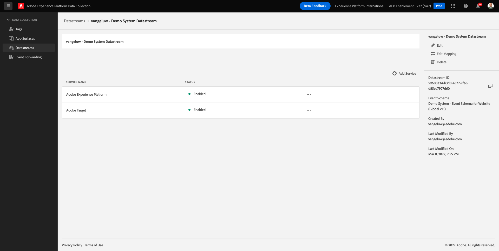
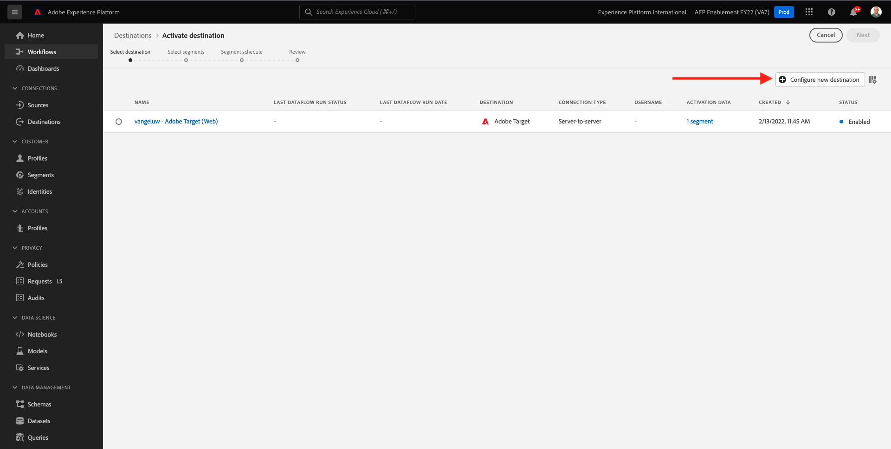
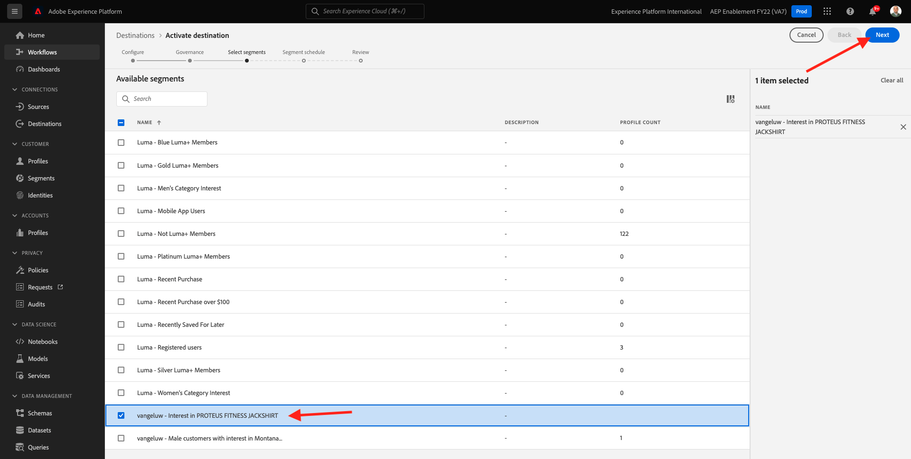
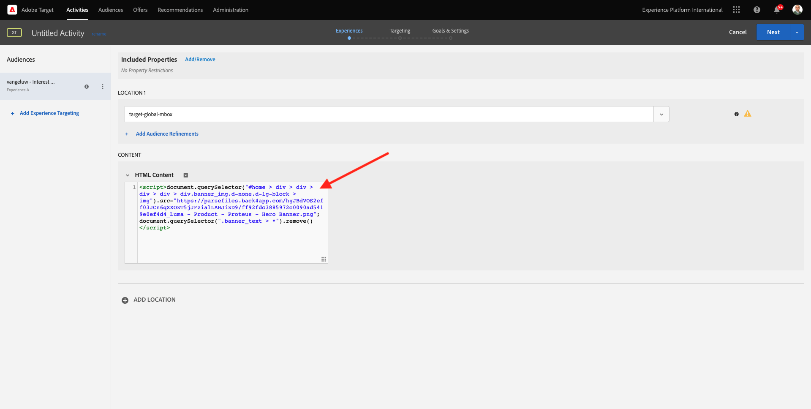

# 6.5採取行動：將區段傳送至Adobe Target

前往 [Adobe Experience Platform](https://experience.adobe.com/platform). 登入後，您會登陸Adobe Experience Platform首頁。


繼續之前，您需要選取 **沙箱**. 要選取的沙箱已命名 ``--aepSandboxId--``. 您可以按一下文字 **[!UICONTROL 生產產品]** 在螢幕上方的藍線。 選取適當的 [!UICONTROL 沙箱]，您會看到畫面變更，現在您已進入專屬 [!UICONTROL 沙箱].


## 6.5.1驗證資料流

Real-Time CDP中的Adobe Target目的地已連線至用來將資料內嵌至Adobe邊緣網路的資料流。 如果您想設定Adobe Target目的地，首先需要確認您的資料流是否已針對Adobe Target啟用。 您的資料已在 [練習0.2建立資料流](./../module0/ex2.md) 並且已命名 `--demoProfileLdap-- - Demo System Datastream`.

前往 [https://experience.adobe.com/#/data-collection/](https://experience.adobe.com/#/data-collection/)，然後按一下 **資料流** 或 **資料流（測試版）**.


在畫面的右上角，選取沙箱名稱，名稱應為 `--aepSandboxId--`.


在資料流中，搜尋名為的資料流 `--demoProfileLdap-- - Demo System Datastream`. 按一下您的資料流以開啟它。


然後您會看到，按一下 **...** 下一頁 **Adobe Experience Platform** 然後按一下 **編輯**.


選中兩者的複選框 **邊緣分割** 和 **個人化目的地**. 按一下「**儲存**」。


下一步，按一下 **+新增服務**.


選擇服務 **Adobe Target**. 按一下「**儲存**」。


您的資料流現在已針對Adobe Target設定。



## 6.5.2設定Adobe Target目的地

Adobe Target是Real-Time CDP的目的地。 若要設定Adobe Target整合，請前往 **目的地**，到 **目錄**.


按一下 **個人化** 在 **類別** 功能表。 然後您會看到 **Adobe Target** 目的地卡。 按一下 **啟用區段** (或 **設定** 視您的環境而定)。


視您的環境而定，您可能必須按一下 **+配置新目標** 開始建立目的地。



你會看到這個。


在 **配置新目標** 畫面中，您需要設定兩個項目：

- 名稱：使用名稱 `--demoProfileLdap-- - Adobe Target (Web)`，其看起來應如下： **vangeluw - Adobe Target(Web)**.
- 資料流ID:您需要選取您在 [練習0.2建立資料流](./../module0/ex2.md). 資料流的名稱應為： `--demoProfileLdap-- - Demo System Datastream`.

按&#x200B;**「下一步」**。


在下一個螢幕中，您可以選擇選擇控管原則。 不需要選取一個，在此情況下不需要選取，因此按一下 **建立**.


您的目的地現在已建立，並將顯示在清單中。 選取您的目的地，然後按一下 **下一個** 開始將區段傳送至目的地。


在可用區段清單中，選取您在中建立的區段 [練習6.1建立區段](./ex1.md)，此名稱為 `--demoProfileLdap-- - Interest in PROTEUS FITNESS JACKSHIRT`. 然後，按一下 **下一個**.



在下一頁，按一下 **下一個**.


按一下&#x200B;**完成**。


您的區段現在已啟動至Adobe Target。


>[!IMPORTANT]
>
>當您剛在Real-Time CDP中建立Adobe Target目的地時，該目的地可能需要一小時的時間才能上線。 由於後端設定的設定，這是一次性的等候時間。 完成初始1小時等候時間和後端設定後，傳送至Adobe Target目的地的新新增邊緣區段便可即時用於鎖定目標。

## 6.5.3設定Adobe Target表單式活動

現在您的Real-Time CDP區段已設定為傳送至Adobe Target，您可以在Adobe Target中設定您的體驗鎖定目標活動。 在本練習中，您將設定表單式活動。

前往Adobe Experience Cloud首頁， [https://experiencecloud.adobe.com/](https://experiencecloud.adobe.com/). 按一下 **目標** 來開啟它。


在 **Adobe Target** 首頁，您會看到所有現有活動。


按一下 **+建立活動** 來建立新活動。


選擇 **體驗鎖定**.


選擇 **表單** 選取 **無屬性限制**. 按&#x200B;**「下一步」**。


您現在位於表單式活動撰寫器。


針對欄位 **位置1**，選取 **target-global-mbox**.


預設對象目前為 **所有訪客**. 按一下 **3點** 下一頁 **所有訪客** 按一下 **變更對象**.


您現在會看到可用對象的清單，而您先前建立並傳送至Adobe Target的Adobe Experience Platform區段現已成為此清單的一部分。 選取您先前在Adobe Experience Platform中建立的區段。 按一下 **指派對象**.


您的Adobe Experience Platform區段現在是此體驗鎖定目標活動的一部分。


現在來變更網站首頁的「主圖影像」。 按一下以開啟旁邊的下拉式清單 **預設內容** 按一下 **建立HTML選件**.


貼上下列程式碼。 然後，按一下 **下一個**.

```javascript
<script>document.querySelector("#home > div > div > div > div > div.banner_img.d-none.d-lg-block > img").src="https://parsefiles.back4app.com/hgJBdVOS2eff03JCn6qXXOxT5jJFzialLAHJixD9/ff92fdc3885972c0090ad5419e0ef4d4_Luma - Product - Proteus - Hero Banner.png"; document.querySelector(".banner_text > *").remove()</script>
```



然後，您就會看到您所選對象的新影像體驗。


按一下左上角的「活動」標題，將其重新命名。


名稱請使用：

- `--demoProfileLdap-- - RTCDP - XT (Form)`


按&#x200B;**「下一步」**。


在 **目標與設定**  — 頁，轉到 **目標量度**.


將主要目標設為 **參與** - **網站逗留時間**.


按一下&#x200B;**「儲存並關閉」**。


你現在在 **活動概覽** 頁面。 您仍需要啟用活動。


按一下欄位 **非作用中** 選取 **啟動**.


之後，您會獲得活動現已上線的視覺確認。


您的活動現已上線，可在示範網站上測試。

>[!IMPORTANT]
>
>當您剛在Real-Time CDP中建立Adobe Target目的地時，該目的地可能需要一小時的時間才能上線。 由於後端設定的設定，這是一次性的等候時間。 完成初始1小時等候時間和後端設定後，傳送至Adobe Target目的地的新新增邊緣區段便可即時用於鎖定目標。

如果您現在回到示範網站並造訪PROTEUS FITNESS JACKSHIRT的產品頁面，您便會立即符合所建立的區段資格，且您會看到Adobe Target活動即時顯示在首頁上。


下一步： [6.6外部受眾](./ex6.md)

[返回模組6](./real-time-cdp-build-a-segment-take-action.md)

[返回所有模組](../../overview.md)
