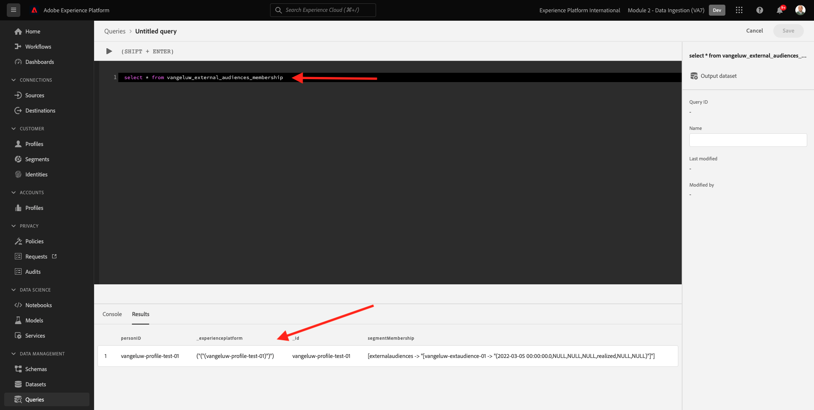

# 6.6外部受眾

在許多情況下，您的公司可能會想使用其他應用程式的現有區段，以豐富Adobe Experience Platform中的客戶設定檔。
這些外部受眾可能已根據資料科學模型或使用外部資料平台來定義。

Adobe Experience Platform的外部對象功能可讓您專注於擷取外部對象及其啟用，而無需在Adobe Experience Platform中詳細重新定義對應的區段定義。

整個過程主要分為三個步驟：

- 匯入外部對象中繼資料：此步驟的用意是將外部對象中繼資料（例如對象名稱）內嵌至Adobe Experience Platform。
- 將外部受眾成員指派給客戶設定檔：此步驟旨在透過外部區段成員資格屬性，讓客戶設定檔更為豐富。
- 在Adobe Experience Platform中建立區段：此步驟旨在根據外部對象成員資格建立可操作的區段。

## 6.6.1元資料

前往 [Adobe Experience Platform](https://experience.adobe.com/platform). 登入後，您會登陸Adobe Experience Platform首頁。


>[!IMPORTANT]
>
>本練習使用的沙箱為 ``--module2sandbox--``!

繼續之前，您需要選取 **沙箱**. 要選取的沙箱已命名 ``--module2sandbox--``. 您可以按一下文字 **[!UICONTROL 生產產品]** 在螢幕上方的藍線。 選取適當的 [!UICONTROL 沙箱]，您會看到畫面變更，現在您已進入專屬 [!UICONTROL 沙箱].


雖然區段資料定義設定檔要成為區段一部分的條件，但區段中繼資料是關於區段的資訊，例如區段的名稱、說明和狀態。 由於外部對象中繼資料會儲存在Adobe Experience Platform中，因此您需要使用身分命名空間，在Adobe Experience Platform中內嵌中繼資料。

## 6.6.1.1外部對象的身分命名空間

已建立身分命名空間以搭配使用 **外部對象**.
若要檢視已建立的身分，請前往 **身分**，並搜尋 **外部**. 按一下「外部對象」項目。

請注意：

- 標識符號 **externalaudiences** 將用於後續步驟，以參照外部對象身分。
- 此 **非人員識別碼** 類型會用於此身分識別命名空間，因為此命名空間並非用來識別客戶設定檔，而是用來識別區段。


## 6.6.1.2建立外部對象中繼資料結構

外部對象中繼資料以 **區段定義結構**. 如需詳細資訊，請參閱 [XDM Github存放庫](https://github.com/adobe/xdm/blob/master/docs/reference/classes/segmentdefinition.schema.md).

在左側功能表中，前往結構描述。 按一下 **+建立結構** 然後按一下 **瀏覽**.


要分配類，請搜索 **區段定義**. 選取 **區段定義** 類別和按一下 **分配類**.


你會看到這個。 按一下 **取消**.


你會看到這個。 選取欄位 **_id**. 在右側功能表中，向下捲動並啟用 **身分** 和 **主要身分** 框。 選取 **外部對象** 身分識別命名空間。 按一下&#x200B;**套用**。


接下來，選擇架構名稱 **無標題結構**. 將名稱變更為 `--demoProfileLdap-- - External Audiences Metadata`.


啟用 **設定檔** 切換並確認。 最後，按一下 **儲存**.


## 6.6.1.3建立外部對象中繼資料資料集

在 **結構**，前往 **瀏覽**. 搜尋並按一下 `--demoProfileLdap-- - External Audiences Metadata` 您在上一步中建立的架構。 下一步，按一下 **從結構建立資料集**.


針對欄位 **名稱**，輸入 `--demoProfileLdap-- - External Audience Metadata`. 按一下 **建立資料集**.


你會看到這個。 別忘了啟用 **設定檔** 切換！


## 6.6.1.4建立HTTP API來源連線

接下來，您需要設定HTTP API來源連接器，以便將中繼資料內嵌至資料集。

前往 **來源**. 在搜尋欄位中，輸入 **HTTP**. 按一下「**新增資料**」。


輸入以下資訊：

- **帳戶類型**:選取 **新帳戶**
- **帳戶名稱**:輸入 `--demoProfileLdap-- - External Audience Metadata`
- 勾選核取方塊 **XDM相容盒**

下一步，按一下 **連接到源**.


你會看到這個。 按&#x200B;**「下一步」**。


選擇 **現有資料集** 在下拉式功能表中，搜尋並選取資料集 `--demoProfileLdap-- - External Audience Metadata`.

驗證 **資料流詳細資訊** 然後按一下 **下一個**.


你會看到這個。

此 **對應** 精靈的步驟為空，因為您會將符合XDM的裝載擷取至HTTP API來源連接器，因此不需要進行對應。 按&#x200B;**「下一步」**。


在 **檢閱** 步驟您可以選擇檢閱連線和對應詳細資訊。 按一下&#x200B;**完成**。


你會看到這個。


## 6.6.1.5擷取外部受眾中繼資料

在「來源連接器概述」標籤上，按一下 **...** 然後按一下 **複製架構裝載**.


在電腦上開啟文字編輯器應用程式，並貼上您剛複製的裝載，如下所示。 接下來，您需要更新 **xdmEntity** 物件。


物件 **xdmEntity** 需替換為下列程式碼。 複製下列程式碼，並將取代 **xdmEntity** 物件。

```
"xdmEntity": {
    "_id": "--demoProfileLdap---extaudience-01",
    "description": "--demoProfileLdap---extaudience-01 description",
    "segmentIdentity": {
      "_id": "--demoProfileLdap---extaudience-01",
      "namespace": {
        "code": "externalaudiences"
      }
    },
    "segmentName": "--demoProfileLdap---extaudience-01 name",
    "segmentStatus": "ACTIVE",
    "version": "1.0"
  }
```

之後，您應該會看到：


接下來，開啟新 **終端** 窗口。 複製文字編輯器中的所有文字，並貼到終端機視窗中。


下一個，點擊 **輸入**.

之後，您會在「終端機」視窗中看到資料擷取的確認：


重新整理您的HTTP API來源連接器畫面，您現在就會看到資料正在處理中：


## 6.6.1.6驗證外部對象中繼資料擷取

處理完成後，您可以使用查詢服務檢查資料集中的資料可用性。

在右側功能表中，前往 **資料集** ，然後選取 `--demoProfileLdap-- - External Audience Metadata` 您先前建立的資料集。


在右側功能表中，前往查詢並按一下 **建立查詢**.


輸入下列程式碼，然後點擊 **SHIFT + ENTER**:

```
select * from --demoProfileLdap--_external_audience_metadata
```

在查詢結果中，您會看到您擷取的外部對象中繼資料。


## 6.6.2區段成員資格

透過可用的外部受眾中繼資料，您現在可以擷取特定客戶設定檔的區段成員資格。

您現在需要準備針對區段成員資格結構而擴充的設定檔資料集。 如需詳細資訊，請參閱 [XDM Github存放庫](https://github.com/adobe/xdm/blob/master/docs/reference/datatypes/segmentmembership.schema.md).

## 6.6.2.1建立外部受眾成員資格結構

在右側功能表中，前往 **結構**. 按一下 **建立結構** 然後按一下 **XDM個別設定檔**.


在 **新增欄位群組** 快顯視窗，搜尋 **設定檔核心**. 選取 **設定檔核心v2** 欄位群組。


接下來，在 **新增欄位群組** 快顯視窗，搜尋 **區段成員資格**. 選取 **區段成員資格詳細資料** 欄位群組。 下一步，按一下 **新增欄位群組**.


你會看到這個。 導覽至欄位 `--aepTenantId--.identification.core`. 按一下 **crmId** 欄位。 在右側功能表中，向下捲動並檢查 **身分** 和 **主要身分** 複選框。 若 **身分命名空間** 選取 **示範系統 — CRMID**.

按一下&#x200B;**套用**。


接下來，選擇架構名稱 **無標題結構**. 在顯示名稱欄位中，輸入 `--demoProfileLdap-- - External Audiences Membership`.


接下來，啟用 **設定檔** 切換並確認。 按一下「**儲存**」。


## 6.6.2.2建立外部受眾成員資格資料集

在 **結構**，前往 **瀏覽**. 搜尋並按一下 `--demoProfileLdap-- - External Audiences Membership` 您在上一步中建立的架構。 下一步，按一下 **從結構建立資料集**.


針對欄位 **名稱**，輸入 `--demoProfileLdap-- - External Audiences Membership`. 按一下 **建立資料集**.


你會看到這個。 別忘了啟用 **設定檔** 切換！


## 6.6.2.3建立HTTP API來源連線


接下來，您需要設定HTTP API來源連接器，以便將中繼資料內嵌至資料集。

前往 **來源**. 在搜尋欄位中，輸入 **HTTP**. 按一下「**新增資料**」。


輸入以下資訊：

- **帳戶類型**:選取 **新帳戶**
- **帳戶名稱**:輸入 `--demoProfileLdap-- - External Audience Membership`
- 勾選核取方塊 **XDM相容盒**

下一步，按一下 **連接到源**.


你會看到這個。 按&#x200B;**「下一步」**。


選擇 **現有資料集** 在下拉式功能表中，搜尋並選取資料集 `--demoProfileLdap-- - External Audiences Membership`.

驗證 **資料流詳細資訊** 然後按一下 **下一個**.


你會看到這個。

此 **對應** 精靈的步驟為空，因為您會將符合XDM的裝載擷取至HTTP API來源連接器，因此不需要進行對應。 按&#x200B;**「下一步」**。


在 **檢閱** 步驟您可以選擇檢閱連線和對應詳細資訊。 按一下&#x200B;**完成**。


你會看到這個。


## 6.6.2.4擷取外部受眾會籍資料

在「來源連接器概述」標籤上，按一下 **...** 然後按一下 **複製架構裝載**.


在電腦上開啟文字編輯器應用程式，並貼上您剛複製的裝載，如下所示。 接下來，您需要更新 **xdmEntity** 物件。


物件 **xdmEntity** 需替換為下列程式碼。 複製下列程式碼，並將取代 **xdmEntity** 物件。

```
  "xdmEntity": {
    "_id": "--demoProfileLdap---profile-test-01",
    "_experienceplatform": {
      "identification": {
        "core": {
          "crmId": "--demoProfileLdap---profile-test-01"
        }
      }
    },
    "personID": "--demoProfileLdap---profile-test-01",
    "segmentMembership": {
      "externalaudiences": {
        "--demoProfileLdap---extaudience-01": {
          "status": "realized",
          "lastQualificationTime": "2022-03-05T00:00:00Z"
        }
      }
    }
  }
```

之後，您應該會看到：


接下來，開啟新 **終端** 窗口。 複製文字編輯器中的所有文字，並貼到終端機視窗中。


下一個，點擊 **輸入**.

之後，您會在「終端機」視窗中看到資料擷取的確認：


重新整理HTTP API來源連接器畫面，幾分鐘後您就會看到資料正在處理中：


## 6.6.2.5驗證外部受眾成員資格擷取

處理完成後，您可以使用查詢服務檢查資料集中的資料可用性。

在右側功能表中，前往 **資料集** ，然後選取 `--demoProfileLdap-- - External Audiences Membership ` 您先前建立的資料集。


在右側功能表中，前往查詢並按一下 **建立查詢**.


輸入下列程式碼，然後點擊 **SHIFT + ENTER**:

```
select * from --demoProfileLdap--_external_audiences_membership
```

在查詢結果中，您會看到您擷取的外部對象中繼資料。



## 6.6.3建立區段

現在您已準備好對外部對象採取動作。
在Adobe Experience Platform中，您可透過建立區段、填入個別對象並將這些對象共用至目的地來採取動作。
您現在將使用您剛剛建立的外部對象來建立區段。

在左側功能表中，前往 **區段** 按一下 **建立區段**.


前往 **對象**. 你會看到這個。 按一下 **外部對象**.


選取您先前建立的外部對象，名稱為 `--demoProfileLdap---extaudience-01`. 將對象拖放至畫布上。


為區段命名，請使用 `--demoProfileLdap-- - extaudience-01`. 按一下&#x200B;**儲存並關閉**。


你會看到這個。 您也會注意到，您擷取區段成員資格的設定檔現在會顯示在 **範例設定檔**.


您的區段現在已就緒，可傳送至目的地以進行啟用。

## 6.6.4將您的客戶設定檔視覺化

您現在也可以在客戶設定檔中視覺化區段資格。 前往 **設定檔**，請使用身分命名空間 **示範系統 — CRMID** 並提供身份 `--demoProfileLdap---profile-test-01`，您可在練習6.6.2.4時使用，然後按一下 **檢視**. 下一步，按一下 **設定檔ID** 來開啟設定檔。


前往 **區段成員資格**，您會在其中看到外部對象。


下一步： [6.7目的地SDK](./ex7.md)

[返回模組6](./real-time-cdp-build-a-segment-take-action.md)

[返回所有模組](../../overview.md)
