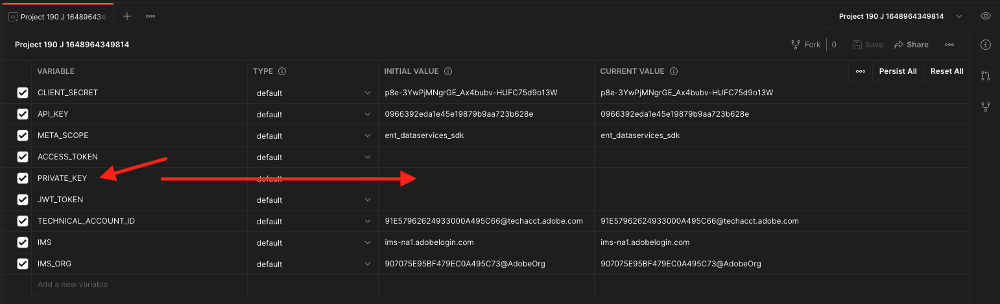
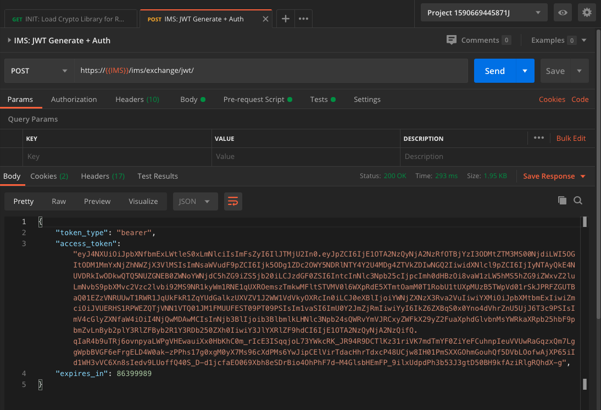

# 6.7目的地SDK

## 6.7.1設定您的Adobe I/O專案

>[!IMPORTANT]
>
>如果您在2021年12月之後建立了Adobe I/O專案，則可重複使用該專案，略過本練習，並立即改用6.7.2練習。
>
>如果您在2021年12月之前建立了Adobe I/O專案，請建立新專案以確保其與Destinations Authoring API相容。

在本練習中，您將會大量使用Adobe I/O來查詢Platform的API。 請按照以下步驟設定Adobe I/O。

前往 [https://developer.adobe.com/console/home](https://developer.adobe.com/console/home)


請務必在畫面右上角選取正確的Adobe Experience Platform例項。 您的例項為 `--envName--`.


按一下 **建立新專案**.

 或


選擇 **+新增至專案** 選取 **API**.


然後您會看到：


按一下 **Adobe Experience Platform** 表徵圖。


按一下 **Experience PlatformAPI**.


按&#x200B;**「下一步」**。


您現在可以選擇讓Adobe I/O產生您的安全金鑰組，或上傳現有的金鑰組。

選擇 **選項1 — 產生金鑰組**.


按一下 **產生鍵對**.


30秒後，你就會看見一個旋轉器。


之後您會看到這個訊息，您產生的鑰匙組將會以zip檔案的形式下載： **config.zip**.

將檔案解壓縮 **config.zip** 在案頭上，您會看到其中包含2個檔案：


- **certificate_pub.crt** 是您的公開金鑰憑證。 從安全性角度來看，這是可自由用來設定與線上應用程式整合的憑證。
- **private.key** 是您的私密金鑰。 這永遠不應該和任何人分享。 私密金鑰是您用來驗證API實作的，且應為機密。 如果您與任何人共用您的私密金鑰，對方將可存取您的實作，並濫用API將惡意資料內嵌至Platform中，以及擷取位於Platform中的所有資料。


請務必儲存 **config.zip** 檔案，因為您後續步驟及日後存取Adobe I/O和Adobe Experience Platform API時，都需要此功能。

按&#x200B;**「下一步」**。


您現在必須選取 **產品設定檔** 以進行整合。

選取所需的產品設定檔。

**菲**:在您的Adobe Experience Platform例項中，產品設定檔會有不同的命名。 您至少需要選取一個具有適當存取權限的產品設定檔，這些權限會設定在Adobe Admin Console中。


按一下 **儲存已設定的API**.


你會看見一個旋轉器。


接下來，您將看到您的整合。


按一下 **下載Postman** 按鈕，然後按一下 **服務帳戶(JWT)** 若要下載Postman環境（等到環境下載完成，可能需要幾秒鐘的時間）。


向下捲動，直到您看到 **服務帳戶(JWT)**，您可在此找到所有用來設定與Adobe Experience Platform整合的整合詳細資訊。


您的IO項目當前具有通用名稱。 您必須為整合指定好記的名稱。 按一下 **項目1** （或類似名稱）如所示


按一下 **編輯專案**.


輸入整合的名稱和說明。 作為命名慣例，我們將 `AEP API --demoProfileLdap--`. 將ldap替換為ldap。
例如，如果您的ldap為vangeluw，則整合的名稱和說明會變成AEP API vangeluw。

輸入 `AEP API --demoProfileLdap--` 作為 **專案標題**. 按一下「**儲存**」。


您的Adobe I/O整合現已完成。


## 6.7.2Postman驗證至Adobe I/O

前往 [https://www.getpostman.com/](https://www.getpostman.com/).

按一下 **開始使用**.


接下來，下載並安裝Postman。


安裝Postman後，啟動應用程式。

在Postman中有2個概念：環境和集合。

- 「環境」包含所有或多或少一致的環境變數。 在「環境」中，您會找到平台環境的IMSOrg等項目，以及私密金鑰等安全性認證。 在上一個練習的Adobe I/O設定期間下載的環境檔案名稱如下： **service.postman_environment.json**.

- 集合包含許多您可使用的API請求。 我們將使用2個集合
   - 1個AdobeI/0驗證的集合
   - 1收集本模組中的練習
   - 1個集合，供Real-Time CDP模組中的練習，用於目標編寫

請下載該檔案 [postman.zip](../../assets/postman/postman_profile.zip) 到本地案頭。

在此 **postman.zip** 檔案中，您會找到下列檔案：

- `_Adobe I-O - Token.postman_collection.json`
- `_Adobe Experience Platform Enablement.postman_collection.json`
- `Destination_Authoring_API.json`

將 **postman.zip** 將這3個檔案連同從Adobe I/O下載的Postman環境，儲存在案頭上的資料夾中。該資料夾中需要包含以下4個檔案：


回Postman。 按一下&#x200B;**「匯入」**。


按一下 **上傳檔案**.


導覽至案頭上您擷取4個下載檔案的資料夾。 同時選取這4個檔案，然後按一下 **開啟**.


點按後 **開啟**,Postman會顯示您要匯入的環境和集合概覽。 按一下&#x200B;**「匯入」**。


現在，Postman提供您開始透過API與Adobe Experience Platform互動所需的一切。

首先，要確保你的身份正確。 若要驗證，您需要請求存取權杖。

在執行任何請求之前，請確定已選取正確的環境。 您可以驗證右上角的「環境」下拉式清單，以檢查目前選取的環境。

所選環境的名稱應與以下名稱類似：


按一下 **眼** 圖示，然後按一下 **編輯** 更新環境檔案中的私密金鑰。


你會看到這個。 除欄位外，所有欄位皆已預先填入 **PRIVATE_KEY**.



建立Adobe I/O專案時，會產生私密金鑰。 下載為zip檔案，名為 **config.zip**. 將zip檔案解壓縮至您的案頭。


開啟資料夾 **設定** 並開啟檔案 **private.key** 選擇的文字編輯器。


然後，您會看到類似這樣的內容，將所有文本複製到剪貼簿。


返回Postman，並將私密金鑰貼到變數旁的欄位中 **PRIVATE_KEY**，針對兩欄 **初始值** 和 **目前值**. 按一下「**儲存**」。


您的Postman環境和集合現在已設定且運作中。 您現在可以從Postman驗證至Adobe I/O。

為此，您需要載入一個外部庫，負責通信的加密和解密。 若要載入此程式庫，您必須以名稱執行要求 **INIT:載入RS256的加密庫**. 在 **_Adobe I/O — 代號集合** 你會看到它顯示在螢幕的中央。


按一下藍色 **傳送** 按鈕。 幾秒後，您應該會在 **主體** Postman區段：


現在載入加密程式庫後，我們便可以驗證以Adobe I/O。

在 **\_Adobe I/O — 代號集合**，請選取名稱為的請求 **IMS:JWT產生+驗證**. 同樣地，畫面中間會顯示請求詳細資訊。


按一下藍色 **傳送** 按鈕。 幾秒後，您應該會在 **主體** Postman區段：



如果您的設定成功，您應該會看到包含下列資訊的類似回應：

| 代碼 | 值 |
|:-------------:| :---------------:| 
| token_type | **承載者** |
| access_token | **eyJ4NXUiOiJpbXNfbmEx..QT7mqZkumN1tdsPEioOEl4087Dg** |
| expires_in | **86399973** |

Adobe I/O給你了 **承載者**-token，具有特定值（這個很長的access_token）和過期窗口。

我們收到的代號現在有效24小時。 這表示24小時後，如果您想使用Postman驗證以Adobe I/O，則必須再次執行此請求以產生新代號。

## 6.7.3定義端點和格式

在本練習中，您需要設定端點，以便在區段符合資格時，將資格事件串流至該端點。 在本練習中，您將使用範例端點，使用 [https://webhook.site/](https://webhook.site/). 前往 [https://webhook.site/](https://webhook.site/)，您會看到類似的內容。 按一下 **複製到剪貼簿** 來複製url。 您必須在下一個練習中指定此url。 此範例中的URL為 `https://webhook.site/e0eb530c-15b4-4a29-8b50-e40877d5490a`.


至於格式，我們將使用標準範本來串流區段資格或取消資格，以及中繼資料（如客戶識別碼）。 您可以自訂範本，以符合特定端點的期望，但在本練習中，我們將重複使用標準範本，這會產生類似此的裝載，並串流至端點。

```json
{
  "profiles": [
    {
      "identities": [
        {
          "type": "ecid",
          "id": "64626768309422151580190219823409897678"
        }
      ],
      "AdobeExperiencePlatformSegments": {
        "add": [
          "f58c723c-f1e5-40dd-8c79-7bb4ab47f041"
        ],
        "remove": []
      }
    }
  ]
}
```

## 6.7.4建立伺服器和模板配置

在Adobe Experience Platform中建立自己的目的地的第一步，是建立伺服器和範本設定。

若要這麼做，請前往 **Destination Authoring API**，到 **目標伺服器和模板** 並按一下以開啟請求 **POST — 建立目標伺服器配置**. 你會看到這個。 在 **標題**，您需要手動更新索引鍵的值 **x-sandbox-name** 並將其設定為 `--aepSandboxId--`. 選取值 **{{SANDBOX_NAME}}**.


替換為 `--aepSandboxId--`.


接下來，轉到 **主體**. 選擇佔位符 **{{body}}**.


您現在需要取代預留位置 **{{body}}** 依照下列程式碼：

```json
{
    "name": "Custom HTTP Destination",
    "destinationServerType": "URL_BASED",
    "urlBasedDestination": {
        "url": {
            "templatingStrategy": "PEBBLE_V1",
            "value": "yourURL"
        }
    },
    "httpTemplate": {
        "httpMethod": "POST",
        "requestBody": {
            "templatingStrategy": "PEBBLE_V1",
            "value": "{\n    \"profiles\": [\n    \n        {\n            \"identities\": [\n            \n            \n                \n                {\n                    \"type\": \"{{ namespace }}\",\n                    \"id\": \"{{ identity.id }}\"\n                },\n                ,\n            \n            ],\n            \"AdobeExperiencePlatformSegments\": {\n                \"add\": [\n                \n                    \"{{ segment.key }}\",\n                \n                ],\n                \"remove\": [\n                {#- Alternative syntax for filtering segments by status: -#}\n                \n                    \"{{ segment.key }}\",\n                \n                ]\n            }\n        },\n    \n    ]\n}"
        },
        "contentType": "application/json"
    }
}
```

貼上上述程式碼後，您需要手動更新欄位 **urlBasedDestination.url.value**，而您必須將其設為您在上一步(亦即 `https://webhook.site/e0eb530c-15b4-4a29-8b50-e40877d5490a` 在此範例中。


更新欄位後 **urlBasedDestiation.url.value**，應該看起來像這樣。 按一下 **傳送**.


按一下 **傳送**，則會建立您的伺服器範本，而在回應中，您會看到名為的欄位 **instanceId**. 記下來，因為下一步需要它。 在此範例中， **instanceId** is
`eb0f436f-dcf5-4993-a82d-0fcc09a6b36c`.


## 6.7.5建立目標配置

在Postman，在 **Destination Authoring API**，前往 **目標配置** 並按一下以開啟請求 **POST — 建立目標配置**. 你會看到這個。 在 **標題**，您需要手動更新索引鍵的值 **x-sandbox-name** 並將其設定為 `--aepSandboxId--`. 選取值 **{{SANDBOX_NAME}}**.


替換為 `--aepSandboxId--`.


接下來，轉到 **主體**. 選擇佔位符 **{{body}}**.


您現在需要取代預留位置 **{{body}}** 依照下列程式碼：

```json
{
    "name": "--demoProfileLdap-- - Webhook",
    "description": "Exports segment qualifications and identities to a custom webhook via Destination SDK.",
    "status": "TEST",
    "customerAuthenticationConfigurations": [
        {
            "authType": "BEARER"
        }
    ],
    "customerDataFields": [
        {
            "name": "endpointsInstance",
            "type": "string",
            "title": "Select Endpoint",
            "description": "We could manage several instances across the globe for REST endpoints that our customers are provisioned for. Select your endpoint in the dropdown list.",
            "isRequired": true,
            "enum": [
                "US",
                "EU",
                "APAC",
                "NZ"
            ]
        }
    ],
    "uiAttributes": {
        "documentationLink": "https://experienceleague.adobe.com/docs/experience-platform/destinations/home.html?lang=en",
        "category": "streaming",
        "connectionType": "Server-to-server",
        "frequency": "Streaming"
    },
    "identityNamespaces": {
        "ecid": {
            "acceptsAttributes": true,
            "acceptsCustomNamespaces": false
        }
    },
    "segmentMappingConfig": {
        "mapExperiencePlatformSegmentName": true,
        "mapExperiencePlatformSegmentId": true,
        "mapUserInput": false
    },
    "aggregation": {
        "aggregationType": "BEST_EFFORT",
        "bestEffortAggregation": {
            "maxUsersPerRequest": "1000",
            "splitUserById": false
        }
    },
    "schemaConfig": {
        "profileRequired": false,
        "segmentRequired": true,
        "identityRequired": true
    },
    "destinationDelivery": [
        {
            "authenticationRule": "NONE",
            "destinationServerId": "yourTemplateInstanceID"
        }
    ]
}
```


貼上上述程式碼後，您需要手動更新欄位 **destinationDelivery。 destinationServerId**，而您需要將其設為 **instanceId** 上一步建立的目標伺服器模板( `eb0f436f-dcf5-4993-a82d-0fcc09a6b36c` 在此範例中。 下一步，按一下 **傳送**.


然後您會看到此回應。


您的目的地現在已在Adobe Experience Platform中建立。 我們去檢查一下。

前往 [Adobe Experience Platform](https://experience.adobe.com/platform). 登入後，您會登陸Adobe Experience Platform首頁。


繼續之前，您需要選取 **沙箱**. 要選取的沙箱已命名 ``--aepSandboxId--``. 您可以按一下文字 **[!UICONTROL 生產產品]** 在螢幕上方的藍線。 選取適當的 [!UICONTROL 沙箱]，您會看到畫面變更，現在您已進入專屬 [!UICONTROL 沙箱].


在左側功能表中，前往 **目的地**，按一下 **目錄** 並向下捲動到類別 **串流**. 您現在可以看到目的地。


## 6.7.6將區段連結至目的地

在 **目的地** > **目錄**，按一下 **設定** 來開始將區段新增至新目的地。


輸入一個虛擬的承載令牌，例如 **1234**. 按一下 **連接到目標**.


你會看到這個。 作為目的地的名稱，請使用 `--demoProfileLdap-- - Webhook`. 在本示例中，選擇選擇的端點 **歐盟**. 按&#x200B;**「下一步」**。


您可以選擇選取資料控管原則。 按&#x200B;**「下一步」**。


選取您先前建立的區段，名稱為 `--demoProfileLdap-- - Interest in PROTEUS FITNESS JACKSHIRT`. 按&#x200B;**「下一步」**。


你會看到這個。 請務必將 **源欄位** `--aepTenantId--.identification.core.ecid` 欄位 `Identity: ecid`. 按&#x200B;**「下一步」**。


按一下&#x200B;**完成**。


您的目的地現在已上線，新區段資格現在會串流至您的自訂網頁連結。


## 6.7.7測試您的區段啟用

前往 [https://builder.adobedemo.com/projects](https://builder.adobedemo.com/projects). 使用您的Adobe ID登入後，您會看到這個。 按一下您的網站專案以開啟。


您現在可以依照下列流程存取網站。 按一下 **整合**.


在 **整合** 頁，您需要選擇在練習0.1中建立的資料收集屬性。


然後，您會看到示範網站已開啟。 選取URL並複製到剪貼簿。


開啟新的無痕瀏覽器窗口。


貼上您在上一步複製的示範網站URL。 然後系統會要求您使用Adobe ID登入。


選取您的帳戶類型並完成登入程式。


然後，您會在無痕瀏覽器視窗中看到您的網站載入。 對於每個演示，您都需要使用全新的無痕瀏覽器窗口來載入演示網站URL。


從 **盧馬** 首頁，轉到 **男性**，然後按一下產品 **PROTEUS健身夾克衫**.


您現在已瀏覽的產品頁面 **PROTEUS健身夾克衫**，這表示您現在符合本練習先前建立之區段的資格。


當您開啟「設定檔檢視器」，然後前往 **區段**，您會看到區段符合資格。


現在回到你的開啟網頁鈎 [https://webhook.site/](https://webhook.site/)，此時您應會看到新的傳入要求，其來源為Adobe Experience Platform，且包含區段資格事件。


下一步： [摘要和優點](./summary.md)

[返回模組6](./real-time-cdp-build-a-segment-take-action.md)

[返回所有模組](../../overview.md)
