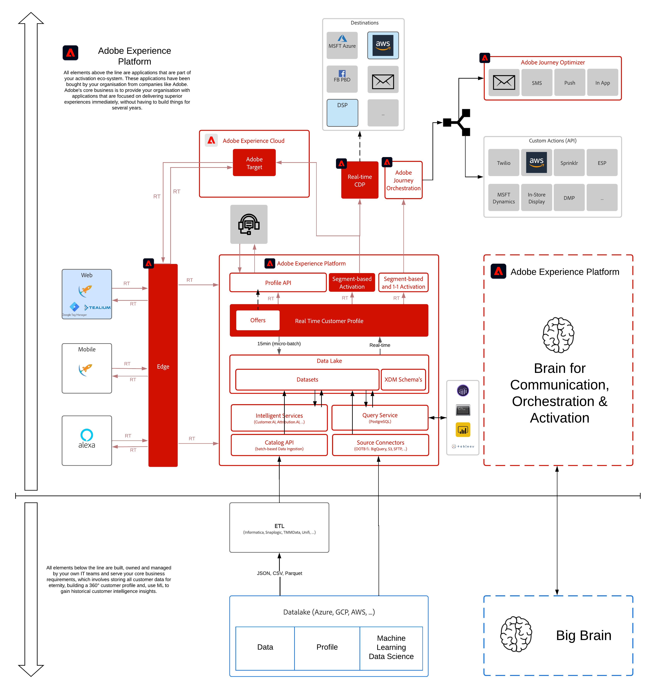

# 6.即時CDP — 建立區段並採取行動

**作者： [沃特·范·蓋盧韋](https://www.linkedin.com/in/woutervangeluwe/), [阿爾貝托·德·卡羅](https://www.linkedin.com/in/albertodecaro/), [貝尼迪克特·韋德尼克](https://www.linkedin.com/in/benedikt-wedenik/)**

在此模組中，您將設定串流區段，並將區段啟用至多個目的地。

## 學習目標

- 了解如何建立區段並啟用該區段以進行串流。
- 了解如何使用Adobe Experience Platform UI設定廣告目的地。
- 了解如何將區段連線至目的地並啟用它。
- 了解如何在Adobe Audience Manager中使用Adobe Experience Platform區段，以及如何在Adobe Experience Platform中使用Adobe Audience Manager區段，這要歸功於雙向區段共用。

## 先決條件

- 存取 Adobe Experience Platform: [https://experience.adobe.com/platform](https://experience.adobe.com/platform)
- 存取Adobe Target
- 存取AWS S3

>[!IMPORTANT]
>
>本教學課程的建立是為了便於使用特定研討會格式。 它使用您可能沒有存取權的特定系統和帳戶。 即使沒有訪問權，我們仍然認為，通過閱讀這些非常詳細的內容，您仍可以學到很多。 如果您是其中一個研討會的參與者，並需要您的訪問認證，請聯繫您的Adobe代表，他將向您提供所需資訊。

## 架構概述

請查看下列架構，其中會強調本模組中將討論和使用的元件。

## 要使用的沙箱

對於此模組，請使用此沙箱： `--module11sandbox--`.

>[!NOTE]
>
>別忘了安裝、設定和使用Chrome擴充功能，如 [0.1 — 安裝Experience League檔案的Chrome擴充功能](../module0/ex1.md)

## 練習

[6.1建立區段](./ex1.md)

了解如何建立區段。

[6.2查看如何使用目的地配置DV360目的地](./ex2.md)

了解如何使用Real-Time CDP UI設定廣告目的地。

[6.3採取行動：將段發送到DV360](./ex3.md)

將您在練習6.1中建立的段連接到目標DV360。

[6.4採取行動：將區段傳送至S3目的地](./ex4.md)

使用您在練習6.1中建置的區段，並將其傳送至S3目的地，通常用於電子郵件行銷目的地。

[6.5採取行動：將區段傳送至Adobe Target](./ex5.md)

使用您在練習6.1中建置的區段，在Adobe Target中設定體驗鎖定目標活動。

[6.6外部受眾](./ex6.md)

從外部來源系統匯入對象至Adobe Experience Platform。

[6.7目的地SDK](./ex7.md)

使用Destinations SDK設定您自己的目的地。

[摘要和優點](./summary.md)

本模組的摘要，以及優點的概述。

>[!NOTE]
>
>謝謝你花時間去學習關於Adobe Experience Platform的一切。 如果您有疑問，想要分享對未來內容有建議的一般性反饋，請直接聯繫Wouter Van Geluwe，方法是發送電子郵件至 **vangeluw@adobe.com**.

[返回所有模組](../../overview.md)
